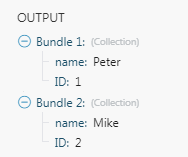

# [!UICONTROL JSON] modules

De [!DNL Adobe Workfront Fusion] [!UICONTROL JSON] app biedt modules om gegevens in JSON-indeling te verwerken, zodat [!DNL Adobe Workfront Fusion] kan verder werken met de gegevensinhoud of nieuwe JSON-inhoud maken.

## Toegangsvereisten

U moet de volgende toegang hebben om de functionaliteit in dit artikel te kunnen gebruiken:

<table style="table-layout:auto"> 
 <col> 
 <col> 
 <tbody> 
  <tr> 
   <td role="rowheader">[!DNL Adobe Workfront] plan*</td>
  <td> <p>[!UICONTROL Pro] of hoger</p> </td>
  </tr> 
  <tr data-mc-conditions=""> 
   <td role="rowheader">[!DNL Adobe Workfront] licentie*</td>
   <td> <p>[!UICONTROL Plan], [!UICONTROL Work]</p> </td> 
  </tr> 
  <tr> 
   <td role="rowheader">[!DNL Adobe Workfront Fusion] licentie**</td> 
   <td>
   <p>Huidige vergunningsvereiste: Nee [!DNL Workfront Fusion] vergunningsvereiste.</p>
   <p>of</p>
   <p>Vereisten voor oudere licenties: [!UICONTROL [!DNL Workfront Fusion] voor arbeidsautomatisering en -integratie],  [!UICONTROL [!DNL Workfront Fusion] voor werkautomatisering]</p>
   </td> 
  </tr> 
  <tr> 
   <td role="rowheader">Product</td> 
   <td>
   <p>Huidige productvereisten: Als u de [!UICONTROL Select] of [!UICONTROL Prime] [!DNL Adobe Workfront] Abonnement, uw organisatie moet [!DNL Adobe Workfront Fusion] alsmede [!DNL Adobe Workfront] om de in dit artikel beschreven functionaliteit te gebruiken. [!DNL Workfront Fusion] is opgenomen in de [!UICONTROL Ultimate] [!DNL Workfront] plannen.</p>
   <p>of</p>
   <p>Oudere productvereisten: Uw organisatie moet [!DNL Adobe Workfront Fusion] alsmede [!DNL Adobe Workfront] om de in dit artikel beschreven functionaliteit te gebruiken.</p>
   </td> 
  </tr> 
 </tbody> 
</table>

Neem contact op met uw [!DNL Workfront] beheerder.

Voor informatie over [!DNL Adobe Workfront Fusion] licenties, zie [[!DNL Adobe Workfront Fusion] licenties](../../workfront-fusion/get-started/license-automation-vs-integration.md).

## Parse JSON

* [Gegevensstructuur](#data-structure)
* [Verzameling versus array](#collection-vs-array)

### Gegevensstructuur

De gegevensstructuur beschrijft hoe de JSON-gegevens zijn georganiseerd en maakt het mogelijk om afzonderlijke JSON-items toe te wijzen aan andere modules in uw scenario. Als u de gegevensstructuur niet aanbiedt, kunt u de module handmatig uitvoeren en [!DNL Workfront Fusion] bouwt de structuur op basis van de aangeboden JSON:

1. Voeg de [!UICONTROL Parse JSON] aan een scenario.
1. In de **[!UICONTROL JSON String]** voert u de JSON in waarvan u een gegevensstructuur wilt maken.
1. Sluit andere modules niet aan op de [!UICONTROL Parse JSON] nog. Omdat [!DNL Workfront Fusion] nog niet op de hoogte is van de structuur van de JSON-gegevens, is het nog niet mogelijk gegevens toe te wijzen uit de [!UICONTROL Parse JSON] aan andere modules in uw scenario.
1. Voer het scenario handmatig uit. Hierdoor wordt de [!UICONTROL Parse JSON] om de JSON-structuur te identificeren vanuit de JSON die u hebt opgegeven.
1. U kunt nu de volgende modules verbinden. De punten van de Parse JSON module zijn nu beschikbaar voor afbeelding.

Zie voor meer informatie [Gegevensstructuren in [!UICONTROL Adobe Workfront Fusion]](../../workfront-fusion/modules/data-structures.md).

### Verzameling versus array

Als het JSON-tekenreeksveld een verzameling bevat `{ ... }`De uitvoer bestaat uit één bundel die de onderdelen van de verzameling bevat.

>[!INFO]
>
>**Voorbeeld:**
>
>```
>{
>       "name" : "Peter",
>
>    
   "ID" : 1
>}
>```
>
>

Als het JSON-tekenreeksveld een array bevat `[ ... ]`De uitvoer bestaat uit een reeks bundels. elke bundel bevat één element van de array.

>[!INFO]
>
>**Voorbeeld:**
>
>```
>[
>   {
>       "name" : "Peter",
>       "ID" : 1
>   },
>
>  
 {
>       "name" : "Mike",
>       "ID" : 2
>   }
>]
>```
>
>

## [!UICONTROL JSON] modules en hun velden

Wanneer u [!DNL JSON] modules, [!DNL Workfront Fusion] geeft de onderstaande velden weer. Daarnaast kunnen aanvullende JSON-velden worden weergegeven, afhankelijk van factoren zoals uw toegangsniveau in de app of service. Een bolde titel in een module wijst op een vereist gebied.

Als u de kaartknoop boven een gebied of een functie ziet, kunt u het gebruiken om variabelen en functies voor dat gebied te plaatsen. Zie voor meer informatie [De informatie van de kaart van één module aan een andere binnen [!DNL Adobe Workfront Fusion]](../../workfront-fusion/mapping/map-information-between-modules.md).


* [Samenvoegen tot JSON](#aggregate-to-json)
* [JSON converteren naar XML](#convert-json-to-xml)
* [Parse JSON](#parse-json)
* [JSON maken](#create-json)
* [Transform JSON](#transform-json)

### [!UICONTROL Aggregate to JSON]

Deze aggregatormodule aggregeert de uitvoer van een vorige module naar JSON.

<table style="table-layout:auto"> 
 <col data-mc-conditions=""> 
 <col data-mc-conditions=""> 
 <tbody> 
  <tr> 
   <td role="rowheader">[!UICONTROL Source module] </td> 
   <td> <p>Selecteer de module die de gegevens uitvoert die u aan JSON wilt samenvoegen.</p> </td> 
  </tr> 
  <tr> 
   <td role="rowheader">[!UICONTROL Data structure]</td> 
   <td> <p>Selecteer de gegevensstructuur die u wilt gebruiken om JSON te maken. De gegevensstructuur bepaalt welke andere velden beschikbaar zijn in deze module. Zie voor meer informatie <a href="#data-structure" class="MCXref xref">Gegevensstructuur</a> in dit artikel.</p> </td> 
  </tr> 
  <tr> 
   <td role="rowheader">[!UICONTROL Indentation]</td> 
   <td> <p> Selecteer of u de JSON wilt laten inspringen met tabs, twee spaties of vier spaties.</p> </td> 
  </tr> 
  <tr> 
   <td role="rowheader">[!UICONTROL Group by]</td> 
   <td>Definieer een expressie waarop u de geaggregeerde uitvoer wilt groeperen. Deze expressie kan een of meer toegewezen items bevatten. De geaggregeerde gegevens worden vervolgens in groepen verdeeld op basis van de waarde van deze expressie. Elke groep voert als een afzonderlijke bundel met een sleutel (de geëvalueerde uitdrukking) en een waarde (de samengevoegde tekst) uit. U kunt de sleutel als filter in verdere modules gebruiken.</td> 
  </tr> 
  <tr> 
   <td role="rowheader">[!UICONTROL Stop processing after an empty aggregation]</td> 
   <td>Schakel deze optie in om het scenario te stoppen als er geen resultaten zijn.</td> 
  </tr> 
 </tbody> 
</table>

### [!UICONTROL Convert JSON to XML]

Deze actiemodule converteert een JSON-tekenreeks naar XML.

<table style="table-layout:auto"> 
 <col data-mc-conditions=""> 
 <col data-mc-conditions=""> 
 <tbody> 
  <tr> 
   <td role="rowheader">[!UICONTROL JSON string] </td> 
   <td> <p>Typ of wijs de JSON toe die u in XML wilt omzetten.</p> </td> 
  </tr> 
 </tbody> 
</table>

### [!UICONTROL Parse JSON]

Deze actiemodule parseert een JSON-tekenreeks in een gegevensstructuur, waarmee u toegang hebt tot de gegevens in de JSON-tekenreeks.

<table style="table-layout:auto"> 
 <col data-mc-conditions=""> 
 <col data-mc-conditions=""> 
 <tbody> 
  <tr> 
   <td role="rowheader">[!UICONTROL Data structure]</td> 
   <td> <p>Selecteer de gegevensstructuur die u wilt gebruiken om JSON te maken. Zie voor meer informatie <a href="#data-structure" class="MCXref xref">Gegevensstructuur</a> in dit artikel.</p> </td> 
  </tr> 
  <tr> 
   <td role="rowheader">[!UICONTROL JSON string] </td> 
   <td> <p>Typ of wijs de JSON toe die u wilt parseren.</p> </td> 
  </tr> 
 </tbody> 
</table>

### [!UICONTROL Create JSON]

Deze actiemodule maakt JSON op basis van een gegevensstructuur.

<table style="table-layout:auto"> 
 <col data-mc-conditions=""> 
 <col data-mc-conditions=""> 
 <tbody> 
  <tr> 
   <td role="rowheader">Gegevensstructuur</td> 
   <td> <p>Selecteer de gegevensstructuur die u wilt gebruiken om JSON te maken. Zie voor meer informatie <a href="#data-structure" class="MCXref xref">Gegevensstructuur</a> in dit artikel.</p> </td> 
  </tr> 
 </tbody> 
</table>

### [!UICONTROL Transform JSON]

Deze actiemodule transformeert een object naar een json-tekenreeks.

<table style="table-layout:auto"> 
 <col data-mc-conditions=""> 
 <col data-mc-conditions=""> 
 <tbody> 
  <tr> 
   <td role="rowheader">[!UICONTROL Object]</td> 
   <td> <p>Typ of wijs het object toe dat u in JSON wilt transformeren.</p> </td> 
  </tr> 
 </tbody> 
</table>

## Gegevensrecords omzetten in JSON

>[!INFO]
>
>**Voorbeeld:** In het volgende voorbeeld wordt getoond hoe u gegevensrecords kunt transformeren vanuit [!DNL Google Sheets] in JSON-indeling:
>
>1. Plaats de [!DNL Google Sheets] > [!UICONTROL Select rows] in uw scenario om de gegevens op te halen. Stel de module in om rijen op te halen uit uw [!DNL Google] spreadsheet. De &#x200B; instellen **[!UICONTROL Maximum number of returned rows]** tot een klein aantal, maar groter dan één voor testdoeleinden (bijvoorbeeld drie). Voer de [!DNL Google Sheets] door er met de rechtermuisknop op te klikken en &quot;**[!UICONTROL Run this module only]**.&quot; Controleer de uitvoer van de module.
>
1. Verbind de [!UICONTROL Array Aggregator] module na de [!DNL Google Sheets] module. In de opstelling van de module kiest u [!DNL Google Sheets] in de **[!UICONTROL Source node]** veld. Laat de andere velden op dit moment ongewijzigd.
>
1. Verbinden [!UICONTROL JSON] > [!UICONTROL Create JSON] module na de [!UICONTROL Array Aggregator] module. De opstelling van de module vereist een structuur van Gegevens die het formaat JSON beschrijft. Klikken **[!UICONTROL Add]** om de gegevensstructuurinstellingen te openen. De eenvoudigste manier om deze gegevensstructuur te maken, is deze automatisch te genereren op basis van een JSON-voorbeeld. Klikken **[!UICONTROL Generator]** en plak uw JSON-voorbeeld in de **[!UICONTROL Sample data]** veld:
>
**Voorbeeld:**
>   
```
{

"books": [

{

"id": "ID",

"title": "Title",

"author": "Author"

}

]

}
```
>
1. Klik op **[!UICONTROL Save]**. De [!UICONTROL Specification] bevat nu de gegenereerde structuur.
1. Wijzig de naam van de gegevensstructuur in een specifiekere naam en klik op **[!UICONTROL Save]**. Een veld dat overeenkomt met het kenmerk van de hoofdarray wordt als een toewijzingsveld weergegeven in de instellingen van de JSON-module.
>
1. Klik op de knop **[!UICONTROL Map]** naast het veld en wijs de `Array[]` item van de uitvoer van de Array-aggregator naar dit item.
>
1. Klikken **[!UICONTROL OK]** om de [!UICONTROL JSON] instellen.
>
1. Open de instelling van het dialoogvenster [!UICONTROL Array Aggregator] module. Wijzig de **[!UICONTROL Target structure]** van [!UICONTROL Custom] aan de [!UICONTROL JSON] het veld van de module dat overeenkomt met het kenmerk van de hoofdarray. Items toewijzen vanuit de [!DNL Google Sheets] aan de aangewezen gebieden.
>
1. Klikken **[!UICONTROL OK]** om de [!UICONTROL Array Aggregator] instellen.
>
1. Voer het scenario uit.
>
De [!UICONTROL JSON] -module geeft de juiste JSON-indeling als uitvoer.
>
1. Open de instelling van het dialoogvenster [!DNL Google Sheets] en verhoogt u de [!UICONTROL Maximum number of returned rows] getal dat groter is dan het aantal rijen in het werkblad om alle gegevens te verwerken.

## Problemen oplossen

### Kan geen gegevens toewijzen uit de [!UICONTROL Parse JSON] module

Zorg ervoor dat de JSON-inhoud correct is toegewezen aan de [!UICONTROL Parse JSON] en dat de gegevensstructuur correct is gedefinieerd. Zie voor meer informatie [Gegevensrecords omzetten in JSON](#transforming-data-records-to-json) in dit artikel.

### De module mislukt wanneer voorwaardelijke instructies in JSON worden gebruikt

Bij het gebruik van voorwaardelijke instructies zoals `if` in uw JSON, plaats de aanhalingstekens buiten de voorwaardelijke verklaring.

>[!INFO]
>
**Voorbeeld:**
>

