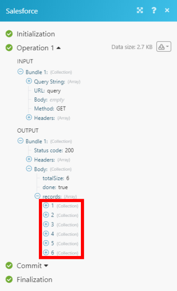

# [!DNL Salesforce] modules

In een Adobe Workfront Fusion-scenario kunt u workflows automatiseren die [!DNL Salesforce]en deze verbinding maken met meerdere toepassingen en services van derden.

Als u instructies bij het creëren van een scenario nodig hebt, zie [Een scenario maken in [!DNL Adobe Workfront Fusion]](../../workfront-fusion/scenarios/create-a-scenario.md).

Voor informatie over modules, zie [Modules in [!DNL Adobe Workfront Fusion]](../../workfront-fusion/modules/modules.md).

>[!NOTE]
>
>* Niet alle edities van [!DNL Salesforce] API-toegang hebben. Zie de informatie over [!DNL Salesforce] edities met API-toegang op de [!DNL Salesforce] Community site.
>* Voor informatie over specifieke fouten die door de [!DNL Salesforce] API, zie [!DNL Salesforce] API-documenten. U kunt ook de status van het dialoogvenster [!DNL Salesforce] API voor mogelijke uitvallen van de service.
>

## Toegangsvereisten

U moet de volgende toegang hebben om de functionaliteit in dit artikel te kunnen gebruiken:

<table style="table-layout:auto"> 
 <col> 
 <col> 
 <tbody> 
  <tr> 
   <td role="rowheader">[!DNL Adobe Workfront] plan*</td>
  <td> 
[!UICONTROL Pro] of hoger
 </td>
  </tr> 
  <tr data-mc-conditions=""> 
   <td role="rowheader">[!DNL Adobe Workfront] licentie*</td>
   <td> 
[!UICONTROL Plan], [!UICONTROL Work]
 </td> 
  </tr> 
  <tr> 
   <td role="rowheader">[!DNL Adobe Workfront Fusion] licentie**</td> 
   <td> 
[!UICONTROL [!DNL Workfront Fusion] voor werkautomatisering en -integratie] 
 </td> 
  </tr> 
  <tr> 
   <td role="rowheader">Product</td> 
   <td>Uw organisatie moet [!DNL Adobe Workfront Fusion] alsmede [!DNL Adobe Workfront] om de in dit artikel beschreven functionaliteit te gebruiken.</td> 
  </tr> 
 </tbody> 
</table>

Neem contact op met uw [!DNL Workfront] beheerder.

Voor informatie over [!DNL Adobe Workfront Fusion] licenties, zie [[!DNL Adobe Workfront Fusion] licenties](../../workfront-fusion/get-started/license-automation-vs-integration.md).

## Vereisten

Te gebruiken [!DNL Salesforce] modules, moet u een [!DNL Salesforce] account.

## Informatie over zoeken naar [!DNL Salesforce] objecten

Bij het zoeken naar objecten kunt u afzonderlijke zoekwoorden invoeren of een complexere query maken met behulp van jokertekens en operatoren:

* Gebruik de asterisk wild card (\*) als vervanging voor nul of meer tekens. Als u bijvoorbeeld zoekt naar CA\*, worden items gevonden die met CA beginnen
* Wilde kaart met vraagteken gebruiken (?) als vervanging van één teken. Bijvoorbeeld, vindt een onderzoek naar Jo?n punten met de term John of Joan maar niet Jon
* Gebruik de operator voor aanhalingstekens (&quot; &quot;) om een exacte woordovereenkomst te zoeken. Bijvoorbeeld: &quot;Maandvergadering&quot;

Raadpleeg voor meer informatie over zoekmogelijkheden de [!DNL Salesforce] ontwikkelaarsdocumentatie over SOQL en SOSL.

## [!DNL Salesforce] modules en hun velden

* [Triggers](#triggers)
* [Handelingen](#actions)
* [Zoekopdrachten](#searches)

### Triggers

* [[!UICONTROL Watch for Records]](#watch-for-records)
* [[!UICONTROL Watch Outbound Messages]](#watch-outbound-messages)
* [[!UICONTROL Watch a field]](#watch-a-field)

#### [!UICONTROL Watch for Records]

Deze triggermodule voert een scenario uit wanneer een record in een object wordt gemaakt of bijgewerkt. De module retourneert alle standaardvelden die zijn gekoppeld aan de record of records, samen met aangepaste velden en waarden die door de verbinding worden geopend. U kunt deze informatie in verdere modules in het scenario in kaart brengen.

Als u deze module configureert, worden de volgende velden weergegeven.

<table style="table-layout:auto"> 
 <col> 
 <col> 
 <tbody> 
  <tr> 
   <td>[!UICONTROL Connection]</td> 
   <td> 
Voor instructies over het aansluiten van uw [!DNL Salesforce] account aan [!DNL Workfront Fusion], zie <a href="../../workfront-fusion/connections/connect-to-fusion-general.md" class="MCXref xref" data-mc-variable-override="">Verbinding maken met [!DNL Adobe Workfront Fusion] - Basisinstructies</a>
 </td> 
  </tr> 
  <tr> 
   <td>[!UICONTROL Type] </td> 
   <td> 
Selecteer het type van [!DNL Salesforce] neem op dat u de module wilt letten.
 </td> 
  </tr> 
  <tr> 
   <td>[!UICONTROL Record Fields]</td> 
   <td>Selecteer de velden die u in de module wilt bekijken. Beschikbare velden zijn afhankelijk van het type record.</td> 
  </tr> 
  <tr> 
   <td>[!UICONTROL Maximal count of records]</td> 
   <td> 
Ga of kaart het maximumaantal verslagen in u de module tijdens elke cyclus van de scenariouitvoering wilt terugkeren.
 </td> 
  </tr> 
  <tr> 
   <td>[!UICONTROL Watch]</td> 
   <td> 
Bepaal of u het scenario alleen nieuwe records van het geselecteerde type wilt bekijken, of nieuwe records van het geselecteerde type en alle andere wijzigingen in records van dat type.
 </td> 
  </tr> 
 </tbody> 
</table>

#### [!UICONTROL Watch Outbound Messages]

Deze trekkermodule voert een scenario uit wanneer iemand een bericht verzendt. De module retourneert alle standaardvelden die zijn gekoppeld aan de record of records, samen met aangepaste velden en waarden die door de verbinding worden geopend. U kunt deze informatie in verdere modules in het scenario in kaart brengen.

Voor deze module is extra installatie vereist:

1. Ga naar de [!DNL Salesforce] instellingspagina.

   Zoek en klik op de knop met het label &quot;[!UICONTROL Setup]&quot; in de rechterbovenhoek van het [!DNL Salesforce] account. Van de [!DNL Salesforce] opstellingspagina, zoek de map &quot;[!UICONTROL Quick Find / Search]&quot; aan de linkerzijde. Zoeken naar &quot;[!UICONTROL Workflow Rules].&quot;

1. Klik op **[!UICONTROL Workflow Rules]**.
1. Op de [!UICONTROL Workflow Rules] pagina die wordt weergegeven, klikt u op **[!UICONTROL New Rule]** en selecteer het objecttype waarop de regel van toepassing is (bijvoorbeeld &quot;[!UICONTROL Opportunity]&quot; als u updates van de verslagen van de Opportunity controleert).
1. Klik op **[!UICONTROL Next]**.
1. Plaats een regelnaam, evaluatiecriteria, en regelcriteria, dan klik **[!UICONTROL Save]** en **[!UICONTROL Next]**.

1. Klik op **[!UICONTROL Done]**.
1. Klik in de nieuwe workflowregel op **[!UICONTROL Edit]**..
1. Selecteer in de vervolgkeuzelijst **[!UICONTROL Add Workflow Action]** de optie **[!UICONTROL New Outbound Message]**.

1. Geef een naam, beschrijving, URL van eindpunt en velden op die u wilt opnemen in het nieuwe uitgaande bericht en klik vervolgens op **[!UICONTROL Save]**.

   De **[!UICONTROL Endpoint URL]** bevat de URL die is opgegeven in het veld [!DNL Salesforce] [!UICONTROL Outbound Message] in [!DNL Workfront Fusion].

1. Vorm een scenario dat met begint [!UICONTROL Outbound Message] gebeurtenis.

1. Klik op de knop **&lt;/>** in de rechterbenedenhoek en kopieer de opgegeven URL.
1. Terugkeren naar de **[!UICONTROL Workflow Rules]** pagina, zoek de nieuwe regel en klik op **[!UICONTROL Activate]**.

Als u deze module configureert, worden de volgende velden weergegeven.

<table style="table-layout:auto"> 
 <col> 
 <col> 
 <tbody> 
  <tr> 
   <td>[!UICONTROL Webhook]</td> 
   <td> 
Selecteer de webhaak die u wilt gebruiken om uitgaande berichten te bekijken. Als u een webhaak wilt toevoegen, klikt u op <strong>[!UICONTROL Add]</strong> en voert u de naam en de verbinding van de website in.
 
Voor instructies over het aansluiten van uw [!DNL Salesforce] account aan [!DNL Workfront Fusion], zie <a href="../../workfront-fusion/connections/connect-to-fusion-general.md" class="MCXref xref" data-mc-variable-override="">Verbinding maken met [!UICONTROL Adobe Workfront Fusion] - Basisinstructies</a>
 </td> 
  </tr> 
  <tr> 
   <td>[!UICONTROL Record Type] </td> 
   <td> 
Selecteer het type van [!DNL Salesforce] verslag dat u de module voor uitgaande berichten wilt letten.
 </td> 
  </tr> 
  <tr> 
   <td>[!UICONTROL Fields]</td> 
   <td> 
Selecteer de gebieden die u de module voor uitgaande berichten wilt letten. Beschikbare velden zijn afhankelijk van het type record.
 </td> 
  </tr> 
 </tbody> 
</table>

#### *[!UICONTROL Watch a field]*

Deze triggermodule start een scenario wanneer een veld wordt bijgewerkt in [!DNL Salesforce].

<table style="table-layout:auto"> 
 <col> 
 <col> 
 <tbody> 
  <tr> 
   <td>[!UICONTROL Connection]</td> 
   <td> 
Voor instructies over het aansluiten van uw [!DNL Salesforce] account aan [!DNL Workfront Fusion], zie <a href="../../workfront-fusion/connections/connect-to-fusion-general.md" class="MCXref xref" data-mc-variable-override="">Verbinding maken met [!DNL Adobe Workfront Fusion] - Basisinstructies</a>
 </td> 
  </tr> 
  <tr> 
   <td>[!UICONTROL Record Type] </td> 
   <td> 
Selecteer het type record dat het veld bevat waarop de module moet letten. U moet een recordtype kiezen dat [!UICONTROL Field History] ingeschakeld [!DNL Salesforce] instellen. Zie voor meer informatie <a href="https://help.salesforce.com/articleView?id=tracking_field_history.htm&amp;type=5">Veldhistorie bijhouden</a> in de [!DNL Salesforce] documentatie. 
 </td> 
  </tr> 
  <tr> 
   <td>[!UICONTROL Field]</td> 
   <td> 
Selecteer de gebieden die u de module voor veranderingen wilt controleren.
 </td> 
  </tr> 
  <tr> 
   <td>[!UICONTROL Limit]</td> 
   <td> 
Ga of kaart het maximumaantal gebieden in u de module tijdens elke cyclus van de scenariouitvoering wilt terugkeren.
 </td> 
  </tr> 
 </tbody> 
</table>

### Handelingen

* [[!UICONTROL Create a Record]](#create-a-record)
* [[!UICONTROL Read a Record]](#read-a-record)
* [[!UICONTROL Delete a Record]](#delete-a-record)
* [[!UICONTROL Custom API Call]](#custom-api-call)
* [[!UICONTROL Upload Attachment/Document]](#upload-attachmentdocument)
* [[!UICONTROL Download Attachment/Document]](#download-attachmentdocument)

#### [!UICONTROL Create a Record]

Deze actiemodule maakt een nieuwe record in een object.

In de module kunt u selecteren welke velden van het object beschikbaar zijn in de module. Dit vermindert het aantal gebieden u door moet scrollen wanneer vestiging de module.

De module retourneert de id van de record en de bijbehorende velden, samen met aangepaste velden en waarden die door de verbinding worden geopend. U kunt deze informatie in verdere modules in het scenario in kaart brengen.

Als u deze module configureert, worden de volgende velden weergegeven.

<table style="table-layout:auto"> 
 <col> 
 <col> 
 <tbody> 
  <tr> 
   <td>[!UICONTROL Connection]</td> 
   <td> 
Voor instructies over het aansluiten van uw [!DNL Salesforce] account aan [!DNL Workfront Fusion], zie <a href="../../workfront-fusion/connections/connect-to-fusion-general.md" class="MCXref xref" data-mc-variable-override="">Verbinding maken met [!DNL Adobe Workfront Fusion] - Basisinstructies</a>
 </td> 
  </tr> 
  <tr> 
   <td> 
[!UICONTROL Record Type] 
 </td> 
   <td> 
Selecteer het type van [!DNL Salesforce] record die u met de module wilt maken. Velden worden beschikbaar op basis van het type record dat is geselecteerd in het dialoogvenster [!UICONTROL Record Type] veld. Deze velden zijn gebaseerd op de [!DNL Salesforce] API.
 </td> 
  </tr> 
  <tr> 
   <td>[!UICONTROL Select fields to map]</td> 
   <td> 
Selecteer de gebieden die u de module wilt vormen wanneer het creëren van het nieuwe verslag. De vereiste velden staan boven aan de lijst. 
 
De velden die u selecteert, worden geopend onder dit veld. U kunt nu waarden invoeren in deze velden.
 </td> 
  </tr> 
 </tbody> 
</table>

#### [!UICONTROL Read a Record]

Deze actiemodule leest gegevens van één object in [!DNL Salesforce].

U geeft de id van de record op.

De module retourneert de id van de record en de bijbehorende velden, samen met aangepaste velden en waarden die door de verbinding worden geopend. U kunt deze informatie in verdere modules in het scenario in kaart brengen.

Als u deze module configureert, worden de volgende velden weergegeven.

<table style="table-layout:auto"> 
 <col data-mc-conditions=""> 
 <col data-mc-conditions=""> 
 <tbody> 
  <tr>
    <td>[!UICONTROL Connection]</td>
   <td> 
Voor instructies over het aansluiten van uw [!DNL Salesforce] account aan [!DNL Workfront Fusion], zie <a href="../../workfront-fusion/connections/connect-to-fusion-general.md" class="MCXref xref" data-mc-variable-override="">Verbinding maken met [!DNL Adobe Workfront Fusion] - Basisinstructies</a>
 </td> 
  </tr> 
  <tr>
    <td>[!UICONTROL Record Type]</td>
    <td>Selecteer het type van [!DNL Salesforce] record dat u de module [action].read wilt.</td>
  </tr> 
  <tr>
    <td>[!UICONTROL Record Fields]</td>
    <td>Selecteer de velden die de module moet lezen. U moet ten minste één veld selecteren.</td>
  </tr> 
  <tr>
    <td>[!UICONTROL ID]</td>
    <td> 
De unieke sleutel invoeren of toewijzen [!DNL Salesforce] Id van de record die de module moet lezen.
 
Als u de id wilt ophalen, opent u de [!DNL Salesforce] -object in uw browser en kopieer de tekst aan het einde van de URL na de laatste slash (/). Bijvoorbeeld: <code>https://eu5.salesforce.com/&lt;object ID&gt;</code>
 </td>
  </tr> 
 </tbody> 
</table>

#### [!UICONTROL Delete a Record]

Deze actiemodule verwijdert een bestaande record in een object.

U geeft de id van de record op.

De module retourneert de id van de record en de bijbehorende velden, samen met aangepaste velden en waarden die door de verbinding worden geopend. U kunt deze informatie in verdere modules in het scenario in kaart brengen.

Als u deze module configureert, worden de volgende velden weergegeven.

<table style="table-layout:auto"> 
 <col> 
 <col> 
 <tbody> 
  <tr> 
   <td>[!UICONTROL Connection]</td> 
   <td> 
Voor instructies over het aansluiten van uw [!DNL Salesforce] account aan [!DNL Workfront Fusion], zie <a href="../../workfront-fusion/connections/connect-to-fusion-general.md" class="MCXref xref" data-mc-variable-override="">Verbinding maken met [!DNL Adobe Workfront Fusion] - Basisinstructies</a>
 </td> 
  </tr> 
  <tr> 
   <td>[!UICONTROL Record Type] </td> 
   <td> 
Selecteer het type van [!DNL Salesforce] record die u wilt verwijderen uit de module.
 </td> 
  </tr> 
  <tr> 
   <td>[!UICONTROL ID]</td> 
   <td> 
De unieke sleutel invoeren of toewijzen [!DNL Salesforce] Id van de record die u wilt verwijderen uit de module.
 
Als u de id wilt ophalen, opent u de [!DNL Salesforce] -object in uw browser en kopieer de tekst aan het einde van de URL na de laatste slash (/). Bijvoorbeeld: <code>https://eu5.salesforce.com/&lt;object ID&gt;</code>
 </td> 
  </tr> 
 </tbody> 
</table>

#### [!UICONTROL Custom API Call]

Deze actiemodule laat u een douane voor authentiek verklaarde vraag aan het maken [!DNL Salesforce] API. Op deze manier kunt u een automatisering van de gegevensstroom maken die niet door de ander kan worden uitgevoerd [!DNL Salesforce] modules.

De module retourneert het volgende:

* **[!UICONTROL Status Code]** (nummer): Dit wijst op het succes of de mislukking van uw HTTP- verzoek. Dit zijn standaardcodes die u kunt opzoeken op internet.
* **[!UICONTROL Headers]** (object): Een meer gedetailleerde context voor de reactie/statuscode die niet op het outputlichaam betrekking heeft. Niet alle kopteksten in een antwoordkoptekst zijn reactiekoppen. Sommige koppen zijn daarom niet altijd even handig.

   De antwoordheaders zijn afhankelijk van de HTTP-aanvraag die u hebt gekozen bij het configureren van de module.

* **[!UICONTROL Body]** (object): Afhankelijk van de HTTP-aanvraag die u hebt gekozen tijdens het configureren van de module, ontvangt u mogelijk gegevens terug. Deze gegevens, zoals de gegevens van een [!UICONTROL GET] request, bevindt zich in dit object.

Als u deze module configureert, worden de volgende velden weergegeven.

<table style="table-layout:auto"> 
 <col> 
 <col> 
 <tbody> 
  <tr> 
   <td role="rowheader">[!UICONTROL Connection]</td> 
   <td> 
Voor instructies over het aansluiten van uw [!DNL Salesforce] account aan [!DNL Workfront Fusion], zie <a href="../../workfront-fusion/connections/connect-to-fusion-general.md" class="MCXref xref" data-mc-variable-override="">Verbinding maken met [!DNL Adobe Workfront Fusion] - Basisinstructies</a>
 </td> 
  </tr> 
  <tr> 
   <td role="rowheader"> 
[!UICONTROL URL]
 </td> 
   <td> 
Een pad invoeren ten opzichte van<code> &lt;Instance URL&gt;/services/data/v46.0/</code>.
 
Voor de lijst met beschikbare eindpunten raadpleegt u de <a href="https://developer.salesforce.com/docs/atlas.en-us.api_rest.meta/api_rest/intro_what_is_rest_api.htm">Handleiding voor ontwikkelaars van Salesforce REST API</a>.
 </td> 
  </tr> 
  <tr> 
   <td role="rowheader"> 
[!UICONTROL Method]
 </td> 
   td&gt; 
Selecteer de HTTP- verzoekmethode u de API vraag moet vormen. Zie voor meer informatie <a href="../../workfront-fusion/modules/http-request-methods.md" class="MCXref xref" data-mc-variable-override="">HTTP-aanvraagmethoden in [!DNL Adobe Workfront Fusion]</a>.
 </td> 
  </tr> 
  <tr> 
   <td role="rowheader">[!UICONTROL Headers]</td> 
   <td> 
Voeg de kopteksten van de aanvraag toe in de vorm van een standaard JSON-object. Bijvoorbeeld: <code>{"Content-type":"application/json"}</code>. Workfront Fusion voegt de machtigingsheaders voor u toe.
 </td> 
  </tr> 
  <tr> 
   <td role="rowheader">[!UICONTROL Query String]</td> 
   <td> 
Voeg de query voor de API-aanroep toe in de vorm van een standaard JSON-object.Bijvoorbeeld: <code>{"name":"something-urgent"}</code>
 </td> 
  </tr> 
  <tr> 
   <td role="rowheader">[!UICONTROL Body]</td> 
   <td> 
Voeg de inhoud van de hoofdtekst voor de API-aanroep toe in de vorm van een standaard JSON-object.
 
Opmerking:  
Bij het gebruik van voorwaardelijke instructies zoals <code>if</code> in uw JSON, plaats de aanhalingstekens buiten de voorwaardelijke verklaring.
 
     
Example: </b>"> 
      
  
 
     
 
 </td> 
  </tr> 
 </tbody> 
</table>

>[!INFO]
>
>**Voorbeeld:** De volgende API-aanroep retourneert de lijst met alle gebruikers in uw [!DNL Salesforce] account:
>
>* **URL**: `query`
>
>* **Methode**: [!UICONTROL GET]
>
>* **Tekenreeks query**:
>
>* **Sleutel**: `q`
>
>* **Waarde**: `SELECT Id, Name, CreatedDate, LastModifiedDate FROM User LIMIT 10`
>
>De gelijken van het onderzoek kunnen in de Output van de module onder worden gevonden **[!UICONTROL Bundle]> [!UICONTROL Body] >[!UICONTROL records]**.
>
>In ons voorbeeld werden 6 gebruikers geretourneerd:
>
>

#### [!UICONTROL Upload Attachment/Document]

Deze actiemodule uploadt een bestand en koppelt het aan een record die u opgeeft, of uploadt een document.

De module retourneert de id van de bijlage of het document en alle bijbehorende velden, samen met eventuele aangepaste velden en waarden die door de verbinding worden geopend. U kunt deze informatie in verdere modules in het scenario in kaart brengen.

Als u deze module configureert, worden de volgende velden weergegeven.

<table style="table-layout:auto"> 
 <col data-mc-conditions=""> 
 <col data-mc-conditions=""> 
 <tbody> 
  <tr> 
   <td>[!UICONTROL Connection]</td> 
   <td> 
Voor instructies over het aansluiten van uw [!DNL Salesforce] account aan [!DNL Workfront Fusion], zie <a href="../../workfront-fusion/connections/connect-to-fusion-general.md" class="MCXref xref" data-mc-variable-override="">Verbinding maken met [!DNL Adobe Workfront Fusion] - Basisinstructies</a>
 </td> 
  </tr> 
  <tr> 
   <td>[!UICONTROL Type of Upload]</td> 
   <td>Selecteer of u een bijlage of een document wilt uploaden in de module.</td> 
  </tr> 
  <tr> 
   <td>[!UICONTROL ID]</td> 
   <td>Voer de id in of wijs de id toe van het object waarnaar u een bijlage wilt uploaden.</td> 
  </tr> 
  <tr> 
   <td>[!UICONTROL Folder]</td> 
   <td>Selecteer de map met het bestand dat u wilt uploaden in de module. </td> 
  </tr> 
  <tr> 
   <td>[!UICONTROL Source File]</td> 
   <td>Selecteer een bronbestand uit een vorige module of wijs de naam en gegevens van het bronbestand toe.</td> 
  </tr> 
 </tbody> 
</table>

#### [!UICONTROL Download Attachment/Document]

Deze actiemodule downloadt een document of bijlage uit een record.

U geeft de id van de record op en het gewenste type download.

De module retourneert de id van de bijlage of het document en alle bijbehorende velden, samen met eventuele aangepaste velden en waarden die door de verbinding worden geopend. U kunt deze informatie in verdere modules in het scenario in kaart brengen.

Als u deze module configureert, worden de volgende velden weergegeven.

<table style="table-layout:auto"> 
 <col data-mc-conditions=""> 
 <col data-mc-conditions=""> 
 <tbody> 
  <tr>
    <td>[!UICONTROL Connection]</td>
   <td> 
Voor instructies over het aansluiten van uw [!DNL Salesforce] account aan [!DNL Workfront Fusion], zie <a href="../../workfront-fusion/connections/connect-to-fusion-general.md" class="MCXref xref" data-mc-variable-override="">Verbinding maken met [!DNL Adobe Workfront Fusion] - Basisinstructies</a>
 </td> 
  </tr> 
  <tr>
    <td>[!UICONTROL Type of Download]</td>
    <td> 
Geef het type bestand op dat u van Salesforce wilt downloaden.
 
     <ul> 
      <li>[!UICONTROL Attachment]</li> 
      <li>[!UICONTROL Document]</li> 
      <li>[!UICONTROL ContentDocument] (Dit is een document dat is geüpload naar een bibliotheek in [!DNL Saleforce CRM Content] of [!DNL Salesforce Files].)</li> 
     </ul> </td>
  </tr> 
  <tr>
    <td> 
[!UICONTROL ID] / 
 
[!UICONTROL Attachment ID] / 
 
[!UICONTROL ContentDocument ID]
 </td>
    <td> 
De unieke sleutel invoeren of toewijzen [!DNL Salesforce] Id van de record die de module moet downloaden.
 
Als u de id wilt ophalen, opent u de [!DNL Salesforce] -object in uw browser en kopieer de tekst aan het einde van de URL na de laatste slash (/). Bijvoorbeeld: <code>https://eu5.salesforce.com/&lt;object ID&gt;</code>
 </td>
  </tr> 
 </tbody> 
</table>

#### [!UICONTROL Update a Record]

Deze actiemodule bewerkt een record in een object.

In de module kunt u selecteren welke velden van het object beschikbaar zijn in de module. Dit vermindert het aantal gebieden u door moet scrollen wanneer vestiging de module.

De module retourneert de id van de record en de bijbehorende velden, samen met aangepaste velden en waarden die door de verbinding worden geopend. U kunt deze informatie in verdere modules in het scenario in kaart brengen.

Als u deze module configureert, worden de volgende velden weergegeven.

<table style="table-layout:auto"> 
 <col> 
 <col> 
 <tbody> 
  <tr> 
   <td>[!UICONTROL Connection]</td> 
   <td> 
Voor instructies over het aansluiten van uw [!DNL Salesforce] account aan [!DNL Workfront Fusion], zie <a href="../../workfront-fusion/connections/connect-to-fusion-general.md" class="MCXref xref" data-mc-variable-override="">Verbinding maken met [!DNL Adobe Workfront Fusion] - Basisinstructies</a>
 </td> 
  </tr> 
  <tr> 
   <td>[!UICONTROL ID]</td> 
   <td>Voer de id in van de record die u wilt bijwerken of wijs deze toe.</td> 
  </tr> 
  <tr> 
   <td> 
[!UICONTROL Record Type] 
 </td> 
   <td> 
Selecteer het type van [!DNL Salesforce] record dat de module moet worden bijgewerkt. Velden worden beschikbaar op basis van het type record dat is geselecteerd in het veld Recordtype. Deze velden zijn gebaseerd op de [!DNL Salesforce] API.
 </td> 
  </tr> 
  <tr> 
   <td>[!UICONTROL Select fields to map]</td> 
   <td> 
Selecteer de gebieden die u de module wilt vormen wanneer het creëren van het nieuwe verslag. De vereiste velden staan boven aan de lijst. 
 
De velden die u selecteert, worden geopend onder dit veld. U kunt nu waarden invoeren in deze velden.
 </td> 
  </tr> 
 </tbody> 
</table>

### Zoekopdrachten

#### [!UICONTROL Search with Query]

Deze zoekmodule zoekt naar records in een object in [!DNL Salesforce] die overeenkomen met de zoekquery die u opgeeft. U kunt deze informatie in verdere modules in het scenario in kaart brengen.

Als u deze module configureert, worden de volgende velden weergegeven.

<table style="table-layout:auto"> 
 <col> 
 <col> 
 <tbody> 
  <tr> 
   <td>[!UICONTROL Connection]</td> 
   <td> 
Voor instructies over het aansluiten van uw [!DNL Salesforce] account aan [!DNL Workfront Fusion], zie <a href="../../workfront-fusion/connections/connect-to-fusion-general.md" class="MCXref xref" data-mc-variable-override="">Verbinding maken met [!DNL Adobe Workfront Fusion] - Basisinstructies</a>
 </td> 
  </tr> 
  <tr> 
   <td>[!UICONTROL Search Type]</td> 
   <td> 
Selecteer het type onderzoek u de module wilt uitvoeren:
 
    <ul> 
     <li> 
[!UICONTROL Simple]
 </li> 
     <li> 
[!UICONTROL Using SOSL (Salesforce Object Search Language)]
 </li> 
     <li> 
[!UICONTROL Using SOQL (Salesforce Object Query Language)]
 </li> 
    </ul> </td> 
  </tr> 
  <tr> 
   <td> 
[!UICONTROL Type] 
 </td> 
   <td> 
Als u het type Eenvoudige zoekopdracht hebt geselecteerd, kiest u het type van [!DNL Salesforce] record waarnaar u wilt zoeken in de module.
 </td> 
  </tr> 
  <tr> 
   <td>[!UICONTROL Query] / [!UICONTROL SOSL Query] / [!UICONTROL SOQL Query]</td> 
   <td> 
Voer de query in waarop u wilt zoeken.
 
Zie voor meer informatie over SOSL <a href="https://developer.salesforce.com/docs/atlas.en-us.soql_sosl.meta/soql_sosl/sforce_api_calls_sosl.htm">Salesforce Object Search Language (SOSL)</a> in de [!DNL Salesforce] documentatie.
 
Zie voor meer informatie over SOQL <a href="https://developer.salesforce.com/docs/atlas.en-us.soql_sosl.meta/soql_sosl/sforce_api_calls_soql.htm">Salesforce Object Query Language (SOQL)</a> in de [!DNL Salesforce] documentatie.
 
Opmerking: De waarde van de parameter <code>RETURNING </code>beïnvloedt de output van de module. Als u <code>LIMIT</code>, [!DNL Fusion] negeert de instellingen in het dialoogvenster [!UICONTROL Maximal count of records] veld. Als u geen limiet instelt, voegt Fusion de waarde in [!UICONTROL LIMIT = Maximal count of records].
 </td> 
  </tr> 
  <tr> 
   <td>[!UICONTROL Maximal count of records]</td> 
   <td> 
Ga of kaart het maximumaantal verslagen in u de module tijdens elke cyclus van de scenariouitvoering wilt terugkeren.
 </td> 
  </tr> 
 </tbody> 
</table>

#### [!UICONTROL Search]

Deze actiemodule wint alle verslagen terug die aan een bepaalde criteria voldoen.

<table style="table-layout:auto"> 
 <col> 
 <col> 
 <tbody> 
  <tr> 
   <td role="rowheader">[!UICONTROL Connection]</td> 
   <td>Voor instructies over het aansluiten van uw [!DNL Salesforce] account aan [!DNL Workfront Fusion], zie <a href="../../workfront-fusion/connections/connect-to-fusion-general.md" class="MCXref xref" data-mc-variable-override="">Verbinding maken met[!DNL  Adobe Workfront Fusion] - Basisinstructies</a></td> 
  </tr> 
  <tr> 
   <td role="rowheader">[!UICONTROL Type]</td> 
   <td> 
Selecteer het type object waarnaar u wilt zoeken.
 </td> 
  </tr> 
  <tr> 
   <td role="rowheader">[!UICONTROL Search criteria]</td> 
   <td>Selecteer het veld waarnaar u wilt zoeken, de operator die u wilt gebruiken in de query en de waarde die u in het veld zoekt. U kunt vragen verbinden door EN of OF te gebruiken.</td> 
  </tr> 
  <tr> 
   <td role="rowheader">[!UICONTROL Outputs]</td> 
   <td>Selecteer de velden die u in de uitvoer van de module wilt opnemen.</td> 
  </tr> 
  <tr> 
   <td role="rowheader">[!UICONTROL Result set]</td> 
   <td>Selecteer of u de module Alle Overeenkomende Verslagen, of het Eerste Overeenkomende slechts Verslag wilt terugkeren.</td> 
  </tr> 
  <tr> 
   <td role="rowheader">[!UICONTROL Maximal]</td> 
   <td>Ga of kaart het maximumaantal verslagen in u de module tijdens elke cyclus van de scenariouitvoering wilt terugwinnen.</td> 
  </tr> 
 </tbody> 
</table>
