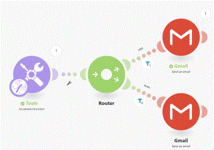

# [!UICONTROL Tools]

De sectie [!DNL Adobe Workfront Fusion Tools] bevat verschillende nuttige modules die uw scenario kunnen verbeteren.

[!UICONTROL Tools] -modules zijn beschikbaar via de lijst met toepassingen of via het [!UICONTROL Tools] pictogram  onder aan het scherm.

## Toegangsvereisten

U moet de volgende toegang hebben om de functionaliteit in dit artikel te kunnen gebruiken:

<table style="table-layout:auto"> 
 <col> 
 <col> 
 <tbody> 
  <tr> 
   <td role="rowheader">[!DNL Adobe Workfront] plan*</td>
  <td> 
[!UICONTROL Pro] of hoger
 </td>
  </tr> 
  <tr data-mc-conditions=""> 
   <td role="rowheader">[!DNL Adobe Workfront] licentie*</td>
   <td> 
[!UICONTROL Plan], [!UICONTROL Work]
 </td> 
  </tr> 
  <tr> 
   <td role="rowheader">[!DNL Adobe Workfront Fusion] licentie**</td> 
   <td>
   
Huidige licentievereiste: geen [!DNL Workfront Fusion] licentievereiste.

   
of

   
Vereiste voor oudere licenties: [!UICONTROL [!DNL Workfront Fusion] voor werkautomatisering en integratie] 

   </td> 
  </tr> 
  <tr> 
   <td role="rowheader">Product</td> 
   <td>
   
Huidige productvereiste: als u het abonnement [!UICONTROL Select] of [!UICONTROL Prime] [!DNL Adobe Workfront] hebt, moet uw organisatie [!DNL Adobe Workfront Fusion] en [!DNL Adobe Workfront] aanschaffen om de in dit artikel beschreven functionaliteit te kunnen gebruiken. [!DNL Workfront Fusion] wordt opgenomen in het [!UICONTROL Ultimate] [!DNL Workfront] -abonnement.

   
of

   
Vereiste verouderd product: uw organisatie moet [!DNL Adobe Workfront Fusion] en [!DNL Adobe Workfront] aanschaffen om de in dit artikel beschreven functionaliteit te kunnen gebruiken.

   </td> 
  </tr>
 </tbody> 
</table>

Neem contact op met de [!DNL Workfront] -beheerder als u wilt weten welk abonnement, licentietype of toegang u hebt.

Voor informatie over [!DNL Adobe Workfront Fusion] vergunningen, zie [[!DNL Adobe Workfront Fusion]  vergunningen ](../../workfront-fusion/get-started/license-automation-vs-integration.md).

## [!UICONTROL Tools] en de bijbehorende velden

* [Triggers](#triggers)
* [Handelingen](#actions)
* [Samenvoegapparatuur](#aggregators)
* [Transformatoren](#transformers)

### Triggers

#### [!UICONTROL Basic trigger]

In deze module kunt u een aangepaste trigger maken en de bijbehorende invoerbundels definiëren.

U kunt deze module, bijvoorbeeld, voor contacten of een andere lijst gebruiken die om naar een gespecificeerd e-mailadres (zoals [!UICONTROL Email] > [!UICONTROL Send an Email], of [!DNL Gmail] > [!UICONTROL Send an Email] modules) gepland is te worden verzonden, of als eenvoudige herinnering die moet worden teweeggebracht wanneer u wilt.

<table style="table-layout:auto"> 
 <col> 
 <col> 
 <tbody> 
  <tr> 
   <td role="rowheader">[!UICONTROL Bundle]</td> 
   <td> 
Aangepaste bundels maken door arrayitems toe te voegen. De array bestaat uit naam-waardeparen.
 </td> 
  </tr> 
 </tbody> 
</table>

### Handelingen

* [[!UICONTROL Get Multiple Variables]](#get-multiple-variables)
* [[!UICONTROL Get Variable]](#get-variable)
* [[!UICONTROL Increment function]](#increment-function)
* [[!UICONTROL Set Multiple Variables]](#set-multiple-variables)
* [[!UICONTROL Set Variable]](#set-variable)
* [[!UICONTROL Sleep]](#sleep)

#### [!UICONTROL Get Multiple Variables]

Deze module haalt waarden op die eerder door de module [!UICONTROL Set Variable] of [!UICONTROL Set Multiple Variables] zijn gemaakt.

Deze module kan variabelen lezen die overal in het scenario werden geplaatst, zelfs als de variabele in een verschillende route werd geplaatst dan waar de [!UICONTROL Get Multiple Variables] module wordt gevestigd. De enige vereiste is dat de module [!UICONTROL Tools] > [!UICONTROL Set Variable] of [!UICONTROL Tools] > [!UICONTROL Set Multiple Variable] wordt uitgevoerd vóór de module [!UICONTROL Tools] > [!UICONTROL Get Multiple Variables] . Voor meer informatie over de orde waarin de modules worden uitgevoerd, zie [ module van de Router in  [!DNL Adobe Workfront Fusion]](../../workfront-fusion/modules/router-module.md).

<table style="table-layout:auto">
    <tr>
        <td>[!UICONTROL Variables]</td>
        <td>Voeg de variabelen toe die u de module wilt krijgen.</td>
    </tr>
    <tr>
        <td>[!UICONTROL Variable name]</td>
        <td>Wijs voor elke variabele die u toevoegt de naam toe van de variabele die u wilt ophalen.</td>
    </tr>
</table>

>[!INFO]
>
>**Voorbeelden:** het volgende is mogelijk gebruik van de [!UICONTROL Set] [!UICONTROL Get (multiple) variable(s)] modules:
>
>* Een berekende waarde opslaan voor later gebruik, zelfs in een verschillende route. Dit is handig wanneer de waarde in meerdere modules wordt gebruikt en de formule voor het berekenen van de waarde te complex is.
>* Fouten opsporen in een formule. Als een in een module gebruikte formule ogenschijnlijk geen correct resultaat oplevert, kopieert u de formule en plakt u deze in een [!UICONTROL Set Variable] -module die u vóór de relevante module invoegt. Koppel de module(s) los na de module [!UICONTROL Set Variable] en voer het scenario uit. Verifieer de output van de module [!UICONTROL Set Variable], pas of vereenvoudig de formule aan, voer opnieuw het scenario uit, en ga zo te werk tot de kwestie is opgelost.

#### [!UICONTROL Get Variable]

Deze module haalt een waarde op die eerder door de module [!UICONTROL Set Variable] of [!UICONTROL Set Multiple Variables] is gemaakt.

Deze module kan variabelen lezen die overal in het scenario werden geplaatst, zelfs als de variabele in een verschillende route werd geplaatst dan waar de [!UICONTROL Get Variable] module wordt gevestigd. De enige vereiste is dat de module [!UICONTROL Tools] > [!UICONTROL Set Variable] of [!UICONTROL Tools] > [!UICONTROL Set Multiple Variables] wordt uitgevoerd vóór de module [!UICONTROL Tools] > [!UICONTROL Get Variable] . Voor meer informatie over de orde waarin de modules worden uitgevoerd, zie [ module van de Router in  [!DNL Adobe Workfront Fusion]](../../workfront-fusion/modules/router-module.md).

<table style="table-layout:auto"> 
 <col> 
 <col> 
 <tbody> 
  <tr> 
   <td role="rowheader">[!UICONTROL Variable name]</td> 
   <td> 
Wijs de naam van de variabele toe die u de module wilt krijgen.
 </td> 
  </tr> 
 </tbody> 
</table>

#### [!UICONTROL Increment function]

Deze module keert een waarde terug die door 1 na de verrichting van elke module wordt verhoogd.

<table style="table-layout:auto"> 
 <col> 
 <col> 
 <tbody> 
  <tr> 
   <td role="rowheader">[!UICONTROL Reset a value]</td> 
   <td> 
Selecteer wanneer u de module de waarde wilt verhogen. 
 
    <ul> 
     <li>[!UICONTROL After one cycle]</li> 
     <li>[!UICONTROL After one scenario run]</li> 
     <li>[!UICONTROL Never]</li> 
    </ul> </td> 
  </tr> 
 </tbody> 
</table>

>[!INFO]
>
>**Voorbeeld:**
>
>Een van de toepassingen van de module is het implementeren van een &#39;round robin&#39;-toewijzing van taken, leads, e-mails, enzovoort, aan gebruikers in een groep. Het algoritme kiest de toewijzen van een groep in een rationele volgorde, meestal van boven naar beneden in een lijst. Wanneer het algoritme het eind van de lijst bereikt, zou het dan de volgende taak aan de gebruiker bij de bovenkant van de lijst geven en blijven taken onderaan de lijst maken.
>
>Het volgende scenario verzendt een e-mail naar de eerste ontvanger na elk oneven genummerd scenario in werking gesteld, en naar de tweede ontvanger na elk even genummerd scenario in werking gesteld.
>
>
>
>1. Dit scenario maken:
>1. Stel het veld **[!UICONTROL Reset a value]** van de module in op Nooit.
>1. Stel de route in voor oneven waarden. Stel het filter voor deze route in met de rekenkundige modulusfunctie die gelijk is aan `1` :
>
>   
>
>  **Nota**: Vergeet niet om de [!UICONTROL Equal to] exploitant van de standaard [!UICONTROL Text] exploitant in de [!UICONTROL Numeric] exploitant te veranderen.
>
>1. Stel de route voor even waarden in met de wiskundige functie &#39;restbepaling bij deling&#39; die gelijk is aan `0` :
>
>De verhogingsfunctie voegt één toe telkens als het scenario loopt. De filters controleren de verhoging en handelen op zijn waarde, die ervoor zorgt dat de e-mails gelijkelijk worden verdeeld.

#### [!UICONTROL Set Multiple Variables]

Deze module leidt tot variabelen die door andere modules in de route kunnen worden in kaart gebracht. De variabele kan ook voor elke route in het scenario worden toegewezen aan de modules [!UICONTROL Get Variable] of [!UICONTROL Get Multiple Variables] .

<table style="table-layout:auto"> 
 <col> 
 <col> 
 <tbody> 
  <tr> 
   <td>[!UICONTROL Variables]</td> 
   <td>Voeg de variabelen toe die u de module wilt plaatsen.</td> 
  </tr> 
  <tr> 
   <td>[!UICONTROL Variable name] </td> 
   <td>Voer voor elke variabele de naam van de variabele in. Deze naam zal worden getoond wanneer het in kaart brengen van de variabele in andere modules. </td> 
  </tr> 
  <tr> 
   <td>[!UICONTROL Variable value] </td> 
   <td>Voer voor elke variabele de waarde voor de variabele in. </td> 
  </tr> 
  <tr> 
   <td>[!UICONTROL Variable lifetime] </td> 
   <td> 
Selecteer hoe lang de variabelen geldig moeten blijven (dezelfde waarde behouden).
 
    <ul> 
     <li><strong>[!UICONTROL One cycle]</strong>: De variabele is geldig voor één cyclus. Nuttig wanneer meerdere webhaken in één scenario worden ontvangen (meer webhooks = meer cycli). </li> 
     <li><strong>[!UICONTROL One execution]</strong>: De variabele is geldig voor één scenario-uitvoering. Een uitvoering kan een of meer cycli bevatten.</li> 
    </ul> </td> 
  </tr> 
 </tbody> 
</table>

#### [!UICONTROL Set Variable]

Deze module leidt tot een variabele die door andere modules in de route kan worden in kaart gebracht. De variabele kan ook voor elke route in het scenario worden toegewezen aan de modules [!UICONTROL Get Variable] of [!UICONTROL Get Multiple Variables] .

<table style="table-layout:auto"> 
 <col> 
 <col> 
 <tbody> 
  <tr> 
   <td>[!UICONTROL Variable name] </td> 
   <td>Voer de variabelenaam in. Deze naam zal worden getoond wanneer het in kaart brengen van de variabele in andere modules. </td> 
  </tr> 
  <tr> 
   <td>[!UICONTROL Variable lifetime] </td> 
   <td> 
Selecteer hoe lang de variabelen geldig moeten blijven (dezelfde waarde behouden).
 
    <ul> 
     <li><strong>[!UICONTROL One cycle]</strong>: De variabele is geldig voor één cyclus. Nuttig wanneer meerdere webhaken in één scenario worden ontvangen (meer webhooks = meer cycli). </li> 
     <li><strong>[!UICONTROL One execution]</strong>: De variabele is geldig voor één scenario-uitvoering. Een uitvoering kan een of meer cycli bevatten.</li> 
    </ul> </td> 
  </tr> 
  <tr> 
   <td>[!UICONTROL Variable value] </td> 
   <td>Voer de waarde voor de variabele in of wijs deze toe. </td> 
  </tr> 
 </tbody> 
</table>

#### [!UICONTROL Sleep]

Deze module staat u toe om de scenariostroom tot 300 seconden (5 minuten) te vertragen.

Deze functie kan bijvoorbeeld nuttig zijn als u de belasting van de [!DNL target] -serviceserver wilt verminderen of als u menselijk gedrag wilt simuleren bij het verzenden van sms-berichten of e-mails.

<table style="table-layout:auto"> 
 <col> 
 <col> 
 <tbody> 
  <tr> 
   <td> 
[!UICONTROL Delay]
 </td> 
   <td> 
Voer het aantal seconden in waarvoor het scenario wordt gepauzeerd.
 </td> 
  </tr> 
 </tbody> 
</table>

>[!TIP]
>
>Als u de stroom voor langere periodes wilt pauzeren, adviseren wij om uw scenario in twee scenario&#39;s te verdelen:
>
>* Het eerste scenario zou het deel vóór de pauze bevatten.
>* Het tweede scenario zou het deel na het bevatten.
>
>In het eerste scenario worden alle benodigde gegevens samen met de huidige tijdstempel opgeslagen in een gegevensopslagruimte. Het tweede scenario zou de gegevensopslag periodiek controleren op verslagen met een timestamp ouder dan de voorgenomen vertraging, de verslagen terugwinnen, de verwerking van de gegevens voltooien en de verslagen uit de gegevensopslag verwijderen.
>
>Voor meer informatie over gegevensopslag, zie [ de Opslag van Gegevens in  [!DNL Adobe Workfront Fusion]](../../workfront-fusion/modules/data-stores.md).
>
>Voor meer informatie over specifieke modules van de gegevensopslag, zie [[!UICONTROL Data store] modules ](../../workfront-fusion/apps-and-their-modules/data-store-modules.md).

### Samenvoegapparatuur

* [[!UICONTROL Numeric aggregator]](#numeric-aggregator)
* [[!UICONTROL Table aggregator]](#table-aggregator)
* [[!UICONTROL Text aggregator]](#text-aggregator)

#### [!UICONTROL Numeric aggregator]

Met deze module kunt u numerieke waarden ophalen en vervolgens een van de geselecteerde functies (SUM, AVG, COUNT, MAX, MIN) toepassen en het resultaat in één bundel retourneren.

<table style="table-layout:auto"> 
 <col> 
 <col> 
 <tbody> 
  <tr> 
   <td> 
[!UICONTROL Source module]
 </td> 
   <td> 
Selecteer de module waarvan u velden wilt samenvoegen.
 </td> 
  </tr> 
  <tr> 
   <td> 
[!UICONTROL Aggregate function]
 </td> 
   <td> 
Selecteer de functie die u wilt gebruiken om de waarden samen te voegen.
 </td> 
  </tr> 
  <tr> 
   <td> 
[!UICONTROL Group by]
 </td> 
   <td> 
Definieer een expressie waarop u de geaggregeerde uitvoer wilt groeperen. Deze expressie kan een of meer toegewezen items bevatten. De geaggregeerde gegevens worden vervolgens in groepen verdeeld op basis van de waarde van deze expressie. Elke groep voert als een afzonderlijke bundel met een sleutel (de geëvalueerde uitdrukking) en een waarde (de bijeengevoegde waarde) uit. U kunt de sleutel als filter in verdere modules gebruiken.
 </td> 
  </tr> 
  <tr> 
   <td>[!UICONTROL Stop processing after an empty aggregation]</td> 
   <td>Schakel deze optie in om het scenario te stoppen als er geen resultaten zijn.</td> 
  </tr> 
  <tr> 
   <td> 
[!UICONTROL Value]
 </td> 
   <td> 
Voer de waarde in die u wilt samenvoegen of wijs deze toe.
 </td> 
  </tr> 
 </tbody> 
</table>

#### [!UICONTROL Table aggregator]

In deze module worden waarden uit de geselecteerde velden met ontvangen bundels samengevoegd in één bundel met een opgegeven kolom- en rijscheidingsteken (waarmee u een tabel kunt maken).

<table style="table-layout:auto"> 
 <col> 
 <col> 
 <tbody> 
  <tr> 
   <td> 
[!UICONTROL Source module]
 </td> 
   <td> 
Selecteer de module waarvan u velden wilt samenvoegen.
 </td> 
  </tr> 
  <tr> 
   <td>[!UICONTROL Aggregated fields]</td> 
   <td> 
 Selecteer de velden in de module die hierboven is geselecteerd en de waarden bevatten die u wilt samenvoegen tot één bundel.
 </td> 
  </tr> 
  <tr> 
   <td> 
[!UICONTROL Column separator]
 </td> 
   <td> 
Selecteer of typ het type scheidingsteken waarmee de kolommen met veldwaarden in de resulterende bundel worden gescheiden. Als u [!UICONTROL Other] selecteert, voert u het teken in dat u wilt gebruiken om waarden te scheiden in het scheidingsveld.
 </td> 
  </tr> 
  <tr> 
   <td> 
[!UICONTROL Row separator]
 </td> 
   <td> 
Selecteer of typ het type scheidingsteken waarmee de rijen met veldwaarden in de resulterende bundel worden gescheiden. Als u [!UICONTROL Other] selecteert, voert u het teken in dat u wilt gebruiken om waarden te scheiden in het scheidingsveld.
 </td> 
  </tr> 
  <tr> 
   <td> 
[!UICONTROL Group by]
 </td> 
   <td> 
Definieer een expressie waarop u de geaggregeerde uitvoer wilt groeperen. Deze expressie kan een of meer toegewezen items bevatten. De geaggregeerde gegevens worden vervolgens in groepen verdeeld op basis van de waarde van deze expressie. Elke groep voert als een afzonderlijke bundel met een sleutel (de geëvalueerde uitdrukking) en een waarde (de bijeengevoegde waarde) uit. U kunt de sleutel als filter in verdere modules gebruiken.
 </td> 
  </tr> 
  <tr> 
   <td>[!UICONTROL Stop processing after an empty aggregation]</td> 
   <td>Selecteer deze optie om het scenario te stoppen als er geen resultaten zijn.</td> 
  </tr> 
 </tbody> 
</table>

#### [!UICONTROL Text aggregator]

In deze module worden waarden uit de geselecteerde velden met ontvangen bundels samengevoegd in één bundel.

<table style="table-layout:auto"> 
 <col> 
 <col> 
 <tbody> 
  <tr> 
   <td> 
[!UICONTROL Source module]
 </td> 
   <td> 
Selecteer de module waarvan u velden wilt samenvoegen.
 </td> 
  </tr> 
  <tr> 
   <td> 
[!UICONTROL Row separator]
 </td> 
   <td> 
Selecteer of typ het type scheidingsteken waarmee de rijen met veldwaarden in de resulterende bundel worden gescheiden. Als u [!UICONTROL Other] selecteert, voert u het teken in dat u wilt gebruiken om waarden te scheiden in het scheidingsveld.
 </td> 
  </tr> 
  <tr> 
   <td> 
[!UICONTROL Group by]
 </td> 
   <td> 
Definieer een expressie die een of meer in kaart gebrachte items bevat. De samengevoegde gegevens worden gescheiden onder Groepen met de waarde van dezelfde expressie. Elke groep voert als afzonderlijke bundel uit die een Sleutel met de geëvalueerde uitdrukking en de samengevoegde tekst bevat. Door dit te doen, kunt u Sleutel als filter in verdere modules gebruiken.
 </td> 
  </tr> 
  <tr> 
   <td>[!UICONTROL Text]</td> 
   <td> 
 Typ of wijs de tekst toe die u in de module wilt samenvoegen.
 </td> 
  </tr> 
  <tr> 
   <td>[!UICONTROL Stop processing after an empty aggregation]</td> 
   <td>Selecteer deze optie om het scenario te stoppen als er geen resultaten zijn.</td> 
  </tr> 
 </tbody> 
</table>

>[!INFO]
>
>**Voorbeeld:** u kunt de tekstaggregator gebruiken om meer waarden (bijvoorbeeld, klantennamen of nota&#39;s) in één enkele bundel op te nemen en een e-mail te verzenden die alle waarden in het e-maillichaam of het e-mailonderwerp bevat.

### Transformatoren

* [[!UICONTROL Compose a string]](#compose-a-string)
* [[!UICONTROL Convert the encoding of the text]](#convert-the-encoding-of-the-text)
* [[!UICONTROL Switch]](#switch)

#### [!UICONTROL Compose a string]

Zet om het even welke waarde in een type van koordgegevens (tekst). Het maakt de afbeelding gemakkelijker wanneer het in kaart brengen, bijvoorbeeld, binaire gegevens.

<table style="table-layout:auto"> 
 <col> 
 <col> 
 <tbody> 
  <tr> 
   <td role="rowheader">[!UICONTROL Text]</td> 
   <td> 
Voer de gegevens in die u in de tekst wilt omzetten of wijs deze toe.
 </td> 
  </tr> 
 </tbody> 
</table>

#### [!UICONTROL Convert the encoding of the text]

Hiermee wordt ingevoerde invoertekst (of binaire gegevens) omgezet in de geselecteerde codering.

<table style="table-layout:auto"> 
 <col> 
 <col> 
 <tbody> 
  <tr> 
   <td> 
[!UICONTROL Input data]
 </td> 
   <td> 
Voer de inhoud in of wijs de inhoud toe die u wilt omzetten.
 </td> 
  </tr> 
  <tr> 
   <td>[!UICONTROL Input data codepage]</td> 
   <td> 
Selecteer het coderingstype van de invoergegevens. 
 </td> 
  </tr> 
  <tr> 
   <td> 
[!UICONTROL Output data codepage]
 </td> 
   <td> 
Selecteer het coderingstype van uw doel- (uitvoer)gegevens.
 </td> 
  </tr> 
 </tbody> 
</table>

#### [!UICONTROL Switch]

Controleert de invoerwaarde voor een overeenkomst met de opgegeven lijst met waarden. Retourneert uitvoer op basis van het resultaat.

<table style="table-layout:auto"> 
 <col> 
 <col> 
 <tbody> 
  <tr> 
   <td> 
[!UICONTROL Input]
 </td> 
   <td> 
Voer de expressie in die u wilt evalueren.
 </td> 
  </tr> 
  <tr> 
   <td>[!UICONTROL Use regular expressions to match]</td> 
   <td> 
Schakel deze optie in als u reguliere expressies wilt gebruiken. De module bepaalt de gevallen die op de regelmatige uitdrukking, eerder dan een nauwkeurige gelijke worden gebaseerd.
 
    
 
     
Een reguliere expressie is een reeks tekens waarin elk teken een metateken is met een speciale betekenis of een regulier teken met een letterlijke betekenis. Met deze teken- en metatekens wordt een patroon geïdentificeerd dat kan worden gebruikt voor het zoeken naar tekst. Als u bijvoorbeeld naar namen wilt zoeken, kunt u een reguliere expressie instellen om te zoeken naar een patroon dat bestaat uit twee opeenvolgende woorden die beginnen met hoofdletters. Reguliere expressies zijn een krachtig gereedschap voor het zoeken en bewerken van tekst.
 
     
Een discussie over reguliere expressies valt buiten het toepassingsgebied van dit artikel. Wij adviseren de volgende middelen:
 
     <ul> 
      <li>Voor de volledige lijst van metacharacters, zie <a href="https://developer.mozilla.org/en-US/docs/Web/JavaScript/Guide/Regular_Expressions"> Reguliere uitdrukkingen </a> in MDN Web docs.</li> 
      <li>Voor een leerprogramma op hoe te om regelmatige uitdrukkingen tot stand te brengen, adviseren wij <a href="https://regexone.com/"> RegexOne </a>.</li> 
      <li>Voor het experimenteren met regelmatige uitdrukkingen, adviseren wij de <a href="https://regex101.com/"> Reguliere Uitdrukkingen 101 </a> website. Selecteer de ECMAScript-FLAVOR (JavaScript) in het linkerdeelvenster.</li> 
     </ul> 
    
 </td> 
  </tr> 
  <tr> 
   <td>[!UICONTROL Cases] </td> 
   <td> 
Als de invoer een waarde bevat die is ingevoerd in het veld [!UICONTROL Pattern] , wordt de waarde die is ingevoerd in het veld [!UICONTROL Output] geretourneerd.
 
Als de invoer niet overeenkomt met een van de waarden die u in een [!UICONTROL Pattern] -veld hebt ingesteld, vindt een van de volgende gebeurtenissen plaats:
 
    <ul> 
     <li>De waarde van het veld [!UICONTROL Else] wordt geretourneerd</li> 
     <li>Wanneer het veld [!UICONTROL Else] geen waarde bevat, wordt geen uitvoer geretourneerd.</li> 
    </ul> </td> 
  </tr> 
  <tr> 
   <td> 
[!UICONTROL Else]
 </td> 
   <td> 
Voer de waarde in die wordt geretourneerd wanneer niet wordt voldaan aan de criteria die in het veld Gevallen zijn ingesteld. 
 </td> 
  </tr> 
 </tbody> 
</table>
