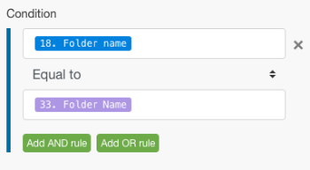

# Geavanceerde foutafhandeling in [!DNL Adobe Workfront Fusion]

Geavanceerde technieken voor foutafhandeling zijn onder andere filteren en nesten.

## Toegangsvereisten

U moet de volgende toegang hebben om de functionaliteit in dit artikel te kunnen gebruiken:

<table style="table-layout:auto">
 <col> 
 <col> 
 <tbody> 
  <tr> 
   <td role="rowheader">[!DNL Adobe Workfront] plan*</td> 
   <td> 
[!UICONTROL Pro] of hoger
 </td> 
  </tr> 
  <tr data-mc-conditions=""> 
   <td role="rowheader">[!DNL Adobe Workfront] licentie*</td> 
   <td> 
[!UICONTROL Plan], [!UICONTROL Work]
 </td> 
  </tr> 
  <tr> 
   <td role="rowheader">[!UICONTROL Adobe Workfront Fusion] licentie**</td> 
   <td> 
[!UICONTROL [!DNL Workfront Fusion] voor werkautomatisering en -integratie] 

[!UICONTROL [!DNL Workfront Fusion] voor werkautomatisering]
  </td> 
  </tr> 
  <tr> 
   <td role="rowheader">Product</td> 
   <td>Uw organisatie moet [!DNL Adobe Workfront Fusion] alsmede [!DNL Adobe Workfront] om de in dit artikel beschreven functionaliteit te gebruiken.</td> 
  </tr> 
 </tbody> 
</table>

Neem contact op met uw [!DNL Workfront] beheerder.

Voor informatie over [!DNL Adobe Workfront Fusion] licenties, zie [[!DNL Adobe Workfront Fusion] licenties](../../workfront-fusion/get-started/license-automation-vs-integration.md).

## Filteren

Er zijn twee soorten het filtreren die op een route van de foutenmanager kunnen plaatsvinden.

* [Een filter toevoegen aan de fouthandlerroute](#adding-a-filter-to-the-error-handler-route)
* [Het toevoegen van een Router die door filters aan de route van de foutenmanager wordt gevolgd](#adding-a-router-followed-by-filters-to-the-error-handler)

### Een filter toevoegen aan de fouthandlerroute

U kunt een filter gebruiken om te controleren welke fouten door de route van de foutenmanager worden behandeld. Op deze manier kunt u alleen bepaalde soorten fouten verwerken. Als een fout niet door de filter overgaat, zal het worden behandeld alsof er geen die route van de foutenmanager voor de bepaalde module wordt bepaald is.

>[!INFO]
>
>**Voorbeeld:**
>
>

### Een [!UICONTROL Router] gevolgd door filters naar de fouthandler

>[!INFO]
>
>
>
>In dit voorbeeld vindt de fout plaats op het tabblad [!UICONTROL Create a folder] module (A), die een regelmatige route en een route van de foutenmanager heeft. Het laatste wordt gevolgd door een router met één route die een filter heeft dat een specifiek type van fout (de Fout van Gegevens neemt) bepaalt, en andere die de standaardroute voor alle andere fouten is. De eerste route beëindigt met [!UICONTROL Resume] richtlijn die vervangende waarden bevat voor het scenario dat uit module A wordt hervat ([!UICONTROL Create a folder]), terwijl de tweede route eindigt met de [!UICONTROL Rollback] richtlijn die de uitvoering van het scenario onmiddellijk stopt.

Zie [Fout bij verwerken in [!DNL Adobe Workfront Fusion]](../../workfront-fusion/errors/error-processing.md) voor meer informatie over verschillende fouttypen en over hoe [!DNL Workfront Fusion] verwerkt en evalueert deze.

### Het voorbeeldscenario

U kunt deze voorbeeldscène instellen om te begrijpen hoe deze filters werken voor foutafhandeling.

Bestaande gebruiken [!DNL Dropbox] om een bestand te uploaden in plaats van een nieuw bestand te maken

Als u het [!UICONTROL Create a folder] module ingeschakeld [!DNL Dropbox] en er al een map met dezelfde naam bestaat, genereert de module een gegevensfout zoals hieronder wordt weergegeven:

Het volledige scenario:

1. De [!UICONTROL Tools] > [!UICONTROL Set Variable] module bevat de mapnaam
1. De [!UICONTROL HTTP] >[!UICONTROL Get a file] haalt het bestand op dat naar de map moet worden geüpload
1. De [!UICONTROL Dropbox] >[!UICONTROL Create a folder] een fout meldt als er al een map bestaat met dezelfde naam als de map die in de module is toegewezen
1. De route van de foutenmanager (transparante bellen) bevat een router om de fouten te filtreren
1. De eerste route is voor een gespecificeerd type van fout genoemd de Fout van Gegevens zoals wij reeds van het kennen:

   1. Als er een gegevensfout optreedt en de foutdetails door het filter worden doorgegeven, [!UICONTROL Dropbox] >[!UICONTROL List all files/subfolders in a folder module] geeft alle mappen in [!DNL Dropbox]
   1. Het volgende filter komt overeen met de mapnamen
   1. De [!UICONTROL Resume] instructie geeft de map-id en het mappad van de bestaande map op en de uitvoering van het scenario wordt hervat vanuit de [!UICONTROL Dropbox] >[!UICONTROL Create a folder] in plaats van een nieuwe map te maken, gebruikt deze keer de waarden van de [!UICONTROL Resume] naar de volgende module te gaan en het bestand in de bestaande map te uploaden

1. De tweede route is voor alle andere fouten en beëindigt met [!UICONTROL Rollback] richtlijn die onmiddellijk een einde maakt aan het scenario

Hieronder volgt een gedetailleerde uitleg van de vijfde verklaring:

Voor het gebruik van de bestaande map in de volgende modules ([!UICONTROL Upload a file] hieronder), moet u een route van de foutenmanager aan de module toevoegen en de omslagweg halen die in in kaart moet worden gebracht [!UICONTROL Resume] de volgende richtlijnmodule :

Het filter op de eerste route wordt geplaatst om de bepaalde fout (de Fout van Gegevens) slechts te behandelen die verschijnt wanneer een omslag met de zelfde naam reeds bestaat:

De [!UICONTROL Dropbox] >[!UICONTROL List all files in a folder] wordt gevormd om alle omslagen in de doelomslag terug te keren. Het volgende filter geeft alleen het filter door dat we oorspronkelijk probeerden te maken (de mapnaam wordt opgeslagen in de map 33). Mapnaam (item):

Uiteindelijk [!UICONTROL Resume] instructie levert het pad Map als uitvoer voor de mislukte module. De map-id is leeg gelaten omdat deze niet nodig is voor de &#39;[!UICONTROL Upload a file]module:

## Nesten

Ongeacht waar een module wordt gevestigd, kunnen de routes van de foutenmanager op alle modules, behalve routers worden gecreeerd en worden uitgevoerd. Zo is het mogelijk om een route van de foutenmanager voor een module tot stand te brengen die reeds deel van een bestaande die route van de foutenmanager voor een andere module wordt gecreeerd.

Hier is een voorbeeld van een genestelde route van de foutenmanager:

In dit scenario, wordt de tweede route van de foutenmanager genest onder de eerste route van de foutenmanager. Dus als de [!UICONTROL Dropbox] >[!UICONTROL Create a folder module] ontmoet een fout, de uitvoeringsbewegingen aan Route 1, als de [!UICONTROL Data Error Takes Place] filter wordt overgegaan, wordt de volgende module uitgevoerd gevolgd door [!UICONTROL Resume] compilerinstructie als er geen fout optreedt met de [!UICONTROL Dropbox] >[!UICONTROL List all files/subfolders] in een mappenmodule.

Als er echter wel een fout optreedt [!DNL Dropbox] module, dan de uitvoeringsbewegingen aan Route 2 van de Handler van de Fout en beëindigt met [!UICONTROL Ignore] richtlijn. De [!UICONTROL Resume directive] wordt in dit geval niet uitgevoerd.

Dit is een combinatie van fouthandlers voor filteren en nesten.

