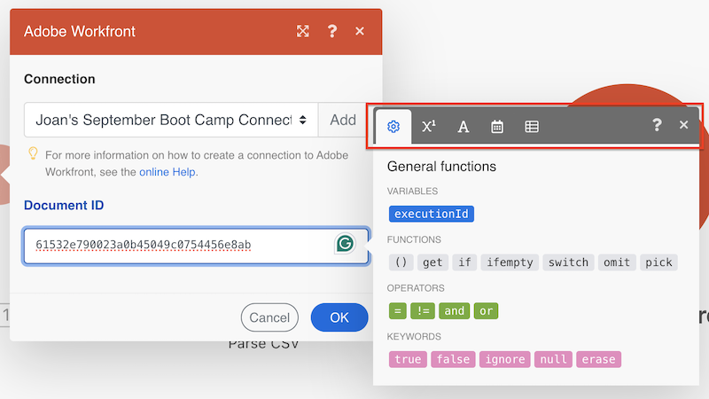

# Items toewijzen met behulp van functies in [!DNL Adobe Workfront Fusion]

>[!IMPORTANT]
>
>De Adobe Workfront Fusion-documentatie is verplaatst naar een nieuwe locatie.
>
>De informatie in dit artikel is nu te vinden in het artikel:
>
>* [ kaart een punt gebruikend functies ](https://experienceleague.adobe.com/docs/workfront-fusion/using/create-scenarios/map-data/map-using-functions.html)
>
>Werk eventuele bladwijzers bij.
>
>Dit artikel wordt niet meer bijgewerkt en wordt in de nabije toekomst verwijderd.

Wanneer u items toewijst, kunt u functies gebruiken om eenvoudige of complexe formules te maken. De functies die beschikbaar zijn in [!DNL Adobe Workfront Fusion] zijn vergelijkbaar met functies in Excel en in sommige programmeertalen:

* Ze evalueren algemene logica, wiskunde, tekst, datums en arrays.
* U kunt hiermee voorwaardelijke logica en transformaties van itemwaarden uitvoeren, zoals het omzetten van tekst in hoofdletters, het bijsnijden van tekst, het omzetten van een datum in een andere notatie en nog veel meer.

Voor meer informatie, zie [ informatie van de Kaart van één module aan een andere in de Fusie van Adobe Workfront ](../../workfront-fusion/mapping/map-information-between-modules.md).

## Toegangsvereisten

U moet de volgende toegang hebben om de functionaliteit in dit artikel te kunnen gebruiken:

<table style="table-layout:auto">

<col>  
 <col>  
 <tbody>  
  <tr>  
   <td role="rowheader">[!DNL Adobe Workfront] plan</td>  
   <td> 
Alle
 </td>  
  </tr>  
  <tr data-mc-conditions="">  
   <td role="rowheader">[!DNL Adobe Workfront] licentie</td>  
   <td> 
Nieuw: [!UICONTROL Standard]

of

Huidig: [!UICONTROL Work] of hoger
 </td>  
  </tr>  
  <tr>  
   <td role="rowheader">[!DNL Adobe Workfront Fusion] licentie**</td>  
   <td> 
   
Huidig: Geen [!DNL Workfront Fusion] vereiste licentie.
 
   
of
 
   
Verouderd: alle 
 
   </td>  
  </tr>  
  <tr>  
   <td role="rowheader">Product</td>  
   <td> 
   
Nieuw:
 <ul><li>[!UICONTROL Select] of [!UICONTROL Prime] [!DNL Workfront] Plan: Uw organisatie moet het abonnement aanschaffen [!DNL Adobe Workfront Fusion] .</li><li>[!UICONTROL Ultimate] [!DNL Workfront] Overzicht: [!DNL Workfront Fusion] is opgenomen.</li></ul> 
   
of
 
   
Huidig: Uw organisatie moet [!DNL Adobe Workfront Fusion] aanschaffen.
 
   </td>  
  </tr> 
 </tbody>  
</table>

Voor meer detail over de informatie in deze lijst, zie [ vereisten van de Toegang in de documentatie van Workfront ](/help/quicksilver/administration-and-setup/add-users/access-levels-and-object-permissions/access-level-requirements-in-documentation.md).

Voor informatie over [!DNL Adobe Workfront Fusion] vergunningen, zie [[!DNL Adobe Workfront Fusion]  vergunningen ](../../workfront-fusion/get-started/license-automation-vs-integration.md).

## Overzicht van het tabblad Toewijzing

U opent als volgt het deelvenster [!UICONTROL mapping] voor een veld:

1. Klik **Scenario&#39;s** in het linkerpaneel.
1. Kies een scenario.

### Tabbladen van het deelvenster Toewijzing

Hier volgen tabbladen in het deelvenster Toewijzing:

* **Algemene functies**  - zie [ Algemene functies in  [!DNL Adobe Workfront Fusion]](../../workfront-fusion/functions/general-functions.md) voor meer informatie.

* **functies Math**  - zie [ functies Math in  [!DNL Adobe Workfront Fusion]](../../workfront-fusion/functions/math-functions.md) voor meer informatie.

* **Tekst en binaire functies**  - zie [ functies van het Koord in  [!DNL Adobe Workfront Fusion]](../../workfront-fusion/functions/string-functions.md) voor meer informatie.

* **Datum en tijd**  - zie [ Datum en tijdfuncties in  [!DNL Adobe Workfront Fusion]](../../workfront-fusion/functions/date-and-time-functions.md) en de hieronder artikelen voor meer informatie:

   * [Tokens voor datum- en tijdnotatie in  [!DNL Adobe Workfront Fusion]](../../workfront-fusion/functions/tokens-for-date-and-time-formatting.md)
   * [Tokens voor datum en tijd het ontleden in  [!DNL Adobe Workfront Fusion]](../../workfront-fusion/functions/tokens-for-date-and-time-parsing.md)

* **Functies voor het werken met series**  - zie [ functies van de Serie in  [!DNL Adobe Workfront Fusion]](../../workfront-fusion/functions/array-functions.md) voor meer informatie.

* **Kaart andere functies**  toont de punten die u van andere modules kunt in kaart brengen. Dit tabblad is niet altijd beschikbaar.

## Functies invoegen in velden

Een functie invoegen in een veld:

1. Klik op de naam van de functie.

   of

   Sleep de functie naar het veld.

>[!BEGINSHADEBOX]

**Voorbeeld:** Sommige gegevenstypes verhinderen gebruikers meer dan een bepaald aantal karakters in te gaan. U kunt de subtekenreeksfunctie gebruiken om een waarde te beperken tot een bepaald aantal tekens.

In dit voorbeeld beperkt de subtekenreeksfunctie de projectnaam tot 50 tekens.

>[!ENDSHADEBOX]

## Nesten, functies

U kunt functies binnen elkaar nesten.

## [!DNL Google Sheets] -functies gebruiken

Als een functie die u wilt gebruiken niet in [!DNL Workfront Fusion] voorkomt, maar wel in [!DNL Google Sheets] , kunt u deze functie als volgt gebruiken:

1. Maak in [!DNL Google Sheets] een nieuw leeg spreadsheet.
1. Open in [!DNL Workfront Fusion] het scenario.
1. Voeg de module **[!DNL Google Sheets]** > **[!UICONTROL Update a cell]** aan het scenario toe.

   Voor instructies bij het toevoegen van een module, zie [ een module in een scenario ](../../workfront-fusion/scenarios/create-a-scenario.md#add) in het artikel [ een scenario in  [!DNL Adobe Workfront Fusion]](../../workfront-fusion/scenarios/create-a-scenario.md) creëren.

1. Configureer de module:

   1. Kies het nieuwe werkblad in het veld **[!UICONTROL Spreadsheet]** .
   1. Voeg uw formule met de [!DNL Google Sheets] functie(s) in het **[!UICONTROL Value]** veld in.

      U kunt de output van voorafgaande modules zoals gebruikelijk gebruiken.

      

1. Voeg de module **[!UICONTROL Google Sheets]>[!UICONTROL Get a cell]** in om het berekende resultaat te verkrijgen.
1. Vorm de module, gebruikend zelfde identiteitskaart van de Cel die u in stap 4 gebruikte.

   
