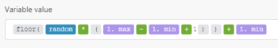

# Wiskundige variabelen in [!DNL Adobe Workfront Fusion]

<!--Audited: 4/2024-->

## Toegangsvereisten

U moet de volgende toegang hebben om de functionaliteit in dit artikel te kunnen gebruiken:

<table style="table-layout:auto"> 
 <col>  
 <col>  
 <tbody>  
  <tr>  
   <td role="rowheader">[!DNL Adobe Workfront] plan</td>  
   <td> <p>Alle</p> </td>  
  </tr>  
  <tr data-mc-conditions="">  
   <td role="rowheader">[!DNL Adobe Workfront] licentie</td>  
   <td> <p>Nieuw: [!UICONTROL Standard]</p><p>of</p><p>Huidige: [!UICONTROL Work] of hoger</p> </td>  
  </tr>  
  <tr>  
   <td role="rowheader">[!DNL Adobe Workfront Fusion] licentie**</td>  
   <td> 
   <p>Huidig: Nee [!DNL Workfront Fusion] vergunningsvereiste.</p> 
   <p>of</p> 
   <p>Verouderd: alle </p> 
   </td>  
  </tr>  
  <tr>  
   <td role="rowheader">Product</td>  
   <td> 
   <p>Nieuw:</p> <ul><li>[!UICONTROL Select] of [!UICONTROL Prime] [!DNL Workfront] Abonnement: uw organisatie moet aankopen [!DNL Adobe Workfront Fusion].</li><li>[!UICONTROL Ultimate] [!DNL Workfront] Plan: [!DNL Workfront Fusion] is opgenomen.</li></ul> 
   <p>of</p> 
   <p>Huidig: Uw organisatie moet het volgende aanschaffen [!DNL Adobe Workfront Fusion].</p> 
   </td>  
  </tr> 
 </tbody>  
</table>

Zie voor meer informatie over de informatie in deze tabel [Toegangsvereisten in Workfront-documentatie](/help/quicksilver/administration-and-setup/add-users/access-levels-and-object-permissions/access-level-requirements-in-documentation.md).

Voor informatie over [!DNL Adobe Workfront Fusion] licenties, zie [[!DNL Adobe Workfront Fusion] licenties](../../workfront-fusion/get-started/license-automation-vs-integration.md).

## pi

Vertegenwoordigt het wiskundige symbool $\pi$.

## [!UICONTROL random]

Hiermee wordt een pseudo-willekeurig getal met drijvende komma in het bereik geretourneerd [`0`,`1`] (inclusief `0`, maar niet `1`).

Gebruik de volgende formule om een geheel pseudo-willekeurig aantal in de waaier te produceren [`min`,`max`] (inclusief beide `min` en `max`):



```
floor(random * (1.max - 1.min + 1)) + 1.min
```
