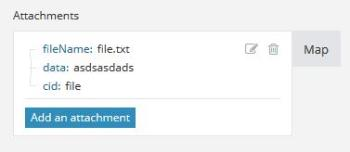

# Een array toewijzen in [!DNL Adobe Workfront Fusion]

Een array is een speciaal type item dat het volgende kan bevatten:

* Een of meer tekstwaarden (eenvoudige array)
* Een of meer verzamelingen van hetzelfde type (complexe array)

>[!INFO]
>
>**Voorbeeld:** De [!UICONTROL Watch emails] retourneert een array met bijlagen voor elke e-mail. Elke bijlage vertegenwoordigt een verzameling die een naam, inhoud, grootte enzovoort kan bevatten.

Zie voor meer informatie [Gegevenstypen item in [!DNL Adobe Workfront Fusion]](../../workfront-fusion/mapping/item-data-types.md).

## Toegangsvereisten

U moet de volgende toegang hebben om de functionaliteit in dit artikel te kunnen gebruiken:

<table style="table-layout:auto">
 <col> 
 <col> 
 <tbody> 
  <tr> 
    <td role="rowheader">[!DNL Adobe Workfront] plan*</td> 
   <td> 
[!DNL Pro] of hoger
 </td> 
  </tr> 
  <tr data-mc-conditions=""> 
   <td role="rowheader">[!DNL Adobe Workfront] licentie*</td> 
   <td> 
[!UICONTROL Plan], [!UICONTROL Work]
 </td> 
  </tr> 
  <tr> 
   <td role="rowheader">[!UICONTROL Adobe Workfront Fusion] licentie**</td> 
   <td>
   
Huidige vergunningsvereiste: Nee [!DNL Workfront Fusion] vergunningsvereiste.

   
of

   
Vereisten voor oudere licenties: [!UICONTROL [!DNL Workfront Fusion] voor werkautomatisering en -integratie] 

   </td> 
  </tr> 
  <tr> 
   <td role="rowheader">Product</td> 
   <td>
   
Huidige productvereisten: Als u de [!UICONTROL Select] of [!UICONTROL Prime] [!DNL Adobe Workfront] Abonnement, uw organisatie moet [!DNL Adobe Workfront Fusion] alsmede [!DNL Adobe Workfront] om de in dit artikel beschreven functionaliteit te gebruiken. [!DNL Workfront Fusion] is opgenomen in de [!UICONTROL Ultimate] [!DNL Workfront] plannen.

   
of

   
Oudere productvereisten: Uw organisatie moet [!DNL Adobe Workfront Fusion] alsmede [!DNL Adobe Workfront] om de in dit artikel beschreven functionaliteit te gebruiken.

   </td> 
  </tr> 
 </tbody> 
</table>

Neem contact op met uw [!DNL Workfront] beheerder.

Voor informatie over [!DNL Adobe Workfront Fusion] licenties, zie [[!DNL Adobe Workfront Fusion] licenties](../../workfront-fusion/get-started/license-automation-vs-integration.md).

## Een array toewijzen

1. Klik op de knop in het doelveld.

   >[!INFO]
   >
   >  **Voorbeeld:** In het bovenstaande voorbeeld klikt u op de knop [!UICONTROL Add an attachment] voor een e-mailbericht.
   >
   >

1. Voer het item in het vak dat wordt weergegeven.

   In het deelvenster kunt u velden op dezelfde manier toewijzen als bij elk ander type item. Als u niet elk punt afzonderlijk wilt invullen, maar een andere serie in het doelgebied wilt in kaart brengen, gebruik [!UICONTROL Map] knop. In dit geval moet u ervoor zorgen dat beide arrays (de bronarray en de doelarray) dezelfde structuur hebben.

   U kunt elk gewenst aantal items aan een array toevoegen.

U kunt een array in afzonderlijke bundels verdelen met behulp van een iterator. Zie voor meer informatie [[!UICONTROL Iterator] module in [!DNL Adobe Workfront Fusion]](../../workfront-fusion/modules/iterator-module.md).
