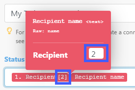

# Gegevens van de ene module toewijzen aan de andere in [!DNL Adobe Workfront Fusion]

Toewijzing is het proces om de output van een module, gestructureerd in punten, aan de inputgebieden van een andere module toe te wijzen.

Het deelvenster Toewijzing wordt weergegeven wanneer u in een scenario op een veld klikt waarin u een waarde wilt invoegen die is uitgevoerd vanuit een voorgaande module. Binnen een module, op om het even welk gebied dat voor afbeelding beschikbaar is, kunt u een formule tot stand brengen gebruikend om het even welke combinatie functies en in kaart gebrachte punten van het toewijzingspaneel met statische teksten die u typt. Deze elementen kunnen in elkaar worden genest.

## Toegangsvereisten

U moet de volgende toegang hebben om de functionaliteit in dit artikel te kunnen gebruiken:

<table style="table-layout:auto">
 <col> 
 <col> 
 <tbody> 
  <tr> 
    <td role="rowheader">[!DNL Adobe Workfront] plan*</td> 
   <td> 
[!DNL Pro] of hoger
 </td> 
  </tr> 
  <tr data-mc-conditions=""> 
   <td role="rowheader">[!DNL Adobe Workfront] licentie*</td> 
   <td> 
[!UICONTROL Plan], [!UICONTROL Work]
 </td> 
  </tr> 
  <tr> 
   <td role="rowheader">[!UICONTROL Adobe Workfront Fusion] licentie**</td> 
   <td>
   
Huidige licentievereiste: geen [!DNL Workfront Fusion] licentievereiste.

   
of

   
Vereiste voor oudere licenties: [!UICONTROL [!DNL Workfront Fusion] voor werkautomatisering en integratie] 

   </td> 
  </tr> 
  <tr> 
   <td role="rowheader">Product</td> 
   <td>
   
Huidige productvereiste: als u het [!UICONTROL Select] - of [!UICONTROL Prime] [!DNL Adobe Workfront] -abonnement hebt, moet uw organisatie [!DNL Adobe Workfront Fusion] en [!DNL Adobe Workfront] aanschaffen om de in dit artikel beschreven functionaliteit te kunnen gebruiken. [!DNL Workfront Fusion] wordt opgenomen in het [!UICONTROL Ultimate] [!DNL Workfront] -abonnement.

   
of

   
Vereiste verouderd product: uw organisatie moet [!DNL Adobe Workfront Fusion] en [!DNL Adobe Workfront] aanschaffen om de in dit artikel beschreven functionaliteit te kunnen gebruiken.

   </td> 
  </tr> 
 </tbody> 
</table>

Neem contact op met de [!DNL Workfront] -beheerder als u wilt weten welk abonnement, licentietype of toegang u hebt.

Voor informatie over [!DNL Adobe Workfront Fusion] vergunningen, zie [[!DNL Adobe Workfront Fusion]  vergunningen ](../../workfront-fusion/get-started/license-automation-vs-integration.md).

## Bundels en artikelen

De verrichting van een module veroorzaakt nul, één, of meer bundels als zijn output. Een bundel bestaat uit een of meer items.

De uitvoer van een module verkennen:

1. Klik op **[!UICONTROL Run once]** om de module uit te voeren.
1. Klik op de ballon boven de module.

   Een logboek dat alle de fasenvertoningen van de module bevat. U kunt de bundel of bundels vinden die door de verrichtingsfase van een module onder de **[!UICONTROL Output]** rubriek worden uitgevoerd. Elke bundel bevat zijn punten en de waarden van elk punt.

>[!INFO]
>
>**Voorbeeld:** Dit voorbeeld toont de module [!UICONTROL Email] > [!UICONTROL Watch emails]. U ziet dat de toepassing 1 bewerking heeft uitgevoerd waarbij één bundel wordt gemaakt die verschillende items bevat, zoals `Date` , `Email ID (UID)` , `size` , enzovoort.
>
>

>[!NOTE]
>
>De uitvoer van modules tussen een [!UICONTROL Iterator] en [!UICONTROL Aggregator] is niet toegankelijk buiten de module [!UICONTROL Aggregator] .

## Een item toewijzen

Nadat u een opeenvolging van modules door twee of meer van hen te verbinden hebt gecreeerd, kan elke module waarden van punten verwerken die door de modules worden uitgevoerd die het voorafgaan.

Om de punten aan de inputgebieden van een module toe te wijzen:

1. Klik op de module die de output van de voorafgaande module of modules zou moeten verwerken.
1. Klik in het deelvenster Moduleinstellingen dat wordt weergegeven op een veld waar u de waarde wilt gebruiken van een item dat is uitgevoerd vanuit een of meer voorgaande modules.

   Het deelvenster Toewijzing wordt geopend.

1. Klik op een item in het deelvenster Toewijzing om het in te voegen in het veld.
1. (Optioneel) Als u naar een bepaald veld in het deelvenster Toewijzing wilt zoeken, klikt u op de zoekbalk van het deelvenster Toewijzing en typt u de term die u wilt zoeken. Klik op het veld wanneer dit in de lijst wordt weergegeven.

   Zoekresultaten bevatten de zoekterm en zijn niet hoofdlettergevoelig.

Voor meer informatie, zie [ de montages van een module in  [!DNL Adobe Workfront Fusion]](../../workfront-fusion/modules/configure-a-modules-settings.md) vormen.

## Formulas

U kunt veelvoudige punten in een gebied in kaart brengen, hen combineren met literals (vaste waarden), en exploitanten en Functies in dienst nemen om complexe formules te bouwen:

U vindt de functies en operatoren in het deelvenster Toewijzing onder een van de tabbladen.

Op de eerste tab  (weergegeven bij het openen van het deelvenster) worden de items weergegeven die u vanuit andere modules kunt toewijzen.

De andere tabbladen bevatten de volgende typen functies:

* **Algemene functies**  - zie [ Algemene functies in  [!DNL Adobe Workfront Fusion]](../../workfront-fusion/functions/general-functions.md) voor meer informatie.

* **functies Math**  - zie [ functies Math in  [!DNL Adobe Workfront Fusion]](../../workfront-fusion/functions/math-functions.md) voor meer informatie.

* **Tekst en binaire functies**  - zie [ functies van het Koord in  [!DNL Adobe Workfront Fusion]](../../workfront-fusion/functions/string-functions.md) voor meer informatie.

* **Datum en tijd**  - zie [ Datum en tijdfuncties in  [!DNL Adobe Workfront Fusion]](../../workfront-fusion/functions/date-and-time-functions.md) en de hieronder artikelen voor meer informatie.

   * [Tokens voor datum- en tijdnotatie in  [!DNL Adobe Workfront Fusion]](../../workfront-fusion/functions/tokens-for-date-and-time-formatting.md)
   * [Tokens voor datum- en tijdparsering in Adobe Workfront Fusion](../../workfront-fusion/functions/tokens-for-date-and-time-parsing.md)

* **Functies voor het werken met series**  - zie [ functies van de Serie in  [!DNL Adobe Workfront Fusion]](../../workfront-fusion/functions/array-functions.md) voor meer informatie.

>[!TIP]
>
>Wanneer u een complexe formule maakt die u opnieuw wilt gebruiken in een ander veld, kunt u klikken op het veld dat de combinatie bevat, Command-A of Ctrl-A gebruiken om de combinatie te selecteren en vervolgens kopiëren en in het andere veld plakken.

Voor meer informatie bij het in kaart brengen van punten die functies gebruiken, zie [ punten van de Kaart gebruikend functies in  [!DNL Adobe Workfront Fusion]](../../workfront-fusion/functions/map-using-functions.md).

## Verzamelingen

Sommige items kunnen meerdere waarden van verschillende typen bevatten. Dit zijn verzamelingstypepunten.

U kunt een [!UICONTROL collection] type-item identificeren door de kleine zwarte rechthoek die rechts van het label van het item en de automatisch uitgevouwen lijst met subitems wordt weergegeven:

>[!NOTE]
>
>In de meeste gevallen wijst u de subitems van de verzameling toe in plaats van het item dat de gehele verzameling vertegenwoordigt.

Voor meer informatie over inzamelingen, zie [ de gegevenstypes van het Punt in [!UICONTROL Adobe Workfront Fusion]](../../workfront-fusion/mapping/item-data-types.md)

## Arrays

Sommige items kunnen meerdere elementen van hetzelfde type bevatten. Dit zijn arraytype-items.

U kunt een arraytype-item herkennen aan de vierkante haakjes aan het einde van het label van het item. Klik op de kleine zwarte rechthoek rechts van het label van het item om de items van het element weer te geven:

Voor meer informatie over series, zie {de gegevenstypen van 0} Punt in  [!DNL Adobe Workfront Fusion]](../../workfront-fusion/mapping/item-data-types.md)[

### Het eerste element van een array toewijzen

Wanneer u het `Recipient name` -item van een array toewijst, wordt dit als volgt in het veld weergegeven:

Het getal tussen de vierkante haakjes is een index die bepaalt welk element van de array wordt gebruikt. De standaardwaarde is 1.

### Het n-de element van een array toewijzen

Als u toegang wilt krijgen tot een ander element, klikt u op de vierkante haakjes en bewerkt u de indexwaarde:

### Het element van een array toewijzen met een bepaalde sleutel

Sommige arrays bevatten verschillende verzamelingen met sleutel- en waardeitems. Dit zijn doorgaans verschillende metagegevens, kenmerken, enzovoort.

In het volgende voorbeeld wordt de uitvoer van de [!DNL Jira] App getoond.

In dit voorbeeld krijgen we een bestandsnaam van een array met bijlagen voor de specifieke bijlage met een id van 10108.

De uitvoer van [!DNL Jira] ziet er als volgt uit:

De typische eis moet een element door zijn bepaalde zeer belangrijke waarde opzoeken en de overeenkomstige waarde van het waardepunt verkrijgen. Dit kan worden bereikt met een formule die een combinatie van de functies `map()` en `get()` gebruikt.

Hieronder volgt een gedetailleerde uitsplitsing van de formule:

1. De eerste parameter van de functie `map()` is het gehele arrayitem.
1. De tweede parameter is de onbewerkte naam van het waardeitem. Als u de onbewerkte naam wilt verkrijgen, plaatst u de muisaanwijzer op het item in het deelvenster [!UICONTROL mapping] :

   

   >[!NOTE]
   >
   >Alle parameters zijn hoofdlettergevoelig. Hoewel het label van het item in dit voorbeeld alleen in hoofdletters verschilt van de onbewerkte naam, moet u de naam Raw gebruiken. Dit is een kleine waarde in tegenstelling tot de labelwaarde.

1. De derde parameter is de onbewerkte naam van het sleutelitem:

   

1. De vierde parameter is de opgegeven sleutelwaarde.

Omdat de functie `map()` een array retourneert (omdat er meer elementen met de opgegeven sleutelwaarde kunnen zijn), is het nodig de functie `get()` toe te passen om het eerste element op te halen:

* De eerste parameter van de functie `get()` is het resultaat van de functie `map()` .

* De tweede parameter is de index van het element - één.

Voor meer informatie over de `map()` functie, zie [ functies van de Serie in  [!DNL Adobe Workfront Fusion]](../../workfront-fusion/functions/array-functions.md).

Voor meer informatie over de `get()` functie, zie [ Algemene functies in  [!DNL Adobe Workfront Fusion]](../../workfront-fusion/functions/general-functions.md).

## Elementen omzetten in een reeks pakketten

Arrays kunnen met de module [!UICONTROL Iterator] worden omgezet in een reeks bundels. Zie [[!UICONTROL Iterator] in [!UICONTROL Adobe Workfront Fusion]](../../workfront-fusion/modules/iterator-module.md) voor meer informatie.

## Problemen oplossen

### Ontbrekende items in het deelvenster Toewijzing

In het deelvenster Toewijzing worden voor elke module alle uitvoeritems weergegeven die door de auteur van de module worden vermeld. In sommige gevallen is deze lijst om verschillende redenen mogelijk onvolledig en ontbreken sommige items. [!DNL Workfront Fusion] kan de ontbrekende outputpunten automatisch ontdekken wanneer u de module in de scenarioredacteur in werking stelt. De nauwkeurige procedure verschilt lichtjes afhankelijk van het type van de module:

#### Instant trigger

1. Klik met de rechtermuisknop op de module en klik vervolgens op **[!UICONTROL Run this module only]** in het menu dat wordt weergegeven.

   Als er geen webhooks in de wachtrij zijn, wacht de module tot een nieuwe webhaak wordt verwerkt.

1. Genereer een webhaak.

   Bijvoorbeeld, verzendt de module webhaak **[!DNL Slack]>[!UICONTROL Listen for new events]** (die voor nieuwe kanaalberichten in een kanaal) een bericht naar het kanaal.

1. Wanneer de module eindigt lopend, klik de bel boven de module om zijn volledige output te onderzoeken.

   Het deelvenster Toewijzing bevat alle items die in de uitvoer van de module zijn aangetroffen.

#### Opiniepeilingtrigger

1. Klik met de rechtermuisknop op de module en klik vervolgens op **[!UICONTROL Run this module only]** in het menu dat wordt weergegeven.
1. Als er geen uitvoer is, klikt u op **[!UICONTROL Choose where to start]** en past u de instellingen aan.
1. Als er geen gebeurtenis moet worden verwerkt, maakt u er een en gaat u terug naar stap 2.

   Bijvoorbeeld, verzendt de module webhaak **[!UICONTROL Gmail]>[!UICONTROL Watch emails]** een e-mail naar de omslag die de module let.

1. Wanneer de module eindigt lopend, klik de bel boven de module om zijn volledige output te onderzoeken.

   Het deelvenster Toewijzing bevat nu alle items die zijn aangetroffen in de uitvoer van de module.

#### Overige modules

U kunt kiezen om uit te voeren:

* Het hele scenario (of alleen het onderdeel dat de module bevat)

  Als uw scenario met een trekker begint, verwijs naar de [ Onmiddellijke trekker ](#instant-trigger) of [ Opiniepeilende trekker ](#polling-trigger) hierboven sectie.

* Alleen de enkele module

Als u ervoor kiest om alleen de enkele module uit te voeren:

1. Klik met de rechtermuisknop op de module en klik vervolgens op **[!UICONTROL Run this module only]** in het menu dat wordt weergegeven.
1. Geef voorbeeldwaarden op voor de invoeritems en klik op **[!UICONTROL OK]** .
1. Wanneer de module eindigt lopend, klik de bel boven de module om zijn volledige output te onderzoeken.

   Het deelvenster Toewijzing bevat nu alle items die zijn aangetroffen in de uitvoer van de module.
