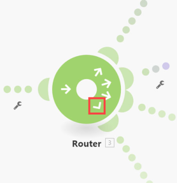

# [!UICONTROL Router] module in [!DNL Adobe Workfront Fusion]

De [!UICONTROL Router] module staat u toe om uw stroom in verscheidene routes te vertakken en de gegevens binnen elke route verschillend te verwerken. Zodra een [!UICONTROL Router] module een bundel ontvangt, door:sturen het aan elke verbonden route in de orde de routes aan de [!UICONTROL Router] module in bijlage waren.

>[!NOTE]
>
>* Om de orde van de routes te verifiëren, kunt u het [!UICONTROL Auto-align] pictogram klikken, dat de routes volgens de orde van boven tot onder zal schikken.
>
>  Als u de volgorde wilt wijzigen, verwijdert u de module [!UICONTROL Router] en maakt u de routes opnieuw in de gewenste volgorde.
>
>* Routes worden opeenvolgend verwerkt, niet parallel. Een bundel wordt niet verzonden naar de volgende route tot het volledig door de vorige route is verwerkt.
>

## Toegangsvereisten

U moet de volgende toegang hebben om de functionaliteit in dit artikel te kunnen gebruiken:

<table style="table-layout:auto">
 <col> 
 <col> 
 <tbody> 
  <tr> 
    <td role="rowheader">[!DNL Adobe Workfront] plan*</td> 
   <td> 
[!DNL Pro] of hoger
 </td> 
  </tr> 
  <tr data-mc-conditions=""> 
   <td role="rowheader">[!DNL Adobe Workfront] licentie*</td> 
   <td> 
[!UICONTROL Plan], [!UICONTROL Work]
 </td> 
  </tr> 
  <tr> 
   <td role="rowheader">[!UICONTROL Adobe Workfront Fusion] licentie**</td> 
   <td>
   
Huidige licentievereiste: geen [!DNL Workfront Fusion] licentievereiste.

   
of

   
Vereiste voor oudere licenties: [!UICONTROL [!DNL Workfront Fusion] voor werkautomatisering en integratie] 

   </td> 
  </tr> 
  <tr> 
   <td role="rowheader">Product</td> 
   <td>
   
Huidige productvereiste: als u het [!UICONTROL Select] - of [!UICONTROL Prime] [!DNL Adobe Workfront] -abonnement hebt, moet uw organisatie [!DNL Adobe Workfront Fusion] en [!DNL Adobe Workfront] aanschaffen om de in dit artikel beschreven functionaliteit te kunnen gebruiken. [!DNL Workfront Fusion] wordt opgenomen in het [!UICONTROL Ultimate] [!DNL Workfront] -abonnement.

   
of

   
Vereiste verouderd product: uw organisatie moet [!DNL Adobe Workfront Fusion] en [!DNL Adobe Workfront] aanschaffen om de in dit artikel beschreven functionaliteit te kunnen gebruiken.

   </td> 
  </tr> 
 </tbody> 
</table>

Neem contact op met de [!DNL Workfront] -beheerder als u wilt weten welk abonnement, licentietype of toegang u hebt.

Voor informatie over [!DNL Adobe Workfront Fusion] vergunningen, zie [[!DNL Adobe Workfront Fusion]  vergunningen ](../../workfront-fusion/get-started/license-automation-vs-integration.md).

## Een module [!UICONTROL Router] toevoegen aan een scenario

Een [!UICONTROL Router] kan op een van de volgende manieren aan een scenario worden toegevoegd:

* Als u de module [!UICONTROL Router] na een module wilt aansluiten, klikt u op de rechterhandgreep van de module, typt u **[!UICONTROL router]** om ernaar te zoeken en kiest u **[!UICONTROL Flow Control]** > **[!UICONTROL Router]** in de lijst met modules die wordt weergegeven.

  

* Als u de module [!UICONTROL Router] tussen twee modules wilt invoegen, klikt u op het moersleutelpictogram onder de route die de twee modules verbindt (of klikt u met de rechtermuisknop op de route) en kiest u **[!UICONTROL Add a router]** in het menu.

  

* U kunt een module [!UICONTROL Router] automatisch invoegen. Als u in de onderstaande afbeelding bijvoorbeeld de module in de rechterbenedenhoek wilt verbinden met de module in de linkerbovenhoek (die al is verbonden met de module in de rechterbovenhoek), sleept u de linkerhandgreep van de module rechtsonder en zet u deze neer op de module linksboven.

  

## Filters

U kunt een filter op een route na de module [!UICONTROL Router] aan filterbundels zoals op een andere route zetten:

1. Klik één van de punten in de route.

   

1. Voeg in het vak **[!UICONTROL Set up a filter]** dat wordt weergegeven voorwaarden toe en klik vervolgens op **[!UICONTROL OK]** om de filterinstelling op te slaan.

   

Voor meer informatie, zie [ een filter aan een scenario in  [!DNL Adobe Workfront Fusion]](../../workfront-fusion/scenarios/add-a-filter-to-a-scenario.md) toevoegen.

## De fallback-route

De filteropstelling op een route na een module [!UICONTROL Router] bevat een speciale optie: De reserveroute:

Wanneer toegelaten, wordt deze route gebruikt in het geval wanneer een bundel niet van de [!UICONTROL Router] module via een andere route kan verdergaan omdat de filters op de andere routes het uit filtreerden.

De terugvalroute wordt onderscheiden met een verschillend pijlteken binnen de module [!UICONTROL Router]:

## Indien/anders

Een typisch gebruiksgeval van de reserveroute moet de stroom met één route voortzetten als aan de voorwaarde wordt voldaan en met een andere route als het niet is, zoals in de volgende stappen:

1. Voeg een module [!UICONTROL Router] in uw scenario in.
1. Verbind beide routes met de module [!UICONTROL Router].
1. Klik op de eerste route en specificeer een voorwaarde:

   

1. Klik op de tweede route en schakel de optie [!UICONTROL fallback route] in:

   
