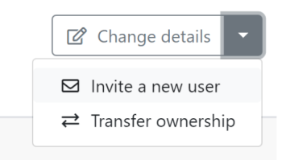

# [!DNL Adobe Workfront Fusion] organisaties en teams

[!DNL Adobe Workfront Fusion]Met de functies Organisatie en Teams kunnen ondernemingen de toegang tot scenario&#39;s en andere kenmerken binnen Fusion controleren.

## Toegangsvereisten

U moet de volgende toegang hebben om de functionaliteit in dit artikel te kunnen gebruiken:

<table style="table-layout:auto"> 
 <col> 
 <col> 
 <tbody> 
  <tr> 
    <td role="rowheader">[!DNL Adobe Workfront] plan*</td> 
   <td> 
[!DNL Pro] of hoger
 </td> 
  </tr> 
  <tr> 
   <td role="rowheader">[!UICONTROL Adobe Workfront Fusion] licentie**</td> 
   <td>
   
Huidige vergunningsvereiste: Neen [!DNL Workfront Fusion] vergunningsvereiste.

   
of

   
Vereisten voor oudere licenties: [!UICONTROL [!DNL Workfront Fusion] voor arbeidsautomatisering en -integratie],  [!UICONTROL [!DNL Workfront Fusion] voor werkautomatisering]

   </td> 
  </tr> 
  <tr> 
   <td role="rowheader">Product</td> 
   <td>
   
Huidige productvereiste: als u beschikt over [!UICONTROL Select] of [!UICONTROL Prime] [!DNL Adobe Workfront] Abonnement, uw organisatie moet [!DNL Adobe Workfront Fusion] alsmede [!DNL Adobe Workfront] om de in dit artikel beschreven functionaliteit te gebruiken. [!DNL Workfront Fusion] is opgenomen in de [!UICONTROL Ultimate] [!DNL Workfront] plannen.

   
of

   
Vereisten voor verouderd product: uw organisatie moet het product kopen [!DNL Adobe Workfront Fusion] alsmede [!DNL Adobe Workfront] om de in dit artikel beschreven functionaliteit te gebruiken.

   </td> 
  </tr> 
  <tr data-mc-conditions=""> 
   <td role="rowheader">Configuraties op toegangsniveau*</td> 
   <td> 
     
U moet een [!DNL Workfront Fusion] beheerder van uw organisatie.

     
U moet een [!DNL Workfront Fusion] beheerder voor uw team.

   </td> 
  </tr> 
 </tbody> 
</table>

Neem contact op met uw [!DNL Workfront] beheerder.

**Voor informatie over [!DNL Adobe Workfront Fusion] licenties, zie <a href="../../workfront-fusion/get-started/license-automation-vs-integration.md" class="MCXref xref">[!DNL Adobe Workfront Fusion] licenties</a>

## Organisaties

[!DNL Workfront Fusion] gebruikers behoren tot een organisatie.

* [Organisatiefuncties](#organization-roles)
* [Gebruikers uitnodigen voor een organisatie](#inviting-users-to-an-organization)
* [Overschakelen tussen organisaties](#switch-between-organizations)

### Organisatiefuncties

Een gebruiker heeft een van de volgende rollen in een organisatie:

* **[!UICONTROL Owner]**: De eigenaar heeft alle machtigingen die beschikbaar zijn in de organisatie.
* **[!UICONTROL Admin]**: De admin rol laat een gebruiker toe om teams en gebruikers voor de organisatie tot stand te brengen en te beheren.
* **[!UICONTROL Member]**: Leden kunnen gebruikmaken [!DNL Workfront Fusion] maar kan geen organisatorische wijzigingen aanbrengen.
* **[!UICONTROL Accountant]**: Met een accountantrol kunnen gebruikers alleen licentiegegevens weergeven op het dashboard van de organisatie.
* **[!UICONTROL App Developer]**: Functionaliteit voor deze rol is momenteel niet beschikbaar en wordt in de nabije toekomst beschikbaar gesteld. We raden u momenteel niet aan gebruikers aan deze rol toe te wijzen.

Voor informatie over specifieke acties beschikbaar aan gebruikers in elke organisatierol, zie [Organisatie- en teamrollen](/help/quicksilver/workfront-fusion/organizations/organization-roles.md).

### Gebruikers uitnodigen voor een organisatie

Door gebrek, kan een organisatieeigenaar (of erkende gebruiker) een andere persoon uitnodigen om zich bij hun organisatie aan te sluiten.

Een gebruiker uitnodigen om deel te nemen aan een organisatie:

1. Klikken **[!UICONTROL Change details]** rechtsboven in het scherm.
1. Selecteren **[!UICONTROL Invite a new user]**.

   

1. Vul het e-mailadres en de naam van de gebruiker in.
1. Selecteer een rol voor de gebruiker. Voor meer informatie over rollen, zie [Organisatiefuncties](#organization-roles) in dit document.
1. (Optioneel) Voeg een notitie toe. Deze opmerking wordt weergegeven in de e-mail met de uitnodiging die de gebruiker ontvangt.
1. Klik op **[!UICONTROL Save]**.

[!DNL Fusion] stuurt een e-mail met een uitnodiging naar de specifieke organisatie en een [!UICONTROL Accept The Role] knop.

Wanneer de ontvanger op de knop klikt, wordt hij of zij omgeleid naar de uitnodigingspagina waar hij of zij de uitnodiging kan accepteren.

De uitnodiging verloopt over een dag.

>[!NOTE]
>
>Als de gebruiker nieuw is voor [!DNL Fusion], [!DNL Fusion] maakt automatisch een account voor deze gebruikers en stuurt een e-mail met een tijdelijk wachtwoord, zodat de nieuwe gebruiker zich kan aanmelden en zijn wachtwoord kan wijzigen.

### Overschakelen tussen organisaties

U kunt deel uitmaken van meer dan één organisatie in Fusion. De middelen worden niet gedeeld tussen organisaties.

U kunt organisaties binnen de Adobe Verenigde Ervaring schakelen door de organisatienaam in de hoger-juiste hoek te klikken en de nieuwe organisatie van dropdown te selecteren. Alleen organisaties met een Fusion-account worden in het vervolgkeuzemenu weergegeven, zelfs als u lid bent van andere organisaties in de Adobe.

## Teams

Teams zijn groepen gebruikers die toegang tot specifieke bronnen delen. Deze middelen kunnen omvatten:

* Scenarios
* Verbindingen
* Webhaken
* Toetsen
* Gegevensopslag
* Gegevensstructuren
* Instellingen voor e-mailmeldingen

>[!NOTE]
>
>Aangezien de teams toegang tot middelen controleren, is het soms nuttig voor een team om slechts één lid te hebben. Gebruikers in opleiding kunnen bijvoorbeeld verbindingen maken met hun individuele [!DNL Google] rekeningen. Om het even welke teamleden zouden ook met het individu kunnen verbinden [!DNL Google] account, dus in dit geval is het beter dat de gebruiker het enige lid van een trainingsteam is.

Organisaties kunnen zo veel teams hebben als ze nodig hebben en gebruikers kunnen tot een of meer teams behoren.

Gebruikers kunnen hun team selecteren in de vervolgkeuzelijst in het navigatievenster aan de linkerkant. Gebruikers zien alleen teams waarvan zij lid zijn. Als u een team selecteert, heeft de gebruiker toegang tot de bronnen van dat team.

* [Teamrollen](#team-roles)
* [Teambeheer](#team-management)

### Teamrollen

Een gebruiker heeft één van de volgende rollen in elk van zijn teams:

* **[!UICONTROL Team Admin]**: Naast de mogelijkheden van de andere teamrollen, staat de rol Admin de gebruiker toe om, de rol van een teamlid toe te voegen te verwijderen of te veranderen.
* **[!UICONTROL Team Member]**: Met de rol van het teamlid kunnen gebruikers scenario&#39;s maken en uitvoeren.
* **[!UICONTROL Team Monitoring]**: De [!UICONTROL monitoring] de rol staat gebruikers toe om tot uitvoerinformatie voor scenario&#39;s toegang te hebben, maar zij kunnen scenario&#39;s ontwerpen of hun &quot;Actieve&quot;status veranderen niet.
* **[!UICONTROL Team Operator]**: De [!UICONTROL operator] de rol staat gebruikers toe om uitvoeringsgegevens te zien en de &quot;Actieve&quot;status van scenario&#39;s te veranderen.
* **[!UICONTROL Team Restricted Member]**: Functionaliteit voor deze rol is momenteel niet beschikbaar en wordt in de nabije toekomst beschikbaar gesteld. We raden u momenteel niet aan gebruikers aan deze rol toe te wijzen.

Voor informatie over specifieke acties beschikbaar aan gebruikers in elke teamrol, zie [Organisatie- en teamrollen](/help/quicksilver/workfront-fusion/organizations/organization-roles.md).

### Teambeheer

* [Een team maken](#create-a-team)
* [Meldingsopties voor team instellen](#set-team-notification-options)

#### Een team maken

Eigenaars en beheerders van organisaties kunnen teams maken.

Een team maken:

1. Klik in het linkernavigatievenster op **[!UICONTROL Organization]**
1. Selecteer de **[!UICONTROL Team]** tab.
1. Klikken **[!UICONTROL Add a new team]** onder de lijst van teams.
1. Voer een naam in voor het nieuwe team en klik op **Toevoegen**.

#### Meldingsopties voor team instellen

>[!NOTE]
>
>Als uw organisatie aan Verenigde Shell is bewogen, ontvangt u berichten door het gebied van de Berichten van de Adobe. U moet de Verenigde ervaring van Shell gebruiken om berichten op het gebied van de Berichten van de Adobe te kunnen zien.
>
>Om de Verenigde Ervaring van Shell, met inbegrip van het gebied van de Berichten van de Adobe te gebruiken, klik de Uitgezochte Nieuwe Fusie UI in Verenigde knoop van de Ervaring dichtbij de bovenkant van de pagina. Deze knoop is slechts beschikbaar als uw organisatie aan Verenigde Shell heeft bewogen.
>
>Zie voor meer informatie [Toegang tot uw berichten](/help/quicksilver/workfront-fusion/fusion-in-admin-console/fusion-unified-experience.md#access-your-notifications) in [!DNL Adobe Unified Experience] for [!DNL Workfront Fusion].

De opties voor e-mailmeldingen worden ingesteld op teamniveau.

1. Klik in het linkernavigatievenster op **[!UICONTROL Team]**
1. Selecteer de **[!UICONTROL Notification Options]** tab.
1. Schakel de meldingen in die het team moet ontvangen.

   <table style="table-layout:auto"> 
    <col> 
    <col> 
    <tbody> 
     <tr> 
      <td role="rowheader">'[!UICONTROL Warning in scenario run]'</td> 
      <td> 
Ontvang een e-mail wanneer er een waarschuwing in een scenario looppas is
 </td> 
     </tr> 
     <tr> 
      <td role="rowheader">[!UICONTROL Errors in scenario run]</td> 
      <td>Ontvang een e-mail wanneer er een fout in een scenario looppas is.</td> 
     </tr> 
     <tr> 
      <td role="rowheader"> 
[!UICONTROL Scenario deactivation]
 </td> 
      <td>
Ontvang een e-mail wanneer een scenario deactiveert.

<b>Opmerking:</b> U wordt op de hoogte gesteld van deactivering van scenario's alleen wanneer het scenario automatisch is gedeactiveerd vanwege fouten. U ontvangt geen meldingen over scenario's die handmatig worden gedeactiveerd.

In sommige gevallen kan een scenario door de [!DNL Workfront Fusion] engineeringsteam omdat het scenario prestaties of andere kwesties veroorzaakt. In deze gevallen ontvangt u geen meldingen in [!DNL Workfront Fusion]. 
</td>

</tr>
</tbody>
</table>

Wijzigingen in meldingsopties worden automatisch opgeslagen

#### Schakelen tussen teams

U kunt deel uitmaken van meer dan één team in Fusion. Aangezien de teams geen middelen delen, kunt u teams moeten schakelen om tot specifieke scenario&#39;s of andere middelen toegang te hebben.

Als uw organisatie niet op de Adobe Verenigde Ervaring is, kunt u teams schakelen door de teamnaam in de linkernavigatie te klikken, dan selecterend een team van dropdown.

Als uw team op de Adobe Verenigde Ervaring is, kunt u een nieuw team selecteren door op de teamnaam in de kopbal te klikken, dan selecterend een team van dropdown. Deze optie is beschikbaar bij alle pagina&#39;s die voor een bepaald team, zoals een scenario pagina of de pagina van Verbindingen specifiek zijn.

<!--

  

-->