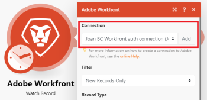
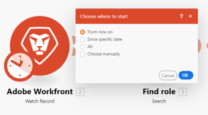

# Een scenario maken in [!DNL Adobe Workfront Fusion]

De volgende taken verklaren hoe te om tot een [!DNL Adobe Workfront Fusion] scenario.

Voor een oefening die u door het creëren van een automatiseringsscenario loopt, zie [Creeer een scenario van de praktijkautomatisering in [!DNL Adobe Workfront Fusion]](../../workfront-fusion/get-started/create-a-practice-automation-scenario.md).

Voor een praktijkoefening die u door het creëren van een integratiescenario gebruikend gegevens loopt die wij verstrekken, zie [Een praktijkintegratiescenario maken in Adobe Workfront Fusion](../../workfront-fusion/get-started/create-a-practice-scenario.md).

>[!NOTE]
>
>Als u een scenario wilt maken op basis van een sjabloon, raadpleegt u [scenario&#39;s maken met [!DNL Adobe Workfront Fusion] sjablonen](../../workfront-fusion/scenarios/templates/create-scenarios-with-fusion-templates.md).

## Toegangsvereisten

U moet de volgende toegang hebben om de functionaliteit in dit artikel te kunnen gebruiken:

<table style="table-layout:auto"> 
 <col> 
 <col> 
 <tbody> 
  <tr> 
    <td role="rowheader">[!DNL Adobe Workfront] plan*</td> 
   <td> 
[!DNL Pro] of hoger
 </td> 
  </tr> 
  <tr data-mc-conditions=""> 
   <td role="rowheader">[!DNL Adobe Workfront] licentie*</td> 
   <td> 
[!UICONTROL Plan], [!UICONTROL Work]
 </td> 
  </tr> 
  <tr> 
   <td role="rowheader">[!UICONTROL Adobe Workfront Fusion] licentie**</td> 
   <td> 
[!UICONTROL [!DNL Workfront Fusion] voor werkautomatisering en -integratie] 

[!UICONTROL [!DNL Workfront Fusion] voor werkautomatisering]

[!UICONTROL [!DNL Workfront Fusion] voor werkautomatisering]
    </td> 
  </tr> 
  <tr> 
   <td role="rowheader">Product</td> 
   <td>Uw organisatie moet [!DNL Adobe Workfront Fusion] alsmede [!DNL Adobe Workfront] om de in dit artikel beschreven functionaliteit te gebruiken.</td> 
  </tr> 
 </tbody> 
</table>

Neem contact op met uw [!DNL Workfront] beheerder.

Voor informatie over [!DNL Adobe Workfront Fusion] licenties, zie [[!DNL Adobe Workfront Fusion] licenties](../../workfront-fusion/get-started/license-automation-vs-integration.md).

## Beginnen met het maken van een scenario

1. Klikken **[!UICONTROL Scenarios]**  in het linkerdeelvenster.

1. Klikken **[!UICONTROL Create a new scenario]** in de rechterbovenhoek van de pagina.
1. (Optioneel) Onder **[!UICONTROL What services do you want to integrate]** Als u een nieuw scenario maakt, selecteert u de apps waarmee u wilt werken in het scenario en klikt u op **[!UICONTROL Continue]**.

   of

   Klikken **[!UICONTROL Skip]** als u de apps wilt kiezen in de scenario-editor.

1. Als u een nieuw scenario maakt, klikt u in het scherm dat wordt weergegeven (de scenario-editor) **[!UICONTROL New scenario]** in de linkerbovenhoek en typ een naam voor het scenario.
1. Doorgaan naar [Voeg een module in een scenario toe](#add-a-module-in-a-scenario).

## Voeg een module in een scenario toe

1. Als u de eerste module aan het scenario wilt toevoegen, klikt u op het pictogram met het vraagteken. 

   of

   Om extra modules aan het scenario toe te voegen, klik de handvat op de rechterkant van de module u het wilt volgen.

1. Zoek en klik in het vak dat wordt weergegeven op de app of service waarmee u wilt beginnen.

   Eerder geselecteerde apps worden weergegeven in het vak, zodat u ze gemakkelijk kunt openen en in het dialoogvenster **[!UICONTROL Favorites]** onder aan het scherm.

   Als u op **[!UICONTROL Add another module]**, de modules die tonen hangen van af waar in het scenario u de module toevoegt. Sommige modules kunnen slechts binnen tussen andere modules, en anderen slechts aan het begin van het scenario worden geplaatst.

   >[!TIP]
   >
   >De twee gemeenschappelijkste types van modules zijn acties en trekkers. Zie voor meer informatie [Typen modules](../../workfront-fusion/modules/module-types.md).

1. In de lijst van modules die toont, klik de eerste module u aan het scenario wilt toevoegen.

   De modules die tonen hangen van af waar u een module in uw scenario wilt toevoegen. Sommige modules kunnen slechts binnen tussen andere modules, en anderen slechts aan het begin van het scenario worden geplaatst.

   De twee gemeenschappelijkste types van modules zijn acties en trekkers. Zie voor meer informatie [Typen modules](../../workfront-fusion/modules/module-types.md).

1. Doorgaan naar [Sluit de app of webservice van de module aan op [!DNL Workfront Fusion]](#connect-the-modules-app-or-web-service-to-workfront-fusion).

## Sluit de app of webservice van de module aan op [!DNL Workfront Fusion] {#connect-the-modules-app-or-web-service-to-workfront-fusion}

Workfront Fusion-modules die verbinding maken met een toepassing (zoals [!DNL Workfront], [!DNL Salesforce], of [!DNL Jira)] de functie [!UICONTROL Connection] veld. Hier kunt u opgeven welke verbinding deze module moet gebruiken om verbinding te maken met de app. U kunt een bestaande verbinding selecteren in het vervolgkeuzemenu of een nieuwe verbinding maken.

Wanneer u in een scenario een verbinding voor een app selecteert of maakt, gebruiken andere modules voor die app automatisch dezelfde verbinding, tenzij u een andere verbinding selecteert bij het instellen van de latere modules.

Zie voor meer informatie [Verbinding maken [!DNL Adobe Workfront Fusion] naar een app of service](../../workfront-fusion/connections/about-connecting-wf-fusion-to-app-or-service.md).

Een verbinding maken in een [!DNL Workfront Fusion] module:

1. Klikken **[!UICONTROL Add]** om de **[!UICONTROL Create a connection]** doos.
1. (Optioneel) Wijzig de standaardinstelling **[!UICONTROL Connection name]**.
1. (Voorwaardelijk) Als de toepassing geavanceerde verbindingsinstellingen vereist, zoals een id, sleutel of [!UICONTROL secret], voert u die informatie in.

   Mogelijk moet u op **[!UICONTROL Show advanced settings]** om de velden weer te geven waarin u dit soort informatie kunt invoeren.

1. Klik op **[!UICONTROL Continue]**.
1. Voer in het aanmeldingsvenster dat wordt weergegeven uw aanmeldingsgegevens in om u aan te melden bij de app als u dat nog niet hebt gedaan.
1. (Voorwaardelijk) Als een **[!UICONTROL Allow]** knopweergaven, controleer de acties die de connector kan uitvoeren en klik vervolgens op de knop om de app te verbinden met [!DNL Workfront Fusion].
1. Doorgaan naar [De module configureren](#configure-the-module).

## De module configureren

1. In de gebieden onder het gebied van de Verbinding, vorm de montages voor de module, dan klik **[!UICONTROL OK]**.

   

   Deze instellingen verschillen voor elke module. Een bolde titel wijst op een vereiste het plaatsen.

   >[!TIP]
   >
   >Terwijl u aan uw scenario werkt, kunt u op de module klikken om dit vak met instellingen op elk gewenst moment weer te geven.
   >
   >
   >Als u een zwarte cirkel op een module ziet, hebt u niet klaar met het vormen van zijn montages. Klik op de module om deze te openen en verder te configureren.
   >
   >
   >

1. Als u de eerste module in uw scenario toevoegt, selecteer een optie om erop te wijzen waar u het scenario wilt beginnen telkens als het loopt.

   

1. De stappen in de secties herhalen [Voeg een module in een scenario toe](#add-a-module-in-a-scenario) en [De module configureren](#configure-the-module) om andere modules aan het scenario toe te voegen.

1. (Optioneel) Kopieer en plak een module of groep modules.

   Zie voor meer informatie [Modules of scenario&#39;s kopiëren in Adobe Workfront Fusion](../../workfront-fusion/scenarios/copy-modules-or-scenarios.md).

1. Doorgaan naar [Vorm en werk met uw scenario](#configure-and-work-with-your-scenario).

## Vorm en werk met uw scenario

1. Voer een van de volgende handelingen uit om uw scenario te configureren:

   <table style="table-layout:auto"> 
    <col> 
    <col> 
    <tbody> 
     <tr> 
      <td role="rowheader">Opgeven wanneer en hoe vaak het scenario wordt uitgevoerd</td> 
      <td> 
Klik op het klokpictogram. 
 
  
 
Zie voor meer informatie <a href="../../workfront-fusion/scenarios/schedule-a-scenario.md" class="MCXref xref">Een scenario plannen in [!DNL Adobe Workfront Fusion]</a>.
 </td> 
     </tr> 
     <tr> 
      <td role="rowheader">Een route instellen</td> 
      <td> 
Klik op het moersleutelpictogram  tussen de twee modules en gebruik een van de volgende opties. Zie voor meer informatie <a href="../../workfront-fusion/scenarios/add-a-filter-to-a-scenario.md" class="MCXref xref">Een filter toevoegen aan een scenario in [!DNL Adobe Workfront Fusion]</a>.
 
       <ul> 
        <li><strong>[!UICONTROL Set up a filter]</strong>: Bepalen welke bundels op bepaalde punten in het scenario worden gebruikt.</li> 
        <li><strong>[!UICONTROL Unlink]</strong>: Hiermee verwijdert u een route.</li> 
        <li><strong>[!UICONTROL Add a router]</strong>: Voegt een router tussen modules toe. </li> 
        <li><strong>[!UICONTROL Add a module]</strong>: Voegt een nieuwe module tussen modules toe.</li> 
        <li><strong>[!UICONTROL Add a note]</strong>: Voegt een nota aan de route toe.</li> 
       </ul> </td> 
     </tr> 
     <tr> 
      <td role="rowheader">De scenario-instellingen configureren</td> 
      <td>Klik op de knop [!UICONTROL Scenario settings] pictogram.  Deze instellingen zijn vooral bedoeld voor geavanceerde gebruikers. Zie voor meer informatie <a href="../../workfront-fusion/scenarios/scenario-settings-panel.md" class="MCXref xref">Het deelvenster met scenario-instellingen in [!DNL Adobe Workfront Fusion]</a>.</td> 
     </tr> 
     <tr> 
      <td role="rowheader">Stroomregelinstellingen configureren</td> 
      <td> 
Klik op de knop [!UICONTROL Flow Control] pictogram.  U kunt een taak instellen om een bepaald aantal keren te herhalen, een array om te zetten in een reeks bundels en verschillende bundels samen te voegen tot één bundel. Zie voor meer informatie <a href="../../workfront-fusion/apps-and-their-modules/flow-control.md" class="MCXref xref">Stroomregeling in [!DNL Adobe Workfront Fusion]</a>.
 </td> 
     </tr> 
     <tr> 
      <td role="rowheader">Het scenario verbeteren met geavanceerde gereedschappen</td> 
      <td>Klik op de knop [!DNL Tools] pictogram.  U kunt triggers, handelingen, aggregators en transformatoren maken. Zie voor meer informatie <a href="../../workfront-fusion/apps-and-their-modules/tools-modules.md" class="MCXref xref">Gereedschappen</a>.</td> 
     </tr> 
     <tr> 
      <td role="rowheader">Gereedschappen voor het parseren van tekst door gebruikers</td> 
      <td>Klik op de knop [!DNL Text parser] pictogram . U kunt HTML-elementen ophalen, tekenreekselementen zoeken en uitpakken die overeenkomen met een zoekpatroon, tekst zoeken en vervangen en gegevens van een website verwijderen. Zie voor meer informatie <a href="../../workfront-fusion/apps-and-their-modules/tools-modules.md" class="MCXref xref">Gereedschappen</a>.</td> 
     </tr> 
    </tbody> 
   </table>

1. Voer een van de volgende handelingen uit om met uw scenario te werken:

   <table style="table-layout:auto"> 
    <col> 
    <col> 
    <tbody> 
     <tr> 
      <td role="rowheader">Bekijk een logboek van de gebeurtenissen die voorkomen wanneer het scenario loopt</td> 
      <td> 
Klik op de knop [!UICONTROL Exit editing] pijl  in de scenario redacteur om de Scenario detailpagina te bekijken. Het logbestand wordt onder in het venster of in de rechterbenedenhoek weergegeven. Het bevat informatie over elke fase en om het even welke fouten die tijdens de uitvoering van het scenario worden ontmoet.
 
Om met uw scenario in terug te keren [!DNL scenario editor], klik overal op de Scenario detailpagina.
 
Voor meer informatie over de Scenario detailpagina, zie <a href="../../workfront-fusion/scenarios/scenario-detail.md" class="MCXref xref">Scenario-details in [!DNL Adobe Workfront Fusion]</a>.
 </td> 
     </tr> 
     <tr> 
      <td role="rowheader">Toegang tot veelgebruikte apps en services</td> 
      <td> Klik op een pictogram in het dialoogvenster <strong>[!UICONTROL Favorites]</strong> onder aan het scherm. Pictogrammen worden automatisch in deze sectie weergegeven wanneer u apps en services toevoegt aan uw scenario. U kunt ook op de knop [!UICONTROL Add] pictogram  om handmatig apps en services aan dit gebied toe te voegen.</td> 
     </tr> 
     <tr> 
      <td role="rowheader">Een animatie weergeven die aangeeft hoe gegevens door het scenario lopen</td> 
      <td>Klik op de knop [!UICONTROL Explain flow] pictogram .</td> 
     </tr> 
     <tr> 
      <td role="rowheader">De lay-out van de modules automatisch uitlijnen </td> 
      <td>Klik op de knop [!UICONTROL Auto-align] pictogram .</td> 
     </tr> 
     <tr> 
      <td role="rowheader">Opmerkingen over het scenario typen of weergeven</td> 
      <td>Klik op de knop [!UICONTROL Notes] pictogram .</td> 
     </tr> 
     <tr> 
      <td role="rowheader">Een module verwijderen</td> 
      <td>Klik met de rechtermuisknop op de module en klik vervolgens op <strong>[!UICONTROL Delete module]</strong>.</td> 
     </tr> 
    </tbody> 
   </table>

1. Als u het scenario wilt testen, klikt u op **[!UICONTROL Run once]**.

   Het is belangrijk om te verifiëren dat het scenario zoals u verwacht loopt alvorens u het activeert. Nadat het scenario is geactiveerd, wordt het volgens het schema uitgevoerd. Als alles niet zoals verwacht loopt, raadpleegt u [Foutafhandeling in [!DNL Adobe Workfront Fusion]](../../workfront-fusion/errors/error-handling.md).

1. Wanneer u klaar bent met het bewerken van het scenario (of op elk gewenst moment tijdens het bewerken), klikt u op de knop [!UICONTROL Save] pictogram onder aan het venster .

Voor informatie over het activeren van een scenario, zie [Een scenario activeren of deactiveren in [!DNL Adobe Workfront Fusion]](../../workfront-fusion/scenarios/activate-or-inactivate-scenario.md).

## Sneltoetsen voor Workfront Fusion-scenario

U kunt de volgende sneltoetsen gebruiken bij het maken of bewerken van een scenario:

<table style="table-layout:auto"> 
 <col data-mc-conditions=""> 
 <col data-mc-conditions=""> 
 <col data-mc-conditions=""> 
 <thead> 
  <tr> 
   <th> 
Handeling
 </th> 
   <th>[!DNL Windows]</th> 
   <th> 
[!DNL MacOS]
 </th> 
  </tr> 
 </thead> 
 <tbody> 
  <tr> 
   <td role="rowheader">[!UICONTROL Save] </td> 
   <td>Ctrl+Shift+S</td> 
   <td>Cmd+Shift+S </td> 
  </tr> 
  <tr> 
   <td role="rowheader">[!UICONTROL Run Once]</td> 
   <td>Ctrl+Shift+Enter</td> 
   <td>Cmd+Shift+Enter </td> 
  </tr> 
 </tbody> 
</table>
