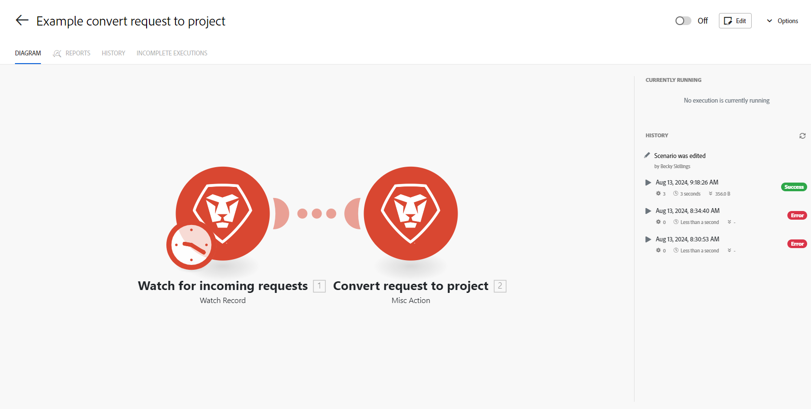

# Scenario-details in [!DNL Adobe Workfront Fusion]

De pagina met de details van het scenario is de startpagina van een specifiek scenario. Het verleent toegang tot specifieke informatie voor het scenario dat op de pagina wordt vertegenwoordigd.

Het verleent u ook toegang tot [ de scenarioredacteur in  [!DNL Adobe Workfront Fusion]](../../workfront-fusion/scenarios/scenario-editor.md), waar u het scenario kunt uitgeven.

## Toegangsvereisten

U moet de volgende toegang hebben om de functionaliteit in dit artikel te kunnen gebruiken:

<table style="table-layout:auto">  
 <col> 
 <col> 
 <tbody> 
  <tr> 
    <td role="rowheader">[!DNL Adobe Workfront] plan*</td> 
   <td> 
[!DNL Pro] of hoger
 </td> 
  </tr> 
  <tr data-mc-conditions=""> 
   <td role="rowheader">[!DNL Adobe Workfront] licentie*</td> 
   <td> 
[!UICONTROL Plan], [!UICONTROL Work]
 </td> 
  </tr> 
  <tr> 
   <td role="rowheader">[!UICONTROL Adobe Workfront Fusion] licentie**</td> 
   <td> 
[!UICONTROL [!DNL Workfront Fusion] voor werkautomatisering en -integratie] 

[!UICONTROL [!DNL Workfront Fusion] voor werkautomatisering] 

[!UICONTROL [!DNL Workfront Fusion] voor werkautomatisering]
   </td> 
  </tr> 
  <tr> 
   <td role="rowheader">Product</td> 
   <td>
   
Huidige productvereiste: als u het [!UICONTROL Select] - of [!UICONTROL Prime] [!DNL Adobe Workfront] -abonnement hebt, moet uw organisatie [!DNL Adobe Workfront Fusion] en [!DNL Adobe Workfront] aanschaffen om de in dit artikel beschreven functionaliteit te kunnen gebruiken. [!DNL Workfront Fusion] wordt opgenomen in het [!UICONTROL Ultimate] [!DNL Workfront] -abonnement.

   
of

   
Vereiste verouderd product: uw organisatie moet [!DNL Adobe Workfront Fusion] en [!DNL Adobe Workfront] aanschaffen om de in dit artikel beschreven functionaliteit te kunnen gebruiken.

   </td> 
  </tr> 
 </tbody> 
</table>

Neem contact op met de [!DNL Workfront] -beheerder als u wilt weten welk abonnement, licentietype of toegang u hebt.

Voor informatie over [!DNL Adobe Workfront Fusion] vergunningen, zie [[!DNL Adobe Workfront Fusion]  vergunningen ](../../workfront-fusion/get-started/license-automation-vs-integration.md).

## Open de pagina [!UICONTROL Scenario detail] :

1. Klik op de tab **[!UICONTROL Scenario]** in het linkerdeelvenster en klik op een scenario waarin u details wilt weergeven.

   of

   Als u aan het scenario in [ de scenarioredacteur in  [!DNL Adobe Workfront Fusion]](../../workfront-fusion/scenarios/scenario-editor.md) werkt, klik de linkerpijl  dichtbij de upper-left hoek van het venster.

1. Op de pagina die wordt weergegeven, kunt u de elementen bekijken die in de onderstaande tabel worden vermeld.

   

   <table style="table-layout:auto"> 
    <col> 
    <col> 
    <tbody> 
     <tr> 
      <td role="rowheader">[!UICONTROL Modules diagram] </td> 
      <td>Dit lusje toont de visuele vertegenwoordiging van het scenario. Het Diagram is het zelfde als u in de scenarioredacteur zult zien</td> 
     </tr> 
     <tr> 
      <td role="rowheader">[!UICONTROL Reports] (tab) </td> 
      <td> 
Open dit tabblad om een grafiek weer te geven van het aantal bewerkingen dat door dit scenario gedurende de laatste 30 dagen is uitgevoerd.
  </td> 
     </tr> 
     <tr> 
      <td role="rowheader">[!UICONTROL History] (tab) </td> 
      <td> 
Open dit lusje om een geschiedenis van het scenario, met inbegrip van om het even welke het uitgeven van het scenario te zien. 
 
Het tabblad [!UICONTROL History] bevat ook de geschiedenis van de uitvoering van het scenario van elke uitvoering, die het volgende bevat:
 
       <ul> 
        <li>Status van elke uitvoering (geslaagd of fout)</li> 
        <li>Runtimeduur</li> 
        <li>Aantal verrichtingen</li> 
        <li>Grootte van gegevensoverdracht</li> 
        <li>Koppeling naar gedetailleerde informatie</li> 
       </ul> </td> 
     </tr> 
     <tr> 
      <td role="rowheader">[!UICONTROL Incomplete executions]</td> 
      <td> 
Dit lusje verstrekt informatie over om het even welke onvolledige uitvoeringen van het scenario. Het omvat de volgende informatie voor elke onvolledige looppas:
 
       <ul> 
        <li>Gemaakt op</li> 
        <li>Grootte van gegevensoverdracht</li> 
        <li>Opnieuw</li> 
        <li>Opgelost</li> 
        <li>Aantal pogingen</li> 
       </ul> </td> 
     </tr> 
     <tr> 
      <td role="rowheader">[!UICONTROL Activate scenario] (Aan/Uit-knop)</td> 
      <td>Als een scenario eenmaal is gemaakt, moet het worden geactiveerd om te kunnen worden uitgevoerd volgens het schema. Als u klikt op de knop Aan/uit in de rechterbovenhoek, kunt u het scenario activeren of inactiveren. Zodra het wordt aangezet, loopt het scenario volgens zijn programma.</td> 
     </tr> 
     <tr> 
      <td role="rowheader">[!UICONTROL Edit]</td> 
      <td>Klik deze knoop in de hoger-juiste hoek om de scenarioredacteur te openen, waar u aan uw scenario kunt werken.</td> 
     </tr> 
     <tr> 
      <td role="rowheader">[!UICONTROL Options]</td> 
      <td> 
Dit menu biedt u extra opties zonder dat u de scenario-editor hoeft te openen. Deze omvatten:
 
       <ul> 
        <li>[!UICONTROL Scheduling]</li> 
        <li>[!UICONTROL Rename]</li> 
        <li>[!UICONTROL Clone]</li> 
        <li>[!UICONTROL Delete]</li> 
       </ul> </td> 
     </tr> 
     <tr> 
      <td role="rowheader">[!UICONTROL Currently running]</td> 
      <td>Dit gebied bevat informatie over de uitvoering die momenteel wordt uitgevoerd.</td> 
     </tr> 
     <tr> 
      <td role="rowheader"> 
[!UICONTROL History] (gebied)
 
 
 </td> 
      <td> 
In dit gebied wordt informatie over de laatste uitvoering van het scenario weergegeven. Voor elke uitvoering wordt het weergegeven:
 
       <ul> 
        <li>Datum uitvoeren</li> 
        <li>Status (geslaagd of mislukt)</li> 
        <li>Runtimeduur</li> 
        <li>Grootte van gegevensoverdracht</li> 
        <li>Koppeling naar gedetailleerde informatie</li> 
       </ul> </td> 
     </tr> 
     <tr> 
      <td role="rowheader"> 
[!UICONTROL Stats]
  </td> 
      <td>In deze grafiek kunt u de hoeveelheid gegevensoverdracht en bewerkingen bekijken die tijdens de uitvoering van het scenario in een [!UICONTROL line] -grafiek worden gebruikt.</td> 
     </tr> 
     <tr> 
      <td role="rowheader"> 
[!UICONTROL Processing banner]
  </td> 
      <td>Als uw scenario onlangs heeft uitgevoerd, kunt u een banner zien die leest:
<code>Data is still being processed. Only partial scenario history will show until processing is complete.</code>
Dit wordt weergegeven terwijl de uitvoeringsgegevens naar opslag worden geschreven. De verwerking vindt onmiddellijk plaats nadat het scenario wordt uitgevoerd. en mag niet langer duren dan een paar minuten. Details van de uitvoering van het scenario zijn mogelijk niet zichtbaar terwijl de uitvoering wordt verwerkt.</td> 
     </tr> 
    </tbody> 
   </table>
