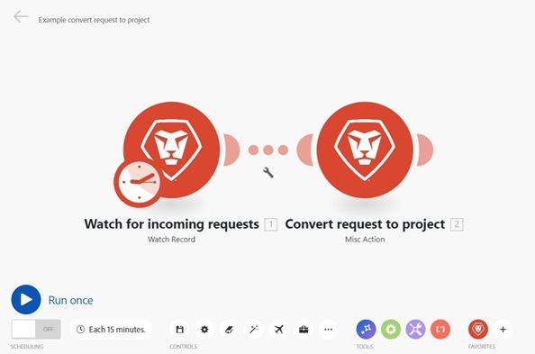

# De scenario-editor in [!DNL Adobe Workfront Fusion]

De scenario redacteur staat u toe om scenario&#39;s in een visuele interface tot stand te brengen en uit te geven.

## Toegangsvereisten

U moet de volgende toegang hebben om de functionaliteit in dit artikel te kunnen gebruiken:

<table style="table-layout:auto"> 
 <col> 
 <col> 
 <tbody> 
  <tr> 
    <td role="rowheader">[!DNL Adobe Workfront] plan*</td> 
   <td> 
[!DNL Pro] of hoger
 </td> 
  </tr> 
  <tr data-mc-conditions=""> 
   <td role="rowheader">[!DNL Adobe Workfront] licentie*</td> 
   <td> 
[!UICONTROL Plan], [!UICONTROL Work]
 </td> 
  </tr> 
  <tr> 
   <td role="rowheader">[!UICONTROL Adobe Workfront Fusion] licentie**</td> 
   <td>
   
Huidige licentievereiste: geen [!DNL Workfront Fusion] licentievereiste.

   
of

   
Vereiste voor oudere licenties: [!UICONTROL [!DNL Workfront Fusion] voor werkautomatisering en integratie] 

   </td> 
  </tr> 
  <tr> 
   <td role="rowheader">Product</td> 
   <td>
   
Huidige productvereiste: als u het [!UICONTROL Select] - of [!UICONTROL Prime] [!DNL Adobe Workfront] -abonnement hebt, moet uw organisatie [!DNL Adobe Workfront Fusion] en [!DNL Adobe Workfront] aanschaffen om de in dit artikel beschreven functionaliteit te kunnen gebruiken. [!DNL Workfront Fusion] wordt opgenomen in het [!UICONTROL Ultimate] [!DNL Workfront] -abonnement.

   
of

   
Vereiste verouderd product: uw organisatie moet [!DNL Adobe Workfront Fusion] en [!DNL Adobe Workfront] aanschaffen om de in dit artikel beschreven functionaliteit te kunnen gebruiken.

   </td> 
  </tr> 
 </tbody> 
</table>

Neem contact op met de [!DNL Workfront] -beheerder als u wilt weten welk abonnement, licentietype of toegang u hebt.

Voor informatie over [!DNL Adobe Workfront Fusion] vergunningen, zie [[!DNL Adobe Workfront Fusion]  vergunningen ](../../workfront-fusion/get-started/license-automation-vs-integration.md).

## Open de scenario-editor:

1. Klik op **[!UICONTROL Scenarios]**  in het linkerdeelvenster.

1. Als u een scenario wilt maken, klikt u op **[!UICONTROL Create a new scenario]** rechtsboven op de pagina.

   of

   Als u een bestaand scenario wilt uitgeven, klik het scenario.

   In de scenario redacteur die toont, kunt u alles doen die in de lijst hieronder wordt vermeld. Voor meer informatie, zie [ een scenario in  [!DNL Adobe Workfront Fusion]](../../workfront-fusion/scenarios/create-a-scenario.md) creëren.

1. Wanneer u klaar bent met het bewerken van een scenario (of op elk gewenst moment terwijl u aan het bewerken bent), klikt u op het pictogram [!UICONTROL Save] . 

   >[!NOTE]
   >
   >Nadat u het scenario hebt opgeslagen, is er een nieuwe versie beschikbaar in het menu met drie punten voor het geval u deze in de toekomst wilt gebruiken. Eerder opgeslagen versies van scenario&#39;s zijn slechts beschikbaar gedurende 60 dagen.

## Beschikbare scenario-editoracties

De volgende acties zijn beschikbaar in de redacteur Scenario:

<table style="table-layout:auto"> 
<tbody>
  <tr>
     <td role="rowheader">Voeg de eerste module toe</td>
     <td> 
Klik op het pictogram van het vraagteken. 
 
 Zoek en klik vervolgens op de app of service waarmee u wilt beginnen. Als u in stap 2 apps hebt geselecteerd, worden deze hier weergegeven voor eenvoudige toegang (en in de sectie <strong>[!UICONTROL Favorites]</strong> onder aan het scherm).
 </td>
  </tr>
  <tr>
     <td role="rowheader">Een module toevoegen</td>
     <td>Klik boven een module op de plusknop die aan de rechterkant wordt weergegeven en klik vervolgens op de gewenste module in het menu dat wordt weergegeven.</td>
  </tr>  
  <tr>   
     <td role="rowheader">Opgeven wanneer en hoe vaak het scenario wordt uitgevoerd</td>  
      <td> 
Klik op het klokpictogram. 
 
  
 
Voor meer informatie, zie <a href="../../workfront-fusion/scenarios/schedule-a-scenario.md" class="MCXref xref"> Plan een scenario in [!DNL Adobe Workfront Fusion]</a>.
 </td>
  </tr>  
  <tr>
     <td role="rowheader">Een route instellen</td>   
     <td> 
Klik op het pictogram [!UICONTROL wrench]  tussen de twee modules en gebruik een van de volgende opties:
    
       <ul>
         <li><strong>[!UICONTROL Set up a filter]</strong>: Hiermee bepaalt u welke bundels op bepaalde punten in het scenario worden gebruikt. Voor meer informatie, zie <a href="../../workfront-fusion/scenarios/add-a-filter-to-a-scenario.md" class="MCXref xref"> een filter aan een scenario in [!DNL Adobe Workfront Fusion]</a> toevoegen.</li>     
         <li><strong>[!UICONTROL Unlink]</strong>: Verwijdert een route.</li>     
         <li><strong>[!UICONTROL Add a router]</strong>: Voegt een router tussen modules toe. </li>     
         <li><strong>[!UICONTROL Add a module]</strong>: Voegt een nieuwe module tussen modules toe.</li>     
         <li><strong>[!UICONTROL Add a note]</strong>: Voegt een nota aan de route toe.</li>   
       </ul> 
     </td>  
  </tr>  
  <tr>  
     <td role="rowheader">Een module verwijderen</td>   
     <td>Klik met de rechtermuisknop op de module en klik vervolgens op <strong>[!UICONTROL Delete module]</strong> .</td>  
   </tr>  
   <tr> 
     <td role="rowheader">Bekijk een logboek van gebeurtenissen dat voorkomt is een scenario</td>     
     <td> 
       
Voer een scenario uit. Wanneer het scenario is voltooid, wordt het logbestand in de rechterbenedenhoek van het [!UICONTROL Scenario Editor] weergegeven. 
 
  
 
Afhankelijk van het scenario, kan het logboek informatie over de moeilijkheid van elke fase en om het even welke fouten bevatten die tijdens de uitvoering van het scenario worden ontmoet.
 
     </td>  
   </tr>  
   <tr>   
     <td role="rowheader">De scenario-instellingen configureren</td>   
     <td>Klik op het pictogram [!UICONTROL Scenario settings] .  Deze instellingen zijn vooral bedoeld voor geavanceerde gebruikers.</td>  
   </tr>  
   <tr>   
     <td role="rowheader">Opmerkingen over het scenario typen of weergeven</td>   
     <td>Klik op het pictogram [!UICONTROL Notes] . </td>  
   </tr>  
   <tr> 
     <td role="rowheader">De lay-out van de modules automatisch uitlijnen </td>   
     <td>Klik op het pictogram [!UICONTROL Auto-align] . </td>  </tr>  <tr>   <td role="rowheader">Een animatie weergeven die aangeeft hoe gegevens door het scenario lopen</td>   <td>Klik op het pictogram [!UICONTROL Explain Flow] . </td>  
   </tr>  
   <tr> 
     <td role="rowheader">Het scenario als een blauwdruk exporteren naar uw computer</td>   
     <td>Klik op het [!UICONTROL More] menu  en klik vervolgens op [!UICONTROL Export Blueprint] .</td>  
   </tr>  
   <tr>   
     <td role="rowheader">Een scenario-blauwdruk van uw computer importeren</td>   
     <td>Klik op het [!UICONTROL More] menu  en klik vervolgens op [!UICONTROL Import Blueprint] .</td>  
   </tr>  
   <tr>   
     <td role="rowheader">Een vorige versie van het scenario herstellen</td>   
     <td>Zie artikel <a href="../../workfront-fusion/scenarios/restore-a-scenario-version.md" class="MCXref xref"> herstellen een scenario versie in [!DNL Adobe Workfront Fusion]</a>.</td>  
   </tr>  
   <tr> 
     <td role="rowheader">[!UICONTROL Flow Control] -instellingen configureren</td>   
     <td> 
Klik op het pictogram [!UICONTROL Flow Control] .  U kunt een taak instellen om een bepaald aantal keren te herhalen, een array om te zetten in een reeks bundels en verschillende bundels samen te voegen tot één bundel. Voor meer informatie, zie <a href="../../workfront-fusion/apps-and-their-modules/flow-control.md" class="MCXref xref"> controle van de Stroom in [!DNL Adobe Workfront Fusion]</a>.
 </td>  
   </tr>  
   <tr> 
     <td role="rowheader">Het scenario verbeteren met geavanceerde gereedschappen</td>   
     <td>Klik op het pictogram [!UICONTROL Tools] .  U kunt triggers, handelingen, aggregators en transformatoren maken. Voor meer informatie, zie <a href="../../workfront-fusion/apps-and-their-modules/tools-modules.md" class="MCXref xref"> Hulpmiddelen </a>.</td>  
   </tr>  
   <tr> 
     <td role="rowheader">Gereedschappen voor het parseren van tekst gebruiken</td>   
     <td>Klik op het pictogram [!UICONTROL Text parser] .  U kunt elementen ophalen uit HTML-code, tekenreekselementen zoeken en uitpakken die overeenkomen met een zoekpatroon, tekst zoeken en vervangen en gegevens van een website verwijderen. Voor meer informatie, zie <a href="../../workfront-fusion/apps-and-their-modules/tools-modules.md" class="MCXref xref"> Hulpmiddelen </a>.</td>  
   </tr>  
   <tr> 
     <td role="rowheader">Toegang tot veelgebruikte apps en services</td>   
     <td> Klik op een pictogram in de sectie <strong>[!UICONTROL Favorites]</strong> onder aan het scherm. Pictogrammen worden automatisch in deze sectie weergegeven wanneer u apps en services toevoegt aan uw scenario. U kunt ook handmatig op het pictogram Toevoegen  klikken om toepassingen en services aan dit gebied toe te voegen.</td>  
   </tr>  
   <tr> 
     <td role="rowheader">Het scenario testen</td>   
     <td>Klik op <strong>[!UICONTROL Run once]</strong> om te controleren of het scenario wordt uitgevoerd zoals u verwacht voordat u het activeert. Nadat het scenario is geactiveerd, wordt het volgens het schema uitgevoerd. Als alles niet zoals verwacht loopt, kunt u onze sectie van de foutenbehandeling bezoeken om te leren hoe te om fouten te behandelen.</td> 
   </tr> 
   <tr> 
     <td role="rowheader">Met het gereedschap Ontwikkelen kunt u fouten in het scenario opsporen</td>   
     <td>Voor informatie, zie voor meer informatie, <a href="../../workfront-fusion/scenarios/debug-scenarios-with-dev-tool.md" class="MCXref xref"> zuivert scenario's met [!DNL Adobe Workfront Fusion] Devtool </a>.
</td> 
   </tr> 
<tr>
<td>De status van het scenario controleren</td>
<td>Scenario's kunnen actief of inactief zijn. U kunt de status van het scenario wijzigen door op de knop Aan/Uit te klikken in de details van het scenario.

Raadpleeg de volgende artikelen voor meer informatie:
<ul>
<li><a href="../../workfront-fusion/scenarios/activate-or-inactivate-scenario.md">Een scenario activeren of deactiveren in Adobe Workfront Fusion</a></li>
<li><a href="../../workfront-fusion/scenarios/scenario-detail.md">Scenario-details in Adobe Workfront Fusion</a></li>
</ul>
</td>
</tr>
<tr>
<td>De planning van het scenario wijzigen</td>
<td>De actieve scenario's worden uitgevoerd volgens een programma. Door gebrek, loopt een scenario om de 15 minuten. U kunt dit veranderen door te bepalen wanneer en hoe vaak een geactiveerd scenario loopt. De scenario's van de fusie kunnen worden gepland zo vaak zoals om de 5 minuten te lopen.

Voor meer informatie zie <a href="../../workfront-fusion/scenarios/schedule-a-scenario.md"> Plan een scenario in de Fusie van Adobe Workfront </a>.
</td>
</tr>
<tr>
<td>De naam van het scenario wijzigen</td>
<td>Als u de naam van een scenario wilt wijzigen, opent u het scenario en klikt u in de linkerbovenhoek op de naam van het scenario en bewerkt u het scenario. Druk op Enter of klik buiten het bewerkte veld om de scenarionaam op te slaan.</td>
</tr>
<tr>
<td>De eerste bundel selecteren</td>
<td>Met bepaalde triggermodules kunt u de eerste bundel selecteren waaruit u het ophalen van bundels wilt laten starten.

Voor meer informatie, zie <a href="../../workfront-fusion/modules/choose-where-trigger-module-starts.md"> kiezen waar een trekkermodule in de Fusie van Adobe Workfront </a> begint.</td>
</tr>
<tr>
<td>Aantal geretourneerde bundels instellen</td>
<td>Modules retourneren standaard alleen twee bundels. Dit kan worden gewijzigd in de module-instellingen in het veld [!UICONTROL Maximum number of returned bundles] .</td>
</tr>
<tr>
<td>Geavanceerde scenario-instellingen configureren</td>
<td>[!DNL Adobe Workfront Fusion] biedt u de mogelijkheid om een aantal andere geavanceerde montages te vormen.

Voor meer informatie, zie <a href="../../workfront-fusion/scenarios/scenario-settings-panel.md"> het paneel van scenario montages in de Fusie van Adobe Workfront </a>.</td>
</tr>
</tbody>
</table>
