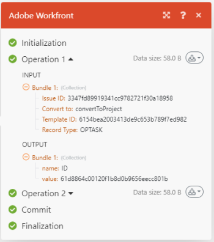

# Uitvoeringsstroom van scenario&#39;s in [!DNL Adobe Workfront Fusion]

>[!IMPORTANT]
>
>De Adobe Workfront Fusion-documentatie is verplaatst naar een nieuwe locatie.
>
>De informatie in dit artikel is nu te vinden in het artikel:
>
>* [ de uitvoeringsstroom van het Scenario ](https://experienceleague.adobe.com/docs/workfront-fusion/using/references/scenarios/scenario-execution-flow.html)
>
>Werk eventuele bladwijzers bij.
>
>Dit artikel wordt niet meer bijgewerkt en wordt in de nabije toekomst verwijderd.

In dit artikel wordt uitgelegd hoe een scenario wordt uitgevoerd en hoe de gegevens erin stromen. Hier wordt ook uitgelegd waar u informatie kunt vinden over uw verwerkte gegevens en hoe u deze kunt lezen.

## Toegangsvereisten

U moet de volgende toegang hebben om de functionaliteit in dit artikel te kunnen gebruiken:

<table style="table-layout:auto"> 
 <col> 
 <col> 
 <tbody> 
  <tr> 
    <td role="rowheader">[!DNL Adobe Workfront] plan*</td> 
   <td> 
[!DNL Pro] of hoger
 </td> 
  </tr> 
  <tr data-mc-conditions=""> 
   <td role="rowheader">[!DNL Adobe Workfront] licentie*</td> 
   <td> 
[!UICONTROL Plan], [!UICONTROL Work]
 </td> 
  </tr> 
  <tr> 
   <td role="rowheader">[!UICONTROL Adobe Workfront Fusion] licentie**</td> 
   <td>
   
Huidige licentievereiste: geen [!DNL Workfront Fusion] licentievereiste.

   
of

   
Vereiste voor verouderde licentie: [!UICONTROL [!DNL Workfront Fusion] voor werkautomatisering en -integratie], [!UICONTROL [!DNL Workfront Fusion] voor werkautomatisering]

   </td> 
  </tr> 
  <tr> 
   <td role="rowheader">Product</td> 
   <td>
   
Huidige productvereiste: als u het [!UICONTROL Select] - of [!UICONTROL Prime] [!DNL Adobe Workfront] -abonnement hebt, moet uw organisatie [!DNL Adobe Workfront Fusion] en [!DNL Adobe Workfront] aanschaffen om de in dit artikel beschreven functionaliteit te kunnen gebruiken. [!DNL Workfront Fusion] wordt opgenomen in het [!UICONTROL Ultimate] [!DNL Workfront] -abonnement.

   
of

   
Vereiste verouderd product: uw organisatie moet [!DNL Adobe Workfront Fusion] en [!DNL Adobe Workfront] aanschaffen om de in dit artikel beschreven functionaliteit te kunnen gebruiken.

   </td> 
  </tr> 
 </tbody> 
</table>

Neem contact op met de [!DNL Workfront] -beheerder als u wilt weten welk abonnement, licentietype of toegang u hebt.

Voor informatie over [!DNL Adobe Workfront Fusion] vergunningen, zie [[!DNL Adobe Workfront Fusion]  vergunningen ](../../workfront-fusion/get-started/license-automation-vs-integration.md).

## Uitvoeringsstroom van scenario

Nadat een scenario opstelling correct en geactiveerd is, voert het volgens zijn bepaald programma uit.

Terwijl het scenario begint, reageert de eerste module op een gebeurtenis waarvoor deze is ingesteld. Als het om het even welke bundels (gegevens) terugkeert, gaan zij tot de volgende module over en het scenario gaat verder, die de bundels door elke opeenvolgende module, één voor één overgaat.

Als de bundels correct door alle modules verwerken, is het scenario duidelijk als succes op het gebied van het scenario detail, zoals die in [ details van het Scenario in  [!DNL Adobe Workfront Fusion]](../../workfront-fusion/scenarios/scenario-detail.md) wordt verklaard.

* Voor meer informatie bij vestiging ziet een scenario, [ de scenarioredacteur in  [!DNL Adobe Workfront Fusion]](../../workfront-fusion/scenarios/scenario-editor.md).
* Voor meer informatie bij het activeren van een scenario, zie [ een scenario in  [!DNL Adobe Workfront Fusion]](../../workfront-fusion/scenarios/activate-or-inactivate-scenario.md) activeren of deactiveren.
* Voor meer informatie bij het plannen van een scenario, zie [ Plan een scenario in  [!DNL Adobe Workfront Fusion]](../../workfront-fusion/scenarios/schedule-a-scenario.md).
* Voor meer informatie over modules, zie [ Types van modules ](../../workfront-fusion/modules/module-types.md).

### Voorbeeld: [!UICONTROL [!DNL Workfront Fusion] for Work Automation]

>[!INFO]
>
>**Voorbeeld:** in een scenario dat voor inkomende verzoeken in [!DNL Workfront] kijkt en dan hen in [!DNL Workfront] projecten omzet, zouden de gegevens als volgt stromen.
>
>De eerste stap van het scenario, die door de eerste module wordt uitgevoerd, moet op verzoeken letten. Elk verzoek dat binnen komt wordt beschouwd als één bundel. Als de module zonder enige bundels loopt te vinden, beëindigt het scenario na de eerste module.
>
>Als de eerste module een bundel terugkeert, gaat de bundel door de rest van het scenario. In dit voorbeeld, bestaat de rest van het scenario uit de tweede en laatste module, die het verzoek in een project omzet.
>
>?

### Voorbeeld: [!UICONTROL [!DNL Workfront Fusion] for Work Automation and Integration]

>[!INFO]
>
>**Voorbeeld:** in een scenario dat documenten van [!DNL Adobe Workfront] downloadt en hen naar een omslag in [!DNL Dropbox] verzendt, zouden de gegevens als volgt stromen.
>
>De eerste stap van het scenario, die door de eerste module wordt uitgevoerd, is op bundels (documenten) te letten. In dit voorbeeld wordt in de module naar bundels gezocht in [!DNL Workfront] . Als het geen bundel terugkeert, eindigt het scenario na de eerste module.
>
>Als een bundel is teruggekeerd, gaat de bundel door de rest van het scenario. In dit voorbeeld bestaat de rest van het scenario uit de tweede en laatste module, die de bundel naar de map [!DNL Dropbox] uploadt.
>
>
>
>Als de eerste module meerdere bundels retourneert, wordt de eerste bundel geüpload naar [!DNL Dropbox] voordat de tweede bundel wordt geüpload. Vervolgens uploadt de tweede bundel, vervolgens de derde, enzovoort.

## Informatie over verwerkte pakketten

Voor elke module, gaat de bundel door een proces in vier stappen alvorens naar de volgende module te gaan of zijn definitieve bestemming te bereiken. Het proces in vier stappen is Initalization, Operation, Commit/Rollback en Finalization. Dit wordt genoemd transactieverwerking en het helpt om te verklaren hoe het gegeven in een module werd verwerkt.

Zodra een scenario looppas volledig is, toont elke module een pictogram dat het aantal uitgevoerde verrichtingen toont. U kunt op dit pictogram klikken om de gedetailleerde informatie over de verwerkte bundels in de hierboven beschreven indeling weer te geven. U kunt zien welke modules montages werden gebruikt en welke bundels door welke module werden teruggegeven.

Een module ontving inputinformatie zoals:

* Omgezette afbeelding
* Geselecteerde map waarnaar de afbeelding moet worden geüpload
* Oorspronkelijke naam van de [!DNL Facebook] afbeelding

Na verwerking retourneerde de module deze uitvoerinformatie:

* Afbeeldings-id toegewezen door [!DNL Dropbox]
* Volledig pad waar in [!DNL Dropbox] [!DNL Workfront Fusion] het bestand is geüpload

De bovenstaande informatie wordt voor elke bundel afzonderlijk vastgelegd, zoals gemarkeerd door de vervolgkeuzelijsten [!UICONTROL Operation 1] en [!UICONTROL Operation 2] in de afbeelding.

Voor meer informatie bij transactieverwerking zie [ uitvoering Scenario, cycli, en fasen in  [!DNL Adobe Workfront Fusion]](../../workfront-fusion/scenarios/scenario-execution-cycles-phases.md).

## Er is een fout opgetreden tijdens het uitvoeren van een scenario

Er kan een fout optreden tijdens het uitvoeren van het scenario. Als u bijvoorbeeld de map [!DNL Dropbox] verwijdert die u als doelmap hebt ingesteld in de module-instelling, wordt het scenario afgesloten met een foutbericht. Voor meer informatie over hoe te om fouten te behandelen, zie [ de verwerking van de Fout in  [!DNL Adobe Workfront Fusion]](../../workfront-fusion/errors/error-processing.md).
