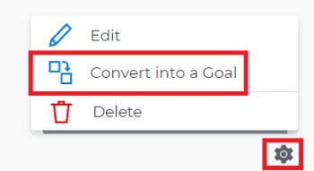

# Richt doelstellingen door resultaten en activiteiten aan doelstellingen om te zetten

U kunt twee doelstellingen manueel richten of u kunt de resultaten en de activiteiten van een bestaand doel in een ander doel omzetten. Het omgezette resultaat of de omgezette activiteit wordt het kinddoel van het originele doel.
Voor informatie over het manueel richten van twee doelstellingen, zie [ doelstellingen door hen in de Doelen van Adobe Workfront ](../../workfront-goals/goal-alignment/align-goals-by-connecting-them.md) aan te sluiten.

## Toegangsvereisten

<table style="table-layout:auto">
<col>
</col>
<col>
</col>
<tbody>
 <tr>
 <td role="rowheader">Adobe Workfront-plan</td>
 <td>
 
Alle

</td>
 </tr>
 <tr>
 <td role="rowheader">Adobe Workfront-licentie*</td>
 <td>
 
Nieuwe licentie: Medewerker of hoger

 of
 
Huidige licentie: aanvragen of hoger
 
Voor meer informatie, zie <a href="../../administration-and-setup/add-users/access-levels-and-object-permissions/wf-licenses.md" class="MCXref xref"> het vergunningsoverzicht van Adobe Workfront </a>.
 </td>
 </tr>
 <tr>
 <td role="rowheader">Product*</td>
 <td>
 
 Nieuwe productbehoefte, één van het volgende: 

<ul>
<li>Een Select- of Prime Adobe Workfront-abonnement en een extra Adobe Workfront Goals-licentie.</li>
<li>Een Ultimate Workfront-plan dat standaard Workfront Goals bevat. </li></ul>
 
of

 
Huidige productvereiste: een Workfront-plan en een extra licentie voor Adobe Workfront Goals. 
 
Voor informatie, zie <a href="../../workfront-goals/goal-management/access-needed-for-wf-goals.md" class="MCXref xref"> Vereisten om de Doelen van Workfront </a> te gebruiken. 
 </td>
 </tr>
 <tr>
 <td role="rowheader">Toegangsniveau</td>
 <td> 
Toegang tot doelen bewerken
 </td>
 </tr>
 <tr data-mc-conditions="">
 <td role="rowheader">Objectmachtigingen</td>
 <td>
  

  
De toestemmingen van de mening of hoger aan het doel om het te bekijken

  
Machtigingen beheren om het te bewerken

  
Voor informatie over het delen van doelstellingen, zie <a href="../../workfront-goals/workfront-goals-settings/share-a-goal.md" class="MCXref xref"> een doel in de Doelen van Workfront delen </a>. 

  
 </td>
 </tr>
<tr>
   <td role="rowheader">
Lay-outsjabloon
</td>
   <td> 
Aan alle gebruikers, inclusief Workfront-beheerders, moet een lay-outsjabloon worden toegewezen die het gebied Doelen in het hoofdmenu bevat. 
  
</td>
  </tr>
</tbody>
</table>

*Voor meer informatie, zie [ vereisten van de Toegang in de documentatie van Workfront ](/help/quicksilver/administration-and-setup/add-users/access-levels-and-object-permissions/access-level-requirements-in-documentation.md).

## Vereisten

U moet het volgende hebben voordat u kunt beginnen:

* Een bestaand doel met bestaande resultaten en activiteiten.

  Voor informatie over het creëren van doelstellingen, zie [ doelstellingen in de Doelen van Adobe Workfront ](../../workfront-goals/goal-management/create-goals.md) creëren.

>[!IMPORTANT]
>
>Een doel kan tot 1000 voortgangsindicatoren hebben.

<!--drafted for goal redesign: At PRODUCTION: update the sentence above to remove Production/ Preview references-->

## Overwegingen bij het omzetten van resultaten en activiteiten in doelen

Soms kan een resultaat of een activiteit een grotere reikwijdte hebben dan verwacht en het zou meer zin hebben dat ze doelstellingen worden. U kunt resultaten en activiteiten van een bestaand doel omzetten in een nieuw doel. Dit is een bottom-up benadering van het richten van doelstellingen.

Overweeg het volgende wanneer het omzetten van resultaten en activiteiten in doelstellingen:

* Het omgezette resultaat of de omgezette activiteit wordt het kinddoel van het oorspronkelijke doel, en de twee doelstellingen worden gericht.
* Het nieuwe doel wordt de enige voortgangsindicator voor het oorspronkelijke doel, als er geen extra resultaten of activiteiten op het oorspronkelijke doel zijn. U moet resultaten en activiteiten aan het kinddoel toevoegen om vooruitgang op het te kunnen volgen.
* Het omzetten van een resultaat of activiteit in een doel is onomkeerbaar. Na omgezette, kan het nieuwe kinddoel nooit een resultaat of activiteit voor het ouderdoel opnieuw worden.

## Een resultaat of activiteit omzetten in een doel

<!--
Converting results and activities differs depending on what environment you use. 

### Convert a result or activity to a goal in the Production environment

1. Go to a goal that has a result or an activity that you want to convert to a goal.
1. Click the name of the goal to open the **Goal Details** panel.
1. Expand the **Results** or **Activities** right-pointing arrows to see a list of results or activities for the goal. 

1. Click the **gear icon**  to the right of the result or activity name that you want to convert, then click **Convert into a Goal**.

   

1. (Optional) Remove the name of the original activity or result owner from the **Goal Owner** field and replace it with another user, team, group, or your organization's name. By default, Workfront selects the owner of the result or the activity as the goal owner. 
1. Click **Convert**. The activity or result displays as an aligned goal in the Goal Details panel of the original goal and the original activity or result is removed from the original goal and transferred to the second goal. By default, the new goal has the same name as the original converted result or activity. 
1. (Optional) Click the name of the new goal to open the **Goal Details** panel and edit the name of the goal. For information about editing any information for an existing goal, see [Edit goals in Adobe Workfront Goals](../../workfront-goals/goal-management/edit-goals.md).
-->

1. Ga naar een doel dat een resultaat of een activiteit heeft die u in een doel wilt omzetten.
1. Van de pagina van het doel, klik **indicatoren van de Voortgang** in het linkerpaneel.
1. Selecteer een resultaat of een activiteit in de lijst van vooruitgangsindicatoren, dan klik de **Bekeerling in doel** pictogram  bij de bovenkant van de lijst van de vooruitgangsindicator. Het vak Omzetten in doel wordt geopend.

   
1. Werk de volgende gegevens bij:
   * **Goal naam**: Door gebrek, heeft het nieuwe doel de zelfde naam zoals het originele resultaat of de activiteit.
   * **Periode**: Door gebrek, is de periode van het nieuwe doel het huidige kwart. U kunt **selecteren laat douanedata** plaatsen toe om een periode van de douanetijd voor het nieuwe doel te bepalen.
   * **Eigenaar van het Doel**: Door gebrek, is de nieuwe doeleigenaar de eigenaar van het originele resultaat of de activiteit.
   * **Beschrijving**: Voeg meer informatie over het nieuwe doel toe.
1. Klik **sparen**

   Het resultaat of de activiteit wordt nu omgezet in een kinddoel van het originele doel. Het wordt vermeld als doel in de lijst van voortgangsindicatoren van het oorspronkelijke doel.

