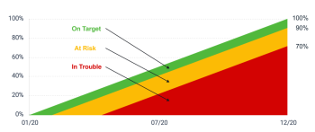

# Overzicht van de voortgang en conditie van het doel in de Adobe Workfront-doelstellingen

<!--Audited for P&P only: 4/2025-->

>[!IMPORTANT]
>
>Uw organisatie moet het volgende hebben om de functionaliteit te gebruiken die in dit artikel wordt beschreven:
>
>
>* Voor het nieuwe plan en de nieuwe licentiestructuur:
>
>   * Een Ultimate-abonnement
>    
>* Voor het huidige plan en de licentiestructuur:
>
>   * Een Pro of hoger
>   * Een Adobe Workfront Goals-licentie in aanvulling op een Workfront-licentie.
>
> Neem contact op met uw Workfront-accountmanager voor meer informatie over een Workfront Goals-licentie.
>
>Voor extra informatie over toegang tot de Doelen van Workfront, zie [&#x200B; Vereisten om de Doelen van Workfront &#x200B;](../../workfront-goals/goal-management/access-needed-for-wf-goals.md) te gebruiken.

Adobe Workfront berekent automatisch de voortgang van het doel op basis van de voortgangsindicatoren.

## Overzicht van de voortgang en drempel van het doel

Nadat u een doel hebt geactiveerd, begint u met het berekenen van de voortgang en toestand van de Workfront Goals en worden de volgende indicatoren weergegeven wanneer u de cursor op het veld Voortgang plaatst:

| Indicator | Beschrijving van de indicator |
|---|---|
| Werkelijk percentage voltooid | Hoeveel van het doel is tot nu toe daadwerkelijk bereikt. Workfront Goals berekent deze waarde door het gemiddelde te nemen van het percentage van alle voortgangsindicatoren die bij het doel horen. |
| Verwacht percentage voltooid | Hoeveel van het doel moet tot nu toe worden verwezenlijkt om het doel tijdig te kunnen voltooien. De Doelen van Workfront berekent deze waarde door de Duur van het doel en het huidige tijdstip te bekijken. Deze waarde moet op het huidige tijdstip worden weergegeven als het doel op tijd moet worden voltooid. |
| Voortgang | Een label dat aangeeft of het doel op tijd moet worden voltooid of dat het risico loopt of niet kan worden voltooid. |


<!--drafted for the redesign: replace the screen shot above with the redesigned one which is white, not black-->

* [&#x200B; Werkelijk volledig percent &#x200B;](#actual-percent-complete)
* [&#x200B; Verwacht percentage volledig &#x200B;](#expected-percent-complete)
* [Voortgang en toestand](#progress)

### Werkelijk percentage voltooid {#actual-percent-complete}

De Doelen van Workfront berekent automatisch het daadwerkelijke percentage volledig van een doel dat op het percentage volledig gemiddelde van de indicatoren van de doelvooruitgang wordt gebaseerd.

De volgende punten worden beschouwd als voortgangsindicatoren voor doelstellingen:

* Resultaten

  Voor informatie over het toevoegen van resultaten aan doelstellingen, zie [&#x200B; resultaten aan doelstellingen in de Doelen van Adobe Workfront &#x200B;](../../workfront-goals/results-and-activities/add-results-to-goals.md) toevoegen.

* Activiteiten

  Voor informatie over het toevoegen van activiteiten met inbegrip van projecten aan doelstellingen, zie [&#x200B; activiteiten aan doelstellingen in de Doelen van Adobe Workfront &#x200B;](../../workfront-goals/results-and-activities/add-activities-to-goals.md) toevoegen.

* Uitgelijnde onderliggende doelen

  Voor informatie over ouder en kinddoelstellingen, zie [&#x200B; doelstellingen richten door hen in de Doelen van Adobe Workfront &#x200B;](../../workfront-goals/goal-alignment/align-goals-by-connecting-them.md) te verbinden.

  Workfront Goals berekent het werkelijke percentage voltooid met de volgende formule:

  ```
  Actual percent complete of goal = SUM(Percent complete of goal progress indicators)* 100 / Number of progress indicators
  ```

  Als een doel bijvoorbeeld een resultaat heeft dat 20% voltooid is, een handmatige voortgangsbalk die 30% voltooid is, een project dat 10% voltooid is en een kinderdoel dat 40% voltooid is, is het streefpercentage voltooid 25%.

### Verwacht percentage voltooid {#expected-percent-complete}

De Doelen van Workfront berekent automatisch het verwachte percentage volledig van een doel dat op het totale aantal dagen in de duur van het doel evenals op het aantal dagen wordt gebaseerd die sinds de doel begindatum zijn overgegaan.

Workfront Goals berekent het verwachte percentage voltooid met de volgende formule:

```
Expected percent complete of goal = Number of days since the goal start date * 100/ Number of days in the goal duration
```

Als een doel bijvoorbeeld binnen 90 dagen moet worden voltooid en vandaag de 45e dag van die duur is, is het verwachte percentage voltooid 50%.

### Voortgang en toestand {#progress}

De Doelen van Workfront berekent een vooruitgangspercentage en wijst een vooruitgangsetiket aan doelstellingen toe, die op welk percentage van het Verwachte percentage volledig op het huidige tijdstip is bereikt. De kleur van de volledige bar van het doelpercentage verandert om op de vooruitgang van het doel te wijzen.

De voorwaarde van het doel wordt dienovereenkomstig ook bijgewerkt, om erop te wijzen of het doel op doel is op tijd te voltooien, of het achterloopt achterop.

Met de volgende formule wordt het voortgangspercentage van een doel berekend aan de hand van de Workfront-doelen:

```
Goal progress percentage = Actual percent complete * 100 / Expected percent complete
```

Als het verwachte percentage voltooid bijvoorbeeld 53% is op het huidige moment en het werkelijke percentage voltooid 30% is, is het percentage van de voortgang van het doel voltooid 56%. Workfront Goals noemt dit doel met de voorwaarde &#39;In Trouble&#39;.

In het volgende diagram ziet u de relatie tussen de voorwaardelabels en het voortgangspercentage:



In de onderstaande tabel staan de labels voor de doelvoorwaarde en de percentages voor de voortgang van het doel die aan elk label zijn gekoppeld.

>[!TIP]
>
>De labels voor de voorwaarde van het doel komen overeen met de naam en kleur van de Workfront-projectvoorwaarde.

<table style="table-layout:auto"> 
 <col> 
 <col> 
 <col> 
 <col> 
 <tbody> 
  <tr> 
   <td><b>Naam van voortgang van doel</b></td> 
   <td><b>Definitie van voortgang van het doel</b></td> 
   <td><b>Percentage voortgang van de doelstelling</b></td> 
   <td><b>Kleur van percentage van volledige balk</b></td> 
   <td><b>Voorwaardeindicator, pictogram</b></td> 
  </tr> 
  <tr> 
   <td>Nieuw</td> 
   <td> <p>Het doel is pas gecreëerd en het registreert nog geen vooruitgang. De voortgang van een doel wordt als Nieuw weergegeven totdat iemand de voortgang voor het eerst bijwerkt. </p> <p>Voor informatie over het bijwerken van doelvooruitgang, zie <a href="../../workfront-goals/goal-review-and-workfront-goals-sections/check-in-goals.md" class="MCXref xref"> het doel van de Update vooruitgang in de Doelen van Adobe Workfront </a>.</p> </td> 
   <td>Geen percentage</td> 
   <td>Geen balk</td> 
   <td></td>
  </tr> 
  <tr> 
   <td> <p><span> op Doel </span> </p> </td> 
   <td>Het doel presteert zoals verwacht en het is zeer waarschijnlijk dat het op tijd zal worden voltooid. </td> 
   <td>90-100%</td> 
   <td>Groen</td> 
    <td></td>
  </tr> 
  <tr> 
   <td> <p><span> Bij Risico </span> </p> </td> 
   <td>Het doel loopt achter, maar het kan nog steeds mogelijk zijn om het op tijd af te ronden. </td> 
   <td>70-89,99%</td> 
   <td>Geel</td>
   <td></td> 
  </tr> 
  <tr> 
   <td> <p><span> in Problemen </span> </p> </td> 
   <td> <p>Het is zeer waarschijnlijk dat het doel niet op tijd zal worden bereikt. </p> </td> 
   <td>0-69,99%</td> 
   <td>Rood</td> 
   <td></td> 
  </tr> 
 </tbody> 
</table>
