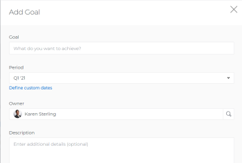

# Doelen maken voor Adobe Workfront-doelen

<!--Audited for P&P only: 4/2025-->

Of u nu CEO, manager of individuele medewerker bent, u kunt doelstellingen in de Doelen van Adobe Workfront creëren om uw werk met uw doelstellingen en de doelstellingen te richten die de strategie van uw organisatie schetsen.

## Toegangsvereisten

>[!NOTE]
>
>Uw bedrijf zou kunnen verkiezen om de Doelen van Adobe Workfront verder te gebruiken als zij dit pakket in het verleden kochten. U moet voor meer informatie contact opnemen met uw accountvertegenwoordiger.
>
>Adobe Workfront Goals kan niet meer worden aangeschaft.

+++ Breid uit om de toegangseisen voor de functionaliteit in dit artikel weer te geven. 

<table style="table-layout:auto">
<col>
</col>
<col>
</col>
<tbody>
 <tr>
  <td> 
Adobe Workfront-pakket
 </td> 
   <td> 
   
Adobe Workfront Ultimate

   </td> 
  </tr>
 <tr>
 <td role="rowheader">Adobe Workfront-licentie</td>
 <td>
 
Medewerker of hoger

Aanvraag of hoger
</td>
 </tr>
  <tr>
 <td role="rowheader">Configuratie op toegangsniveau</td>
 <td> 
Toegang tot doelen bewerken
 </td>
 </tr>
 <tr data-mc-conditions="">
 <td role="rowheader">Objectmachtigingen</td>
 <td>
  

  
De toestemmingen van de mening of hoger aan het doel om het te bekijken

  
Machtigingen beheren om het te bewerken

  
 </td>
 </tr>
<tr>
   <td role="rowheader">
Lay-outsjabloon
</td>
   <td> 
Aan alle gebruikers, inclusief Systeembeheerders, moet een lay-outsjabloon worden toegewezen die het gebied Doelen in het hoofdmenu bevat. 
  
</td>
  </tr>
</tbody>
</table>

Voor meer informatie, zie [&#x200B; vereisten van de Toegang in de documentatie van Workfront &#x200B;](/help/quicksilver/administration-and-setup/add-users/access-levels-and-object-permissions/access-level-requirements-in-documentation.md).

+++

<!--Old:

<table style="table-layout:auto">
<col>
</col>
<col>
</col>
<tbody>
 <tr> 
   <td role="rowheader">Adobe Workfront plan*</td> 
   <td> 
   
For the new plan and license structure:
  <ul><li>An Ultimate plan </li></ul>
   

For the current plan and license structure: 
<ul><li> A Pro or higher </li>
  <li>An Adobe Workfront Goals license in addition to a Workfront license.</li></ul>

   </td>  
  </tr>
 <tr>
 <tr>
 <td role="rowheader">Adobe Workfront license*</td>
 <td>
 
New license: Contributor or higher

 Or
 
Current license: Request or higher
 
For more information, see <a href="../../administration-and-setup/add-users/access-levels-and-object-permissions/wf-licenses.md" class="MCXref xref">Adobe Workfront licenses overview</a>.
 </td>
 </tr>
 <tr>
 <td role="rowheader">Product*</td>
 <td>
  
 New product requirement: Workfront

 
Or

  
Current product requirement: In addition to a Workfront license, you must purchase a license for Adobe Workfront Goals. 
 
For information, see <a href="../../workfront-goals/goal-management/access-needed-for-wf-goals.md" class="MCXref xref">Requirements to use Workfront Goals</a>. 
 </td>
 </tr>
 <tr>
 <td role="rowheader">Access level</td>
 <td> 
Edit access to Goals
 </td>
 </tr>
 <tr data-mc-conditions="">
 <td role="rowheader">Object permissions</td>
 <td>
  

  
View or higher permissions to the goal to view it

  
Manage permissions to the goal to edit it

  
For information about sharing goals, see <a href="../../workfront-goals/workfront-goals-settings/share-a-goal.md" class="MCXref xref">Share a goal in Workfront Goals</a>. 

  
 </td>
 </tr>
<tr>
   <td role="rowheader">
Layout template
</td>
   <td> 
All users, including Workfront administrators,  must be assigned a layout template that includes the Goals area in the Main Menu. 
  
</td>
  </tr>
</tbody>
</table>-->

## Richtlijnen voor het maken van doelen

Voordat we beginnen met Workfront Goals, raden we u aan om te lezen over onze aanbevelingen en richtlijnen voor het effectief beheren van doelen. Voor meer informatie over richtlijnen voor het creëren van en het leiden van doelstellingen, zie [&#x200B; overzicht van de Doelen van Adobe Workfront &#x200B;](../../workfront-goals/goal-management/wf-goals-overview.md).

## Doelen maken

In dit artikel wordt beschreven hoe u een strategisch doel maakt in Workfront Goals. Voor informatie over het creëren van een bedrijfscasedoel, zie [&#x200B; BedrijfsGevallendoelstellingen &#x200B;](../../manage-work/projects/define-a-business-case/create-business-case-goals.md) creëren.

U kunt een strategisch doel op een van de volgende manieren maken:

* [&#x200B; creeer een doel van kras &#x200B;](#create-a-goal-from-scratch)
* [&#x200B; Exemplaar een bestaand doel &#x200B;](#copy-an-existing-goal)
* [Een resultaat of activiteit omzetten in een doel](#convert-a-result-or-activity-to-a-goal)

### Een geheel nieuwe doelstelling maken {#create-a-goal-from-scratch}

<!--
Creating goals differs depending on what environment you use.

#### Create a goal from scratch in the Production environment 

1. Click the **Main Menu** icon  in the upper right corner, then click **Goals**.

   (!-- Add this when Shell is available to all: or (if available), click the **Main Menu** icon  in the upper-left corner)
   -)

   The Goal List displays.

1. (Conditional) Click **Goal List**, **Graphs**, **Pulse**, or **Check-in** in the left pane, then click **Add Goal** in the upper-right corner of the page. The Add Goal box displays.

   

   >[!TIP]
   >
   >You can add a goal from any section in Workfront Goals. The process for creating a goal is identical regardless of the section you choose to add the goal from.

1. Start typing what you want to achieve in the **Goal** field. This is the name of the goal and a required field. 
1. Select a time period when the goal should be executed in the **Period** drop-down menu. This is a pre-filled field. The default is the current quarter.

   Select from the following predefined options:

   * The current year
   * The quarters of the current year
   * The next two years
   * The quarters of the next two years

   Or

   Click **Define custom dates** to select a custom time frame. 

1. (Conditional) Select a **Start date** and an **End date** for your goal, if you clicked **Define custom dates**.

   >[!TIP]
   >
   >* You can create a goal with dates in any time period, including up to 2 years in the past. 
   >* When defining custom dates, they are constrained by the initial date you selected. So if you select quarter and then custom dates, you can't go beyond that quarter.

1. (Optional) Click **Reset custom dates** to return to the predefined options.

   >[!TIP]
   >
   >We recommend that everyone in your organization selects the same timeframes for similar goals or goals that are aligned. This provides better alignment between goals and ensures that everyone's work supports your over-arching strategy.

1. (Optional) Click your name in the **Owner** field, if you want to indicate someone else as the owner of the goal. By default, you are the owner of goals you create. 
1. Start typing the name of a user, team, group, or the name of your organization in the **Owner** field, then select it when it displays in the list. You can have only one owner for a goal. 
1. (Optional) Enter a **Description** for the goal. This field is optional. 
1. Click **Save**.

   The status of the new goal is Draft.

   >[!IMPORTANT]
   >
   >You must associate a goal with a progress indicator to activate it and start working on it. 
   >
   >Do at least one of the following to be able to activate a goal: 
   >
   >* Add a Result
   >
   >  For information about adding results, see [Add results to goals in Adobe Workfront Goals](../../workfront-goals/results-and-activities/add-results-to-goals.md).
   >   
   >* Add an Activity
   >   
   >  For information about adding activities, see [Add activities to goals in Adobe Workfront Goals](../../workfront-goals/results-and-activities/add-activities-to-goals.md). 
   >   
   >* Align another goal to it
   >   
   >  For information about aligning goals, see [Align goals by connecting them in Adobe Workfront Goals](../../workfront-goals/goal-alignment/align-goals-by-connecting-them.md).

1. Click the **X** icon in the upper-right of the Goal Details panel to close it.

-->

{{step1-to-goals}}

De vertoningen van de doellijst.

1. Klik **Nieuw doel**.

   De Nieuwe doeldoos toont.

   

1. Voer in de volgende velden gegevens in:
   * **Goal naam**: Ga een naam voor het doel in. Dit is een verplicht veld.
   * **Periode**: Selecteer een vooraf bepaald kwartaal of een jaar van het **Periode** drop-down gebied

     of

     Selecteer **douanedata** optie toelaten, dan a **Begin** en **einddatum** voor het doel selecteren.

     De voorgaande, huidige en volgende jaren en hun respectieve kwartalen worden vermeld als vooraf gedefinieerde opties in het vervolgkeuzeveld Periode.

     De Periode van het doel wijst op het tijdkader wanneer u het doel verwacht te voltooien.

   * **Goal eigenaar**: Begin typend de naam van een gebruiker, een team, een groep, of van uw organisatie om erop te wijzen wie de eigenaar van het doel is. U wordt standaard geselecteerd als de eigenaar van het doel.
   * **Beschrijving**: Ga extra informatie over het doel in.
1. Klik **creëren doel**.

   Het nieuwe doel wordt vermeld in de lijst van het Doel en het heeft het statuut van **Ontwerp**.

   U moet een doel koppelen aan een voortgangsindicator om het te activeren en er aan te gaan werken.

   Voer ten minste een van de volgende handelingen uit om een te activeren doel voor te bereiden:
   * Een resultaat toevoegen

     Voor informatie over het toevoegen van resultaten, zie [&#x200B; resultaten aan doelstellingen in de Doelen van Adobe Workfront &#x200B;](../results-and-activities/add-results-to-goals.md) toevoegen.
   * Een activiteit toevoegen

     Voor informatie over het toevoegen van activiteiten, zie [&#x200B; activiteiten aan doelstellingen in de Doelen van Adobe Workfront &#x200B;](../results-and-activities/add-activities-to-goals.md) toevoegen.
   * Nog een doel uitlijnen

     Voor informatie over het richten van doelstellingen, zie [&#x200B; doelstellingen door hen in de Doelen van Adobe Workfront &#x200B;](../goal-alignment/align-goals-by-connecting-them.md) te verbinden.

### Een bestaand doel kopiëren {#copy-an-existing-goal}

U kunt een doel creëren door bestaande te kopiëren.

Voor informatie over het kopiëren van doelstellingen, zie [&#x200B; doelstellingen van het Exemplaar in de Doelen van Adobe Workfront &#x200B;](../../workfront-goals/goal-management/copy-goals.md).

### Een resultaat of activiteit omzetten in een doel {#convert-a-result-or-activity-to-a-goal}

U kunt een doel tot stand brengen door het resultaat of de activiteit van een bestaand doel in een doel om te zetten. Het nieuwe doel wordt uitgelijnd op het oorspronkelijke doel.

Voor informatie over het omzetten van resultaten en activiteiten in doelstellingen, zie [&#x200B; doelstellingen richten door resultaten en activiteiten in doelstellingen &#x200B;](../../workfront-goals/goal-alignment/align-goals-by-converting-results-activities.md) om te zetten.

