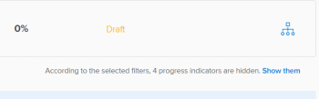

# Gegevens filteren in Adobe Workfront Goals

U kunt doelstellingen bekijken die u of iemand anders in de Doelen van Adobe Workfront toevoegde. Voor informatie over het creëren van doelstellingen, zie [Doelen maken voor Adobe Workfront-doelen](../../workfront-goals/goal-management/create-goals.md). Wanneer u doelstellingen bekijkt, kunt u informatie in de Doelen van Workfront filtreren om slechts doelstellingen te bekijken die voor u belangrijk zijn.

## Toegangsvereisten

<!--drafted - replace the table below with this one when P&P releases: 

<table style="table-layout:auto">
 <col>
 </col>
 <col>
 </col>
 <tbody>
  <tr>
   <td role="rowheader">Adobe Workfront plan*</td>
   <td>
   
Current plan: Select or higher

   Or
   
Legacy plan: Pro or higher

   
   </td>
  </tr>
  <tr>
   <td role="rowheader">Adobe Workfront license*</td>
   <td>
   
Current license: Contributor or higher

   Or
   
Legacy license: Request or higher
 
For more information, see <a href="../../administration-and-setup/add-users/access-levels-and-object-permissions/wf-licenses.md" class="MCXref xref">Adobe Workfront licenses overview</a>.
 </td>
  </tr>
  <tr>
   <td role="rowheader">Product</td>
   <td>
   
 Current product requirement: If you have the Select or Prime Adobe Workfront plan, you must also buy an additional Adobe Workfront Goals license.  Workfront Goals are included in the Ultimate Workfront Plan.

   Or
   
Legacy product requirement: You must purchase an additional license for the Adobe Workfront Goals to access functionality described in this article. 
 
For information, see <a href="../../workfront-goals/goal-management/access-needed-for-wf-goals.md" class="MCXref xref">Requirements to use Workfront Goals</a>. 
 </td>
  </tr>
  <tr>
   <td role="rowheader">Access level*</td>
   <td> 
Edit access to Goals
 
<b>NOTE</b>
If you still don't have access, ask your Workfront administrator if they set additional restrictions in your access level. For information on how a Workfront administrator can change your access level, see:

     <ul>
      <li> 
<a href="../../administration-and-setup/add-users/configure-and-grant-access/create-modify-access-levels.md" class="MCXref xref">Create or modify custom access levels</a> 
 </li>
      <li> 
<a href="../../administration-and-setup/add-users/configure-and-grant-access/grant-access-goals.md" class="MCXref xref">Grant access to Adobe Workfront Goals</a> 
 </li>
     </ul> 
 </td>
  </tr>
  <tr data-mc-conditions="">
   <td role="rowheader">Object permissions</td>
   <td>
    

     
View or higher permissions to the goal to view it

     
Manage permissions to the goal to edit it

     
For information about sharing goals, see <a href="../../workfront-goals/workfront-goals-settings/share-a-goal.md" class="MCXref xref">Share a goal in Workfront Goals</a>. 

    
 </td>
  </tr>
 </tbody>
</table>
-->

U moet de volgende toegang hebben om de handelingen uit te voeren die in dit artikel worden beschreven:

<table style="table-layout:auto"> 
 <col> 
 <col> 
 <tbody> 
  <tr> 
   <td role="rowheader">Adobe Workfront-abonnement*</td> 
   <td> 
Pro of hoger
 </td> 
  </tr> 
  <tr> 
   <td role="rowheader">Adobe Workfront-licentie*</td> 
   <td> 
Aanvraag of hoger
 
Zie voor meer informatie <a href="../../administration-and-setup/add-users/access-levels-and-object-permissions/wf-licenses.md" class="MCXref xref">Overzicht van Adobe Workfront-licenties</a>.
 </td> 
  </tr> 
  <tr> 
   <td role="rowheader">Product</td> 
   <td> 
U moet een extra licentie voor de Adobe Workfront Goals aanschaffen om toegang te krijgen tot de functionaliteit die in dit artikel wordt beschreven. 
 
Zie voor meer informatie <a href="../../workfront-goals/goal-management/access-needed-for-wf-goals.md" class="MCXref xref">Vereisten voor het gebruik van Workfront-doelen</a>. 
 </td> 
  </tr> 
  <tr> 
   <td role="rowheader">Toegangsniveau*</td> 
   <td> 
Toegang tot doelen weergeven of vergroten
 
<b>OPMERKING</b>

Als u nog steeds geen toegang hebt, vraagt u de Workfront-beheerder of deze aanvullende beperkingen op uw toegangsniveau instelt. Voor informatie over hoe een beheerder van Workfront uw toegangsniveau kan veranderen, zie:
 
     <ul> 
      <li> 
<a href="../../administration-and-setup/add-users/configure-and-grant-access/create-modify-access-levels.md" class="MCXref xref">Aangepaste toegangsniveaus maken of wijzigen</a> 
 </li> 
      <li> 
<a href="../../administration-and-setup/add-users/configure-and-grant-access/grant-access-goals.md" class="MCXref xref">Toegang tot Adobe Workfront-doelen verlenen</a> 
 </li> 
     </ul> 
 </td> 
  </tr> 
  <tr data-mc-conditions=""> 
   <td role="rowheader">Objectmachtigingen</td> 
   <td> 
    
 
     
De toestemmingen van de mening of hoger op doelstellingen
 
     
Voor informatie over het delen van doelstellingen, zie <a href="../../workfront-goals/workfront-goals-settings/share-a-goal.md" class="MCXref xref">Een doel delen in Workfront-doelen</a>. 
 
    
 </td> 
  </tr> 
 </tbody> 
</table>

*Neem contact op met uw Workfront-beheerder om te weten te komen welk abonnement, licentietype of toegang u hebt.

## Vereisten

U moet het volgende hebben voordat u kunt beginnen:

* Een lay-outsjabloon die het gebied Doelen in het hoofdmenu bevat.

## Overzicht van filters in Workfront Goals

>[!NOTE]
>
>We raden u aan filters te gebruiken in Workfront Goals om op efficiënte wijze de juiste doelen te vinden en de focus op de juiste doelen te plaatsen. Dit staat u toe om de correcte informatie te tonen alvorens u begint doelstellingen te leiden die voor u belangrijk zijn. Standaard geeft Workfront Goals alle doelen in het systeem weer.

In Workfront kunt u zoeken naar doelen in de volgende secties van het gebied Doelen en filteren:

* Lijst met doelen
* Grafieken
* Goal Alignment

Voor informatie over de gedeelten van het gebied Doelstellingen raadpleegt u [Overzicht van de secties Adobe Workfront Goals](../../workfront-goals/goal-review-and-workfront-goals-sections/overview-of-wf-goals-sections.md).

>[!IMPORTANT]
>
>U kunt filters configureren voor één sectie en deze blijven blijvend wanneer u naar een ander gedeelte van Workfront Goals gaat.

Houd rekening met het volgende wanneer u werkt met filters in Workfront Goals:

* U kunt een filter maken en toepassen zonder het op te slaan, of u kunt een filter opslaan om later opnieuw te gebruiken.

   De volgende scenario&#39;s bestaan:

   * Wanneer u een filter opslaat, wordt dit het standaardfilter voor u wanneer u zich aanmeldt bij Workfront Goals.
   * Wanneer u een filter toepast zonder het op te slaan, kunt u terugkeren naar de originele lijsten door de pagina te vernieuwen.

* U kunt alleen filters weergeven en toepassen die u hebt gemaakt. Filters die door andere gebruikers zijn gemaakt, worden alleen voor die gebruikers weergegeven.
* U kunt filters die u met andere gebruikers hebt gemaakt, niet delen.

## Een snelfilter toepassen in Workfront Goals

U kunt een snel filter in een lijst van doelstellingen gebruiken om u van slechts punten te helpen de plaats bepalen die voor u belangrijk zijn. U kunt snelle filters niet opslaan en deze zijn niet blijvend. Workfront wist de resultaten van een snel filter wanneer u de pagina vernieuwt.

Zie voor meer informatie [Het snelle filter toepassen op een lijst](../../workfront-basics/navigate-workfront/use-lists/apply-quick-filter-list.md).

## Een filter maken en toepassen in Workfront Goals

Het proces voor het maken van filters is hetzelfde voor elke sectie van Workfront Goals.

U kunt een geheel nieuw filter maken of een van de ingebouwde filters bewerken.

1. Ga naar de Workfront-doelen.

   Voor informatie over het benaderen van Workfront Goals raadpleegt u [Toegang tot en open doelen in Adobe Workfront-doelen](../../workfront-goals/goal-management/access-goals-in-wf-goals.md)

   Standaard wordt de sectie Lijst met doelstellingen weergegeven.

1. Klikken **Filter** in de rechterbovenhoek van de lijst.

   

   Standaard past Workfront de **Alles** filter dat alle doelstellingen in uw systeem toont.

   >[!TIP]
   >
   >U kunt het filter Alles niet bewerken of verwijderen.

1. Voer een van de volgende handelingen uit:

   * Klik op een van de volgende vooraf gedefinieerde filters om alleen de volgende doelen weer te geven:

      <table style="table-layout:auto"> 
      <col> 
      <col> 
      <tbody> 
       <tr> 
        <td>Alles</td> 
        <td> 
Alle doelstellingen in uw systeem, ongeacht wie hen creeerde, wat de tijdspanne voor hen is, of wie de eigenaar is. Dit is het standaardfilter en u kunt het niet bewerken. 
 <!--
          
(NOTE: what the ALL filter displays might change; right now, it displays all, regardless of status, period, owner, etc)

         --> </td> 
       </tr> 
       <tr> 
        <td>Persoonlijk</td> 
        <td>De doelen waarvoor u de eigenaar bent.</td> 
       </tr> 
       <tr> 
        <td>Mijn teams</td> 
        <td> 
De doelstellingen waarvoor om het even welk van uw teams als eigenaar wordt geselecteerd. 
 
<b>TIP</b>

      Geen doelstellingen tonen wanneer u niet aan om het even welke teams wordt toegewezen. 
 </td>
      </tr> 
       <tr> 
        <td>Mijn groepen</td> 
        <td>De doelstellingen waarvoor om het even welke van uw groepen als eigenaar wordt geselecteerd. </td> 
       </tr> 
       <tr> 
        <td>Bedrijf</td> 
        <td> 
De doelstellingen verbonden aan uw organisatie. 
 
<b>TIP</b>
        
In de Doelen van Adobe Workfront, toont de filter van het Bedrijf de doelstellingen waarvoor uw organisatie als eigenaar wordt geselecteerd. 
 
U kunt niet zoeken naar bedrijven die dit veld gebruiken. Alleen uw organisatie die eigenaar is van uw Workfront-exemplaar is standaard geselecteerd. 
 
 </td> 
       </tr> 
      </tbody> 
     </table>

   * Houd de aanwijzer boven de naam van een filter en klik vervolgens op de knop **Bewerken** pictogram  naast zijn naam om het aan te passen en specifieke namen van gebruikers, teams, groepen, of de naam van uw organisatie toe te voegen, dan selecteer het wanneer zij op de lijst verschijnen.

   * Klikken **Nieuw filter** om een nieuw filter te maken, selecteert u een van de volgende opties om het nieuwe filter aan te passen:

      <table style="table-layout:auto"> 
      <col> 
      <col> 
      <tbody> 
       <tr> 
        <td role="rowheader">Periode</td> 
        <td>Selecteer een tijdsperiode in het keuzemenu. U kunt meerdere tijdsperioden selecteren. </td> 
       </tr> 
       <tr> 
        <td role="rowheader">Status</td> 
        <td> 
Selecteer een status in het vervolgkeuzemenu van de volgende opties:
 
         <ul> 
          <li> 
Actief
 </li> 
          <li> 
Concept
 </li> 
          <li> 
Inactief
 </li> 
          <li> 
Gesloten
 </li> 
         </ul> </td> 
       </tr> 
       <tr> 
        <td role="rowheader">Voortgang</td> 
        <td> 
Selecteer een voortgang in het vervolgkeuzemenu uit de volgende opties: 
 
         <ul> 
          <li> 
In problemen
 </li> 
          <li> 
Risico
 </li> 
          <li> 
Op doel
 </li> 
         </ul> </td> 
       </tr> 
       <tr> 
        <td role="rowheader">Eigenaar</td> 
        <td> 
Typ de naam van een eigenaar en selecteer deze wanneer deze in de lijst wordt weergegeven. 
 
U kunt de namen van gebruikers, teams, groepen of de naam van uw organisatie typen of u kunt een van de vooraf gedefinieerde opties selecteren. 
 
De volgende vooraf gedefinieerde filteropties verwijzen altijd naar de gebruiker die momenteel is aangemeld: 
 
         <ul> 
          <li> 
<strong>Mij</strong>: Hiermee geeft u doelen weer waar u de eigenaar bent.
 </li> 
          <li> 
<strong>Mijn thuisteam</strong> en <strong>Al mijn teams</strong>: De doelstellingen van vertoningen waar of uw Team van het Huis of om het even welk van uw teams als eigenaar worden aangewezen. 
 
Tip: Geen doelstellingen tonen wanneer u niet aan om het even welke teams wordt toegewezen. 
 </li> 
          <li> 
<strong>Mijn startgroep</strong> en <strong>Al mijn groepen</strong>: Hiermee geeft u doelen weer waarbij uw thuisgroep of een van uw groepen is aangewezen als eigenaar.
 </li> 
         </ul> </td> 
       </tr> 
      </tbody> 
     </table>

1. (Optioneel) Klik op **Herstellen** in de rechterbenedenhoek van het filtervak om alle velden te wissen die u hebt geselecteerd en het filter helemaal opnieuw op te bouwen.
1. (Optioneel) Klik op **Toepassen** om het filter toe te passen zonder op te slaan.

   Het filter wordt weergegeven in het dialoogvenster **Niet opgeslagen** gebied van de filterconstrucder als **Nieuw filter**.

   U kunt de naam van een niet-opgeslagen filter niet wijzigen.

   De volgende keer dat u zich afmeldt bij Workfront en zich weer aanmeldt, worden niet-opgeslagen filters verwijderd uit het gebied Doelen.

   >[!TIP]
   >
   >U kunt slechts één niet-opgeslagen nieuw filter tegelijk gebruiken.

1. Klikken **Opslaan** om het filter op te slaan zodat het later kan worden gebruikt, voegt u een naam voor het filter toe in het dialoogvenster **Filternaam toevoegen** veld en klik op **Gereed**.

   Hiermee slaat u het filter op in het dialoogvenster **Opgeslagen** van de filterconstructor. U kunt dit filter in de toekomst gebruiken.

   De laatst opgeslagen en toegepaste filter wordt standaard weergegeven wanneer u zich weer aanmeldt bij Workfront

1. (Optioneel) Klik op de knop **pijl naar links** naast **Nieuw filter** om de filterbuilder af te sluiten en terug te keren naar de lijst met filters.
1. (Optioneel) Klik op de knop **Meer** en klik vervolgens op **Verwijderen** vervolgens **Verwijderen**. Hiermee verwijdert u het filter en kunt u het niet herstellen.

   >[!TIP]
   >
   >U kunt vooraf gedefinieerde filters niet verwijderen.

1. Klik op de knop **X-pictogram** in de rechterbovenhoek van de filterconstructor om de filterconstructor te sluiten.

   De naam van het filter dat momenteel wordt toegepast, wordt rechts van het pictogram Filter weergegeven in de rechterbovenhoek van de lijst met doelen.

   De lijst met doelen wordt gefilterd door de filtercriteria.

1. (Optioneel en voorwaardelijk) Als u doelen weergeeft in het gedeelte Uitlijning van doel, klikt u op **Deze weergeven** als u de gefilterde doelstellingen wilt bekijken.

   

   De filternaam wordt geel weergegeven om aan te geven dat deze wordt genegeerd.

   

1. (Optioneel en voorwaardelijk) Klik op **Filter opnieuw toepassen** om het filter toe te passen en de items weg te laten die u in de vorige stap hebt weergegeven.

