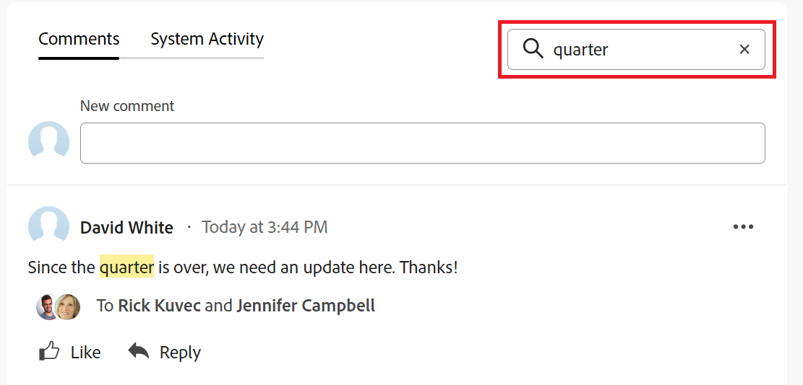

# Doelopmerkingen beheren in Adobe Workfront-doelen

<!--Audited: 01/2024-->

<!--consider retiring this article when goals and all objects are in parity and we remove the legacy commenting from the system. From then on, there is just ONE way to comment and that will be documented in the Update Work article-->

<!--take "legacy" and "new commenting" references out when we remove the legacy - April 2024???-->

<!--The highlighted information on this page refers to functionality not yet generally available. It is available only in the Preview environment for all customers. 

For information about the current release schedule, see [First Quarter 2024 release overview](../../product-announcements/product-releases/24-q1-release-activity/24-q1-release-overview.md).-->

<!--
After the monthly releases to Production, the same features are also available in the Production environment for customers who enabled fast releases.   
For information about fast releases, see [Enable or disable fast releases for your organization](../../administration-and-setup/set-up-workfront/configure-system-defaults/enable-fast-release-process.md)  
-->

U kunt opmerkingen toevoegen aan alle doelen die u kunt weergeven in Adobe Workfront Goals.

## Toegangsvereisten

U moet de volgende toegang hebben om de handelingen uit te voeren die in dit artikel worden beschreven:

<table style="table-layout:auto">
<col>
</col>
<col>
</col>
<tbody>
 <tr>
 <td role="rowheader">Adobe Workfront-plan</td>
 <td>
 
Alle

</td>
 </tr>
 <tr>
 <td role="rowheader">Adobe Workfront-licentie*</td>
 <td>
 
Nieuwe licentie: Medewerker of hoger

 of
 
Huidige licentie: aanvragen of hoger
 </td>
 </tr>
 <tr>
 <td role="rowheader">Product*</td>
 <td>
 
 Nieuwe productvereiste: als je het abonnement Select of Premier Adobe Workfront hebt, moet je ook een extra licentie voor Adobe Workfront Goals kopen. Workfront Goals zijn opgenomen in het Ultimate Workfront Plan.

 of
 
Huidige productvereiste: u moet een extra licentie aanschaffen voor de Adobe Workfront Goals om toegang te krijgen tot de functionaliteit die in dit artikel wordt beschreven. 
 
Zie voor meer informatie <a href="../../workfront-goals/goal-management/access-needed-for-wf-goals.md" class="MCXref xref">Vereisten voor het gebruik van Workfront-doelen</a>. 
 </td>
 </tr>
 <tr>
 <td role="rowheader">Configuratie op toegangsniveau</td>
 <td> 
Toegang tot doelen weergeven of vergroten
 
<b>OPMERKING</b>
Als u geen toegang hebt, vraagt u de Workfront-beheerder of deze aanvullende beperkingen op uw toegangsniveau instelt. Zie voor meer informatie <a href="../../administration-and-setup/add-users/configure-and-grant-access/grant-access-goals.md" class="MCXref xref">Toegang tot Adobe Workfront-doelen verlenen</a></td>
 </tr>
 <tr data-mc-conditions="">
 <td role="rowheader">Objectmachtigingen</td>
 <td>
  

  
De toestemmingen van de mening of hoger aan het doel

  
Standaard krijgen gebruikers geen toegang tot doelen 

 
Voor informatie over het delen van doelstellingen, zie <a href="../../workfront-goals/workfront-goals-settings/share-a-goal.md" class="MCXref xref">Een doel delen in Workfront-doelen</a>. 

  
 </td>
 </tr>
</tbody>
</table>

*Neem contact op met uw Workfront-beheerder om te weten te komen welk abonnement, licentietype of toegang u hebt. Zie voor meer informatie [Toegangsvereisten in Workfront-documentatie](/help/quicksilver/administration-and-setup/add-users/access-levels-and-object-permissions/access-level-requirements-in-documentation.md).

## Vereisten

U moet het volgende hebben voordat u kunt beginnen:

* Een lay-outsjabloon die het gebied Doelen in het hoofdmenu bevat.

## Doelopmerkingen beheren

U kunt commentaren aan doelstellingen in de sectie van Updates van een doelpagina toevoegen.

U kunt reageren op of houden van een opmerking die u of anderen in dit gebied hebben toegevoegd.

1. Klik op de knop **Hoofdmenu** pictogram  in de rechterbovenhoek, of de **Hoofdmenu** pictogram  in de linkerbovenhoek, indien beschikbaar, klikt u op **Doelen**.
Hierdoor wordt de lijst met doelen geopend.
1. Zoek het doel waaraan u opmerkingen wilt toevoegen en klik op de naam van het doel om de doelpagina te openen.
1. Klikken  **Updates** in het linkerdeelvenster.
1. (Optioneel) Typ een trefwoord om een bestaande opmerking te zoeken <!--or a user's name--> in de **Zoeken** in de rechterbovenhoek van het dialoogvenster **Opmerkingen** tab.

   

   Het trefwoord <!--or user--> u hebt gezocht naar wordt benadrukt en de commentaren die het bevatten tonen bij de bovenkant van de sectie van Updates.

   <!--change the NOTE below when functionality changes-->

   >[!NOTE]
   >
   >   U moet zoeken naar een woord dat is opgenomen in een opmerking of antwoord. U kunt niet zoeken naar een gecodeerde gebruiker of team.

   Zie voor meer informatie [Werk bijwerken](../../workfront-basics/updating-work-items-and-viewing-updates/update-work.md)

1. Klik op de knop **x** in het zoekveld om de zoekresultaten te wissen en terug te keren naar het volledige venster.
1. Klik op de knop **Opmerkingen** in de linkerbovenhoek van het gebied Updates.
1. Beginnen met een opmerking in het dialoogvenster **Nieuwe opmerking** doos.

   

   >[!TIP]
   >
   >Als u weg navigeert uit de sectie Updates voordat u klaar bent met het typen en verzenden van een opmerking, wordt de opmerking op de pagina in de conceptmodus bewaard, zelfs nadat u zich hebt afgemeld en u weer hebt aangemeld. Afbeeldingen die aan de opmerking worden toegevoegd, worden ook in het concept opgeslagen. Concepten worden 7 dagen bewaard waarna ze worden verwijderd en kunnen niet worden hersteld. Getekende opmerkingen zijn alleen zichtbaar voor de gebruiker die ze invoert.

1. (Optioneel) Als u een wijziging ongedaan wilt maken of opnieuw wilt uitvoeren, gebruikt u de volgende sneltoetsen:
   * CTRL + Z ( ⌘+z voor Mac) om een wijziging ongedaan te maken
   * CTRL + Y ( ⌘+y voor Mac) om een wijziging opnieuw uit te voeren
1. (Optioneel) Als u opmaak met RTF-opmaak wilt toevoegen aan de update, een hyperlink of een afbeelding, gebruikt u de gewenste opties op de werkbalk RTF of de pictogrammen ernaast. Zie voor meer informatie [Werk bijwerken](../../workfront-basics/updating-work-items-and-viewing-updates/update-work.md).
1. (Optioneel) In het dialoogvenster **Tags toewijzen aan personen of teams** -gebied, typt u de naam of het e-mailadres van een gebruiker of een team dat u in deze opmerking wilt opnemen, en selecteert u deze vervolgens wanneer de opmerking in de lijst wordt weergegeven.
1. Selecteer de **Privé voor mijn bedrijf** Schakel deze optie in om de opmerking alleen zichtbaar te maken voor mensen in uw bedrijf.

   >[!TIP]
   >
   >U moet een Bedrijf hebben in uw profiel wordt gespecificeerd om deze optie beschikbaar in het gebied van Updates te hebben dat.

1. Klikken **Verzenden**.

   >[!TIP]
   >
   >Als een andere gebruiker een opmerking verzendt naar hetzelfde item dat u bijwerkt, wordt er een rode lijn weergegeven met de indicator &quot;Nieuw&quot; om u op de hoogte te brengen van de nieuwere opmerkingen en wordt onder in het scherm een blauwe melding weergegeven die het aantal nieuwe opmerkingen aangeeft.
   >
   >De indicator wordt alleen weergegeven nadat de opmerking op het item is verzonden, en niet wanneer de opmerking nog steeds wordt samengesteld.
   >

1. (Optioneel) Als u een opmerking wilt bewerken, klikt u op **Meer** menu  rechts van het gelijkaardige pictogram, dan klik **Bewerken**.
1. Bewerk de informatie in de opmerking, voeg afbeeldingen toe of verwijder afbeeldingen of verwijder een van de getagde gebruikers.
U kunt uw opmerking binnen 15 minuten na verzending bewerken. Een indicator &quot;bewerkt&quot; wordt toegevoegd links van de datumstempel die wordt weergegeven wanneer de opmerking is bijgewerkt.

   

   >[!TIP]
   >
   > * Er wordt een e-mail gegenereerd om gebruikers alleen van uw update op de hoogte te stellen wanneer u de oorspronkelijke update verzendt. Er wordt geen e-mail gegenereerd nadat u de update hebt bewerkt.
   >
   > * De datumstempel is de datum van de oorspronkelijke opmerking en niet de datum van de laatste update.

1. (Optioneel) Klik op de knop **Meer** menu Klik vervolgens op een van de volgende opties om informatie van een opmerking naar het klembord of naar een nieuw antwoord te kopiëren:

   * **Koppeling kopiëren** om de koppeling van een update te kopiëren, zonder de antwoorden.
   * **Platte tekst kopiëren** om de tekst van een update te kopiëren.
   * **Offerteantwoord** om een nieuw commentaarvakje te openen waar de originele commentaar in een nieuw antwoord wordt geciteerd en als blokcitaat duidelijk is.

     Zie voor meer informatie [Werk bijwerken](../../workfront-basics/updating-work-items-and-viewing-updates/update-work.md).

1. (Optioneel) Klik op de knop **Meer** menu  rechts van een opmerking klikt u op **Verwijderen** om een toegevoegde opmerking te verwijderen. Zie voor meer informatie [Werk bijwerken](../../workfront-basics/updating-work-items-and-viewing-updates/update-work.md).
1. (Optioneel) Klik op **Antwoord** om op een bestaande opmerking te reageren, volgt u de bovenstaande stappen 5 tot en met 9. Voor meer informatie over het beantwoorden van updates, zie [Reageren op updates](../../workfront-basics/updating-work-items-and-viewing-updates/reply-to-updates.md). <!--insure this stays accurate-->
1. (Voorwaardelijk en optioneel) Als andere gebruikers opmerkingen hebben toegevoegd die buiten het zichtbare gebied in de sectie Updates worden weergegeven, klikt u op **Weergave** in het blauw **banner voor nieuwe opmerkingen** onder aan het scherm om deze opmerkingen weer te geven.

   

   Aanvullende opmerkingen worden onder in het scherm weergegeven.
1. (Optioneel) Klik op de knop **leuk** pictogram als u een opmerking wilt toevoegen die iemand anders heeft toegevoegd. Het pictogram wordt bijgewerkt met het aantal ‘like’.

1. (Optioneel) Klik op de knop **Systeemactiviteit** om updates weer te geven die zijn geregistreerd door het systeem. Wanneer een doel wordt bijgewerkt, genereert Workfront een notitie over die update en geeft deze weer op het tabblad Systeemactiviteit. Workfront registreert ook een systeemupdate wanneer een resultaat, een activiteit, of een project aan het doel wordt toegevoegd of wanneer het wordt bijgewerkt. <!--ensure the casing on the tab has not changed-->

