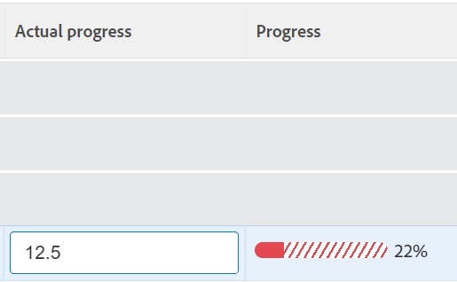

# Herzie doelstellingen in de problemen van Adobe Workfront Doelstellingen

<!--Audited: 4/2025-->

<!--

(NOTE: the status of goals in "red" used to be called At Risk. Now, it is "in trouble") 

-->

Doelen met een vooruitgang in de problemen dreigen niet te worden verwezenlijkt en worden in de doelstellingen van Adobe Workfront weergegeven door een rode voortgangsbalk. U moet uw doelstellingen vaak herzien en begrijpen waarom de vooruitgang achterloopt. Voor informatie over doelvooruitgang, zie [ Overzicht van doelvooruitgang en voorwaarde in de Doelen van Adobe Workfront ](../../workfront-goals/goal-management/calculate-goal-progress.md).

## Toegangsvereisten

>[!NOTE]
>
>Uw bedrijf zou kunnen verkiezen om de Doelen van Adobe Workfront verder te gebruiken als zij dit pakket in het verleden kochten. U moet voor meer informatie contact opnemen met uw accountvertegenwoordiger.
>
>Adobe Workfront Goals kan niet meer worden aangeschaft.

+++ Breid uit om de toegangseisen voor de functionaliteit in dit artikel weer te geven. 

<table style="table-layout:auto">
<col>
</col>
<col>
</col>
<tbody>
 <tr>
  <td> 
Adobe Workfront-pakket
 </td> 
   <td> 
   
Adobe Workfront Ultimate

   </td> 
  </tr>
 <tr>
 <td role="rowheader">Adobe Workfront-licentie</td>
 <td>
 
Medewerker of hoger

Aanvraag of hoger
</td>
 </tr>
  <tr>
 <td role="rowheader">Configuratie op toegangsniveau</td>
 <td> 
Toegang tot doelen bewerken
 </td>
 </tr>
 <tr data-mc-conditions="">
 <td role="rowheader">Objectmachtigingen</td>
 <td>
  

  
De toestemmingen van de mening of hoger aan het doel om het te bekijken

  
Machtigingen beheren om het te bewerken

  
 </td>
 </tr>
<tr>
   <td role="rowheader">
Lay-outsjabloon
</td>
   <td> 
Aan alle gebruikers, inclusief Systeembeheerders, moet een lay-outsjabloon worden toegewezen die het gebied Doelen in het hoofdmenu bevat. 
  
</td>
  </tr>
</tbody>
</table>

Voor meer informatie, zie [ vereisten van de Toegang in de documentatie van Workfront ](/help/quicksilver/administration-and-setup/add-users/access-levels-and-object-permissions/access-level-requirements-in-documentation.md).

+++

<!--Old:
<table style="table-layout:auto">
<col>
</col>
<col>
</col>
<tbody>
 <tr> 
   <td role="rowheader">Adobe Workfront plan*</td> 
   <td> 
   
For the new plan and license structure:
  <ul><li>An Ultimate plan </li></ul>
   

For the current plan and license structure: 
<ul><li> A Pro or higher </li>
  <li>An Adobe Workfront Goals license in addition to a Workfront license.</li></ul>

   </td> 
  </tr>
 <tr>
 <td role="rowheader">Adobe Workfront license*</td>
 <td>
 
New license: Contributor or higher

 Or
 
Current license: Request or higher
 
For more information, see <a href="../../administration-and-setup/add-users/access-levels-and-object-permissions/wf-licenses.md" class="MCXref xref">Adobe Workfront licenses overview</a>.
 </td>
 </tr>
 <tr>
 <td role="rowheader">Product*</td>
 <td>
  
 New product requirement: Workfront

  Or
  
Current product requirement: In addition to a Workfront license, you must purchase a license for Adobe Workfront Goals. 
 
For information, see <a href="../../workfront-goals/goal-management/access-needed-for-wf-goals.md" class="MCXref xref">Requirements to use Workfront Goals</a>. 
 </td>
 </tr>
 <tr>
 <td role="rowheader">Access level</td>
 <td> 
Edit access to Goals
</td>
 </tr>
 <tr data-mc-conditions="">
 <td role="rowheader">Object permissions</td>
 <td>
  

  
View or higher permissions to the goal to view it

  
Manage permissions to the goal to edit it

  
For information about sharing goals, see <a href="../../workfront-goals/workfront-goals-settings/share-a-goal.md" class="MCXref xref">Share a goal in Workfront Goals</a>. 

  
 </td>
 </tr>
 <tr>
   <td role="rowheader">
Layout template
</td>
   <td> 
All users, including Workfront administrators,  must be assigned a layout template that includes the Goals area in the Main Menu. 
  
</td>
  </tr>
</tbody>
</table>-->

## Aanbevelingen voor het voorkomen van doelstellingen om een vooruitgang van In Trouble te bereiken

Voordat de doelstellingen een stap voorwaarts in Problemen bereiken, kunt u ze vaak volgen en de voortgang ervan aanpassen wanneer ze een voortgang in Bij risico bereiken. Doelen die gevaar lopen, dreigen in de problemen te raken. Voor meer informatie over doelvooruitgang, zie [ Overzicht van doelvooruitgang en voorwaarde in de Doelen van Adobe Workfront ](../../workfront-goals/goal-management/calculate-goal-progress.md)

Voordat uw doelstellingen een stap verder gaan in Problemen, raden we het volgende aan:

* De doelstellingen van het overzicht die een voorwaarde van Op Risico vaak zijn die aan u evenals organisatorische doelstellingen worden toegewezen die aan uw teams, groepen, of aan uw organisatie worden toegewezen die door de vooruitgang van uw doelstellingen zouden kunnen worden beïnvloed. Risicodoelen dreigen in de problemen te raken. De risicodoelstellingen worden gemarkeerd met een gele voortgangsbalk. Gebruik de Lijst van het Doel om doelstellingen te bekijken die tot u, uw teams, groepen, of uw organisatie behoren.

## Herzie in-probleemdoelstellingen in de Lijst van het Doel

U kunt doelstellingen in om het even welk gedeelte van de Doelen van Workfront herzien. Voor informatie over de secties van de Doelen van Workfront, zie [ Overzicht van de secties van de Doelen van Adobe Workfront ](../../workfront-goals/goal-review-and-workfront-goals-sections/overview-of-wf-goals-sections.md).

Dit artikel beschrijft hoe te om doelstellingen in de Lijst van het Doel te herzien.

{{step1-to-goals}}

Hiermee opent u standaard het gebied Workfront Goals en de sectie Goal List.

1. (Aanbevolen) Pas de volgende filters voor het gebied van de Lijst van het Beleid aan overzicht bij risicodoelstellingen:

   * Klik **Bedrijf 0}, dan** Mijn Teams **, toen** Mijn Groepen **, toen** Persoonlijke **doelstellingen in deze orde om doelstellingen te bekijken die tot uw organisatie, uw teams, groepen, en toen uw eigen doelstellingen behoren.**

     >[!TIP]
     >
     >In de Doelen van Adobe Workfront, toont de filter van het Bedrijf de doelstellingen waarvoor uw organisatie als eigenaar wordt geselecteerd.
     >
     >
     >U kunt niet zoeken naar bedrijven die dit veld gebruiken. Alleen uw organisatie die eigenaar is van uw Workfront-exemplaar is standaard geselecteerd.

   * Voor elk van de organisatorische eenheden u hierboven selecteert, klik **Nieuwe Filter** > **Voortgang** > **In Problemen** > **is van toepassing.**
   * (Optioneel) Selecteer de periode waarvoor u de doelen wilt weergeven.

     De indicator van de vooruitgangsbar toont in rood voor elk doel in de doellijst.

     Voor meer informatie over het filtreren van doelstellingen die alle andere criteria in het juiste paneel gebruiken, zie [ informatie van de Filter in de Doelen van Adobe Workfront ](../../workfront-goals/goal-management/filter-information-wf-goals.md).

1. Houd de cursor boven de voortgangsbalkindicator om te zien wat het werkelijke voortgangspercentage is en wat de verwachte waarde voor de huidige dag is.

   

1. (Optioneel) Gebruik de filters om doelen te zoeken die bij een specifieke eigenaar horen.

   De doelstellingen van in-probleem voor de geselecteerde gebruikers tonen in de doellijst.

1. Klik een doelnaam om de doelpagina te openen, dan klik **Indicatoren van de Voortgang** in het linkerpaneel. Bekijk welke vooruitgangsindicator het doel veroorzaakt om achter te zijn en de vooruitgang van de indicator gealigneerd bij te werken, in de **Ware vooruitgangs** kolom van de lijst van voortgangsindicatoren.

   Voor informatie over het bijwerken van resultaten en activiteiten, zie [ het doel van de Update vooruitgang in de Doelen van Adobe Workfront ](../goal-review-and-workfront-goals-sections/check-in-goals.md)

   

   >[!NOTE]
   >
   >U kunt alleen resultaten en activiteiten bijwerken in de lijst Voortgangsindicatoren. U moet de voortgangsindicatoren van kinddoelstellingen bijwerken door tot de doelstellingen toegang te hebben en u moet de taken op de verbonden projecten bijwerken om de vooruitgang van de projecten bij te werken.

