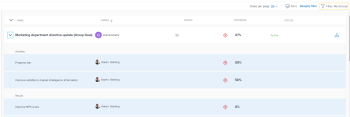

# Doelstellingen beheren in de lijst met doelstellingen van Adobe Workfront

<!-- printing or exporting goals is no longer possible, but see if they add it later-->

Nadat u of andere gebruikers doelen hebben gemaakt, kunt u hun voortgang en informatie in de lijst met doelen bekijken. Voor informatie over het creëren van doelstellingen, zie [ doelstellingen in de Doelen van Adobe Workfront ](../../workfront-goals/goal-management/create-goals.md) creëren.

## Toegangsvereisten

U moet de volgende toegang hebben om de handelingen uit te voeren die in dit artikel worden beschreven:

<table style="table-layout:auto">
<col>
</col>
<col>
</col>
<tbody>
 <tr> 
   <td role="rowheader">Adobe Workfront-abonnement*</td> 
   <td> 
   
Voor het nieuwe plan en de nieuwe licentiestructuur:
  <ul><li>Een Ultimate-abonnement </li></ul>
   

Voor het huidige plan en de licentiestructuur: 
<ul><li> Een Pro of hoger </li>
  <li>Een Adobe Workfront Goals-licentie in aanvulling op een Workfront-licentie.</li></ul>

   </td> 
  </tr>
 <tr>
 <td role="rowheader">Adobe Workfront-licentie*</td>
 <td>
 
Nieuwe licentie: Medewerker of hoger

 of
 
Huidige licentie: aanvragen of hoger
 
Voor meer informatie, zie <a href="../../administration-and-setup/add-users/access-levels-and-object-permissions/wf-licenses.md" class="MCXref xref"> het vergunningsoverzicht van Adobe Workfront </a>.
 </td>
 </tr>
 <tr>
 <td role="rowheader">Product*</td>
 <td>
 
 Nieuwe productbehoefte, één van het volgende: 

<ul>
<li>Een Select- of Prime Adobe Workfront-abonnement en een extra Adobe Workfront Goals-licentie.</li>
<li>Een Ultimate Workfront-plan dat standaard Workfront Goals bevat. </li></ul>
 
of

 
Huidige productvereiste: een Workfront-plan en een extra licentie voor Adobe Workfront Goals. 
 
Voor informatie, zie <a href="../../workfront-goals/goal-management/access-needed-for-wf-goals.md" class="MCXref xref"> Vereisten om de Doelen van Workfront </a> te gebruiken. 
 </td>
 </tr>
 <tr>
 <td role="rowheader">Toegangsniveau</td>
 <td> 
Toegang tot doelen bewerken
  </td>
 </tr>
 <tr data-mc-conditions="">
 <td role="rowheader">Objectmachtigingen</td>
 <td>
  

  
De toestemmingen van de mening of hoger aan het doel om het te bekijken

  
Machtigingen beheren om het te bewerken

  
Voor informatie over het delen van doelstellingen, zie <a href="../../workfront-goals/workfront-goals-settings/share-a-goal.md" class="MCXref xref"> een doel in de Doelen van Workfront delen </a>. 

  
 </td>
 </tr>
 <tr>
   <td role="rowheader">
Lay-outsjabloon
</td>
   <td> 
Aan alle gebruikers, inclusief Workfront-beheerders, moet een lay-outsjabloon worden toegewezen die het gebied Doelen in het hoofdmenu bevat. 
  
</td>
  </tr>
</tbody>
</table>

*Voor meer informatie, zie [ vereisten van de Toegang in de documentatie van Workfront ](/help/quicksilver/administration-and-setup/add-users/access-levels-and-object-permissions/access-level-requirements-in-documentation.md).

## Doelstellingen beheren in de lijst met doelen

U kunt doelstellingen in de volgende secties van de Doelen van Workfront bekijken en beheren:

* Lijst met doelen
* Goal Alignment

In elke sectie worden doelen in iets verschillende indelingen weergegeven. Welke sectie u gebruikt hangt van het doel af u wilt bereiken aangezien u met doelstellingen werkt.

Voor meer informatie, zie [ Overzicht van de secties van de Doelen van Adobe Workfront ](../../workfront-goals/goal-review-and-workfront-goals-sections/overview-of-wf-goals-sections.md).

Dit artikel beschrijft hoe te om doelstellingen in de Lijst van het Doel te herzien.

Overweeg het volgende wanneer het herzien van de Lijst van het Doel:

* U kunt doelstellingen bekijken die u of iedereen anders in uw organisatie in de Lijst van het Beleid wordt gecreeerd. U moet over beheerdersmachtigingen voor doelen beschikken om deze te kunnen bewerken.

<!--

### Manage the Goal List in the Production environment

1. Click the **Main Menu** icon  in the upper-right corner, then click **Goals**.

   (!-- Add this when Shell is available to all: or (if available), click the **Main Menu** icon  in the upper-left corner)
   --)

   The Goal List section displays by default. You can view goals regardless of their status, period, or owner, by default.

   The list of goals contains the following columns with information about each goal, result, or activity: 

   <table style="table-layout:auto"> 
    <col> 
    <col> 
    <tbody> 
     <tr> 
      <td role="rowheader"> 
       
 
        
Name 
 
       
 </td> 
      <td>The name of the goal, result, or activity.</td> 
     </tr> 
     <tr> 
      <td role="rowheader">Owner</td> 
      <td>The name of the goal, result, or activity owner. </td> 
     </tr> 
     <tr> 
      <td role="rowheader">Period</td> 
      <td>The time period for which the goal is scheduled.</td> 
     </tr> 
     <tr> 
      <td role="rowheader">Progress </td> 
      <td> 
The progress indicator for the goal includes the following:
 
       <ul> 
      <li> 
The progress label. 
 
For information, see <a href="../../workfront-goals/goal-management/calculate-goal-progress.md" class="MCXref xref">Overview of goal progress and condition in Adobe Workfront Goals</a>. 
 </li> 
      <li> 
The percent complete of the goal, activity, or result. 
 </li> 
       </ul> </td> 
     </tr> 
     <tr> 
      <td role="rowheader"> 
Status (includes alignment icon)
 
  
 </td> 
      <td> 
The status of the goal which can be one of the following:
 
       <ul> 
        <li>Active</li> 
        <li>Draft</li> 
        <li>Inactive</li> 
        <li>Closed</li> 
       </ul> 
For information about goal status, see <a href="../../workfront-goals/goal-management/goal-status-overview.md" class="MCXref xref">Goal status overview in Adobe Workfront Goals</a>. 
 
The alignment icon appears on goals that are aligned to other goals. For information about aligning goals, see <a href="../../workfront-goals/goal-alignment/align-goals-by-connecting-them.md" class="MCXref xref">Align goals by connecting them in Adobe Workfront Goals</a>.
 </td> 
     </tr> 
    </tbody> 
   </table>

1. Use the filters in the upper-right corner of the goal list to select only goals that are important to you. For information about using filters in Workfront Goals, see [Filter information in Adobe Workfront Goals](../../workfront-goals/goal-management/filter-information-wf-goals.md)
1. Click any of the fields in the column headers to sort it by that field.

   An arrow displays to the right of the field by which the list is sorted.

   

1. (Optional) Click the field in the column again to sort the same column in a descending order. 
1. Click the right-pointing arrow to the left of the goal name to expand a goal

   Or

   Click the right-pointing arrow  in the header of the list to expand all the goals in the list and view additional information about each goal, including any of the following:

   * Results names, owners, and progress

     For information about results, see [Add results to goals in Adobe Workfront Goals](../../workfront-goals/results-and-activities/add-results-to-goals.md).
   
   * Activity names, owners, and progress

     For information about activities, see [Add activities to goals in Adobe Workfront Goals](../../workfront-goals/results-and-activities/add-activities-to-goals.md).

1. Click the name of a goal to open the **Goal Details** panel on the right and review more information about the goal as well as manage it. For information about reviewing individual goals, see [Update goals in the Goal details section in Adobe Workfront Goals](../../workfront-goals/goal-management/update-goals-in-goal-details-panel.md).
1. (Optional) Expand the **Goals per page** drop-down menu and select from the following options to display additional goals:

   * 20  
      
      This is the default selection. 
   * 50
   * 100

1. Click **Print** to export a list of goals, results, and activities to a .pdf file.

   >[!TIP]
   >
   >* When printing a list of goals, the file produced contains only the information displayed on the screen. Items eliminated by filtering a list of goals do not display in the .pdf file.
   >* When you do not expand the goals in the list before printing the list, the .pdf file displays only goals without their results and activities.

   For more information, see [Print the Goal List in Adobe Workfront Goals](../../workfront-goals/goal-management/print-the-goal-list.md). 

1. Click the **Alignment icon**  next to an aligned to open the goal's card in the Goal Alignment section. For more information, see [Navigate the Goal Alignment section in Adobe Workfront Goals](../../workfront-goals/goal-alignment/navigate-goal-alignment-chart.md).
-->

Om doelstellingen in de Lijst van het Doel te beheren:

1. Klik het **pictogram van het 1} pictogram van het Belangrijkste Menu  in de hoger-juiste hoek, dan klik** Doelen **.**

   <!-- Add this when Shell is available to all: or (if available), click the **Main Menu** icon  in the upper-left corner)
   -->

   De sectie Lijst met doelen wordt standaard weergegeven. U kunt doelstellingen ongeacht hun status, periode, of eigenaar, door gebrek bekijken.

   De lijst van doelstellingen bevat de volgende gebieden met informatie over elk doel:

   * **Naam**: De naam van het doel.
   * **Eigenaar**: De naam van de doeleigenaar.
   * **Periode**: De tijdspanne waarvoor het doel gepland is.
   * **Status**: De status van het doel kan één van het volgende zijn:
      * Actief
      * Concept
      * Inactief
      * Gesloten

     Voor informatie over doelstatus, zie [ overzicht van de Goal status in de Doelen van Adobe Workfront ](../goal-management/goal-status-overview.md).

     Het uitlijningspictogram wordt weergegeven bij doelen die zijn uitgelijnd op andere doelen. Voor informatie over het richten van doelstellingen, zie [ doelstellingen door hen in de Doelen van Adobe Workfront ](../goal-alignment/align-goals-by-connecting-them.md) te verbinden.

   * **Voorwaarde**: Een visuele vertegenwoordiging van hoe het doel binnen de tijdspanne vooruit gaat die voor het te voltooien doel wordt toegewezen.

     De voorwaarde van een doel zou één van het volgende kunnen zijn:

      * Nieuw
      * Op doel
      * Risico
      * In problemen

     Voor informatie over doelvoorwaarden, zie [ Overzicht van doelvooruitgang en voorwaarde in de Doelen van Adobe Workfront ](../goal-management/calculate-goal-progress.md).

   * **Voortgang**: De vooruitgangsindicator voor het doel als percentagewaarde. De kleur van de voortgangsindicator komt overeen met de kleur van de voorwaarde van het doel.

     Voor informatie, zie [ doelvooruitgang in de Doelen van Adobe Workfront berekenen ](../goal-management/calculate-goal-progress.md).

1. Klik het pictogram van de Filter van het filterpictogram  in de hoger-juiste hoek van de doellijst en pas filters op vertoningsslechts doelstellingen toe die voor u belangrijk zijn.

   Voor informatie over het gebruiken van filters in de Doelen van Workfront, zie [ informatie van de Filter in de Doelen van Adobe Workfront ](../goal-management/filter-information-wf-goals.md).

1. Klik op een van de velden in de kolomkoppen om de lijst op dat veld te sorteren.
Een pijl wordt rechts van het veld weergegeven waarmee de lijst wordt gesorteerd.

1. (Optioneel) Klik nogmaals op het veld in de kolom om dezelfde kolom in aflopende volgorde te sorteren.
1. Klik op de naam van een doel om de doelpagina te openen.
1. Selecteer een doel in de lijst en klik op een van de volgende opties boven aan de lijst:
   * **geeft** pictogram  uit om informatie over het doel uit te geven. Voor informatie, zie [ doelstellingen in de Doelen van Adobe Workfront ](../goal-management/edit-goals.md) uitgeven.
   * **pictogram van het Aandeel  het pictogram van het 1} Aandeel {om het doel met andere mensen te delen.** Voor informatie, zie [ een doel in de Doelen van Adobe Workfront delen ](../workfront-goals-settings/share-a-goal.md).
   * **Open groepering** pictogram  om het gebied van de Groepering van het Doel te openen. Deze optie wordt alleen weergegeven wanneer het doel dat u selecteert, wordt uitgelijnd op een ander doel.
   * **pictogram van de Schrapping  om het doel te schrappen, dan** Schrapping **te klikken om te bevestigen.**  Voor informatie, zie [ Schrapping en deactiveer doelstellingen in de Doelen van Adobe Workfront ](../goal-management/delete-and-deactivate-goals.md).

