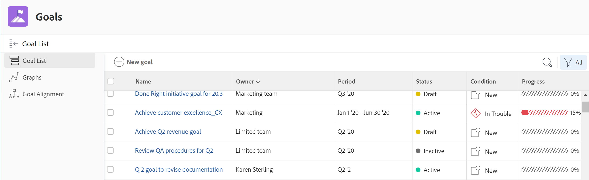

# Overzicht van de secties Adobe Workfront Goals

>[!IMPORTANT]
>
>Uw organisatie moet het volgende hebben om de functionaliteit te gebruiken die in dit artikel wordt beschreven:
>
>* Voor het nieuwe plan en de nieuwe licentiestructuur:
>
>   * Het Ultimate Workfront-plan
>    
>* Voor het huidige plan en de licentiestructuur:
>
>   * Een Pro- of hoger Workfront-abonnement
>   * Een Adobe Workfront Goals-licentie in aanvulling op een Workfront-licentie.
>
>Neem contact op met uw Workfront-accountmanager voor meer informatie over een Workfront Goals-licentie.
> 
>Voor extra informatie over toegang tot de Doelen van Workfront, zie [ Vereisten om de Doelen van Workfront ](/help/quicksilver/workfront-goals/goal-management/access-needed-for-wf-goals.md) te gebruiken.

Nadat uw beheerder van Workfront u toegang tot de Doelen van Workfront heeft verleend, kunt u doelstellingen bekijken die u of iedereen in uw organisatie in het gebied van de Doelstellingen van Workfront wordt gecreeerd.

U hebt toegang tot lijsten met doelen of individuele doelen en kunt deze beheren vanuit verschillende secties van Workfront Goals. Welke sectie u gebruikt hangt van het doel af u wilt bereiken aangezien u met doelstellingen werkt.

U kunt filters toepassen om alleen de doelen weer te geven die voor u in elke sectie van belang zijn.

>[!TIP]
>
>Filters die in één sectie worden bijgewerkt, worden automatisch toegepast op de secties Goal List, Graphs en Goal Alignment. Op deze manier kunt u ze maar één keer bijwerken. Voor meer informatie, zie [ informatie van de Filter in de Doelen van Adobe Workfront ](../../workfront-goals/goal-management/filter-information-wf-goals.md).

Hieronder volgt een kort overzicht van de gedeelten van Workfront Goals en de opties die beschikbaar zijn voor het beheer van doelen. Voor meer informatie over extra acties die u binnen elke sectie van de Doelen van Workfront kunt uitvoeren, adviseren wij ook de volgende artikelen:

* [ creeer doelstellingen in de Doelen van Adobe Workfront ](../../workfront-goals/goal-management/create-goals.md)
* [ het doel van de Update vooruitgang in de Doelen van Adobe Workfront ](../../workfront-goals/goal-review-and-workfront-goals-sections/check-in-goals.md)
* [ informatie van de Filter in de Doelen van Adobe Workfront ](../../workfront-goals/goal-management/filter-information-wf-goals.md)

## Lijst met doelen

U kunt de Lijst van het Doel gebruiken om doelstellingen te herzien die tot u, uw teams, groepen, of uw organisatie behoren. U kunt doelstellingen in om het even welke status en van om het even welke tijdspanne bekijken.

Voor informatie over het navigeren van de Lijst van het Doel en het beheren van doelstellingen, zie [ doelstellingen in de Lijst van het Doel van de Doelen van Adobe Workfront ](../../workfront-goals/goal-review-and-workfront-goals-sections/manage-goals-in-goal-list.md) leiden.

Gebruik de Lijst met doelen voor het volgende:

* De doelstellingen van de mening die tot u, uw teams, groepen, of organisatie behoren.
* De doelstellingen van het overzicht en hun informatie (bijvoorbeeld, naam, eigenaar, vooruitgang, of voorwaarde).
* Voeg nieuwe doelen toe.

  Voor meer informatie, zie [ doelstellingen in de Doelen van Adobe Workfront ](../../workfront-goals/goal-management/create-goals.md) creëren.

* Open de pagina van een doel en bewerk en werk het doel, de resultaten of de activiteiten ervan bij

  Voor meer informatie, zie [ doelstellingen in de Doelen van Adobe Workfront ](../../workfront-goals/goal-management/edit-goals.md) uitgeven.

* Doelen bewerken.

## Grafieken

U kunt de sectie van Grafieken gebruiken om een holistische mening van de gezondheid van doelstellingen te bereiken die tot u of tot uw organisatie behoren. U kunt de voortgangsinformatie van doelstellingen in om het even welke status van om het even welke tijdspanne in deze sectie bekijken.

Voor informatie over het gebruiken van de sectie van Grafieken, zie [ grafieken van het Overzicht om de tendensen van de doelvooruitgang in de Doelen van Adobe Workfront ](../../workfront-goals/goal-review-and-workfront-goals-sections/review-goal-graphs.md) te begrijpen.

Gebruik de sectie Grafieken voor het volgende:

* Bekijk de prestaties van doelstellingen die tot u, uw teams, groepen, of organisatie behoren.
* Bekijk het aantal doelstellingen met een bepaalde vooruitgangsstatus.
* Begrijp hoe uw doelstellingen wekelijks presteren.

## Goal Alignment

Als uw doelstellingen aan elkaar worden gericht, kunt u de sectie van de Groepering van het Doel gebruiken om alle doelstellingen in uw organisatie en hun groepering aan elkaar te tonen en te herzien. Doelstellingen die hier worden uitgelijnd, worden weergegeven op verbonden kaarten om hun uitlijning met elkaar te illustreren. De doelstellingen van de ouder tonen eerst, en de kinddoelstellingen worden gestapeld achter hen. U kunt doelstellingen in om het even welke status en van om het even welke tijdspanne in deze sectie bekijken.

Voor informatie over het navigeren van de sectie van de Groepering van het Doel om doelstellingen te beheren, zie [ de sectie van de Groepering van het Doel in de Doelen van Adobe Workfront ](../../workfront-goals/goal-alignment/navigate-goal-alignment-chart.md) navigeren.

Raadpleeg de volgende artikelen voor informatie over het uitlijnen van doelen:

* [ richt doelstellingen door hen in de Doelen van Adobe Workfront te verbinden ](../../workfront-goals/goal-alignment/align-goals-by-connecting-them.md)
* [Richt doelstellingen door resultaten en activiteiten aan doelstellingen om te zetten](../../workfront-goals/goal-alignment/align-goals-by-converting-results-activities.md)

Gebruik het gedeelte Uitlijning doel voor het volgende:

* De doelstellingen van de mening die tot u of uw organisatie in een kaartformaat behoren.
* Geef de objecthiërarchie weer en bekijk uitgelijnde onderliggende doelen.
* Heb toegang tot de doelpagina en werk het doel, zijn resultaten, of activiteiten bij.

<!--
## Pulse

 The Pulse section has been removed from the Preview environment and will be removed from Workfront Goals with the 23.1 release. Use the Goal List area to review goals that you or your teams are responsible for. 

You can use the Pulse section to review and request updates to goals that might influence the progress of your goals. These could be your own goals, or goals that belong to your teams, groups, or your organization. You can view goals in any status and from any time period in this section.

>[!TIP]
>
>Only goals that have been checked in on at least once display in the Pulse section.

For information about reviewing goals using the Pulse section, see [Review goals in the Adobe Workfront Goals Pulse section](../../workfront-goals/goal-review-and-workfront-goals-sections/review-goals-in-pulse.md).

Use the Pulse section to do the following:

* View goals that belong to your teams, groups, or organization. 
* Review goal progress and updates, including aligned goals, their results, and activities. 
* Make or ask for updates to a goal by adding a comment. 
* Access the Goal Details panel and edit and update the goal, its results, or activities.
* Add new goals. 
* Check in on goals.

  >[!TIP]
  >
  >Clicking Check in opens the Check-in section in the left panel.

## Check-in

 The Check-in section has been removed from the Preview environment and will be removed from Workfront Goals with the 23.1 release. Use the Goal List area to review goals that you or your teams are responsible for.

You must have access to Edit Goals in your access level before you can access the Check- in section. For information about granting access to Goals, see  [Grant access to Adobe Workfront Goals](../../administration-and-setup/add-users/configure-and-grant-access/grant-access-goals.md).

You can use the Check-in section to update active goals and any results and activities that you are the owner of. You can primarily view only goals in an Active status in this section. Children goals aligned to active parents also display in the Check-in section, regardless of their status.

>[!IMPORTANT]
>
>* A goal displays in the Check-in section only if it is assigned to you or if it has a result or activity that is assigned to you. 
>* If a goal assigned to you is the child goal of a parent that is not assigned to you and your goal (the child goal) is closed, inactive, or a draft, the parent goal does not display in your Check-in section. 
>

For information about managing goals in the Goal List, see [Manage goals in the Goal List of Adobe Workfront Goals](../../workfront-goals/goal-review-and-workfront-goals-sections/manage-goals-in-goal-list.md).

Use the Check-in section to do the following:

* Review goal progress and updates, including aligned goals, their results, and activities. 
* Update the progress on the results and activities that are assigned to you. For information about updating goals by checking in on them, see [Update goal progress in Adobe Workfront Goals](../../workfront-goals/goal-review-and-workfront-goals-sections/check-in-goals.md).

  >[!IMPORTANT]
  >
  >You can check in only on the results and activities assigned to you in the Check-in section, and not those that are assigned to other entities.

* Add a comment to a goal, then click Post to make or ask for updates to a goal. 
* Access the Goal Details panel and edit and update the goal, its results, or activities.
* Add new goals.
-->
