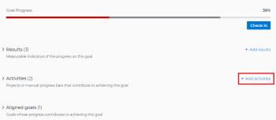

# Activiteiten toevoegen aan doelen in Adobe Workfront

<!--Audited for P&P only: 10/2025-->

Met activiteiten wordt de voortgang van een doel gemeten. Zonder resultaten, activiteiten, projecten, of gerichte doelstellingen te associëren, kunt u geen doel activeren en u kunt geen vooruitgang op het registreren.

## Toegangsvereisten

>[!NOTE]
>
>Uw bedrijf zou kunnen verkiezen om de Doelen van Adobe Workfront verder te gebruiken als zij dit pakket in het verleden kochten. U moet voor meer informatie contact opnemen met uw accountvertegenwoordiger.
>
>Adobe Workfront Goals kan niet meer worden aangeschaft.

+++ Breid uit om de toegangseisen voor de functionaliteit in dit artikel weer te geven. 

<table style="table-layout:auto">
<col>
</col>
<col>
</col>
<tbody>
 <tr>
  <td> 
Adobe Workfront-pakket
 </td> 
   <td> 
   
Adobe Workfront Ultimate

   </td> 
  </tr>
 <tr>
 <td role="rowheader">Adobe Workfront-licentie</td>
 <td>
 
Medewerker of hoger

Aanvraag of hoger
</td>
 </tr>
  <tr>
 <td role="rowheader">Configuratie op toegangsniveau</td>
 <td> 
Toegang tot doelen bewerken
 </td>
 </tr>
 <tr data-mc-conditions="">
 <td role="rowheader">Objectmachtigingen</td>
 <td>
  

  
De toestemmingen van de mening of hoger aan het doel om het te bekijken

  
Machtigingen beheren om het te bewerken

  
 </td>
 </tr>
<tr>
   <td role="rowheader">
Lay-outsjabloon
</td>
   <td> 
Aan alle gebruikers, inclusief Systeembeheerders, moet een lay-outsjabloon worden toegewezen die het gebied Doelen in het hoofdmenu bevat. 
  
</td>
  </tr>
</tbody>
</table>

Voor meer informatie, zie [&#x200B; vereisten van de Toegang in de documentatie van Workfront &#x200B;](/help/quicksilver/administration-and-setup/add-users/access-levels-and-object-permissions/access-level-requirements-in-documentation.md).

+++

<!--Old:
<table style="table-layout:auto">
<col>
</col>
<col>
</col>
<tbody>
 <tr> 
   <td role="rowheader">Adobe Workfront plan*</td> 
   <td> 
   
For the new plan and license structure:
  <ul><li>An Ultimate plan </li></ul>
   

For the current plan and license structure: 
<ul><li> A Pro or higher </li>
  <li>An Adobe Workfront Goals license in addition to a Workfront license.</li></ul>

   </td> 
  </tr>
 <tr>
 <td role="rowheader">Adobe Workfront license*</td>
 <td>
 
New license: Contributor or higher

 Or
 
Current license: Request or higher
 
For more information, see <a href="../../administration-and-setup/add-users/access-levels-and-object-permissions/wf-licenses.md" class="MCXref xref">Adobe Workfront licenses overview</a>.
 </td>
 </tr>
 <tr>
 <td role="rowheader">Product*</td>
 <td>
 
 New product requirement, one of the following: 

<ul>
<li>A Select or Prime Adobe Workfront plan and an additional Adobe Workfront Goals license.</li>
<li>An Ultimate Workfront plan which includes Workfront Goals by default. </li></ul>
 
Or

 
Current product requirement: A Workfront plan and an additional license for Adobe Workfront Goals. 
 
For information, see <a href="../../workfront-goals/goal-management/access-needed-for-wf-goals.md" class="MCXref xref">Requirements to use Workfront Goals</a>. 
 </td>
 </tr>
 <tr>
 <td role="rowheader">Access level*</td>
 <td> 
Edit access to Goals
 </td>
 </tr>
 <tr data-mc-conditions="">
 <td role="rowheader">Object permissions</td>
 <td>
  

  
View or higher permissions to the goal to view it

  
Manage permissions to the goal to edit it

  
For information about sharing goals, see <a href="../../workfront-goals/workfront-goals-settings/share-a-goal.md" class="MCXref xref">Share a goal in Workfront Goals</a>. 

  
 </td>
 </tr>
 <tr>
   <td role="rowheader">
Layout template
</td>
   <td> 
All users, including Workfront administrators,  must be assigned a layout template that includes the Goals area in the Main Menu. 
  
</td>
  </tr>
</tbody>
</table>-->

## Vereisten

U moet een bestaand doel hebben om er activiteiten aan toe te voegen.

Voor informatie over het creëren van doelstellingen, zie [&#x200B; doelstellingen in de Doelen van Adobe Workfront &#x200B;](../../workfront-goals/goal-management/create-goals.md) creëren.

>[!IMPORTANT]
>
>Een doel kan niet meer dan 1000 activiteiten, resultaten, of gerichte doelstellingen hebben.

Voor meer informatie over activiteiten, zie [&#x200B; begonnen worden met resultaten en activiteiten in de Doelen van Adobe Workfront &#x200B;](../../workfront-goals/results-and-activities/get-started-with-results-and-activities.md).

## Een activiteit toevoegen aan een doel

<!--
Adding activities to goals differs depending on which environment you use.

### Add an activity to a goal in the Production environment

1. Go to the goal for which you want to add an activity and click the name to open the **Goal Details** panel.
1. Click **Add activities**.

   

1. From the **Activity Type** drop-down menu, select the type of activity you want to associate with your goal. Select **Manual progress bar** or **Project**. Manual progress bar is the default selection. 
1. (Conditional) Depending on which activity type you selected, do the following:

   1. If you selected **Manual progress bar**:

      1. Start typing a name for your activity in the **Activity** field. 
      1. (Optional) If you want to set the activity owner as someone other than yourself, click your name in the **Owner** field and begin typing the name of the user that you want to assign as the activity owner, then click it when it appears in the drop-down list.

         >[!NOTE]
         >
         >You cannot assign a team or group as an activity owner.

         When you update the progress of an activity, the progress of the goal automatically updates.

   1. If you selected **Project**:

      1. Click the **Connect projects** field.

         Existing projects that you have access to View display in the Connect projects list. Projects that are in a status of Dead do not display in the list. 
      
      1. Click the name of a project to add it as an activity to the goal. You can select several projects at one time.

         Workfront uses the project percent complete of all the attached projects to calculate the progress of the goal.

         For more information about associating projects with goals, see [Add projects to goals in Adobe Workfront Goals](../../workfront-goals/results-and-activities/connect-projects-to-goals-overview.md).

         >[!TIP]
         >
         >   
         >   * The owner of the project becomes the owner of this activity. If the project has no owner, then the activity has no owner. 
         >   * You cannot manually update the progress of a project. Workfront calculates the progress of the project based on the project percent complete. When the project percent complete updates in Workfront this also updates the connected project in Workfront Goals including the percent complete of the goal. 
         >   
         >

1. Click **Save**.

   The activity is saved for the selected goal. After you activate the goal, the progress of the goal automatically updates when you update the progress of an activity or when the percent complete of a project updates. For information about activating a goal, see [Activate goals in Adobe Workfront Goals](../../workfront-goals/goal-management/activate-goals.md).

-->

1. Klik het **&#x200B;**&#x200B;Belangrijkste pictogram van het Menu , toen **Doelen**.
1. Klik in de lijst met doelen op de naam van een doel om de pagina met het doel te openen.
1. Klik **indicatoren van de Voortgang** in het linkerpaneel.
1. Van het Nieuwe drop-down menu van de vooruitgangsindicator, klik **creeer activiteit**.

   Het vak Nieuwe activiteit wordt geopend.

   

1. Typ een naam voor de activiteit in het veld Naam activiteit. Dit is een verplicht veld.
1. (Facultatief) verwijder uw naam uit het **bezit van de Activiteit** gebied als u de activiteit aan een andere gebruiker wilt toewijzen. Standaard bent u de eigenaar van een activiteit die u maakt.

   >[!NOTE]
   >
   >U kunt geen team, groep, of het bedrijf als activiteiteneigenaar toewijzen.

1. Klik **creeer activiteit** om het te bewaren en het aan het geselecteerde doel toe te voegen.

   De activiteit toont in de de indicatorensectie van de Voortgang van de doelpagina, onder de groepering van de Activiteit.

