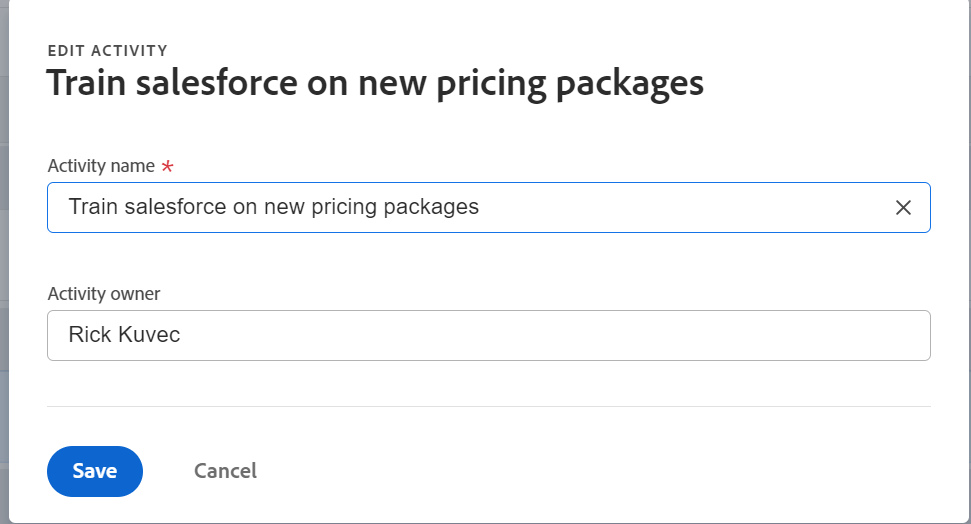

# Resultaten en activiteiten bewerken in Adobe Workfront Goals

Nadat uw Adobe Workfront-beheerder u de juiste toegang tot de doelstellingen van Adobe Workfront heeft verleend, kunt u doelstellingen, resultaten en activiteiten maken en bewerken.

Raadpleeg de volgende artikelen voor informatie over het maken van doelen, resultaten en activiteiten:

* [Doelen maken voor Adobe Workfront-doelen](../../workfront-goals/goal-management/create-goals.md)
* [Aan de slag met resultaten en activiteiten in Adobe Workfront Goals](../../workfront-goals/results-and-activities/get-started-with-results-and-activities.md)
* [Resultaten toevoegen aan doelen in Adobe Workfront-doelen](../../workfront-goals/results-and-activities/add-results-to-goals.md)
* [Activiteiten toevoegen aan doelen in Adobe Workfront](../../workfront-goals/results-and-activities/add-activities-to-goals.md)

## Toegangsvereisten

U moet het volgende hebben:

<table style="table-layout:auto">
<col>
</col>
<col>
</col>
<tbody>
 <tr>
 <td role="rowheader">Adobe Workfront-plan</td>
 <td>
 
Alle

</td>
 </tr>
 <tr>
 <td role="rowheader">Adobe Workfront-licentie*</td>
 <td>
 
Nieuwe licentie: Medewerker of hoger

 of
 
Huidige licentie: aanvragen of hoger
 
Zie voor meer informatie <a href="../../administration-and-setup/add-users/access-levels-and-object-permissions/wf-licenses.md" class="MCXref xref">Overzicht van Adobe Workfront-licenties</a>.
 </td>
 </tr>
 <tr>
 <td role="rowheader">Product*</td>
 <td>
 
 Nieuwe productbehoefte, één van het volgende: 

<ul>
<li>Een Select- of Prime Adobe Workfront-abonnement en een extra Adobe Workfront Goals-licentie.</li>
<li>Een Ultimate Workfront-plan dat standaard Workfront Goals bevat. </li></ul>
 
of

 
Huidige productvereiste: een Workfront-plan en een extra licentie voor Adobe Workfront Goals. 
 
Zie voor meer informatie <a href="../../workfront-goals/goal-management/access-needed-for-wf-goals.md" class="MCXref xref">Vereisten voor het gebruik van Workfront-doelen</a>. 
 </td>
 </tr>
 <tr>
 <td role="rowheader">
Toegangsniveau
</td>
 <td> 
Toegang tot doelen bewerken
 </td>
 </tr>
 <tr data-mc-conditions="">
 <td role="rowheader">Objectmachtigingen</td>
 <td>
  

  
De toestemmingen van de mening of hoger aan het doel om het te bekijken

  
Machtigingen beheren om het te bewerken

  
Voor informatie over het delen van doelstellingen, zie <a href="../../workfront-goals/workfront-goals-settings/share-a-goal.md" class="MCXref xref">Een doel delen in Workfront-doelen</a>. 

  
 </td>
 </tr>
 <tr>
   <td role="rowheader">
Lay-outsjabloon
</td>
   <td> 
Aan alle gebruikers, inclusief Workfront-beheerders, moet een lay-outsjabloon worden toegewezen die het gebied Doelen in het hoofdmenu bevat. 
  
</td>
  </tr>
</tbody>
</table>

*Zie voor meer informatie [Toegangsvereisten in Workfront-documentatie](/help/quicksilver/administration-and-setup/add-users/access-levels-and-object-permissions/access-level-requirements-in-documentation.md).

## Overwegingen bij het bewerken van resultaten en activiteiten

<!--
According to Vazgen, access levels will add more considerations.)
-->

* U kunt resultaten en activiteiten uitgeven die tot doelstellingen behoren u creeerde of aan doelstellingen die u toestemmingen hebt te leiden.
* U kunt de vooruitgang van projecten die met doelstellingen worden verbonden niet als activiteiten van de Doelen van Workfront uitgeven. De voortgang van projecten wordt bijgewerkt wanneer de taken in het project zijn voltooid. U kunt projecten uit het doel verwijderen door hen los te maken. Voor meer informatie, zie de &quot;losmaakt projecten&quot;sectie in het artikel [Resultaten, activiteiten en projecten verwijderen uit doelen in Adobe Workfront Goals](../../workfront-goals/results-and-activities/remove-results-activities-from-goals.md).

  >[!NOTE]
  >
  >Als de volgende projectinformatie op het projectniveau bijwerkt, werkt de Doelen van Workfront het op het doelniveau automatisch bij:
  >
  >   
  >   
  >   * Projecteigenaar
  >   * Projectnaam
  >   * Projectpercentage voltooid
  >   
  >   
  >Voor informatie over het verbinden van projecten met doelstellingen, zie [Projecten toevoegen aan doelen in Adobe Workfront-doelen](../../workfront-goals/results-and-activities/connect-projects-to-goals-overview.md).

* U kunt resultaten en activiteiten van doelstellingen schrappen wanneer zij niet meer relevant voor de doelvooruitgang zijn. Verwijderde resultaten en activiteiten kunnen niet worden hersteld. Voor informatie over het verwijderen van resultaten en activiteiten raadpleegt u [Resultaten, activiteiten en projecten verwijderen uit doelen in Adobe Workfront Goals](../../workfront-goals/results-and-activities/remove-results-activities-from-goals.md).
* U kunt resultaten en activiteiten verbonden aan doelstellingen van om het even welke tijdspanne, met inbegrip van in het verleden uitgeven.
* Als u resultaten en activiteiten bewerkt, worden de instellingen bijgewerkt en wordt de voortgang van de bewerkingen niet bijgewerkt. U moet de voortgang van resultaten en activiteiten bijwerken. Voor informatie over het bijwerken van vooruitgang bij doelstellingen, resultaten, en activiteiten, zie [Voortgang van Adobe Workfront-doelen bijwerken](../../workfront-goals/goal-review-and-workfront-goals-sections/check-in-goals.md).

## Resultaten bewerken

<!--
Editing results differs depending on which environment you use.

### Edit results in the Production environment

1. Go to the goal for which you want to edit a result and click the goal name to open the **Goal Details** panel.
1. Click **Results**.
1. Click the **gear icon**  to the right of the result you want to edit.

   

1. Click **Edit** to edit the following information:

   | Field |Description|
   |---|---|
   | Name |The name of the result. |
   | Owner |The owner of result.  |
   | Value |How you measure the progress of the result. |
   | Initial |The original value of the result. |
   | Target |The desired value when the result is completed. |

1. Click **Save**.
-->

1. Klik op de knop **Hoofdmenu** vervolgens **Doelen**.
1. Klik in de lijst met doelen op de naam van een doel om de doelpagina te openen.
1. Klikken **Voortgangsindicatoren** in het linkerdeelvenster.
1. Selecteer een resultaat in de lijst Voortgangsindicatoren en klik op **Bewerken** pictogram .

   Het vak Resultaat bewerken wordt geopend.

   

1. Bewerk de volgende gegevens:
   * **Resulterende naam**: De naam van het resultaat. Gebruik een beschrijvende naam die aangeeft welk resultaat u moet behalen om het doel te bereiken.
   * **Resultaateigenaar**: De eigenaar van het resultaat. De eigenaar moet een actieve Workfront-gebruiker zijn.
   * **Type waarde**: Hoe u de voortgang van het resultaat meet.
   * **Beginwaarde**: De oorspronkelijke waarde van het resultaat.
   * **Doelwaarde**: De gewenste waarde wanneer het resultaat is voltooid.
Zie voor meer informatie over resultaatvelden [Resultaten toevoegen aan doelen](../results-and-activities/add-results-to-goals.md).
1. Klikken **Opslaan**.

## Bewerkingen bewerken

<!--
Editing activities differs depending on which environment you use.

### Edit activities in the Production environment

>[!TIP]
>
>You cannot edit the Activity Type after you saved an activity on a goal.

1. Go to the goal for which you want to edit an activity and click the goal name to open the **Goal Details** panel.
1. Click **Activities**.
1. Click the **gear icon**  to the right of the activity you want to edit .

   

1. Click **Edit** to edit the following information:

   | Field |Description |
   |---|---|
   | Name |The name of the activity. |
   | Owner |The owner of activity.  |

1. Click **Save**.
-->

1. Klik op de knop **Hoofdmenu** vervolgens **Doelen**.
1. Klik in de lijst met doelen op de naam van een doel om de doelpagina te openen.
1. Klikken **Voortgangsindicatoren** in het linkerdeelvenster.
1. Selecteer een activiteit in de lijst Voortgangsindicatoren en klik op **Bewerken** pictogram .

   Het vak Activiteit bewerken wordt geopend.

   

1. Bewerk de volgende gegevens:
   * **Naam activiteit**: De naam van de activiteit. Gebruik een beschrijvende naam die illustreert welke activiteit u zou moeten uitvoeren om erop te wijzen dat het doel voltooit.
   * **Eigenaar activiteit:** De eigenaar van de activiteit. De eigenaar moet een actieve Workfront-gebruiker zijn.\
     Zie voor meer informatie over activiteitsvelden [Activiteiten toevoegen aan doelen](../results-and-activities/add-activities-to-goals.md).
1. Klikken **Opslaan**.

