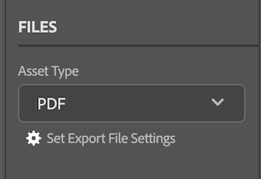

# Documenten uploaden vanuit [!DNL InDesign]

U kunt uw projecten uploaden als documenten voor een snelle revisie en goedkeuring of eenvoudig in [!DNL Adobe Workfront] op te slaan.

## Toegangsvereisten

+++ Breid uit om de toegangseisen voor de functionaliteit in dit artikel weer te geven.

U moet de volgende toegang hebben om de stappen in dit artikel uit te voeren:

<table style="table-layout:auto"> 
 <col> 
 <col> 
 <tbody> 
  <!-- <tr> 
   <td role="rowheader">[!DNL Adobe Workfront] plan*</td> 
   <td> 
[!UICONTROL Pro] or higher
 </td> 
  </tr> 
  <tr data-mc-conditions=""> 
   <td role="rowheader">[!DNL Adobe Workfront] license*</td> 
   <td> 
[!UICONTROL Work] or [!UICONTROL Plan]
 </td> 
  </tr> 
  <tr> -->
   <td role="rowheader">Product</td> 
   <td>U moet een [!DNL Adobe Creative Cloud] licentie hebben naast een [!DNL Workfront] licentie.</td> 
  </tr> 
  <tr> 
   <td role="rowheader">Configuraties op toegangsniveau*</td> 
   <td> 
Toegang bewerken tot [!UICONTROL Documents]
 
Opmerking: als u nog steeds geen toegang hebt, vraag dan aan de [!DNL Workfront] -beheerder of deze aanvullende beperkingen op uw toegangsniveau heeft ingesteld. Voor informatie over hoe een [!DNL Workfront] beheerder uw toegangsniveau kan wijzigen, zie <a href="../../administration-and-setup/add-users/configure-and-grant-access/create-modify-access-levels.md" class="MCXref xref"> tot douanetoegangsniveaus </a> leiden of wijzigen.
 </td> 
  </tr> 
  <tr> 
   <td role="rowheader">Objectmachtigingen</td> 
   <td> 
Bekijk de toegang tot of hoger voor het object waar u een document wilt uploaden.
 
Voor informatie bij het vragen van om extra toegang, zie <a href="../../workfront-basics/grant-and-request-access-to-objects/request-access.md" class="MCXref xref"> de toegang van het Verzoek tot voorwerpen </a>.
 </td> 
  </tr> 
 </tbody> 
</table>

&#42; om te weten te komen welk plan, vergunningstype, of toegang u hebt, contacteer uw [!DNL Workfront] beheerder.

+++

## Vereisten

* U moet de [!DNL Adobe Workfront for design and video] -insteekmodule installeren voordat u documenten kunt uploaden vanuit [!DNL InDesign] .

  Voor instructies, zie [ installeren  [!DNL Adobe Workfront for design and video]](/help/quicksilver/workfront-integrations-and-apps/adobe-workfront-for-creative-cloud/wf-install-cc.md).

## Documenten uploaden naar [!DNL InDesign]

1. Klik op het pictogram **[!UICONTROL Menu]** in de rechterbovenhoek en selecteer vervolgens **[!UICONTROL Work List]** . U kunt het menu ook gebruiken om naar bovenliggende objecten te navigeren.

   

1. Ga naar het werkitem waar u een document wilt uploaden.
1. Klik het **[!UICONTROL Document]** pictogram van het pictogram van het 1&rbrace; Document  in de navigatiebar.

1. Klik op **[!UICONTROL New File]** onder aan de plug-in.
1. (Optioneel) Typ een opmerking in het **[!UICONTROL Updates]** -gebied.
1. Kies de **[!UICONTROL Asset Type]** in de vervolgkeuzelijst.
1. Open het dialoogvenster **[!UICONTROL Set Export File Settings]** en configureer de gewenste exportopties op basis van het hierboven gekozen elementtype.

   
1. Klik op **[!UICONTROL Upload]** .
Het document wordt weergegeven in het gebied [!UICONTROL Documents] in de plug-in en de bureaubladtoepassing.
