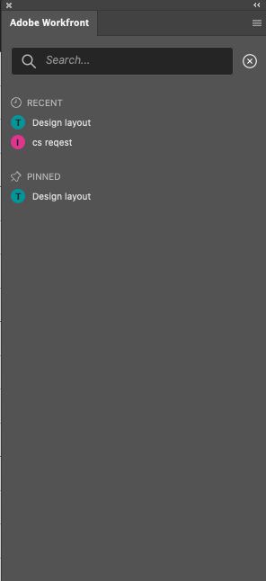

# Uw werk zoeken met de plug-in [!DNL Adobe Workfront]

Zoek het werk dat in [!DNL Adobe Workfront] aan u is toegewezen zonder de volgende [!DNL Adobe Creative Cloud] -toepassingen te verlaten:

{{cc-app-list}}

## Toegangsvereisten

+++ Breid uit om de toegangseisen voor de functionaliteit in dit artikel weer te geven.

U moet de volgende toegang hebben om de stappen in dit artikel uit te voeren:

<table style="table-layout:auto"> 
 <col> 
 <col> 
 <tbody> 
 <!-- <tr> 
   <td role="rowheader">[!DNL Adobe Workfront] plan*</td> 
   <td> 
[!UICONTROL Pro] or higher
 </td> 
  </tr> 
  <tr data-mc-conditions=""> 
   <td role="rowheader">[!DNL Adobe Workfront] license*</td> 
   <td> 
[!UICONTROL Work] or [!UICONTROL Plan]
 </td> 
  </tr> -->
  <tr> 
   <td role="rowheader">Product</td> 
   <td>U moet een [!DNL Adobe Creative Cloud] licentie hebben naast een [!DNL Workfront] licentie.</td> 
  </tr> 
 </tbody> 
</table>

&#42; om te weten te komen welk plan, vergunningstype, of toegang u hebt, contacteer uw [!DNL Workfront] beheerder.

+++

## Vereisten

{{cc-install-prereq}}

## Gebruik [!UICONTROL Work List] om toegang te krijgen tot belangrijke informatie

Met [!UICONTROL Work List] kunt u alle taken en uitgaven die aan u zijn toegewezen op één locatie weergeven. U kunt de optie [!UICONTROL Sort by] gebruiken om items te groeperen en vervolgens de optie [!UICONTROL Filter] gebruiken om de focus in te stellen op werk dat moet worden voltooid.

### Gelijksoortige werkitems groeperen met de optie [!DNL Sort By]

Gebruik de optie [!UICONTROL Sort by] om vergelijkbare items in de [!UICONTROL Work List] te groeperen. U kunt sorteren op:

<table style="table-layout:auto"> 
 <col> 
 <col> 
 <tbody> 
  <tr> 
   <td> 
    <ul> 
     <li>[!UICONTROL Due Date]</li> 
     <li>[!UICONTROL Name]</li> 
     <li>[!UICONTROL Project Name]</li> 
     <li>[!UICONTROL My Priority]</li> 
    </ul> </td> 
   <td>  </td> 
  </tr> 
 </tbody> 
</table>

### Verfijn uw focus met filters

Gebruik [!UICONTROL Filter] om uw focus te beperken tot specifieke werkitems. U kunt het filter op een aantal manieren gebruiken:

 

<table style="table-layout:auto"> 
 <col> 
 <col> 
 <tbody> 
  <tr> 
   <td> 
Het eerste filter is uitsluitend gebaseerd op het type of de kenmerken van het werkitem:
 
    <ul> 
     <li><strong> het punt van het Werk </strong>: Taken, Subtasks, Kwesties, of Persoonlijke taken</li> 
     <li><strong> de staat van het Punt van het Werk </strong>: [!UICONTROL Working On], [!UICONTROL Ready to Start], of [!UICONTROL Not Ready]</li> 
    </ul> 
Het tweede filter filtert het gebruiken van het werkpunt en de staat van het het werkpunt samen. U kunt bijvoorbeeld Taken en [!UICONTROL Ready to Start] selecteren om alle taken in uw werklijst te zoeken die klaar zijn voor gebruik.
 
U kunt [!UICONTROL Field Match] ook gebruiken om naar een specifiek punt binnen uw filterreeks te zoeken. 
 </td> 
   <td>  </td> 
  </tr> 
 </tbody> 
</table>

## Zoeken naar uw werk

Gebruik de balk [!UICONTROL Search] om projecten, taken, problemen en documenten te zoeken die u nodig hebt.

<table style="table-layout:auto"> 
 <col> 
 <col> 
 <tbody> 
  <tr> 
   <td> 
    <ul> 
     <li>Zie recente items: U kunt maximaal vijf van de meest recente werkitems weergeven die via de desktopversie of de plug-inversie van Workfront kunnen worden geopend.</li> 
     <li>Vastgezette items zoeken: u hebt toegang tot projecten, taken, problemen en documenten die u hebt vastgezet in de nieuwe Adobe Workfront-ervaring.</li> 
     <li>Vind uw favorieten: U kunt om het even welk project, taak, kwestie, of document zien u als favoriet bewaarde.</li> 
    </ul> </td> 
   <td>  </td> 
  </tr> 
 </tbody> 
</table>

## Gebruik [!UICONTROL Menu] om door projecten te navigeren

Met het pictogram [!UICONTROL Menu] kunt u naar bovenliggende items in een project navigeren.

