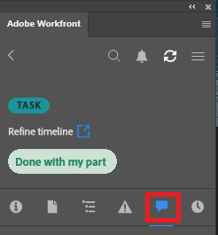

# Werk uw werk bij met de plug-in [!DNL Adobe Workfront]

U kunt uw werk bijwerken vanuit de volgende [!DNL Adobe Creative Cloud] -toepassingen:

{{cc-app-list}}

## Toegangsvereisten

+++ Breid uit om de toegangseisen voor de functionaliteit in dit artikel weer te geven.

<table style="table-layout:auto"> 
 <col> 
 </col> 
 <col> 
 </col> 
 <tbody> 
  <tr> 
   <!--<td role="rowheader">[!DNL Adobe Workfront] package</td> 
   <td>Any</td> 
  </tr> 
  <tr data-mc-conditions=""> 
   <td role="rowheader">[!DNL Adobe Workfront] license</td> 
   <td> 
   
Standard

   
Work or higher
 </td> 
  </tr> -->
  <tr> 
   <td role="rowheader">Aanvullende producten</td> 
   <td>U moet een [!DNL Adobe Creative Cloud] licentie hebben naast een [!DNL Workfront] licentie.</td> 
  </tr> 
  <tr> 
   <td role="rowheader">Objectmachtigingen</td> 
   <td> 
[!UICONTROL View] toegang tot het object dat u wilt bijwerken. 
</td> 
  </tr> 
 </tbody> 
</table>

Voor informatie, zie [ vereisten van de Toegang in de documentatie van Workfront ](/help/quicksilver/administration-and-setup/add-users/access-levels-and-object-permissions/access-level-requirements-in-documentation.md).

+++

## Vereisten

{{cc-install-prereq}}

## Een update verzenden

U kunt uw werk bijwerken vanuit een van de volgende gebieden in de plug-in:

<table style="table-layout:auto"> 
 <col> 
 <col> 
 <tbody> 
  <tr> 
   <td> 
    <ul> 
     <li>Projecten</li> 
     <li>Taken</li> 
     <li>Subtaken</li> 
    </ul> </td> 
   <td> 
    <ul> 
     <li>Problemen</li> 
     <li>Documenten</li> 
    </ul> </td> 
  </tr> 
 </tbody> 
</table>

Een update plaatsen:

1. Klik op het pictogram **[!UICONTROL Menu]** in de rechterbovenhoek en selecteer vervolgens **[!UICONTROL Work List]** . U kunt het menu ook gebruiken om naar bovenliggende objecten te navigeren.

   

1. Selecteer in het **[!UICONTROL Work List]** het werkitem waarnaar u een update wilt posten.
1. Klik op **[!UICONTROL Update]** in de navigatiebalk.\
   

1. Klik op **[!UICONTROL New Update]**.
1. Typ de update.
1. (Optioneel) Als u een gebruiker een tag wilt toewijzen, typt u het @-symbool en de naam van de gebruiker en kiest u vervolgens de naam van de gebruiker in het keuzemenu.
1. Klik op **[!UICONTROL Submit]**. Updates worden in real-time gesynchroniseerd met de Adobe Workfront-webtoepassing.
