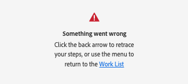

# Installeren en openen [!DNL Adobe Workfront for design and video]

U kunt [!DNL Adobe Workfront for design and video] installeren vanaf [!DNL Adobe Marketplace] . Deze plug-in ondersteunt de volgende Creative Cloud-toepassingen:

{{cc-plugin-app-list}}

[!DNL Adobe Workfront for design and video] ondersteunt de volgende talen:

* Engels
* Frans
* Duits
* Italiaans
* Spaans
* Japans
* Portugees
* Vereenvoudigd Chinees
* Traditioneel Chinees
* Koreaans

>[!NOTE]
>
>Er zijn aparte installatie-instructies voor [!DNL Photoshop] en [!DNL XD] . Voor meer informatie, zie [&#x200B; installeren  [!DNL Adobe Workfront for Photoshop]](/help/quicksilver/workfront-integrations-and-apps/adobe-workfront-for-creative-cloud/wf-cc-install-ps.md) en [&#x200B;  [!DNL Adobe Workfront for XD]](/help/quicksilver/workfront-integrations-and-apps/adobe-workfront-for-creative-cloud/wf-adobe-xd-install.md) installeren.

## Toegangsvereisten

+++ Breid uit om de toegangseisen voor de functionaliteit in dit artikel weer te geven.

<table style="table-layout:auto"> 
 <col> 
 </col> 
 <col> 
 </col> 
 <tbody> 
 <!-- <tr> 
   <td role="rowheader">[!DNL Adobe Workfront] package/td> 
   <td> 
Any
 </td> 
  </tr> 
  <tr data-mc-conditions=""> 
   <td role="rowheader">[!DNL Adobe Workfront] license*</td> 
   <td>
   
Standard

    
Work or higher
 </td> 
  </tr> -->
  <tr> 
   <td role="rowheader">Aanvullende producten</td> 
   <td>
U moet een [!DNL Adobe Creative Cloud] licentie hebben naast een [!DNL Workfront] licentie.
</td> 
  </tr> 
 </tbody> 
</table>

Voor informatie, zie [&#x200B; vereisten van de Toegang in de documentatie van Workfront &#x200B;](/help/quicksilver/administration-and-setup/add-users/access-levels-and-object-permissions/access-level-requirements-in-documentation.md).

+++

## Vereisten

* Installeer de [!DNL Creative Cloud] -app die u wilt gebruiken voordat u de Workfront-insteekmodule voor die app installeert.

## [!DNL Workfront for design and video] voor uw organisatie installeren

Als u een [!DNL Adobe Admin Console] beheerder bent, kunt u [!DNL Adobe Workfront for design and video] opnemen in [!DNL Creative Cloud] implementatiepakketten. Voor meer informatie, zie [&#x200B; Including steekmodules in uw pakket &#x200B;](https://helpx.adobe.com/in/enterprise/using/manage-extensions.html).

[&#x200B; Mening hier een videoleerprogramma &#x200B;](https://www.youtube.com/watch?v=zzvXNLIBzrc){target=_blank}.

[!DNL Adobe Admin Console] -beheerders kunnen ook pakketten met alleen plug-ins maken voor distributie naar gebruikers. Voor meer informatie, zie [&#x200B; [!UICONTROL [!DNL Adobe Workfront] creëren voor  [!DNL Creative Cloud]]  pakketten voor uw gebruikers in  [!DNL Adobe Admin Console]](/help/quicksilver/administration-and-setup/configure-integrations/create-plugin-only-packages.md)

## [!DNL Workfront for design and video] afzonderlijk installeren

U kunt [!DNL Adobe Workfront for design and video] voor uzelf installeren vanuit de map [!DNL Adobe Exchange] .

1. Ga naar [&#x200B; Adobe Workfront voor Ontwerp en Video installeert pagina &#x200B;](https://adobe.com/go/cc_plugins_discover_plugin?pluginId=108938&workflow=share) op Adobe Exchange.
1. In de dialoog die verschijnt, klik **Open [!DNL Adobe Creative Cloud] Desktop app**.
1. Klik op [!DNL Adobe Creative Cloud] als **[!UICONTROL Install]** Plug-inbeheer wordt geopend.
1. Lees de informatie in het dialoogvenster en klik op **[!UICONTROL OK]** .
1. Nadat [!DNL Workfront for design and video] is geïnstalleerd, opent u de [!DNL Creative Cloud] -app die u nodig hebt en zoekt u de [!DNL Workfront] -plug-in in het deelvenster met plug-ins.

1. Ga naar de volgende sectie voor informatie over het openen van [!DNL Workfront for design and video] .

## Openen [!DNL Adobe Workfront for design and video]

1. Open de Creative Cloud-insteekmodule die u wilt gebruiken.

1. Maak een nieuw project of open een bestaand project.

1. In het hoogste menu, klik **Vensters** > **Uitbreidingen** > **het Menu van Adobe Workfront**.

   >[!NOTE]
   >
   >Als u Premiere Pro gebruikt, moet u een project open hebben om tot dit menu toegang te hebben.

   

   >[!TIP]
   >
   >Als u [!DNL Adobe Workfront for design and video] niet ziet nadat u deze hebt geopend in het menu Extensies, bevindt deze zich mogelijk achter de Creative Cloud-toepassing. Probeer de toepassing te minimaliseren om de plug-in te vinden.

1. Ga naar de volgende sectie voor informatie over hoe u zich aanmeldt bij [!DNL Adobe Workfront for design and video] .

## Aanmelden bij [!DNL Adobe Workfront for design and video]

1. Selecteer **[!UICONTROL Plugins]** in het menu **[!UICONTROL Plugin Panel]** boven aan het scherm.
1. Selecteer **[!DNL Adobe Workfront for design and video]**.
1. Voer uw domein in en klik op **[!UICONTROL Log in]** . Er wordt een browserpagina geopend.

   >[!TIP]
   >
   >* Als u uw domein wilt zoeken, opent u een browser, navigeert u naar de instantie [!DNL Workfront] en kopieert u het eerste deel van de URL:
   >
   >
   >
   >* Als uw Workfront-instantie is geïntegreerd met Experience Cloud en het domein begint met `experience.adobe.com` , vraagt u uw beheerder om het Workfront-domein dat u kunt vinden onder Product > Workfront in de Admin Console.

1. Voer in de browser uw [!DNL Workfront] -gegevens in en klik op **[!UICONTROL Log in]** . Als uw bedrijf één enkel teken-op (SSO) gebruikt, zult u aan de pagina van uw leverancier worden geleid SSO om zich aan te melden.

   >[!NOTE]
   >
   >Mogelijk wordt u niet gevraagd om uw [!DNL Adobe] -referenties in te voeren als u zich onlangs hebt aangemeld.

1. Volg de aanwijzingen om u aan te melden bij [!DNL Workfront] .

   >[!NOTE]
   >
   >* [!DNL Workfront] maakt verbinding met [!DNL Adobe Creative Cloud] via OAuth 2.0, een veilige standaard die door de meeste webgebaseerde integraties wordt gebruikt voor de verificatie en autorisatie van gebruikers.

1. Klik op **[!UICONTROL Allow Access]** om het aanmelden te voltooien.
1. Ga terug naar [!DNL Adobe Photoshop] om uw werk te bekijken.

### Problemen met aanmeldfouten oplossen

**Er is iets fout gegaan en er wordt een fout weergegeven bij het aanmelden**

U kunt een URL die begint met `experience.adobe.com` niet gebruiken om u aan te melden bij de plug-in.

 

U kunt dit probleem als volgt oplossen:

1. Verwijder de map waarin het domein voor de plug-in is opgeslagen.

   >[!TIP]
   >
   >Op Mac, ga naar Vinder, druk **Command+Shift+G**, navigeer om  `~/Library/Application Support/Workfront`, dan schrap de **Workfront** omslag.

1. Ga terug naar de plug-in en voer uw Workfront-domein in. Het domein moet `company-name.my.workfront.com` zijn en niet `experience.adobe.com`.

   Om [&#x200B; uw domein van Workfront &#x200B;](/help/quicksilver/wf-api/tips-tricks-and-troubleshooting/locate-domain-for-api.md) te vinden als u op de Adobe Verenigde Ervaring bent, ga naar Opstelling, de info van de Klant.
