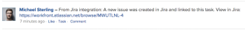
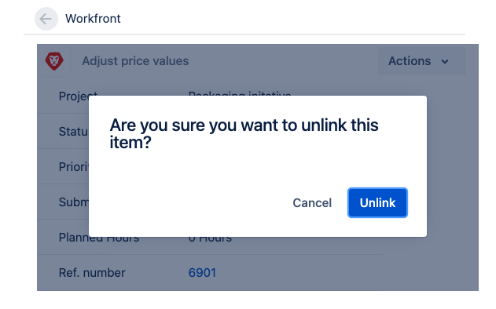

# Items koppelen tussen [!DNL Adobe Workfront] en [!DNL Jira]

U kunt een koppeling [!DNL Jira] problemen [!DNL Adobe Workfront] taken of geeft automatisch of handmatig uit.

Slechts één item in [!DNL Workfront] kan worden gekoppeld aan één item in [!DNL Jira]. U kunt er nooit een koppelen [!DNL Workfront] item naar meerdere [!DNL Jira] en één [!DNL Jira] uitgifte aan meerdere [!DNL Workfront] objecten.

## Toegangsvereisten

U moet het volgende hebben:

<table style="table-layout:auto"> 
 <col> 
 <col> 
 <tbody> 
  <tr> 
   <td role="rowheader"><a href="https://www.workfront.com/plans" target="_blank">[!DNL [!DNL Adobe Workfront] plan]</a>*</td> 
   <td> 
[!UICONTROL Pro] of hoger
 </td> 
  </tr> 
  <tr> 
   <td role="rowheader"><a href="../../administration-and-setup/add-users/access-levels-and-object-permissions/wf-licenses.md" class="MCXref xref">Adobe [!DNL Workfront] overzicht van licenties</a>*</td> 
   <td> 
Plan
 </td> 
  </tr> 
  <tr> 
   <td role="rowheader">Toegang tot Jira</td> 
   <td> 
Toegang tot systeembeheerder
 
<b>BELANGRIJK</b>

Wij adviseren u afzonderlijke rekeningen van de systeembeheerder in [!DNL Jira] en [!DNL Workfront] om aan deze integratie te wijden, eerder dan het gebruiken van bestaande degenen die aan gebruikers zouden kunnen worden vastgemaakt.
 </td>
</tr> 
  <tr> 
   <td role="rowheader">Configuraties op toegangsniveau*</td> 
   <td> 
U moet een [!DNL Workfront] beheerder. Voor informatie over [!DNL Workfront] beheerders, zie <a href="../../administration-and-setup/add-users/configure-and-grant-access/grant-a-user-full-administrative-access.md" class="MCXref xref">Volledige administratieve toegang verlenen aan een gebruiker</a>.
 
<b>OPMERKING</b>

Als u nog steeds geen toegang hebt, vraagt u [!DNL Workfront] beheerder als zij extra beperkingen in uw toegangsniveau plaatsen. Voor informatie over hoe een [!DNL Workfront] de beheerder kan uw toegangsniveau wijzigen, zie <a href="../../administration-and-setup/add-users/configure-and-grant-access/create-modify-access-levels.md" class="MCXref xref">Aangepaste toegangsniveaus maken of wijzigen</a>.
 </td>
</tr> 
 </tbody> 
</table>

&#42;Neem contact op met uw [!DNL Workfront] beheerder.

## Vereisten

Voordat u items kunt koppelen tussen [!DNL Workfront] en [!DNL Jira]moet u

* Installeren [!DNL Workfront] for [!DNL Jira]

   Voor instructies over het installeren van Workfront voor Jira raadpleegt u [Adobe Workfront voor Jira installeren](../../workfront-integrations-and-apps/use-workfront-with-jira/install-workfront-for-jira.md).

* Configureren [!DNL Workfront] voor Jira

   Voor instructies over het configureren van Workfront voor Jira raadpleegt u [Adobe Workfront voor Jira configureren](../../workfront-integrations-and-apps/use-workfront-with-jira/configure-workfront-for-jira.md).

## Automatisch koppelen [!DNL Workfront] objecten naar [!DNL Jira] kwesties

Als [!DNL Workfront] beheerder, kunt u trekkers bepalen die een kwestie automatisch kunnen tot stand brengen in [!DNL Jira] telkens wanneer aan bepaalde voorwaarden is voldaan voor een taak of een probleem in [!DNL Workfront]. De Workfront en [!DNL Jira] objecten worden gekoppeld.

Nadat u de configuratie van hebt voltooid [!DNL Workfront] voor Jira, wanneer een item wordt gemaakt of bijgewerkt in [!DNL Workfront] om aan uw triggers te voldoen, wordt automatisch een nieuw item gemaakt in [!DNL Jira].\
Workfront-gebruikers die Workfront-items maken en bijwerken, hebben geen [!DNL Jira] licentie voor het maken van objecten in [!DNL Jira].

Ga voor meer informatie over het automatisch definiëren van triggers voor het maken van Jira-problemen naar  [Configureren [!DNL Adobe Workfront] voor Jira](../../workfront-integrations-and-apps/use-workfront-with-jira/configure-workfront-for-jira.md).

>[!NOTE]
>
>U kunt [!DNL Jira] items automatisch door een sjabloon aan een project te koppelen. Als de sjabloon taken bevat met toewijzingen die voldoen aan de [!DNL Jira] triggers, de nieuwe taken genereren nieuwe [!DNL Jira] problemen.

Automatisch een koppeling tot stand brengen [!DNL Workfront] aan een [!DNL Jira] de kwestie is identiek aan automatisch het verbinden van [!DNL Workfront] taak aan [!DNL Jira] probleem.

Als u een [!DNL Workfront] taak aan [!DNL Jira] probleem:

1. Zorg ervoor dat uw [!DNL Jira] systeembeheerder heeft trekkers voor automatisch het creëren gevormd [!DNL Jira] problemen bij [!DNL Workfront] items worden toegewezen en aanmelden bij [!DNL Workfront] met een toegangsniveau dat u toestaat om een taak tot stand te brengen.

   Voor meer informatie over toegang tot taken raadpleegt u [Toegang verlenen tot taken](../../administration-and-setup/add-users/configure-and-grant-access/grant-access-tasks.md).

1. Ga naar een project en selecteer **[!UICONTROL Tasks]**  in het linkerdeelvenster.

1. Klik op **[!UICONTROL New Task]**

   of

   Selecteer een bestaande taak en klik op **Bewerken**.

1. Geef de velden op die beschikbaar zijn voor de taak of werk deze bij.
1. Klikken **[!UICONTROL Assignments]** en wijs de taak aan een gebruiker, een rol, of een team toe dat als trekker in wordt gespecificeerd [!DNL Jira] integratie.

1. Klikken **Wijzigingen opslaan**.

   In Workfront wordt een nieuwe taak gemaakt.

   In de **[!UICONTROL Updates]** op het gebied van de nieuwe taak wordt aangegeven dat er ook een nieuwe uitgave is gemaakt in [!DNL Jira].

   

1. (Optioneel) Klik op de koppeling naar de Jira-kwestie om deze in Jira te openen.

   of

   Klik op de knop **[!UICONTROL Go to Jira]** in de **[!UICONTROL Integrations]** gebied van de **[!UICONTROL Details]** sectie of de taak of uitgiftekoptekst om de [!DNL Jira] probleem.

   Uw systeem- of groepsbeheerder moet de [!UICONTROL Integrations] aan uw lay-outmalplaatje om het in de taak of uitgiftekopbal te tonen. Zie voor meer informatie [Objectkoppen aanpassen met een lay-outsjabloon](../../administration-and-setup/customize-workfront/use-layout-templates/customize-object-headers.md).

   Alle [!DNL Jira] gebruiker kan direct beginnen te werken aan automatisch gemaakte objecten van [!DNL Workfront] en de updates ervan worden [!DNL Workfront] zonder dat een vergunning nodig is voor [!DNL Workfront] om dit te doen.

   Alleen de velden die u als [!DNL Workfront] beheerder die tijdens de opstelling van wordt gevormd [!DNL Workfront] invoegtoepassing wordt bijgewerkt.

   Voor meer informatie over het synchroniseren van velden tussen Workfront en Jira raadpleegt u de [Workfront voor Jira configureren](../../workfront-integrations-and-apps/use-workfront-with-jira/configure-workfront-for-jira.md#configuring-the-add-on-for-jira) sectie in  [Adobe Workfront voor Jira configureren](../../workfront-integrations-and-apps/use-workfront-with-jira/configure-workfront-for-jira.md).

   >[!NOTE]
   >
   >De [!DNL Jira] de kwestie wordt niet toegewezen aan iedereen in [!DNL Jira] als deze automatisch wordt gemaakt vanuit Workfront.

## Handmatig koppelen [!DNL Jira] problemen [!DNL Workfront] items

Nadat items zijn gemaakt in [!DNL Jira] en [!DNL Workfront]kunt u handmatig [!DNL Jira] afgifte aan een bestaand [!DNL Workfront] taak of probleem.\
U kunt een koppeling [!DNL Workfront] item van [!DNL Workfront] bestaande [!DNL Jira] item.

>[!NOTE]
>
>Als de [!DNL Jira] de kwestie heeft geen betrekking op een project dat niet als een trigger in het [!DNL Workfront] Integratie u kunt het niet manueel met een punt van Workfront verbinden wanneer het gebruiken van de integratie met [!DNL Jira] Op locatie.\
>Ga voor meer informatie over het instellen van triggers voor de workflow tussen Workfront en Jira naar [Workfront-items automatisch koppelen aan Jira-problemen](#automatically-link-workfront-items-to-jira-issues).

Wanneer [!DNL Workfront] en [!DNL Jira] items zijn gekoppeld, bepaalde velden van het ene item kunnen automatisch worden bijgewerkt van het andere item.\
Zie voor meer informatie over het bijwerken van gekoppelde items [Gekoppelde items tussen Jira en Adobe Workfront bijwerken](../../workfront-integrations-and-apps/use-workfront-with-jira/update-linked-items-between-jira-wf.md).

Handmatig koppelen [!DNL Jira] problemen [!DNL Workfront] objecten:

1. (Voorwaardelijk) Aanmelden bij [!DNL Workfront] en zoeken naar een probleem of een taak waarnaar u een koppeling wilt maken [!DNL Jira] probleem.
1. (Voorwaardelijk) Kopieer de adresbalk van het item **URL** van het object in Workfront.

   of

   Van de [!UICONTROL Details] gebied , kopieert u de **[!UICONTROL Reference Number]** van het object in Workfront.

   >[!NOTE]
   >
   >U moet beschikken over een [!DNL Workfront] licentie voor aanmelden bij [!DNL Workfront]. Anders [!DNL Workfront] Deze gegevens moeten u worden verstrekt.

1. In [!DNL Jira]navigeer naar een probleem dat u handmatig wilt koppelen aan de [!DNL Workfront] item.
1. In de [!DNL Workfront] in het rechterdeelvenster, plakt u de **URL** of de **[!UICONTROL Reference Number]** van de [!DNL Workfront] item dat u eraan wilt koppelen.\
   

1. Klik op **[!UICONTROL Link]**.

   De twee items worden gekoppeld en de [!DNL Workfront] in het rechterdeelvenster wordt informatie uit het [!DNL Workfront] item.

   Het volgende [!DNL Workfront] velden zijn zichtbaar in [!DNL Jira], standaard in de [!DNL Workfront] deelvenster rechts:

   * De **[!UICONTROL Name]** van het item: U hebt toegang tot de [!DNL Workfront] door in het deelvenster op de naam te klikken.
   * **[!UICONTROL Project Name]**
   * De **[!UICONTROL Status]** van het item
   * De **[!UICONTROL Priority]** van het item
   * De datum waarop deze werd gecreëerd in [!DNL Workfront]
   * De **[!UICONTROL Planned Hours]** van het item
   * De **[!UICONTROL Reference Number]**: U hebt toegang tot de [!DNL Workfront] item door op het [!UICONTROL Reference Number] in het deelvenster.

Zie voor meer informatie over het inschakelen van extra velden voor weergave in het rechterdeelvenster [Veldsynchronisatie configureren tussen [!DNL Jira] en [!DNL Workfront] Items](../../workfront-integrations-and-apps/use-workfront-with-jira/configure-workfront-for-jira.md#setting-up-field-synchronization) sectie in [Configureren [!DNL Adobe Workfront for Jira]](../../workfront-integrations-and-apps/use-workfront-with-jira/configure-workfront-for-jira.md). Een opmerking van de [!DNL Workfront] de beheerder die aan de integratie is gekoppeld, wordt gepost in het dialoogvenster **[!DNL Workfront]** tabblad van het dialoogvenster [!DNL Jira] een nieuwe [!DNL Jira] item is gemaakt. De opmerking bevat een koppeling naar de [!DNL Jira] probleem.

## Items ontkoppelen tussen [!DNL Jira] en [!DNL Workfront]

Gekoppelde items tussen [!DNL Jira] en [!DNL Workfront] kan handmatig worden ontkoppeld van [!DNL Jira].\
U kunt een [!DNL Workfront] object van hun [!DNL Jira] tegenhanger [!DNL Workfront].

U hebt de volgende toegang nodig om handmatig gekoppeld item te ontkoppelen:

* U bent de gebruiker die de items handmatig heeft gekoppeld
* U bent de [!DNL Jira] systeembeheerder

Alleen een [!DNL Workfront] de beheerder kan punten ontkoppelen die automatisch werden verbonden.

Een koppeling verbreken [!DNL Jira] afgifte door een [!DNL Workfront] item:

1. In [!DNL Jira]navigeer naar een probleem dat is gekoppeld aan een [!DNL Workfront] taak of probleem.
1. Ga naar de [!DNL Workfront] en klikt u op de knop **[!UICONTROL Unlink]** pictogram, klik vervolgens op **[!UICONTROL Unlink]**.\
   \
   De eerder gekoppelde [!DNL Jira] en [!DNL Workfront] objecten zijn nu ontkoppeld. Alle velden, opmerkingen of documenten die in de toekomst afzonderlijk op de velden kunnen worden bijgewerkt, worden niet bijgewerkt op de vorige versie in de andere toepassing.
