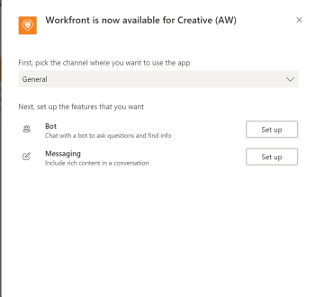

# Installeren [!DNL Adobe Workfront] voor Microsoft Teams

De [!DNL Adobe Workfront for Microsoft Teams] kunt u basishandelingen uitvoeren in [!DNL Workfront] zonder uw [!DNL Microsoft Teams] chatkanalen.

>[!NOTE]
>
>[!DNL Microsoft Teams] niet langer [!DNL Internet Explorer]. Als u de opdracht [!DNL Adobe Workfront for Microsoft Teams integration]moet u een andere webbrowser gebruiken dan [!DNL Internet Explorer].

## Toegangsvereisten

U moet de volgende toegang hebben om de stappen in dit artikel uit te voeren:

<table style="table-layout:auto"> 
 <col> 
 <col> 
 <tbody> 
  <tr> 
   <td role="rowheader">[!DNL Adobe Workfront] plan*</td> 
   <td> 
Alle
 </td> 
  </tr> 
  <tr> 
   <td role="rowheader">[!DNL Adobe Workfront] licentie*</td> 
   <td> 
[!UICONTROL Work], [!UICONTROL Plan]
 </td> 
  </tr> 
 </tbody> 
</table>

&#42;Neem contact op met uw [!DNL Workfront] beheerder.

## Vereisten

U moet teameigenaar zijn in [!DNL Microsoft Teams] om te installeren [!DNL Workfront] for [!DNL Microsoft Teams].

## Installeren [!DNL Workfront for Microsoft Teams]

Als teameigenaar in [!DNL Microsoft Teams], kunt u de [!DNL Workfront for Microsoft Teams] app voor elk van uw teams, ofwel [!DNL Microsoft] Opslaan of een bestand van [!DNL Workfront].

* [Installeren [!DNL Workfront for Microsoft Teams] uit de Microsoft Store](#install-workfront-for-microsoft-teams-from-the-microsoft-store)
* [Installeren [!DNL Workfront for Microsoft Teams] uit een privébestand](#install-workfront-for-microsoft-teams-from-a-private-file)

### Installeren [!DNL Workfront for Microsoft Teams] van de [!DNL Microsoft] Winkel

1. Aanmelden bij [!DNL Microsoft Teams] als teameigenaar.
1. Selecteer het team voor wie u het [!DNL Workfront for Microsoft Teams] app.
1. Klikken **[!UICONTROL Store]** op de zijnavigatiebalk.

   

1. In de **[!UICONTROL Search all]** vak, tekst *[!DNL Workfront]*.

1. Klik op de knop **[!DNL Workfront]** en volg de instructies in de wizard.
1. (Aanbevolen) Selecteer een team in het menu **[!UICONTROL Add to a team]** vervolgkeuzemenu en schakelt u de **[!UICONTROL Yes]** om de app aan een team toe te voegen.

   

1. Selecteren **[!UICONTROL General]** als u de app in dat kanaal wilt gebruiken voor het geselecteerde team, klikt u op **[!UICONTROL Set up]**.

   

1. Wanneer de installatie is voltooid, verschijnt er een melding dat de installatie is gelukt in het dialoogvenster [!UICONTROL General] kanaal van het team u selecteerde. Alle leden van het team kunnen deze melding zien.
1. (Optioneel) Zet uw [!DNL Workfront] app voor eenvoudigere toegang:

   1. Klik op de knop **[!UICONTROL More]** pictogram onder het berichtveld in het dialoogvenster [!UICONTROL General] kanaal.

   1. Muis over de [!DNL Workfront] in de lijst en klik vervolgens op de knop **[!UICONTROL More]** rechts van het pictogram.

      

   1. Klik op **[!UICONTROL Pin]**.

      Hiermee voegt u een [!DNL Workfront] onder het chatveld. U kunt snel de [!UICONTROL Search] gebied van hier.

      Voor informatie over zoeken naar [!DNL Workfront] objecten, zie [Zoeken naar en delen [!DNL Adobe Workfront] objecten in [!DNL Microsoft Teams]](../../workfront-integrations-and-apps/using-workfront-with-microsoft-teams/search-for-and-share-wf-items-in-ms-teams.md).

1. Klikken **[!UICONTROL Log in to [!DNL Workfront]]** toegang [!DNL Workfront from Microsoft Teams].

   Voor informatie over aanmelden bij [!DNL Workfront], zie de [Aanmelden bij Workfront vanaf Microsoft Teams](#log-in-to-workfront-from-microsoft-teams) in dit artikel.

### Installeren [!DNL Workfront for Microsoft Teams] uit een privébestand

Als uw organisatie de toegang tot het downloaden van apps beperkt van de [!DNL Microsoft] Je moet contact opnemen met ons ondersteuningsteam en een privébestand aanvragen van de [!DNL Workfront for Microsoft Teams] om de app te installeren.

Voor informatie over het contacteren van ons Team van de Steun, zie [Contact opnemen met Klantenondersteuning](../../workfront-basics/tips-tricks-and-troubleshooting/contact-customer-support.md).

Om te installeren [!DNL Workfront for Microsoft Teams] uit een privébestand:

1. Sla het privébestand op dat u hebt ontvangen van [!DNL Workfront] op uw computer.
1. Aanmelden bij [!DNL Microsoft Teams] als [!DNL Microsoft] teameigenaar.
1. Klik op de knop **[!UICONTROL More]** pictogram voor het team waarvoor u wilt installeren [!DNL Workfront for Microsoft Teams].

   

1. Klik op **[!UICONTROL Manage Team]**.
1. Selecteer **[!UICONTROL Apps]** tab, en klik vervolgens op **[!UICONTROL Upload a custom app]** in de rechterbenedenhoek van het scherm.

1. Blader naar het privébestand dat u op uw computer hebt opgeslagen en voer de installatiestappen uit [!DNL Workfront for Microsoft Teams].
1. Wanneer de installatie is voltooid, verschijnt er een melding dat de installatie is gelukt in het kanaal Algemeen van het team dat u hebt geselecteerd. Alle leden van het team kunnen deze melding zien.
1. (Optioneel) Klik op de knop **[!UICONTROL More]** onder het pictogram **[!UICONTROL Type your questions here]** veld.

1. (Optioneel) Plaats de muisaanwijzer op de [!DNL Workfront] in de lijst en klik vervolgens op de knop **[!UICONTROL More]** rechts van het pictogram.

   

1. (Optioneel) Klik op **[!UICONTROL Pin]**.

   Hiermee voegt u een [!DNL Workfront] onder het pictogram [!UICONTROL Type your questions here] veld. U kunt snel de [!UICONTROL Search] gebied van hier.\
   Ga voor meer informatie over het zoeken naar Workfront-objecten naar [Zoeken naar en delen [!DNL Adobe Workfront] objecten in [!DNL Microsoft Teams]](../../workfront-integrations-and-apps/using-workfront-with-microsoft-teams/search-for-and-share-wf-items-in-ms-teams.md).

## Aanmelden bij [!DNL Workfront] van [!DNL Microsoft] Teams

Als [!DNL Microsoft Teams] teameigenaar, moet u de [!DNL Workfront for Microsoft Teams] app voor uw team voordat u of iemand anders in het team zich kan aanmelden bij [!DNL Workfront from Microsoft Teams].

Wanneer u bent aangemeld bij [!DNL Workfront] van [!DNL Microsoft Teams], u kunt [!DNL Workfront] meldingen in de [!DNL Workfront] zowel kanaal als mogelijkheid om bepaalde handelingen uit te voeren in [!DNL Workfront] van [!DNL Microsoft Teams].

Voor informatie over het installeren van de [!DNL Workfront] app, zie de [Installeren [!DNL Workfront for Microsoft Teams]](#install-workfront-for-microsoft-teams) in dit artikel.

Voor informatie over toegang tot [!DNL Workfront] van [!DNL Microsoft Teams] om bepaalde handelingen uit te voeren, raadpleegt u [Toegang [!DNL Adobe Workfront] van [!DNL Microsoft Teams]](../../workfront-integrations-and-apps/using-workfront-with-microsoft-teams/access-workfront-from-ms-teams.md).

Aanmelden bij [!DNL Workfront] van [!DNL Microsoft Teams]:

1. Ga naar de **[!UICONTROL General]** kanaal van het team waar [!DNL Workfront for Microsoft Teams] app is geïnstalleerd en klik op **[!UICONTROL Log in to Workfront]**.

   De [!DNL Workfront] beide chatkanalen zijn toegevoegd aan uw [!DNL Microsoft Teams] chatkanalen.

   

1. Ga naar de [!DNL Workfront] chatkanaal [!DNL Microsoft Teams] en type *[!UICONTROL log in]* in de **[!UICONTROL Type your questions here]** veld.

   of

   Klik op **[!UICONTROL Log in]**.

   

   Er wordt een nieuw browsertabblad geopend.

1. Volg de aanwijzingen om u aan te melden [!DNL Workfront] het gebruiken van Verbeterde Authentificatie, OAuth 2.0, of uw Taal van de Prijsverhoging van de Veiligheid (SAML) URL.

   >[!NOTE]
   >
   >* Wanneer u wordt gevraagd het domein van uw [!DNL Workfront] -account, typt u deze notatie: *yourCompany&#39;sDomain.my.workfront.com*. Het domein van uw bedrijf is gewoonlijk de naam van uw bedrijf.
   >* Verbeterde verificatie is pas beschikbaar na een [!DNL Workfront] de beheerder laat het voor deze integratie toe.

1. Sluit het browsertabblad waar u zich hebt aangemeld en ga terug naar [!DNL Microsoft Teams].

   Een bericht wordt weergegeven in het dialoogvenster [!DNL Workfront] chatten met het kanaal om te bevestigen dat u zich hebt aangemeld bij [!DNL Workfront] succesvol.
