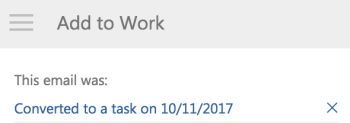

# Een [!DNL Outlook] e-mailen als een taak naar uw werklijst

U kunt omzetten [!DNL Outlook] e-mails naar [!DNL Adobe Workfront] taken. Nadat een e-mail is geconverteerd, is de taak beschikbaar in uw [!UICONTROL Work] Lijst in het dialoogvenster [!UICONTROL Home] gebied.

## Toegangsvereisten

U moet de volgende toegang hebben om de stappen in dit artikel uit te voeren:

<table style="table-layout:auto"> 
 <col> 
 <col> 
 <tbody> 
  <tr> 
   <td role="rowheader">[!DNL Adobe Workfront] plan*</td> 
   <td> 
Alle
 </td> 
  </tr> 
  <tr> 
   <td role="rowheader">[!DNL Adobe Workfront] licentie*</td> 
   <td> 
[!UICONTROL Work], [!UICONTROL Plan]
 </td> 
  </tr> 
 </tbody> 
</table>

&#42;Neem contact op met uw [!DNL Workfront] beheerder.

## Vereisten

Uw [!DNL Workfront] de beheerder moet toelaten [!DNL Outlook for Office] with [!DNL Workfront] voordat u deze integratie kunt gebruiken.

## Een [!DNL Outlook] e-mailen als een taak naar uw werklijst

1. Selecteer de e-mail binnen [!DNL Outlook] die u naar een taak wilt converteren.
1. Klik op de knop **[!DNL Workfront]** in de rechterbovenhoek van het e-mailbericht om het bericht weer te geven [!DNL Workfront] invoegtoepassing.\
   Mogelijk moet u op de pijl omlaag in de rechterbovenhoek van uw e-mail klikken om het dialoogvenster [!DNL Workfront] pictogram.

1. Klik op de knop **[!UICONTROL Menu]** pictogram om de lijst met beschikbare [!DNL Workfront] opties.\
   

1. Klik op **[!UICONTROL Add to Work]**.\
   

1. Schakel de optie **[!UICONTROL Add to Project]** veld.
1. (Optioneel) U kunt de volgende gegevens uit de e-mail bijwerken voordat u deze als taak opslaat:

   * **[!UICONTROL Task Name]:** Standaard is de naam van de taak gelijk aan de naam van het e-mailonderwerp. U kunt de taaknaam naar wens wijzigen.
   * **[!UICONTROL Description]:** Standaard is de beschrijving hetzelfde als de e-mailtekst. U kunt de beschrijving naar wens wijzigen.
   * **[!UICONTROL Attachments]:** Alle e-mailbijlagen worden opgeslagen in de [!UICONTROL Documents] taakgebied. U kunt bijlagen verwijderen voordat u het e-mailbericht als een taak opslaat.

1. Klik op **[!UICONTROL Add]**.\
   De taak wordt toegevoegd aan de [!UICONTROL Work List] in uw thuisgebied zonder datum van betrokkenheid.

1. (Optioneel) Klik op **[!UICONTROL View in Workfront]** om de taak weer te geven binnen de [!DNL Workfront] op een nieuw tabblad.

1. (Optioneel) Ga terug naar [!DNL Outlook]en selecteer het originele e-mailbericht.\
   Aan de bovenkant van de [!DNL Workfront] in het invoegvenster wordt bevestigd dat het e-mailbericht als taak aan Workfront is toegevoegd. De koppeling bevat de datum waarop deze is geconverteerd.\
   
