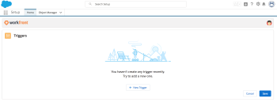

# [!DNL Adobe Workfront] projecten maken van [!DNL Salesforce] -objecten

>[!IMPORTANT]
>
>Om stabielere en scalable integratie te leveren, verschuiven wij naar een moderne, flexibele integratiebenadering gebruikend Workfront Automation and Integration (Fusion). Als deel van dit overgangsproces, zal Workfront voor de integratie van Salesforce niet beschikbaar na **28 Februari, 2026** zijn.
>
>We raden u aan Workfront Automation and Integration te gebruiken voor de integratiebehoeften van uw organisatie met Salesforce.
>
>Voor een overzicht van de Automatisering en de Integratie van Workfront, zie [&#x200B; het overzicht van de Fusie van Adobe Workfront &#x200B;](https://experienceleague.adobe.com/en/docs/workfront-fusion/using/get-started-with-fusion/understand-workfront-fusion/workfront-fusion-overview).
>
>Voor informatie over de specifieke mogelijkheden van de modules van de Automatisering en van de Integratie van Workfront voor Salesforce, zie [&#x200B; modules van Salesforce &#x200B;](https://experienceleague.adobe.com/en/docs/workfront-fusion/using/references/apps-and-their-modules/third-party-app-connectors/salesforce-modules).

Nadat u [!DNL Adobe Workfront] voor Salesforce hebt geïnstalleerd, kunt u triggers definiëren die [!DNL Workfront] -projecten maken als aan bepaalde criteria wordt voldaan op [!DNL Salesforce] [!UICONTROL Opportunities] en [!UICONTROL Accounts] .

## Toegangsvereisten

+++ Breid uit om de toegangseisen voor de functionaliteit in dit artikel weer te geven.

<table style="table-layout:auto"> 
 <col> 
 <col> 
 <tbody> 
  <tr> 
   <td role="rowheader">Adobe Workfront-pakket</td> 
   <td> 
Alle
 </td> 
  </tr> 
  <tr> 
   <td role="rowheader">Adobe Workfront-licentie</td> 
   <td> 
Standard

   
Plan
 </td> 
  </tr> 
 </tbody> 
</table>

Voor informatie, zie [&#x200B; vereisten van de Toegang in de documentatie van Workfront &#x200B;](/help/quicksilver/administration-and-setup/add-users/access-levels-and-object-permissions/access-level-requirements-in-documentation.md).

+++

## Vereisten

Een [!DNL Workfront] aanvraag verzenden vanuit een [!DNL Salesforce] [!UICONTROL Opportunity] of account
zorg ervoor dat u het volgende in uw milieu hebt:

* Uw [!DNL Workfront] -beheerder heeft [!DNL Workfront for Salesforce] geïnstalleerd.\
   Voor meer informatie over het installeren van [!DNL Workfront for Salesforce], zie [&#x200B; installeren  [!DNL Adobe Workfront for Salesforce]](../../workfront-integrations-and-apps/using-workfront-with-salesforce/install-workfront-for-salesforce.md)

* Uw [!DNL Workfront] -beheerder heeft de [!DNL Workfront] -sectie toegevoegd aan uw [!UICONTROL Opportunity] en account
paginalay-outs.\
   Voor meer informatie over het toevoegen van de [!DNL Workfront] sectie aan een paginalay-out, zie [&#x200B; de  [!DNL Adobe Workfront]  sectie voor  [!DNL Salesforce]  gebruikers &#x200B;](../../workfront-integrations-and-apps/using-workfront-with-salesforce/configure-wf-section-for-salesforce-users.md) vormen.

* U hebt een [!DNL Workfront] -account en u kunt zich er vanuit de [!DNL Workfront] -sectie in uw [!UICONTROL Opportunity] of account bij aanmelden
.

## Het maken van [!DNL Workfront] projecten configureren vanuit [!DNL Salesforce]

* [De automatische creatie van projecten begrijpen](#understanding-the-automatic-creation-of-projects-understanding-the-automatic-creation-of-projects)
* [Triggers configureren](#configuring-triggers-configuring-triggers)
* [Projectnamen](#understanding-project-names-understanding-project-names)

### De automatische creatie van projecten begrijpen {#understanding-the-automatic-creation-of-projects}

Als systeembeheerder van [!DNL Salesforce] kunt u triggers definiëren die automatisch projecten kunnen maken in [!DNL Workfront] wanneer de volgende dingen gebeuren in [!DNL Salesforce] :

* De [!UICONTROL Stage] van een [!UICONTROL Opportunity] wordt bijgewerkt.
* De [!UICONTROL Type] van een account
wordt bijgewerkt.

Triggers kunnen alleen worden geconfigureerd nadat u [!DNL Workfront for Salesforce] hebt geïnstalleerd.  \
Voor informatie over het installeren van [!DNL Workfront for Salesforce], zie [&#x200B; installeren  [!DNL Adobe Workfront for Salesforce]](../../workfront-integrations-and-apps/using-workfront-with-salesforce/install-workfront-for-salesforce.md).

Houd rekening met het volgende wanneer u triggers configureert om automatisch [!DNL Workfront] -projecten te maken wanneer [!DNL Salesforce] -items worden gemaakt of bijgewerkt:

* U moet een [!DNL Salesforce] - en [!DNL Workfront] -systeembeheerder zijn om triggers te configureren.
* Nadat u de triggers hebt geconfigureerd, iedereen die de [!UICONTROL Stage] van een [!UICONTROL Opportunity] of de [!UICONTROL Type] van een account bijwerkt
kan het maken van een [!DNL Workfront] -project activeren. Dit geldt ook voor [!DNL Salesforce] -gebruikers die geen [!DNL Workfront] -account hebben.
* Er is geen limiet voor het aantal triggers dat u kunt gebruiken.
* U kunt geen meerdere triggers maken op basis van dezelfde voorwaarden. Triggers zijn standaard uniek.
* Zodra het project wordt gecreeerd wordt het automatisch verbonden met de kans of de rekening waar het werd geproduceerd. Zodra gevestigd, kan deze verbinding niet worden gebroken.
* Eén opportuniteit of account kan aan meerdere projecten in [!DNL Workfront] worden gekoppeld wanneer meerdere malen aan een getriggerde voorwaarde is voldaan tijdens de levensduur van de opportuniteit of de account.

  Als u bijvoorbeeld meer dan één [!UICONTROL Stage] definieert voor een [!UICONTROL Opportunity] -project dat een project activeert, wordt een project gemaakt voor elk gedefinieerd werkgebied dat de mogelijkheid bereikt, gedurende de levensduur van die mogelijkheid. Als u de [!UICONTROL Stage] van een [!UICONTROL Opportunity] van het ene gedefinieerde werkgebied naar het andere bijwerkt en het vervolgens weer bijwerkt naar het gedefinieerde werkgebied, wordt een tweede project gemaakt voor de tweede keer dat u het [!UICONTROL Stage] -veld bijwerkt naar hetzelfde gedefinieerde werkgebied.

* Eén project in [!DNL Workfront] kan op elk gewenst moment maar aan één opportuniteit of één account in [!DNL Salesforce] worden gekoppeld, maar niet aan beide tegelijk.

### Triggers configureren {#configuring-triggers}

Nadat u de triggers hebt geconfigureerd, wordt het maken van [!DNL Workfront] -projecten ingeschakeld voor zowel [!UICONTROL Salesforce Classic] - als [!DNL Lightning Experience] -frameworks.

triggers configureren in [!UICONTROL Salesforce] :

1. Meld u aan bij [!DNL Salesforce] als systeembeheerder.
1. (Voorwaardelijk) Klik in [!DNL Salesforce Classic] op **[!UICONTROL Setup]** en vouw **[!UICONTROL Build]** uit onder de sectie **[!UICONTROL Lightning Bolt]** .

   of

   Klik in [!DNL Salesforce] Lightning Experience op het pictogram **[!UICONTROL Setup]** , vervolgens op **[!UICONTROL Setup]** en onder **[!UICONTROL PLATFORM TOOLS]** expand **[!UICONTROL Apps]** .

1. Klik op **[!UICONTROL Installed Packages]**.

   Het pakket **[!DNL Workfront]** is geïnstalleerd.

1. Klik op **[!UICONTROL Configure]** naast **[!DNL Workfront]** .

1. Meld u aan bij [!DNL Workfront] als systeembeheerder.

   De pagina **[!UICONTROL Triggers]** wordt weergegeven.

   

1. Klik op **[!UICONTROL New Trigger]**.
1. Selecteer **[!UICONTROL [!DNL Salesforce] Object]** in de vervolgkeuzelijst **[!UICONTROL Opportunity]** .

   Dit is een verplicht veld.

1. (Voorwaardelijk) Geef het volgende op:

   1. Selecteer in de vervolgkeuzelijst **[!UICONTROL Stage]** een **[!UICONTROL Stage]**\.

      Wanneer een opportuniteit de hier opgegeven [!UICONTROL Stage] bereikt, wordt een project gemaakt in [!DNL Workfront] . Dit is een verplicht veld.

   1. Typ in het veld **[!UICONTROL Portfolio or Program]** de naam van een Portfolio of Programma waarin u het project wilt plaatsen in [!DNL Workfront] en selecteer het vervolgens wanneer het wordt weergegeven in de lijst.\

      Als u geen Portfolio of programma opgeeft, wordt het nieuwe project gemaakt en toegevoegd aan de [!UICONTROL Projects I Own] -lijst van de gebruiker die bij [!DNL Workfront] is aangemeld bij de configuratie van de triggers. Die gebruiker is ook de Eigenaar van het Project voor het nieuwe project.

   1. Typ de naam van een sjabloon die u wilt koppelen aan het nieuwe [!DNL Workfront] -project en selecteer het vervolgens in de lijst.\

      Dit is een verplicht veld.

      >[!NOTE]
      >
      >Als u een Eigenaar van het Malplaatje op het malplaatje hebt gespecificeerd dat u voor deze integratie van plan bent te gebruiken, wordt dat de Eigenaar van het Project van het nieuwe project. De nieuwe projecten worden weergegeven onder de [!UICONTROL Projects I Own] -lijst van de gebruiker die de eigenaar van het nieuwe project is, volgens de sjabloon.

   1. (Optioneel) Selecteer het **[!UICONTROL Create a new project for each sold product type]veld** als u een nieuw project wilt maken voor elk type product dat onder een van de mogelijkheden wordt verkocht.
   1. (Voorwaardelijk) Selecteer **[!UICONTROL Product]** in het **[!UICONTROL Product]** drop-down menu.

      Dit is een verplicht veld.

   1. (Voorwaardelijk) Typ de naam van een **[!UICONTROL Template]** die u aan het nieuwe [!DNL Workfront] -project wilt koppelen als het opgegeven product zich op het [!UICONTROL Opportunity] bevindt. Selecteer het wanneer het in de lijst verschijnt.

      Dit is een verplicht veld.

      Het project dat wordt gemaakt wanneer een nieuw product wordt toegevoegd aan de [!DNL Salesforce] -mogelijkheid, wordt geplaatst in dezelfde Portfolio of in hetzelfde programma dat voor de opportuniteit is geselecteerd.

      >[!IMPORTANT]
      >
      >Het project wordt alleen gemaakt wanneer het werkgebied wordt bijgewerkt in [!UICONTROL Opportunity] . Er wordt een uniek project gemaakt voor elk product dat wordt opgegeven wanneer het veld Werkgebied wordt bijgewerkt, en niet wanneer de producten aan [!UICONTROL Opportunities] worden toegevoegd.

1. (Optioneel) Klik op **[!UICONTROL New Trigger]** .
1. (Optioneel) Selecteer **Account in de vervolgkeuzelijst &#x200B;** [!UICONTROL [!DNL Salesforce] Object]**
**.

   Dit is een verplicht veld.
1. (Voorwaardelijk) Geef het volgende op:

   1. Selecteer een **[!UICONTROL Type]** in de vervolgkeuzelijst **[!UICONTROL Type]** .

      Als er een **Account is
**&#x200B; wordt opgegeven als de &#x200B;** [!UICONTROL Type] **&#x200B; die hier wordt opgegeven in [!DNL Salesforce] , a &#x200B;** [!UICONTROL Project]** wordt gemaakt in [!DNL Workfront] .

      Dit is een verplicht veld.

   1. (Optioneel) Typ de naam van een **[!UICONTROL Portfolio]** -project of **[!UICONTROL Program]** -project in het [!DNL Workfront] -veld in en selecteer het vervolgens in de lijst.**[!UICONTROL Portfolio or Program]**

      Als u geen Portfolio of programma opgeeft, wordt het nieuwe project gemaakt en toegevoegd aan de **[!UICONTROL Projects I Own]** -lijst van de gebruiker die is aangemeld bij [!DNL Workfront] from [!DNL Salesforce] . De gebruiker is ook de Eigenaar van het Project voor het nieuwe project.

   1. Typ de naam van een **[!UICONTROL Template]** die u aan het nieuwe [!DNL Workfront] -project wilt koppelen en selecteer deze vervolgens wanneer deze in de lijst wordt weergegeven.

      Dit is een verplicht veld.

      >[!NOTE]
      >
      >Als u een Eigenaar van het Malplaatje op het malplaatje hebt gespecificeerd dat u voor deze integratie van plan bent te gebruiken, wordt dat de Eigenaar van het Project van het nieuwe project. De nieuwe projecten worden weergegeven onder de **[!UICONTROL Projects I Own]** -lijst van de gebruiker die de eigenaar van het nieuwe project is, volgens de sjabloon.

   

1. Klik op **[!UICONTROL Save]**.

   [!DNL Workfront] -projecten worden nu gegenereerd telkens wanneer aan een van de triggers wordt voldaan.

### Projectnamen {#understanding-project-names}

Afhankelijk van welke trigger de projecten heeft gegenereerd, kunnen de namen van de projecten in [!DNL Workfront] een van de volgende patronen volgen:

* Als het project wordt gecreeerd gebaseerd op een kans of rekeningstrekker, is de naam van het project: *`<Salesforce object name>`: `<Project template name>` (via [!DNL Salesforce])*.
* Als het project wordt gecreeerd gebaseerd op een opportuniteitstrekker die ook de toevoeging van een nieuw Product omvat, is de naam van het project: *`<Salesforce object name>`: `<Salesforce product name>` (via [!DNL Salesforce])*.

## [!DNL Workfront] projecten weergeven

Als uw [!DNL Workfront] -beheerder de [!DNL Workfront] -sectie heeft toegevoegd aan uw [!UICONTROL Opportunity] of account
paginalay-out, kunt u de projecten zien die automatisch in het [!UICONTROL Projects] lusje van deze sectie worden gecreeerd.\
Voor meer informatie over het toevoegen van de sectie [!DNL Workfront] aan de pagina-indeling van een [!UICONTROL Opportunity] of account
, zie [&#x200B; de  [!DNL Adobe Workfront]  sectie voor  [!DNL Salesforce]  gebruikers &#x200B;](../../workfront-integrations-and-apps/using-workfront-with-salesforce/configure-wf-section-for-salesforce-users.md) vormen.

U moet een [!DNL Workfront] -account hebben en aangemeld zijn bij [!DNL Workfront] om het tabblad [!UICONTROL Projects] weer te geven.

Projecten weergeven die zijn gemaakt op basis van een [!UICONTROL Opportunity] of account
:

1. Naar een [!UICONTROL Opportunity] of account gaan
.
1. Ga naar de sectie **[!DNL Workfront]** .

   >[!NOTE]
   >
   >Afhankelijk van de configuratie van deze sectie door de [!DNL Workfront] -beheerder, heeft deze mogelijk een andere naam.

1. Selecteer het tabblad **[!UICONTROL Projects]**. 

   Alle projecten die door bepaalde triggers worden gemaakt, worden op dit tabblad weergegeven. Elke gebruiker in [!DNL Salesforce] die ook een [!DNL Workfront] -account heeft en die machtigingen heeft om deze projecten in [!DNL Workfront] te bekijken, kan ze ook zien in [!DNL Salesforce] voor de [!UICONTROL Opportunity] of de Account
dat heeft hen opgeleverd.

   U kunt de volgende informatie over de projecten bekijken die door de integratie worden gecreeerd:

   * Projectnaam
   * Referentienummer
   * Invoerdatum
   * Naam van de eigenaar
   * Status
   * Voorwaarde
   * Geplande afsluitdatum
   * Percentage voltooid

     Wanneer deze informatie wordt bijgewerkt in [!DNL Workfront] , worden de velden weergegeven die in deze lijst zijn bijgewerkt.

1. (Optioneel) Klik op de naam van een project om het te openen in Workfront.
1. (Optioneel) Klik op [!UICONTROL **[!UICONTROL Go to Salesforce]**] in het [!UICONTROL Project Details] -gebied of in de projectheader om toegang te krijgen tot de [!UICONTROL Opportunity] of de account
waar het project is opgestart. Uw systeem of groepsbeheerder moet het [!UICONTROL Integrations] gebied aan uw lay-outmalplaatje toevoegen om het in de projectheader te vinden.

   >[!NOTE]
   >
   >De koppeling [!UICONTROL Go to Salesforce] is zichtbaar voor alle [!DNL Workfront] -gebruikers die het project kunnen weergeven. U moet een [!DNL Salesforce] -account hebben om naar de [!DNL Salesforce] Opportunity or Account te kunnen gaan van waaruit het project is gegenereerd.
