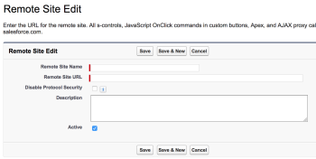
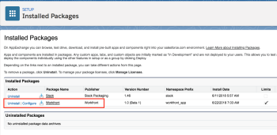

# Installeren [!DNL Adobe Workfront for Salesforce]

De toepassing installeren voordat deze beschikbaar wordt in het dialoogvenster [!DNL Salesforce AppExchange], zie [Installeren [!DNL Workfront for Salesforce] voordat het beschikbaar wordt in het dialoogvenster [!DNL AppExchange] Marketplace](#installing-workfront-for-salesforce-before-it-becomes-available-in-the-appexchange-marketplace-installing-workfront-for-salesforce-before-it-becomes-available-in-the-appexchange-marketplace).

Als [!DNL Salesforce] en [!DNL Adobe Workfront] beheerder, kunt u installeren [!DNL Workfront for Salesforce] om uw [!DNL Salesforce] gebruikers om te verzenden [!DNL Workfront] verzoeken en maken automatisch projecten zonder ooit Salesforce te verlaten.

Voor een algemeen begrip van wat u kunt verwachten door te installeren [!DNL Workfront for Salesforce], zie [[!DNL Adobe Workfront for Salesforce] overzicht](../../workfront-integrations-and-apps/using-workfront-with-salesforce/workfront-for-salesforce-overview.md).

* [Vereisten voor installatie en het Gebruiken [!DNL Workfront for Salesforce]](#prerequisites-for-installing-and-using-workfront-for-salesforce-prerequisites-for-installing-and-using-workfront-for-salesforce)
* [Installeren [!DNL Workfront for Salesforce]](#install-adobe-workfront-for-salesforce)

## Toegangsvereisten

U moet de volgende toegang hebben om de in dit artikel beschreven functionaliteit te kunnen gebruiken:

<table style="table-layout:auto"> 
 <col> 
 <col> 
 <tbody> 
  <tr> 
   <td role="rowheader">[!DNL Adobe Workfront] plan*</td> 
   <td> 
[!UICONTROL Pro] of hoger
 </td> 
  </tr> 
  <tr> 
   <td role="rowheader">[!DNL Adobe Workfront] licentie*</td> 
   <td> 
[!UICONTROL Plan]
 </td> 
  </tr>  </tbody> 
</table>

&#42;Neem contact op met uw [!DNL Workfront] beheerder.

## Vereisten voor installatie en het Gebruiken [!DNL Workfront for Salesforce] {#prerequisites-for-installing-and-using-workfront-for-salesforce}

* U moet beschikken over een [!DNL Salesforce] instantie met toegang tot een systeembeheerdersaccount om de app te installeren.
* U moet beschikken over een [!DNL Workfront] instantie met toegang tot een rekening van de systeembeheerder om de integratie te vormen.
* [!UICONTROL Salesforce] gebruikers moeten beschikken over een [!DNL Workfront] om

   * Maken [!DNL Workfront] verzoeken van [!DNL Salesforce] of
   * Weergave [!DNL Workfront] verzoeken of projecten in Salesforce.

## Installeren [!DNL Workfrontfor Salesforce] {#installing-workfront-for-salesforce}

U moet een [!DNL Salesforce] en [!DNL Workfront] systeembeheerder om te installeren en te vormen [!DNL Workfront for Salesforce].

De volgende subsecties beschrijven hoe te installeren [!DNL Workfront] voor uw [!DNL Salesforce] Productieomgeving. U kunt dezelfde stappen volgen om te installeren [!DNL Workfront] voor uw [!DNL Salesforce] Sandbox-omgeving.

* [Installeren [!DNL Workfront for Salesforce] voordat het beschikbaar wordt in het dialoogvenster [!DNL AppExchange] Marketplace](#installing-workfront-for-salesforce-before-it-becomes-available-in-the-appexchange-marketplace-installing-workfront-for-salesforce-before-it-becomes-available-in-the-appexchange-marketplace)
* [Installeren [!DNL Workfront for Salesforce] in de [!DNL Salesforce Classic] Kader](#installing-workfront-for-salesforce-in-the-salesforce-classic-framework)
* [Installeren [!DNL Workfront for Salesforce] in de [!DNL Salesforce Lightning Experience] Kader](#installing-workfront-for-salesforce-in-the-salesforce-lightning-experience-framework)

### Installeren [!DNL Workfront for Salesforce] voordat het beschikbaar wordt in het dialoogvenster [!DNL AppExchange] Marketplace {#installing-workfront-for-salesforce-before-it-becomes-available-in-the-appexchange-marketplace}

[!DNL Workfront for Salesforce] is beschikbaar in het [!DNL Salesforce AppExchange] binnenkort.

U kunt als volgt de app installeren voordat deze beschikbaar is:

1. Ga in uw productieomgeving naar

   `https://login.salesforce.com/packaging/installPackage.apexp?p0=04t4K000002aUZY`

   Ga in uw Sandbox-omgeving naar

   `https://test.salesforce.com/packaging/installPackage.apexp?p0=04t4K000002aUZY`

1. Controleer de **[!UICONTROL Yes, grant access to these third-party web sites]** doos.

   

   Er wordt een laadscherm weergegeven en de installatie kan even duren.

1. Klikken **[!UICONTROL Done]** als de installatie is voltooid.

1. Ga naar **[!UICONTROL Setup>Security Controls>Remote Site Settings]**.
1. (Voorwaardelijk) Als u uw [!DNL Workfront] URL vermeld in **[!UICONTROL All Remote Sites]** lijst, klikt u op **[!UICONTROL New Remote Site]**.

1. Geef de **[!UICONTROL Remote Site Name]**.

   Bijvoorbeeld, *[!DNL Workfront]*.

1. Geef de **[!UICONTROL Remote Site URL]**.

   Bijvoorbeeld: *yourDomain.my.workfront.com*.

1. Klik op **[!UICONTROL Save]**.

   De [!DNL Workfront] de toepassing is nu geïnstalleerd op uw [!DNL Salesforce] en de **[!UICONTROL WorkfrontOpportunities]** en **[!UICONTROL WorkfrontAccounts]** [!UICONTROL Visualforce] Pagina&#39;s zijn gemaakt in uw omgeving.

   [!DNL Salesforce] gebruikers kunnen de app gebruiken nadat u de [!DNL Workfront] hun [!UICONTROL Opportunity] of [!UICONTROL Account] paginalay-outs.\
   Voor informatie over het configureren van de sectie Workfront voor gebruikers raadpleegt u [De Adobe Workfront-sectie voor Salesforce-gebruikers configureren](../../workfront-integrations-and-apps/using-workfront-with-salesforce/configure-wf-section-for-salesforce-users.md).

### Installeren [!DNL Workfront] for [!DNL Salesforce] in de [!DNL Salesforce Classic] Kader

1. Aanmelden bij [!DNL Salesforce] als systeembeheerder.
1. Ga naar **Instellen.**
1. In de **Opbouwen** sectie, klikt u op **AppExchange Marketplace**.

1. In de **AppExchange-apps zoeken** vak, tekst **Workfront**.

1. Klik op de app wanneer u deze hebt gevonden en klik vervolgens op **Nu ophalen**.
1. Klikken **[!UICONTROL Install in Production]** om de [!DNL Workfront] in uw [!DNL Salesforce] Productieomgeving. (aanbevolen)
1. Selecteer **[!UICONTROL I have read and agree to the terms and conditions]** nadat u de voorwaarden hebt gelezen en ermee akkoord gaat.
1. Klik op **[!UICONTROL Confirm and Install]**.
1. Selecteren **[!UICONTROL Install for All Users]** (aanbevolen) en klik vervolgens op **[!UICONTROL Install]**.

1. (Voorwaardelijk) Als u wordt gevraagd of u een deregang wilt goedkeuren, moet u selecteren **[!UICONTROL Yes, grant access to these third-party web sites]** en klik vervolgens op **[!UICONTROL Continue]**.

1. Klikken **[!UICONTROL Done]** als de installatie is voltooid.

   De [!DNL Workfront] app is vermeld onder **[!UICONTROL Installed Packages]**.

   

1. Ga naar **[!UICONTROL Setup>Security Controls>Remote Site Settings]**.
1. (Voorwaardelijk) Als u uw [!DNL Workfront] URL vermeld in **[!UICONTROL All Remote Sites]** lijst, klikt u op **[!UICONTROL New Remote Site]**.\
   

1. Geef de **[!UICONTROL Remote Site Name]**.\
   Bijvoorbeeld, *[!DNL Workfront]*.

1. Geef de **[!UICONTROL Remote Site URL]**.\
   Bijvoorbeeld: *yourDomain.my.workfront.com*.

1. Klik op **[!UICONTROL Save]**.\
   De [!DNL Workfront] de toepassing is nu geïnstalleerd op uw [!DNL Salesforce] en de **[!UICONTROL WorkfrontOpportunities]** en **[!UICONTROL WorkfrontAccounts]** [!UICONTROL Visualforce] Pagina&#39;s zijn gemaakt in uw omgeving.\
   [!DNL Salesforce] gebruikers kunnen de app nog niet gebruiken totdat u de [!DNL Workfront] hun [!UICONTROL Opportunity] of [!UICONTROL Account] paginalay-outs.\
   Voor informatie over het configureren van de [!DNL Workfront] voor gebruikers, zie [Configureer de [!DNL Adobe Workfront] sectie voor [!DNL Salesforce] gebruikers](../../workfront-integrations-and-apps/using-workfront-with-salesforce/configure-wf-section-for-salesforce-users.md).

### Installeren [!DNL Workfront for Salesforce] in de [!DNL Salesforce Lightning Experience] Kader

1. Aanmelden bij [!DNL Salesforce] als systeembeheerder.
1. Klik op de knop **[!UICONTROL Setup]pictogram** en klik vervolgens op **[!UICONTROL Setup]**.

1. In de **[!UICONTROL PLATFORM TOOLS]** sectie, uitvouwen **[!UICONTROL Apps].**

1. Klik op **[!DNL AppExchange Marketplace]**.
1. In de **[!UICONTROL Search [!DNL AppExchange] Apps]** vak, tekst **[!DNL Workfront]**.

1. Klik op de app wanneer u deze hebt gevonden en klik vervolgens op **[!UICONTROL Get It Now]**.
1. Klik op **[!UICONTROL Open Login Screen]**.\
   U moet zich aanmelden met uw [!DNL Workfront] beheerdersaccount voor [!DNL Salesforce].

1. Klik op **[!UICONTROL Allow]**.
1. In de **[!UICONTROL Install in This Org]** vak, klikt u op **[!UICONTROL Install Here]** om te installeren [!DNL Workfront] in uw [!DNL Salesforce] Productieomgeving. (aanbevolen)

1. Selecteer **[!UICONTROL I have read and agree to the terms and conditions]** nadat u de voorwaarden hebt gelezen en ermee akkoord gaat.
1. Klik op **[!UICONTROL Confirm and Install]**.
1. Selecteren **[!UICONTROL Install for All Users]** (aanbevolen) en klik vervolgens op **[!UICONTROL Install]**.

1. (Voorwaardelijk) Als u wordt gevraagd of u een deregang wilt goedkeuren, moet u selecteren **[!UICONTROL Yes, grant access to these third-party web sites]** en klik vervolgens op **[!UICONTROL Continue]**.

1. Klikken **[!UICONTROL Done]** als de installatie is voltooid.

   De [!DNL Workfront] app is vermeld onder **[!UICONTROL Installed Packages]**.

   

1. Ga naar **[!UICONTROL Setup].**
1. In de **[!UICONTROL SETTINGS]** sectie, &#x200B; uitvouwen **[!UICONTROL Security].**

1. Klik op **[!UICONTROL Remote Site Settings]**.
1. (Voorwaardelijk) Als u uw [!DNL Workfront] URL vermeld in **[!UICONTROL All Remote Sites]** lijst, klikt u op **[!UICONTROL New Remote Site]**.

   

1. Geef de **[!UICONTROL Remote Site Name]**.

   Bijvoorbeeld, *[!DNL Workfront]*.

1. Geef de **[!UICONTROL Remote Site URL]**.

   Bijvoorbeeld: *yourDomain.my.workfront.com*.

1. Klik op **[!UICONTROL Save]**.

   De [!DNL Workfront] de toepassing is nu geïnstalleerd op uw [!DNL Salesforce] en de **[!DNL Workfront]** wordt nu toegevoegd aan uw omgeving.

   [!UICONTROL Salesforce] gebruikers kunnen de [!DNL Workfront] app zodra u de [!DNL Workfront] hun [!UICONTROL Opportunity] of [!UICONTROL Account] paginalay-outs.\
   Voor informatie over het configureren van de [!DNL Workfront] voor gebruikers, zie [Configureer de [!DNL Adobe Workfront] sectie voor [!DNL Salesforce] gebruikers](../../workfront-integrations-and-apps/using-workfront-with-salesforce/configure-wf-section-for-salesforce-users.md).
