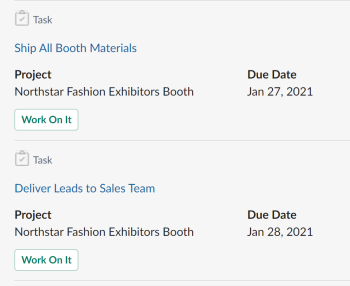

# Uw werk en goedkeuringen beheren vanuit [!DNL Slack]

Nadat u hebt geïnstalleerd [!DNL Adobe Workfront for Slack]kunt u het volgende doen:

* De lijsten van de toegang van uw [!UICONTROL Home] objecten van [!DNL Slack]
* Controleren en accepteren om te werken aan taken en problemen van [!DNL Slack]
* Herziening en besluitvorming van goedkeuringen van [!DNL Slack]

Voor meer informatie over het configureren [!DNL Workfront] with [!DNL Slack], zie [Configureren [!DNL Adobe Workfront for Slack]](../../workfront-integrations-and-apps/using-workfront-with-slack/configure-workfront-for-slack.md).

## Toegangsvereisten

U moet het volgende hebben:

<table style="table-layout:auto"> 
 <col> 
 <col> 
 <tbody> 
  <tr> 
   <td role="rowheader"><a href="https://www.workfront.com/plans" target="_blank">[!DNL Adobe Workfront] plan</a>*</td> 
   <td> 
[!UICONTROL Pro] of hoger
 </td> 
  </tr> 
 </tbody> 
</table>

&#42;Neem contact op met uw Workfront-beheerder om te weten te komen welk plan, licentietype of toegang u hebt.

## Vereisten

Voordat u uw werk en goedkeuringen kunt beheren vanuit [!DNL Slack]moet u

* Configureren [!DNL Workfront for Slack]\
   Voor instructies over het configureren [!DNL Workfront for Slack], zie [Configureren [!DNL Adobe Workfront for Slack]](../../workfront-integrations-and-apps/using-workfront-with-slack/configure-workfront-for-slack.md).

## Uw werk beheren vanuit [!DNL Slack]

1. Meld u aan bij uw [!DNL Slack] instantie en aanmelden bij [!DNL Workfront] van [!DNL Slack].\
   Voor meer informatie over aanmelden bij [!DNL Workfront] van [!DNL Slack], zie &quot;Aanmelden bij [!DNL Workfront] van [!DNL Slack]&quot; sectie in [Toegang [!DNL Adobe Workfront] van [!DNL Slack]](../../workfront-integrations-and-apps/using-workfront-with-slack/access-workfront-from-slack.md).

1. Typ de volgende opdracht in het berichtveld vanaf een willekeurig kanaal:

   `/workfront home`

   >[!NOTE]
   >
   >* Opdrachten zijn hoofdlettergevoelig.
   >* U kunt uw opdracht starten met `/wf` in plaats van `/workfront`.

   De knopen waarvan u tot lijsten van uw taken, kwesties, en goedkeuringsvertoning kunt toegang hebben. Wanneer u op een van de knoppen klikt, worden de eerste 20 items van elke lijst weergegeven in [!DNL Slack].\
   

1. (Optioneel) Klik op **[!UICONTROL Tasks]** om al uw taken weer te geven.

   Voor meer informatie over het beheren van taken in [!DNL Slack], zie [Uw taken beheren vanuit [!DNL Slack]](#manage-your-tasks-from-slack-manage-your-tasks-from-slack).

1. (Optioneel) Klik op **[!UICONTROL Issues]** om al uw problemen weer te geven.

   Voor meer informatie over het beheren van problemen in [!DNL Slack], zie [Uw problemen beheren vanuit [!DNL Slack]](#manage-your-issues-from-slack-manage-your-issues-from-slack).

1. (Optioneel) Klik op **[!UICONTROL Approvals]** om alle goedkeuringen weer te geven die op uw beslissing wachten.\
   Voor meer informatie over het beheer van uw goedkeuringen in [!DNL Slack], zie [Uw goedkeuringen beheren vanuit [!DNL Slack]](#manage-your-approvals-from-slack-manage-your-approvals-from-slack).

## Uw taken beheren vanuit [!DNL Slack] {#manage-your-tasks-from-slack}

1. Meld u aan bij uw [!DNL Slack] instantie en aanmelden bij [!DNL Workfront] van [!DNL Slack].\
   Voor informatie over aanmelden bij [!DNL Workfront] van [!DNL Slack], zie &quot;Aanmelden bij [!DNL Workfront] van [!DNL Slack]&quot; sectie in [Toegang [!DNL Adobe Workfront] van [!DNL Slack]](../../workfront-integrations-and-apps/using-workfront-with-slack/access-workfront-from-slack.md).

1. Typ een van de volgende opdrachten in het berichtveld vanaf een willekeurig kanaal:

   `/workfront home`en klik vervolgens op **[!UICONTROL Tasks]**

   of

   `/workfront tasks`

   >[!NOTE]
   >
   >* Opdrachten zijn hoofdlettergevoelig.
   >* U kunt uw opdracht starten met `/wf` in plaats van `/workfront`.

   De eerste 20 taken op uw lijstvertoning.\
   

1. Klikken **[!UICONTROL +`<remaining number>`meer]** om extra taken weer te geven.
1. Overweeg de volgende informatie over je werk te bekijken:

   * **[!UICONTROL Name]**
   * **[!UICONTROL Project Name]** of **[!DNL Parent Object Name]**

   * **[!DNL Planned Completion Date]** van het werkitem.
   * **[!DNL Assigned By Name]**: Dit is de naam van de gebruiker die de taak aan u heeft toegewezen.
   * **[!UICONTROL Status]**

1. (Optioneel) Klik op de naam van een item om dit in Workfront te openen op een apart browsertabblad.
1. (Optioneel) In het dialoogvenster **[!UICONTROL Status]** selecteert u een nieuwe status.
1. (Optioneel) Klik op **[!UICONTROL Log Time]** Selecteer vervolgens een **[!UICONTROL Hour Type]** en een uurbedrag aan logboektijd op het punt.

   >[!NOTE]
   >
   >* U kunt slechts uren in toename van een volledig of half uur, tot 12 uren en 30 minuten registreren.
   >* De uren u registreert hebben een Datum van de Ingang van vandaag. U kunt geen tijd voor een datum in het verleden of in de toekomst registreren [!DNL Slack].

   U ontvangt een bevestiging dat de tijd is geregistreerd.

1. (Optioneel) Klik op **[!UICONTROL Work on it]** aanvaarden om aan een taak te werken. De [!UICONTROL Work on it] verdwijnt.

## Uw uitgaven beheren vanuit [!DNL Slack] {#manage-your-issues-from-slack}

1. Meld u aan bij uw [!DNL Slack] instantie en aanmelden bij [!DNL Workfront] van [!DNL Slack].\
   Voor meer informatie over aanmelden bij [!DNL Workfront] van [!DNL Slack], zie de [Aanmelden bij [!DNL Workfront] van [!DNL Slack]](../../workfront-integrations-and-apps/using-workfront-with-slack/access-workfront-from-slack.md#logging-in-to-workfront) section in [Access [!DNL Adobe Workfront] van [!DNL Slack]](../../workfront-integrations-and-apps/using-workfront-with-slack/access-workfront-from-slack.md).

1. Typ een van de volgende opdrachten in het berichtveld vanaf een willekeurig kanaal:

   `/workfront home`en klik vervolgens op **[!UICONTROL Issues]**

   of

   `/workfront issues`

   >[!NOTE]
   >
   >* Opdrachten zijn hoofdlettergevoelig.
   >* U kunt uw opdracht starten met `/wf` in plaats van `/workfront`.

   De eerste 20 uitgaven in uw lijstvertoning.\
   

1. Klikken **[!UICONTROL + remaining `<number>`meer]** om extra objecten weer te geven.
1. Overweeg de volgende informatie over je werk te bekijken:

   * **[!UICONTROL Name]**
   * **[!UICONTROL Project]** Naam of naam bovenliggend object
   * **[!UICONTROL Due on]** Datum: Dit is de Geplande Datum van Voltooiing van het het werkpunt.
   * **[!DNL Requested by]** Naam: Dit is de primaire contactpersoon (voor uitgaven) of de gebruiker die de taak heeft uitgevoerd (voor taken).

1. (Optioneel) Klik op de naam van de uitgave om deze in Workfront te openen op een apart browsertabblad.
1. (Optioneel) Klik op **[!DNL Work on it]** om te gaan werken aan problemen die u nog niet hebt geaccepteerd.

   De [!UICONTROL Work on it] verdwijnt.

## Uw goedkeuringen beheren vanuit [!DNL Slack] {#manage-your-approvals-from-slack}

1. Meld u aan bij uw [!DNL Slack] instantie en aanmelden bij [!DNL Workfront] van [!DNL Slack].\
   Voor meer informatie over aanmelden bij [!DNL Workfront] van [!DNL Slack], zie &quot;Aanmelden bij [!DNL Workfront] van [!DNL Slack]&quot; sectie in [Toegang [!DNL Adobe Workfront] van [!DNL Slack]](../../workfront-integrations-and-apps/using-workfront-with-slack/access-workfront-from-slack.md).

1. Typ een van de volgende opdrachten in het berichtveld vanaf een willekeurig kanaal:

   `/workfront home`en klik vervolgens op **[!UICONTROL Approvals]**

   of

   `/workfront approvals`

   >[!NOTE]
   >
   >* Opdrachten zijn hoofdlettergevoelig.
   >* U kunt uw opdracht starten met `/wf` in plaats van `/workfront`.

   De eerste 20 objecten op je **[!UICONTROL Approvals]** lijstweergave. De extra informatie over de punten toont ook, zoals de naam van de gebruiker die het of de naam van het project verzocht het punt tot behoort.

1. Klikken **[!UICONTROL + remaining `<number>`meer]** om extra objecten weer te geven.

   

   

   

1. Overweeg goedkeuringen voor de volgende objecten te beheren:

   * **Projecten**

      Klikken **[!UICONTROL Approve]** of **[!UICONTROL Reject]** om de statuswijziging van een project te accepteren of te verwerpen.

   * **Taken**

      Klikken **[!UICONTROL Approve]** of **[!UICONTROL Reject]** om de statuswijziging van een taak te accepteren of af te wijzen.

   * **Problemen**

      Klikken **[!UICONTROL Approve]** of **[!DNL Reject]** om de statuswijziging van een probleem te accepteren of te negeren.

   * **Documenten**

      Klikken **[!UICONTROL Approve]** een document goed te keuren, **[!UICONTROL Reject]** om het te verwerpen, of **[!UICONTROL Changes]** om aan te geven dat u het document goedkeurt, maar dat het document aanvullende wijzigingen nodig heeft.\
      (Optioneel) Plaats de muisaanwijzer op de documentminiatuur om op het vergrootglas te klikken en een voorvertoning van het document weer te geven.

   * **Proefdrukken**&#x200B; Klik op de naam van de proefdruk om deze te openen in [!DNL Workfront] op een afzonderlijk tabblad en de goedkeuring beheren.
   * **Toegangsverzoeken**

      Klikken **[!UICONTROL Grant Access]** om het gevraagde object uitgebreide machtigingen te geven, of **[!UICONTROL Ignore]** om het verzoek om meer toegang te negeren.

1. (Optioneel) Klik op de naam van het object dat ter goedkeuring is ingediend om het te openen in [!DNL Workfront] in een nieuw browsertabblad.
