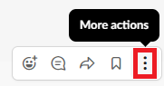

# Een bericht plaatsen [!DNL Slack] opmerking toevoegen als update

U kunt een [!DNL Slack] opmerking als een update van een specifiek project, specifieke taak of een specifieke uitgave in [!DNL Adobe Workfront].

## Toegangsvereisten

U moet het volgende hebben:

<table style="table-layout:auto"> 
 <col> 
 </col> 
 <col> 
 </col> 
 <tbody> 
  <tr> 
   <td role="rowheader"><a href="https://www.workfront.com/plans" target="_blank">[!DNL [!DNL Adobe Workfront] plan]</a>*</td> 
   <td> 
[!UICONTROL Pro] of hoger
 </td> 
  </tr> 
 </tbody> 
</table>

&#42;Neem contact op met uw [!DNL Workfront] beheerder.\

## Vereisten

Voordat u een [!DNL Slack] opmerking toevoegen als update

* Configureren [!DNL Workfront for Slack]\
   Voor instructies over het configureren [!DNL Workfront for Slack], zie [Configureren [!DNL Adobe Workfront for Slack]](../../workfront-integrations-and-apps/using-workfront-with-slack/configure-workfront-for-slack.md).

## Een bericht plaatsen [!DNL Slack] opmerking als een update in [!DNL Workfront]

1. Houd de muisaanwijzer boven een opmerking die u in een [!DNL Slack] kanaal, dan klik **[!UICONTROL More actions]** pictogram.

   

1. Klik op **[!UICONTROL Post an update]...`<the name of your Workfront app>`**.

   >[!NOTE]
   >
   >Mogelijk moet u op **[!UICONTROL More message shortcuts]** en schuiven omlaag naar de locatie van de **[!UICONTROL Post an update]** optie.
   >
   >
   >

1. In de **[!UICONTROL Project, task or issue]** typt u de naam van een project, taak of probleem waaraan u de update wilt toevoegen. Klik vervolgens op de naam van het project, de taak of de uitgave wanneer deze in de lijst wordt weergegeven. U moet toegang hebben om een object te kunnen bekijken voordat het in de lijst wordt weergegeven.
1. (Optioneel) In het dialoogvenster **[!UICONTROL Include another user]** typt u de naam van een gebruiker die u in de update wilt opnemen. Klik vervolgens op de naam wanneer deze in de lijst wordt weergegeven.
1. Klik op **[!UICONTROL Submit]**.

   Een bevestiging wordt weergegeven in [!DNL Slack] om je te laten weten dat je update is gepost.

1. (Optioneel) Klik op de naam van het project, de taak of het probleem waarin u de update hebt geplaatst om het te openen in [!DNL Workfront].

   Er is een indicatie in [!DNL Workfront] dat de update afkomstig is van [!DNL Slack].

   
