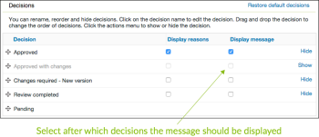

# Opties voor goedkeuringsbeslissingen configureren in [!DNL Workfront Proof]

>[!IMPORTANT]
>
>Dit artikel verwijst naar functionaliteit in het standalone product [!DNL Workfront Proof]. Voor informatie over proefdrukken binnen [!DNL Adobe Workfront], zie [Proofing](../../../review-and-approve-work/proofing/proofing.md).

Als [!DNL Workfront Proof] beheerder die een Uitgezochte of de uitgave van de Premie plan gebruikt, kunt u opties van het goedkeuringsbesluit op de volgende manieren voor alle proeven vormen die door worden gecreeerd [!DNL Workfront Proof] gebruikers in uw organisatie:

* De naam van de beslissing wijzigen
* De volgorde van de beslissingen in de proefdrukviewer wijzigen
* Beslissen welke besluiten moeten worden weergegeven

In dit artikel wordt het volgende uitgelegd:

## Instellingen voor besluit configureren

1. Klik op **[!UICONTROL Account Settings]**.
1. Open de **[!UICONTROL Decisions]** tab.
1. Breng een van de volgende wijzigingen aan:

   * Als u een beslissing wilt verbergen, klikt u op **[!UICONTROL Hide]** rechts van de beslissing die u niet nodig hebt.
   * Als u de naam van een beslissing wilt wijzigen, klikt u op de naam van de beslissing, bewerkt u de beslissing en klikt u buiten het vak (of drukt u op Enter). [!DNL Workfront Proof] werkt de naam van het besluit op alle bestaande proefdrukken in uw systeem bij.

      >[!IMPORTANT]
      >
      >Behoud de logica voor een besluit wanneer u het anders noemt. De standaardbeslissing &#39;Afgewezen&#39; kan bijvoorbeeld worden gewijzigd in &#39;Nieuwe versie vereist&#39;, maar niet in &#39;Verzenden naar printers&#39;.

      Als je terug wilt gaan naar de [!DNL Workfront Proof] standaardinstellingen, kunt u op Standaardinstellingen herstellen klikken.

>[!NOTE]
>
>* De logica achter de besluiten wordt gebruikt om de algemene status van een proefwerkschema te berekenen als er veelvoudige besluiten van diverse niveaus zijn.
>* De besluiten &quot;Goedgekeurd&quot;en &quot;Goedgekeurd met veranderingen&quot;brengen de volgende fase in automatische werkschema&#39;s teweeg.
>* Als u de naam van een beslissing wijzigt en u de logica wilt controleren, klikt u op **[!UICONTROL Activity]** in het linkernavigatievenster en controleer uw activiteitenlogboek waar de oorspronkelijke besluiten tussen haakjes worden weergegeven.
>
>  >

## Redenen voor besluiten

Beslissingsredenen zijn een goede manier om aanvullende informatie over besluiten over een bewijs vast te leggen.

1. Klik op **[!UICONTROL Settings]** > **[!UICONTROL Account Settings]**.

1. Open de **[!UICONTROL Decisions]** tab.
Standaard zijn er redenen voor alle besluitvormers op uw proefdrukken, maar u kunt dat beperken tot primaire besluitvormers.
Afhankelijk van uw vereisten kunt u meerdere redenen selecteren of één keuzelijst maken. U kunt ook redenen verplicht stellen, wat betekent dat revisoren een reden moeten kiezen voordat ze hun beslissing op een bewijs kunnen bewaren.
   

1. In de **[!UICONTROL Reasons]** sectie, klikt u op **[!UICONTROL New reason]**.
   

1. Typ een titel voor de sectie Redenen in het vak onder **[!UICONTROL Reason]**.
1. Als u een tekstvak wilt opnemen, selecteert u **[!UICONTROL Include text box]**.
1. Klik op **[!UICONTROL Save]**.
   
De belangrijkste stap is het selecteren van de beslissingen die de redenen moeten weergeven. Als je dat vergeet, zullen de redenen niet op je proefdrukken worden vermeld.

1. Schakel de selectievakjes in het dialoogvenster **[!UICONTROL Display reasons]** in de lijst met beslissingen boven aan de pagina. U kunt een of meer beslissingen selecteren om uw redenen.
   

## Berichten na een beslissing maken

U kunt een bericht voor een postbeslissing maken om weer te geven nadat een controleur zijn beslissing over de bewijsmiddelen heeft opgeslagen.

1. Klik op **[!UICONTROL Settings]** > **[!UICONTROL Account Settings]**.

1. Open de **[!UICONTROL Decisions]** tab.
1. In de **[!UICONTROL Post decision message]** sectie, klikt u op **[!UICONTROL Edit]** aan het einde van de **[!UICONTROL Message]** rij.
U kunt ook beslissen of u wilt dat het bericht aan alle besluitvormers wordt getoond of dat u het tot de Primaire besluitvormer wilt beperken.
   

1. In de **[!UICONTROL Display message]** kolom, specificeer de besluiten dit bericht zou moeten worden getoond.
Als u niet minstens één beslissing selecteert, wordt het bericht niet weergegeven op uw proefdrukken. Controleer minstens één vakje in deze kolom.
   
