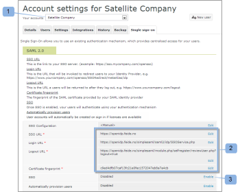

# Single Sign-On voor [!DNL Workfront Proof] -gebruikers configureren

>[!IMPORTANT]
>
>Dit artikel verwijst naar functionaliteit in het zelfstandige product [!DNL Workfront Proof] . Voor informatie bij het proef binnen [!DNL Adobe Workfront], zie [&#x200B; het Bewijzen &#x200B;](../../../review-and-approve-work/proofing/proofing.md).

Als u het abonnement Select of Premium hebt, kunt u SSO-functionaliteit (Single Sign-On) bieden waarmee u de gebruikersnaam en het wachtwoord van uw bestaande organisatie kunt gebruiken om toegang te krijgen tot uw [!DNL Workfront Proof] -account.

Dit betekent dat u zich op uw eigen aanmeldingssysteem verifieert, niet op de aanmeldingspagina van [!DNL Workfront Proof] .

>[!NOTE]
>
>U moet een aangepast subdomein of domein op uw [!DNL Workfront Proof] -account hebben ingesteld om SAML in te schakelen. U kunt aangepaste subdomeinen gratis instellen. Zie [&#x200B; Brandend &#x200B;](https://support.workfront.com/hc/en-us/sections/115000921208-Branding) voor meer informatie.U kunt meer over volledig aangepaste domeinen op onze [&#x200B; Merk de  [!DNL Workfront Proof]  plaats lezen - geavanceerd &#x200B;](../../../workfront-proof/wp-acct-admin/branding/brand-wp-site-advanced.md).

## SSO inschakelen binnen [!DNL Workfront Proof]

De functie Single Sign-On kan worden ingeschakeld op het tabblad [!UICONTROL Single sign-on] van uw [!UICONTROL Account settings] . Deze functie is van toepassing op alle gebruikers van uw [!DNL Workfront Proof] -account. Zie [&#x200B; Montages van de Rekening &#x200B;](https://support.workfront.com/hc/en-us/sections/115000912147-Account-settings) voor meer informatie.

## Entiteit-id

Als serviceprovider hebben we hier onze entiteit-id gepubliceerd:

[&#x200B; https://yoursubdomain.proofhq.com/saml/module.php/saml/sp/metadata.php/phq &#x200B;](https://yoursubdomain.proofhq.com/saml/module.php/saml/sp/metadata.php/phq) (waar &quot;yoursubdomain&quot;het subdomein van uw rekening is)

[!DNL Workfront Proof] vereist het e-mailadres van de gebruiker als hun unieke id, die kan worden doorgegeven als een van de volgende kenmerken:

* urn :mace: dir :attribute-def: emailAddress
* http://schemas.xmlsoap.org/ws/2005/05/identity/claims/emailaddress
* http://schemas.xmlsoap.org/claims/EmailAddress
* urn :oid: 0.9.2342.19200300.100.1.3
* http://axschema.org/contact/email
* openid.sreg.email
* post
* email
* emailAddress

SSO configureren:

1. Open de tab **[!UICONTROL Single Sign-On]** (1).
1. Ga **SSO URL** (2) in.
Dit is de verbinding aan uw server SSO (bijvoorbeeld, **https://sso.mycompany.com/opensso**).

1. Ga **Login URL** (3) in.
Dit is de URL die wordt aangeroepen om de gebruikers om te leiden naar uw identiteitsprovider.

   Dit is geen daadwerkelijke URL u in browser ingaat, maar eerder een eindpunt dat de informatie zal verwerken wij het verzenden om het Login scherm voor te stellen.

1. Ga **Logout URL** (4) in.
Dit is de URL waarnaar u terugkeert nadat u zich hebt afgemeld, bijvoorbeeld

   **https://www.yourcompany.com/services/logout.asp**

1. Ga de **vingerafdruk van het Certificaat** (5) in.
1. De SHA1-vingerafdruk van het SAML-certificaat dat door uw SAML Identity Provider is verstrekt.
1. Zorg ervoor dat u de toetsinfo opneemt door deze in te stellen op uw identiteitsprovider.
1. Schakelaar **SSO** aan **[!UICONTROL Enabled]** (6).
Zodra SSO wordt toegelaten, zullen u en andere gebruikers op uw rekening het programma openen gebruikend uw eigen authentificatiemechanisme. Wat dit betekent is dat wanneer de gebruikers tot uw [!DNL Workfront Proof] account login scherm (bijvoorbeeld, **yourcompany.proofhq.com/login**) toegang hebben, zij met het overdrachtvenster aan uw eigen authentificatie login pagina zullen worden veroorzaakt.

1. (Facultatief) laat **automatisch voorzieningengebruikers** (7) toe.
Zodra deze optie is ingeschakeld, worden gebruikersaccounts automatisch gemaakt voor mensen die geen eigen [!DNL Workfront Proof] -profielen hebben, maar toegang hebben tot uw [!DNL Workfront Proof] -account met behulp van hun Single Sign-On-referenties. Deze actie wordt alleen uitgevoerd als de gebruikerslimiet voor uw account nog niet is bereikt.

1. Nieuwe provisioned gebruikers zullen de het profieltoestemmingen van de Manager door gebrek toegewezen hebben. Als u meer informatie nodig hebt, zie [&#x200B; Profielen van de Toestemmingen van de Bewijs in  [!DNL Workfront Proof]](../../../workfront-proof/wp-acct-admin/account-settings/proof-perm-profiles-in-wp.md).

## SSO inschakelen voor satellietaccounts

Wanneer u satellietrekeningen hebt die met uw hubrekening worden verbonden, kunt u hen van het niveau van de hubrekening beheren.

Single Sign-On is een Select- en Premium-functie, zodat Single Sign-On alleen kan worden ingeschakeld voor satellieten die zich op Select- en Premium-abonnementen bevinden.

1. Klik op **[!UICONTROL Settings]** > **[!UICONTROL Account settings]** (1).

1. Klik op de satellietaccount in de keuzelijst (2).
1. Open de tab **[!UICONTROL Single Sign-On]** (3).
1. Begin het uitgeven van de configuratie SSO (4).
1. 
Hier zult u twee methodes (5) van configuratie hebben:

1. **Geërft:** SSO met de configuratie die van uw hubrekening wordt genomen.
Als een gebruiker tot [!DNL Workfront Proof] door de **standaard login pagina** ([&#x200B; https://business.adobe.com/nl/products/workfront/proofing-approvals.html &#x200B;](https://business.adobe.com/nl/products/workfront/proofing-approvals.html)) toegang heeft zal er **twee niveaus van vergunning** zijn: Eerst wordt een gebruiker gevraagd om binnen het gebruiken van [!DNL Workfront Proof] toegangsgegevens (e-mail en wachtwoord) te registreren; dan wordt de gebruiker overgebracht door een venster SSO aan de SSO login pagina.
Daarom, met de toegelaten dienst SSO, adviseren wij om binnen door uw eigen [!DNL Workfront Proof] subdomain/domein te registreren.

   >[!NOTE]
   >
   >Op dit moment, wanneer Single Sign-On is ingeschakeld op uw [!DNL Workfront Proof] -account, kunt u zich niet met deze gegevens aanmelden bij de iPhone-app.

   1. **Hand** (gebrek): SSO met een verschillende configuratie (bijvoorbeeld, richtend aan een andere Leverancier van de Identiteit).

      >[!NOTE]
      >
      >Als de satellietrekening de configuratie SSO van de hubrekening erft, zal het login scherm dat van de hubrekening zijn. Wanneer de gebruiker van de satellietrekening zijn SSO-aanmeldgegevens op deze pagina invoert, worden deze weer doorgestuurd naar de satellietrekening.

      

   1. Klik op **[!UICONTROL Save]** (6).

## SSO-instellingen overgenomen van een Hub-account

Wanneer u verkiest om de montages van uw hubrekening over te nemen zult u merken dat alle gebieden nu met de gegevens van uw hubrekening (7) worden bevolkt en dat Enige Sign-On automatisch wordt Toegelaten/Gehandicapten(8) zoals op uw hoofdrekening. Er zijn ook geen bewerkingskoppelingen meer in de velden, aangezien de gehele SSO-configuratie voor de Satellite Account nu is ingesteld en beheerd vanaf uw hubaccount.

In uw hubaccount (9) toont het veld [!UICONTROL SSO Usage] aan dat deze configuratie wordt gebruikt door satellietaccounts (10).\

## Handmatig geconfigureerde SSO

Als Handmatige SSO-configuratie is gekozen voor een satellietaccount (1), moet u de gegevens voor Single Sign-On handmatig invoeren.

1. Klik op **[!UICONTROL Settings]** > **[!UICONTROL Account settings]** (1).

1. Open de tab **[!UICONTROL Single sign-on]** .
1. Klik op **[!UICONTROL Edit],** vul het veld in en klik op **[!UICONTROL Save]** (2).

1. Klik in de **[!UICONTROL SSO]** -rij op **[!UICONTROL Enabled]** (3).

## SSO-aanmelding

1. Klik op **[!UICONTROL Settings]** > **[!UICONTROL Account settings]** (1).

1. Open de tab **[!UICONTROL Single sign-on]** .
1. Zorg ervoor dat uw [!DNL Workfront Proof] domein/subdomein (1) is ingesteld en dat uw gebruikers via dit aangepaste domein/subdomein toegang hebben tot uw [!DNL Workfront Proof] -account.
   
Als Single Sign-On is ingeschakeld, wordt in de URL voor aanmelding bij een subdomein (bijvoorbeeld yourcompany.proofhq.com/login) een transferscherm (2) weergegeven waarmee u rechtstreeks naar de SSO-aanmeldingspagina gaat.
   

1. Als een gebruiker [!DNL Workfront Proof] door het **standaardlogin pagina** ([&#x200B; https://business.adobe.com/nl/products/workfront/proofing-approvals.html &#x200B;](https://business.adobe.com/nl/products/workfront/proofing-approvals.html)) toegang heeft zal er **twee niveaus van vergunning** zijn. Eerst wordt een gebruiker gevraagd zich aan te melden met [!DNL Workfront Proof] toegangsgegevens (e-mail en wachtwoord). Vervolgens wordt de gebruiker overgebracht via een SSO-venster (2) naar de SSO-aanmeldingspagina.\
   Daarom, met de toegelaten dienst SSO, adviseren wij om binnen door uw eigen [!DNL Workfront Proof] subdomain/domein te registreren.

1. Als Single Sign-On momenteel is ingeschakeld op uw Workfront Proof-account, kunt u zich niet met deze gegevens aanmelden bij de iPhone-app.

## Informatie over het toevoegen van een nieuwe gebruiker

Wanneer de functie voor eenmalige aanmelding is ingeschakeld op uw [!DNL Workfront Proof] -account, ontvangen nieuwe gebruikers geen bevestigingse-mails omdat hun accounts automatisch worden geactiveerd en klaar zijn voor gebruik.

Nadat u op de knop [!UICONTROL Login] hebt geklikt op de aanmeldingspagina van [!DNL Workfront Proof] , gaan gebruikers naar de aanmeldingspagina van de SSO en wordt hen gevraagd uw aanmeldingsgegevens voor Single Sign-On in te voeren.

>[!IMPORTANT]
>
>Gebruikers worden tijdens het verificatieproces geïdentificeerd aan de hand van een e-mailadres. Dit houdt in dat het e-mailaccount dat wordt gebruikt voor uw aanmelding bij een SSO, het e-mailadres moet zijn van de gebruiker die is geregistreerd in uw account.

## Active Directory Federation Services (AD FS)

De Actieve Diensten van de Federatie van de Folder (AD FS) is een [!DNL Microsoft] softwarecomponent die op de werkende systemen van de Server van Vensters kan worden geïnstalleerd om gebruikers van Enige Sign-On toegang tot systemen en toepassingen te voorzien die over organisatorische grenzen worden gevestigd. Voor meer informatie, zie de &quot;Actieve Diensten van de Federatie van de Folder&quot;op de website van het Netwerk van de Ontwikkelaar van Microsoft.

Het [!DNL Workfront Proof] -systeem ondersteunt SAML 2.0 en is alleen compatibel met AD FS versie 2.0 of hoger.

Zie [&#x200B; Enige Sign-On in  [!DNL Workfront Proof]: Configuratie van FS van de ADVERTENTIE &#x200B;](../../../workfront-proof/wp-acct-admin/account-settings/sso-in-wp-adfs-configuration.md) voor gedetailleerde instructies.
