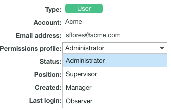

# Proefprofielen voor proefmachtigingen in [!DNL Workfront Proof]

>[!IMPORTANT]
>
>Dit artikel verwijst naar functionaliteit in het zelfstandige product [!DNL Workfront Proof] . Voor informatie bij het proef binnen [!DNL Adobe Workfront], zie [ het Bewijzen ](../../../review-and-approve-work/proofing/proofing.md).

Als [!DNL Workfront] beheerder of [!DNL Workfront Proof] beheerder kunt u een Proefmachtigingenprofiel aan een gebruiker toewijzen om de proefdrukmogelijkheden op te geven die de gebruiker voor alle proefdrukken in het systeem heeft. Voor informatie over het vormen van het Profiel van de Toestemming van een Gebruiker van de Toestemming van het Bewijs, zie [ het Profiel van de Toestemming van een Gebruiker in  [!DNL Workfront Proof]](../../../workfront-proof/wp-acct-admin/account-settings/config-user-pref-in-wp.md) vormen.

>[!NOTE]
>
>U kunt ook het volgende doen:
>
>* Bied gebruikers specifieke rollen op individuele proefdrukken. Voor meer informatie over proefdrukrollen, zie [ de Rollen van het Bewijs binnen beheren  [!DNL Workfront Proof]](../../../workfront-proof/wp-work-proofsfiles/share-proofs-and-files/manage-proof-roles.md).
>* Aangepaste profielen maken voor gebruikers in uw organisatie. Voor meer informatie, zie [ douaneprofielen in  [!DNL Workfront Proof]](../../../workfront-proof/wp-acct-admin/account-settings/configure-custom-profiles.md) vormen.
>

In de volgende tabel worden de machtigingen weergegeven die beschikbaar zijn bij elk profiel voor Proefmachtigingen.

| **Eigen Punten** |  |  |  |  | **Andere Punten van Gebruikers** |  |  | **Admin** | **Facturering** |
|---|---|---|---|---|---|---|---|---|---|
|   | **voeg toe** | **Mening** | **geeft** uit | **Schrapping** | **Mening** | **geeft** uit | **Schrapping** | **geef uit en schrap** | **geeft** uit |
| Factureringsbeheer |  |  |  |  |  |  |  |  |  |
| Beheerder |  |  |  |  |  |  |  |  |   |
| Toezichthouder |  |  |  |  |  |  |  |   |   |
| Manager |  |  |  |  |   |   |   |   |   |
| Waarnemer |   |  |   |   |   |   |   |   |   |
| Bezoeker |   |  |   |   |   |   |   |   |   |

{style="table-layout:auto"}

Overweeg het volgende over rollen en toestemmingen:

* Toegewezen profielmachtigingen hebben alleen betrekking op de gebruikers en items in uw eigen account. De uitzondering is in het geval van Satellietrekeningen, waar de Beheerder en de Facturerings Beheerder voor de belangrijkste (hub) rekeningen tot de rekeningsmontages en het factureren van die rekeningen van het niveau van de hubrekening kunnen toegang hebben en beheren.
* Factureringsbeheerders en -beheerders kunnen gebruikers verwijderen. Dit kan alleen worden gedaan in de accountinstellingen.
* Wanneer de Beheerders en de Beheerders van de Facturering bewijzen bekijken die door andere gebruikers in hun rekening worden bezeten, bekijken zij hen met de rol van Recensent.
* Met de rol Alleen-lezen hebben factureringsbeheerders en beheerders toegang tot proefdrukken in mappen die met hen worden gedeeld of in mappen die door hen worden gemaakt.

In de volgende secties worden elk profiel en de machtigingen beschreven die aan het profiel zijn gekoppeld in een standaardconfiguratie van [!DNL Workfront Proof] :

* [ Facturerende Beheerder ](#billing-administrator)
* [ Beheerder ](#administrator)
* [ Supervisor ](#supervisor)
* [ Manager ](#manager)
* [ Observer ](#observer)
* [ Bezoeker ](#visitor)
* [Gast](#guest)

## Factureringsbeheerder {#billing-administrator}

De facturerende Beheerders hebben toegang tot [ montages van de Rekening in  [!DNL Workfront Proof]](../../../workfront-proof/wp-acct-admin/account-settings/account-settings.md) and [The [!DNL Workfront Proof]  het Factureren Pagina ](../../../workfront-proof/wp-billingsettings/manage-your-billing/wp-billing-page.md), en hebben de volgende toestemmingen:

 kan proefdrukken produceren, dossiers uploaden, en omslagen tot stand brengen. Voor meer informatie, zie [ Proefdrukken in  [!DNL Workfront Proof]](../../../workfront-proof/wp-work-proofsfiles/create-proofs-and-files/generate-proofs.md) produceren, [ uploadt Dossiers en de Inhoud van het Web aan  [!DNL Workfront Proof]](../../../workfront-proof/wp-work-proofsfiles/create-proofs-and-files/upload-files-web-content.md), en [ creeer Omslagen in  [!DNL Workfront Proof]](../../../workfront-proof/wp-work-proofsfiles/organize-your-work/create-folders.md).

 kan, eigen proeven en dossiers bekijken uitgeven en schrappen zij creëren.

 kan, proeven en dossiers bekijken uitgeven en schrappen die door alle gebruikers in de organisatie worden gecreeerd.

 kan de openbare omslagen van andere gebruikers schrappen. Voor meer informatie, zie [ Mappen in  [!DNL Workfront Proof]](../../../workfront-proof/wp-work-proofsfiles/organize-your-work/manage-folders.md) beheren.

 heeft uitgeeft rechten op alle proeven die in de rekening worden gecreeerd.

 kan als eigenaar worden geplaatst Dropzone. Voor meer informatie, zie [ dropzone binnen vormen  [!DNL Workfront Proof]](../../../workfront-proof/wp-acct-admin/account-settings/configure-dropzone-in-wp.md).

 kan tot de het factureren pagina toegang hebben en de het facturerings details uitgeven. Voor meer informatie, zie [ de  [!DNL Workfront Proof]  Facturerende Pagina ](../../../workfront-proof/wp-billingsettings/manage-your-billing/wp-billing-page.md).

 kan tot de pagina van de Montages van de Rekening toegang hebben en de rekeningsdetails uitgeven. Voor meer informatie, zie [ montages van de Rekening in  [!DNL Workfront Proof]](../../../workfront-proof/wp-acct-admin/account-settings/account-settings.md).

 kan het afval leegmaken. Voor meer informatie, zie [ Herstel en Leeg het Afval in  [!DNL Workfront Proof]](../../../workfront-proof/wp-work-proofsfiles/manage-your-work/restore-and-empty-trash.md).

 kan, gebruikers toevoegen uitgeven en schrappen.

 kan groepen tot stand brengen en nieuwe contacten toevoegen.

 kan contacten schrappen.

 kan proefdrukken uitgeven als er geen antwoorden op hen zijn.

 kan proefdrukantwoorden niet uitgeven.

 kan niet de privé omslagen van andere Gebruikers schrappen. Voor meer informatie, zie [ Mappen in  [!DNL Workfront Proof]](../../../workfront-proof/wp-work-proofsfiles/organize-your-work/manage-folders.md) beheren.

Voor informatie over de montages van de Rekening, zie [ montages van de Rekening in  [!DNL Workfront Proof]](../../../workfront-proof/wp-acct-admin/account-settings/account-settings.md).

Voor informatie bij het Factureren, zie [ de  [!DNL Workfront Proof]  Facturerende Pagina ](../../../workfront-proof/wp-billingsettings/manage-your-billing/wp-billing-page.md).

### Beheerder {#administrator}

De beheerders hebben toegang tot [ montages van de Rekening ](https://support.workfront.com/hc/en-us/sections/115000912147-Account-Settings) en hebben de volgende toestemmingen:

 kan proefdrukken tot stand brengen, dossiers uploaden, en omslagen tot stand brengen. Voor meer informatie, zie [ Proefdrukken in  [!DNL Workfront Proof]](../../../workfront-proof/wp-work-proofsfiles/create-proofs-and-files/generate-proofs.md) produceren, [ uploadt Dossiers en de Inhoud van het Web aan  [!DNL Workfront Proof]](../../../workfront-proof/wp-work-proofsfiles/create-proofs-and-files/upload-files-web-content.md), en [ creeer Omslagen in  [!DNL Workfront Proof]](../../../workfront-proof/wp-work-proofsfiles/organize-your-work/create-folders.md).

 kan, proeven en dossiers bekijken uitgeven en schrappen zij creeerden.

 kan, proeven en dossiers bekijken uitgeven en schrappen die door alle gebruikers in de organisatie worden gecreeerd.

 kan de openbare omslagen van andere Gebruikers schrappen. Voor meer informatie, zie [ Mappen in  [!DNL Workfront Proof]](../../../workfront-proof/wp-work-proofsfiles/organize-your-work/manage-folders.md) beheren.

 heeft uitgeeft rechten op alle proeven die in de rekening worden gecreeerd.

 kan als eigenaar worden geplaatst Dropzone. Voor meer informatie, zie [ dropzone binnen vormen  [!DNL Workfront Proof]](../../../workfront-proof/wp-acct-admin/account-settings/configure-dropzone-in-wp.md).

 kan tot de pagina van de Montages van de Rekening toegang hebben en de rekeningsdetails uitgeven. Voor meer informatie, zie [ montages van de Rekening in  [!DNL Workfront Proof]](../../../workfront-proof/wp-acct-admin/account-settings/account-settings.md).

 kan het afval leegmaken. Voor meer informatie, zie [ Herstel en Leeg het Afval in  [!DNL Workfront Proof]](../../../workfront-proof/wp-work-proofsfiles/manage-your-work/restore-and-empty-trash.md).

 kan, gebruikers toevoegen uitgeven en schrappen.

 kan groepen tot stand brengen en nieuwe contacten toevoegen.

 kan contacten schrappen.

 kan proefdrukken uitgeven als er geen antwoorden op hen zijn.

 kan proefdrukantwoorden niet uitgeven.

 kan niet de privé omslagen van andere Gebruikers schrappen. Voor meer informatie, zie [ Mappen in  [!DNL Workfront Proof]](../../../workfront-proof/wp-work-proofsfiles/organize-your-work/manage-folders.md) beheren.

 kan tot de het Factureren pagina toegang hebben of de het factureringsdetails uitgeven. Voor meer informatie, zie [ de  [!DNL Workfront Proof]  Facturerende Pagina ](../../../workfront-proof/wp-billingsettings/manage-your-billing/wp-billing-page.md).

### Toezichthouder {#supervisor}

De toezichthouders hebben de volgende toestemmingen:

 kan proefdrukken tot stand brengen, dossiers uploaden, en omslagen tot stand brengen. Voor meer informatie, zie [ Proefdrukken in  [!DNL Workfront Proof]](../../../workfront-proof/wp-work-proofsfiles/create-proofs-and-files/generate-proofs.md) produceren, [ uploadt Dossiers en de Inhoud van het Web aan  [!DNL Workfront Proof]](../../../workfront-proof/wp-work-proofsfiles/create-proofs-and-files/upload-files-web-content.md), en [ creeer Omslagen in  [!DNL Workfront Proof]](../../../workfront-proof/wp-work-proofsfiles/organize-your-work/create-folders.md).

 kan, eigen proeven en dossiers bekijken uitgeven en schrappen zij creeerden.

 kan, proeven en dossiers bekijken uitgeven en schrappen die door alle gebruikers in de organisatie worden gecreeerd.

 kan de openbare omslagen van andere Gebruikers schrappen. Voor meer informatie, zie [ Mappen in  [!DNL Workfront Proof]](../../../workfront-proof/wp-work-proofsfiles/organize-your-work/manage-folders.md) beheren.

 heeft uitgeeft rechten op alle proeven die in de rekening worden gecreeerd.

 kan als eigenaar worden geplaatst Dropzone. Voor meer informatie, zie [ dropzone binnen vormen  [!DNL Workfront Proof]](../../../workfront-proof/wp-acct-admin/account-settings/configure-dropzone-in-wp.md).

 kan groepen tot stand brengen en nieuwe contacten toevoegen.

 kan contacten schrappen.

 kan proefdrukken uitgeven als er geen antwoorden op hen zijn.

 kan proefdrukantwoorden niet uitgeven.

 kan niet de privé omslagen van andere Gebruikers schrappen. Voor meer informatie, zie [ Omslagen in  [!DNL Workfront Proof]](../../../workfront-proof/wp-work-proofsfiles/organize-your-work/folders.md).

 kan tot de het Factureren pagina of montages van de Rekening toegang hebben niet. Voor meer informatie, zie [ de  [!DNL Workfront Proof]  Facturerende Pagina ](../../../workfront-proof/wp-billingsettings/manage-your-billing/wp-billing-page.md) en [ montages van de Rekening in  [!DNL Workfront Proof]](../../../workfront-proof/wp-acct-admin/account-settings/account-settings.md).

 kan gebruikers toevoegen, uitgeven of schrappen niet.

 kan het afval niet leeg maken. Voor meer informatie, zie [ Herstel en Leeg het Afval in  [!DNL Workfront Proof]](../../../workfront-proof/wp-work-proofsfiles/manage-your-work/restore-and-empty-trash.md).

### Manager {#manager}

Managers hebben de volgende machtigingen:

 kan proefdrukken tot stand brengen, dossiers uploaden, en omslagen tot stand brengen. Voor meer informatie, zie [ Proefdrukken in  [!DNL Workfront Proof]](../../../workfront-proof/wp-work-proofsfiles/create-proofs-and-files/generate-proofs.md) produceren, [ uploadt Dossiers en de Inhoud van het Web aan  [!DNL Workfront Proof]](../../../workfront-proof/wp-work-proofsfiles/create-proofs-and-files/upload-files-web-content.md), en [ creeer Omslagen in  [!DNL Workfront Proof]](../../../workfront-proof/wp-work-proofsfiles/organize-your-work/create-folders.md).

 kan, eigen proeven en dossiers bekijken uitgeven en schrappen zij creëren of bezitten.

 kan, proef van andere gebruikers zien herzien en goedkeuren die uitdrukkelijk met hen (read-only rechten op alles in een gedeelde omslag) worden gedeeld. Voor meer informatie, zie [ Beheer de Rollen van het Bewijs binnen  [!DNL Workfront Proof]](../../../workfront-proof/wp-work-proofsfiles/share-proofs-and-files/manage-proof-roles.md).

 kan groepen tot stand brengen en een nieuw contact toevoegen.

 kan niet, proeven en dossiers bekijken uitgeven of schrappen die door andere gebruikers in de organisatie worden gecreeerd.

 kan geen proefdrukken of antwoorden uitgeven.

 kan niet de privé omslagen van andere Gebruikers schrappen. Voor meer informatie, zie [ Mappen in  [!DNL Workfront Proof]](../../../workfront-proof/wp-work-proofsfiles/organize-your-work/manage-folders.md) beheren.

 kan niet de openbare omslagen van andere Gebruikers schrappen. Voor meer informatie, zie [ Mappen in  [!DNL Workfront Proof]](../../../workfront-proof/wp-work-proofsfiles/organize-your-work/manage-folders.md) beheren.

 kan tot de het Factureren pagina of montages van de Rekening toegang hebben niet. Voor meer informatie, zie [ de  [!DNL Workfront Proof]  Facturerende Pagina ](../../../workfront-proof/wp-billingsettings/manage-your-billing/wp-billing-page.md) en [ montages van de Rekening in  [!DNL Workfront Proof]](../../../workfront-proof/wp-acct-admin/account-settings/account-settings.md).

 kan niet als eigenaar worden geplaatst Dropzone. Voor meer informatie, zie [ dropzone binnen vormen  [!DNL Workfront Proof]](../../../workfront-proof/wp-acct-admin/account-settings/configure-dropzone-in-wp.md).

 kan het afval niet leeg maken. Voor meer informatie, zie [ Herstel en Leeg het Afval in  [!DNL Workfront Proof]](../../../workfront-proof/wp-work-proofsfiles/manage-your-work/restore-and-empty-trash.md).

 kan gebruikers toevoegen, uitgeven of schrappen niet.

 kan geen contacten schrappen.

### Waarnemer {#observer}

Waarnemers hebben de volgende machtigingen:

 kan, proef van andere gebruikers zien herzien en goedkeuren die uitdrukkelijk met hen (read-only rechten aan alles in een gedeelde omslag) worden gedeeld. Voor meer informatie, zie [ Beheer de Rollen van het Bewijs binnen  [!DNL Workfront Proof]](../../../workfront-proof/wp-work-proofsfiles/share-proofs-and-files/manage-proof-roles.md).

 kan dossiers bekijken die uitdrukkelijk met hen worden gedeeld.

 Kan contactpersonen en groepen weergeven

 kan geen proefdrukken tot stand brengen, dossiers uploaden, en omslagen tot stand brengen. Voor meer informatie, zie [ Dossiers en de Inhoud van het Web aan  [!DNL Workfront Proof]](../../../workfront-proof/wp-work-proofsfiles/create-proofs-and-files/upload-files-web-content.md) uploaden.

 kan niet, proeven en dossiers bekijken uitgeven of schrappen die door andere gebruikers in de organisatie worden gecreeerd.

 kan geen proefdrukken of antwoorden uitgeven.

 kan geen punten schrappen die in de organisatie worden gecreeerd.

 kan tot de het Factureren pagina of montages van de Rekening toegang hebben niet. Voor meer informatie, zie [ de  [!DNL Workfront Proof]  Facturerende Pagina ](../../../workfront-proof/wp-billingsettings/manage-your-billing/wp-billing-page.md) en [ montages van de Rekening in  [!DNL Workfront Proof]](../../../workfront-proof/wp-acct-admin/account-settings/account-settings.md).

 kan niet als eigenaar worden geplaatst Dropzone. Voor meer informatie, zie [ dropzone binnen vormen  [!DNL Workfront Proof]](../../../workfront-proof/wp-acct-admin/account-settings/configure-dropzone-in-wp.md).

 kan het afval niet leeg maken. Voor meer informatie, zie [ Herstel en Leeg het Afval in  [!DNL Workfront Proof]](../../../workfront-proof/wp-work-proofsfiles/manage-your-work/restore-and-empty-trash.md).

 kan gebruikers toevoegen, uitgeven of schrappen niet.

 kan geen groepen tot stand brengen of nieuwe contacten toevoegen.

 kan geen contacten schrappen.

>[!NOTE]
>
>De menu&#39;s en functies die beschikbaar zijn voor waarnemers zijn beperkt.
>
>* Waarnemers zien het menu Koptekst of het groene menu Nieuw niet in het dashboard
>* Waarnemers zien de volgende koppelingen niet in hun instellingen: accountinstellingen, facturering
>

### Bezoeker {#visitor}

Bezoekers hebben de volgende machtigingen:

 kan, proef van andere gebruikers zien herzien en goedkeuren die uitdrukkelijk met hen (read-only rechten op alles in een gedeelde omslag) worden gedeeld. Voor meer informatie, zie [ Beheer de Rollen van het Bewijs binnen  [!DNL Workfront Proof]](../../../workfront-proof/wp-work-proofsfiles/share-proofs-and-files/manage-proof-roles.md).

 kan dossiers bekijken die uitdrukkelijk met hen worden gedeeld.

 Kan geen contactpersonen en groepen weergeven

 kan geen proefdrukken tot stand brengen, dossiers uploaden, en omslagen tot stand brengen. Voor meer informatie, zie [ Dossiers en de Inhoud van het Web aan  [!DNL Workfront Proof]](../../../workfront-proof/wp-work-proofsfiles/create-proofs-and-files/upload-files-web-content.md) uploaden.

 kan niet, proeven en dossiers bekijken uitgeven of schrappen die door andere gebruikers in de organisatie worden gecreeerd.

 kan geen proefdrukken of antwoorden uitgeven.

 kan geen punten schrappen die in de organisatie worden gecreeerd.

 kan tot de het Factureren pagina of montages van de Rekening toegang hebben niet. Voor meer informatie, zie [ de  [!DNL Workfront Proof]  Facturerende Pagina ](../../../workfront-proof/wp-billingsettings/manage-your-billing/wp-billing-page.md) en [ montages van de Rekening in  [!DNL Workfront Proof]](../../../workfront-proof/wp-acct-admin/account-settings/account-settings.md).

 kan niet als eigenaar worden geplaatst Dropzone. Voor meer informatie, zie [ dropzone binnen vormen  [!DNL Workfront Proof]](../../../workfront-proof/wp-acct-admin/account-settings/configure-dropzone-in-wp.md).

 kan het afval niet leeg maken. Voor meer informatie, zie [ Herstel en Leeg het Afval in  [!DNL Workfront Proof]](../../../workfront-proof/wp-work-proofsfiles/manage-your-work/restore-and-empty-trash.md).

 kan gebruikers toevoegen, uitgeven of schrappen niet.

 kan geen groepen tot stand brengen of nieuwe contacten toevoegen.

 kan geen contacten schrappen.

>[!NOTE]
>
>Voor bezoekers zijn slechts beperkte menu&#39;s en functies beschikbaar.
>
>* Bezoekers zien het menu Koptekst of het groene menu Nieuw niet in hun dashboard
>* Bezoekers zien de volgende koppelingen niet in hun instellingen: accountinstellingen, facturering
>

### Gast {#guest}

Met het gastprofiel krijgt u toegang tot proefdrukken voor revisoren die geen eigen Workfront Proof-account hebben. Gasten hebben rechtstreeks toegang tot proefdrukken die met hen worden gedeeld via hun persoonlijke e-mailberichten.

 kan, proefdrukken bekijken herzien en goedkeuren die uitdrukkelijk met hen worden gedeeld.

 kan dossiers bekijken die uitdrukkelijk met hen worden gedeeld.

 kan tot het Dashboard toegang hebben niet.

 kan geen die omslagen hebben met hen worden gedeeld. Voor meer informatie, zie [ Mappen in  [!DNL Workfront Proof]](../../../workfront-proof/wp-work-proofsfiles/organize-your-work/manage-folders.md) beheren.

 kan niet als Auteurs of Moderators aan de proeven worden toegevoegd. Voor meer informatie, zie [ Beheer de Rollen van het Bewijs binnen  [!DNL Workfront Proof]](../../../workfront-proof/wp-work-proofsfiles/share-proofs-and-files/manage-proof-roles.md).

>[!NOTE]
>
>Gasten zijn geen Workfront Proof-gebruikers, zodat ze niet alle proefdrukken kunnen zien die met hen worden gedeeld in hun eigen dashboard.

## Bewijs van machtigingsprofiel van een gebruiker bewerken

Beheerders en factureringsbeheerders kunnen de machtigingsprofielen van alle gebruikers in de account bewerken.

1. Voer een van de volgende handelingen uit om te zoeken naar de gebruiker die u wilt bewerken:

   * Navigeer naar **[!UICONTROL Account Settings]** en klik vervolgens op de tab **[!UICONTROL Users]** .

   * Ga naar de pagina **[!UICONTROL Contacts]** .

1. Klik op de naam van de gebruiker wiens machtigingen u wilt bewerken. 

1. Klik op het vervolgkeuzemenu **[!UICONTROL Permissions profile]** en selecteer een nieuw machtigingsprofiel. :

   

   De profielen van de toestemming zijn Beheerder, Supervisor, Manager, en Waarnemer.

1. Klik ergens buiten het menu om op te slaan.

>[!NOTE]
>
>Beheerders kunnen het profiel Factureringsbeheerder niet toewijzen. Een lijst met profielwijzigingen vindt u in de volgende logboeken:
>
>* De activiteitenlogboeken van de account
>* Het profiellogboek van de Gebruiker (toegankelijk slechts voor die Gebruiker)
>

Voor meer informatie over activiteitenlogboeken, zie [ Begrijpend het  [!DNL Workfront Proof]  Trail van de Controle van de Activiteit ](../../../workfront-proof/wp-work-proofsfiles/basic-features/activity-audit-trail.md).
