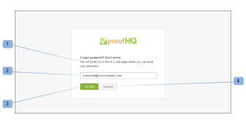

# Merk de [!DNL Workfront Proof] site - geavanceerd

>[!IMPORTANT]
>
>Dit artikel verwijst naar functionaliteit in het standalone product [!DNL Workfront Proof]. Voor informatie over proefdrukken binnen [!DNL Adobe Workfront], zie [Proofing](../../../review-and-approve-work/proofing/proofing.md).

Geavanceerde branding is beschikbaar op Select- en Premium-abonnementen en is inbegrepen in de kosten van het abonnement.

Voor informatie over standaardbranding, waaronder de aanmeldingspagina, e-mailmeldingen en proefdrukken, raadpleegt u [Merk de [!DNL Workfront Proof] site](../../../workfront-proof/wp-acct-admin/branding/brand-wp-site.md).

Geavanceerde opties voor branding zijn onder andere het aanpassen van de volgende gebieden:

* Koptekst en tekstkleur
* Koptekst webtoepassing
* Menubalk en tekstkleur
* Dashboard-welkomstvak en snelstartvak
* Voettekst
* favicon
* Paginatitel
* Help-koppelingen

De volgende secties beschrijven geavanceerde branding meer in detail:

## Geavanceerd merkingoverzicht

U vindt de [!UICONTROL Branding configuration] op het tabblad [Accountinstellingen](https://support.workfront.com/hc/en-us/sections/115000912147-Account-Settings) pagina. Als u de wijzigingen op uw account wilt toepassen, moet u ervoor zorgen dat de optie Branding is ingesteld op [!UICONTROL Enabled] (1)

Zie de onderstaande sectie voor meer informatie over het configureren van de geavanceerde opties voor branding (2-14).

## Geavanceerde brandingconfiguratie

U kunt de volgende gebieden markeren: [!DNL Workfront Proof]:

* [Webtoepassing](#web-application)
* [Koptekst](#header)
* [Koptekstkoppelingen](#header-links)
* [Zijbalk](#sidebar)
* [Welkomstvak](#welcome-box)
* [Sectiekoppen](#section-headers)

### Webtoepassing {#web-application}

U kunt kiezen uit drie opties voor branding voor de koptekst van de webtoepassing (2):

* Afbeelding markeren in de koptekst
* De naam van uw account in de koptekst
* Als u branding onbruikbaar maakt, [!DNL Workfront Proof] logo blijft in de koptekst van de webapp

Branding afbeelding - formaat wordt gewijzigd in maximaal 550 x 90 px. U kunt JPG, GIFFEN of PNG&#39;s gebruiken en de transparante achtergronden worden ondersteund.

Accountnaam - wordt uit de accountgegevens overgenomen en weergegeven met een wit lettertype. De naam van uw account kan maximaal 60 tekens bevatten (inclusief spaties en leestekens).

### Koptekst {#header}

In dit veld (3) kunt u de achtergrond van de koptekst instellen en een effen kleur of een achtergrondafbeelding kiezen.

Kleur - hier kunt u, net als in alle andere brandingvelden van de configuratie van het kleurenschema, een hexadecimale kleurwaarde invoeren of een handige kleurkiezer gebruiken (als u op het tekstveld klikt, wordt het pop-upvenster geopend). De standaardachtergrondkleur voor de koptekst is #232d2e.

Achtergrondafbeelding - kan worden gecombineerd met de Branding-afbeelding.

* U kunt JPG, GIFFEN of PNG&#39;s gebruiken - voor de bestanden met transparantie geeft een witte achtergrondkleur weer.
* De hoogte van de koptekst is 96 px en de geüploade afbeelding wordt niet aangepast voor de [!UICONTROL No repeat] optie.
* De achtergrondafbeelding wordt linksboven geplaatst.

### Koptekstkoppelingen {#header-links}

In dit veld (4) kunt u de kleur en kleur wijzigen van de gebruikersnaam van de koppelingen in het menu Koptekst dat in de rechterbovenhoek van uw account wordt weergegeven.

### Zijbalk {#sidebar}

Kies kleuren voor de menubalk (5) en de doopvont van het Menu (6) om uw Zijbalk aan te passen

>[!NOTE]
>
>De kleur van de muis wordt automatisch aangepast door een constante waarde van de Hexuitdraai aan uw geselecteerde de balkkleur van het Menu toe te voegen.

De kleur van de knop Nieuwe proefdruk kan niet worden aangepast.

### Welkomstvak {#welcome-box}

In dit veld (7) kunt u de kleur van het welkomstvak instellen die op de pagina Dashboard wordt weergegeven.

### Sectiekoppen {#section-headers}

Met deze velden kunt u de achtergrond (8) en de lettertypekleur (9) van de sectiekoppen op het tabblad [[!UICONTROL Account Settings]](https://support.workfront.com/hc/en-us/sections/115000912147-Account-Settings) pagina&#39;s.

**Voettekst**

In dit gebied (10) van het Branding configuratie kunt u footer samenstellen die bij de bodem van alle rekeningspagina&#39;s zal worden getoond. U kunt de ingebouwde redacteur gebruiken WYSIWYG of u kunt eenvoudig uw eigen ontwerp kleven.

>[!NOTE]
>
>U kunt geen HTML bewerken in de teksteditor voor de voettekst, maar u kunt wel een gekopieerd ontwerp plakken (inclusief alle koppelingen en afbeeldingen).

**Voor- en paginatitel**

U kunt aanpassen hoe uw [!DNL Workfront Proof] De pagina&#39;s worden weergegeven in de browsers door uw eigen favicon-afbeelding (.ICO-bestand) (11) en paginatitel (12) in te stellen. Deze worden weergegeven in de tabbladen/vensters van de browsers voor alle accountpagina&#39;s.

>[!NOTE]
>
>Uw favicon wordt ook weergegeven in de koppen van het dialoogvenster [!DNL Workfront Proof] Viewer-vensters voor alle proefdrukken die op uw account zijn gemaakt.

**Help-koppelingen**

U kunt uw eigen Help-koppelingen aanpassen om gebruikers en revisoren naar uw eigen inhoud te wijzen. Als u deze set wilt activeren, [!UICONTROL Help links] (13) aan Ingeschakeld en voeg uw koppelingen toe in de volgende velden (14). U kunt maximaal vier koppelingen configureren. Deze zijn beschikbaar:

* in de [!UICONTROL Header] menu onder [!UICONTROL Help] link
   

* in de [!UICONTROL Help] van het [!DNL Workfront Proof] [!UICONTROL Viewer] zijbalk
   

Voor extra kosten hebben klanten met een Enterprise-abonnement ook de mogelijkheid om het volgende volledig aan te passen:

* Pas uw openingspagina&#39;s volledig aan (bijv. aanmeldingspagina&#39;s en aanmeldingspagina&#39;s, pagina Wachtwoord vergeten)
* Uw domein volledig aanpassen

Neem contact met ons op sales.team@workfront.com voor meer informatie over de extra opties voor branding.

<!--
<h2 data-mc-conditions="QuicksilverOrClassic.Draft mode">Custom Domains</h2>
-->

<!--

Our Select and Premium plans include the option to purchase a fully-branded domain. This means that you can customize your URL as well as all links included in notification emails.&nbsp;

-->

<!--

For more information, please see&nbsp;<a href="../../../workfront-proof/wp-acct-admin/branding/configure-branded-domain-in-wp.md" class="MCXref xref">Configure a branded domain in Workfront Proof</a>.

-->

<!--
<h2 data-mc-conditions="QuicksilverOrClassic.Draft mode">Custom Page Branding</h2>
-->

<!--

Custom branding of the Workfront Proof pages is a paid service and by default&nbsp;includes full customization of the following:

-->

<!--
  <li data-mc-conditions="QuicksilverOrClassic.Draft mode"><a href="https://app.proofhq.com/login">Log in/landing page</a> </li>
  -->

<!--
  <li data-mc-conditions="QuicksilverOrClassic.Draft mode"><a href="https://app.proofhq.com/logout">Logout page</a> </li>
  -->

<!--
  <li data-mc-conditions="QuicksilverOrClassic.Draft mode"><a href="https://app.proofhq.com/login/password">Forgot password page</a> </li>
  -->

<!--
<h3 data-mc-conditions="QuicksilverOrClassic.Draft mode">Design Elements</h3>
-->

<!--

Please create your design&nbsp;in&nbsp;a .PSD file with all the elements placed in the separate layers - this will allow us to prepare the scalable pages for you.

-->

<!--

There are no particular restrictions on the .PSD files, and the look and layout of the pages is completely up to you. However please make sure that the key elements are included in your design:

-->

<!--

<strong>Login Page</strong>    

-->

<!--

<strong>Logout page</strong>    

-->

<!--

<strong>Forgot password</strong>    

-->

<!--

<strong>Inactivity alert</strong>    

-->

<!--

<strong>Invalid email address</strong>    

-->

<!--

<strong>Inactivity and incorrect email address</strong>    

-->

<!--
<note type="note">
&nbsp;The separate designs for the alerts are not required. If you'd like us to leave the default style of the messages, as shown on the screencasts above, please let us know. The team will match the colors with your design.
</note>
-->

<!--

If you'd like to have placeholder text in the text fields, please include this in your designs.

-->

<!--
<note type="note">
The wording of the alerts cannot be changed as these are the system messages.
</note>
-->

<!--

<strong>2. Fonts</strong> 

-->

<!--

Please make sure that the text is not rasterized but kept as the text layers, unless you want the particular elements to be displayed as images on your landing pages.

-->

<!--

If you use custom fonts in your design, please make sure to include the following font files: EOT + .TTF + OTF + SVG + WOFF for support in all browsers.

-->

<!--
<note type="note">
&nbsp; You need to hold an appropriate license, which allows implementing your selected fonts on the web pages.
</note>
-->

<!--

If you use the standard and widely available fonts, the font files are not required. Please see the following lists for reference:

-->

<!--
  <li data-mc-conditions="QuicksilverOrClassic.Draft mode"><a href="http://www.w3schools.com/cssref/css_websafe_fonts.asp">Websafe fonts listed in the standard Font families</a> </li>
  -->

<!--
  <li data-mc-conditions="QuicksilverOrClassic.Draft mode"><a href="https://www.google.com/fonts">Open Source Google fonts</a> </li>
  -->

<!--

<strong>3. Screen resolution</strong> 

-->

<!--

We support 1024x768 screen resolution (1366x768 for wide screens) and upwards. However, for the landing pages designs we do recommend using higher resolution for the better results on the various screens. The best practice would be to determine what screen resolution is the most common on your users' machines and prepare a slightly bigger design.

-->

<!--

<strong>4. Browsers compatibility</strong> 

-->

<!--

The newer browsers generally don't require any custom code to display the pages properly. However, if your users have the older browser versions installed on their machines some code adjustments may be needed.

-->

<!--

By default we do prepare the pages compatible with the following browsers:

-->

<!--
  <li data-mc-conditions="QuicksilverOrClassic.Draft mode">Internet Explorer 9+</li>
  -->

<!--
  <li data-mc-conditions="QuicksilverOrClassic.Draft mode">Safari 6.x+</li>
  -->

<!--
  <li data-mc-conditions="QuicksilverOrClassic.Draft mode">Chrome 22+ *</li>
  -->

<!--
  <li data-mc-conditions="QuicksilverOrClassic.Draft mode">Firefox 15+ *</li>
  -->

<!--

* Preferred browsers 

-->

<!--
<note type="note"> Workfront Proof will not design your custom pages, the PSD files must be supplied by you, but if you have any questions, please contact our Support team.
</note>
-->
