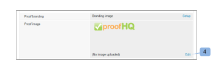

# Plaats de [!DNL Workfront Proof] -site

>[!IMPORTANT]
>
>In dit artikel wordt verwezen naar de functionaliteit van het zelfstandige [!DNL Workfront] proefexemplaar. Voor informatie bij het proef binnen [!DNL Adobe Workfront], zie [&#x200B; het Bewijzen &#x200B;](../../../review-and-approve-work/proofing/proofing.md).

Als [!DNL Workfront Proof] beheerder kunt u uw [!DNL Workfront Proof] -account markeren zodat u en uw gebruikers een meer aangepaste ervaring krijgen.

Op alle abonnementen is gratis een standaardbranding voor accounts beschikbaar.

Voor informatie over geavanceerde branding, die het brandmerken van de kopbal, menubar, dashboard, en meer omvat, zie [&#x200B; Merk de  [!DNL Workfront Proof]  plaats - geavanceerd &#x200B;](../../../workfront-proof/wp-acct-admin/branding/brand-wp-site-advanced.md). Geavanceerde branding is alleen beschikbaar voor Select- en Premium-abonnementen

Raadpleeg de volgende secties voor informatie over het markeren van verschillende aspecten van de proefsite van [!DNL Workfront] :

## Branding inschakelen op de aanmeldingspagina van [!DNL Workfront Proof]

Om branding op uw rekening toe te laten:

1. Meld u aan bij [!DNL Workfront Proof] als de [!DNL Workfront Proof] -beheerder.
1. Klik op **[!UICONTROL Account Settings]** in de rechterbovenhoek van de interface [!DNL Workfront Proof] .

   Voor meer informatie over de diverse rekeningsmontages kunt u vormen, zie [&#x200B; montages van de Rekening.](https://support.workfront.com/hc/en-us/sections/115000912147-Account-Settings)

1. Klik op de tab **[!UICONTROL Settings]** .
1. Klik in de sectie **[!UICONTROL Branding]** op **[!UICONTROL Enable]** . (1)

   

   De brandingafbeelding wordt nu weergegeven op de aanmeldingspagina.

   >[!NOTE]
   >
   >De brandingafbeelding wordt niet weergegeven op de aanmeldingspagina als u de hoofdaanmeldings-URL van [!DNL Workfront] gebruikt. Bijvoorbeeld `https://www.proofhq.com/login` . Het toont slechts als u tot de login pagina via uw douane sub-domein of uw volledig branded domein toegang hebt. Als u uw aangepaste aanmeldingspagina wilt openen, typt u gewoon de URL van uw account in uw browser. Bijvoorbeeld: `http://<yoursubdomain>.proofhq.com.` <!--For more information about fully branded domains, see "Fully Branded Domains" in the article [Configure a branded domain in [!DNL Workfront Proof]](../../../workfront-proof/wp-acct-admin/branding/configure-branded-domain-in-wp.md).-->

   

## Branding inschakelen op proefdrukken

Uw eigen brandingafbeelding toevoegen aan de pagina [!UICONTROL proof loading] van elke proefdruk die in uw account is gemaakt:

1. Meld u aan bij [!DNL Workfront Proof] als de [!DNL Workfront Proof] -beheerder.
1. Klik op **[!UICONTROL Account Settings]** in de rechterbovenhoek van de interface [!DNL Workfront Proof] .

   Voor meer informatie over de diverse rekeningsmontages kunt u vormen, zie [&#x200B; montages van de Rekening.](https://support.workfront.com/hc/en-us/sections/115000912147-Account-Settings)

1. Klik op de tab **[!UICONTROL Settings]** .
1. Klik in de sectie **[!UICONTROL Branding]** op **[!UICONTROL Setup]** naast **[!UICONTROL Proof branding]** . (1)

   

1. Selecteer **[!UICONTROL Branding image]** in het keuzemenu.
Als u **[!UICONTROL Disable]** selecteert, wordt het [!DNL Workfront Proof] -logo weergegeven op de pagina voor het laden van proefdrukken

1. Klik op **[!UICONTROL Save]**. (3)

   

1. Klik op **[!UICONTROL Edit]** om de brandingafbeelding te selecteren (4).

   U kunt JPG, GIFFEN of PNG&#39;s gebruiken. Transparantie wordt ondersteund. De aanbevolen afbeeldingsgrootte is 150 x 300 px. De grootte van de afbeelding op de aanmeldings- en aflogpagina&#39;s wordt aan deze afmetingen aangepast.

   

1. Selecteer de afbeelding die u wilt uploaden. (5)
1. Klik op **[!UICONTROL Save]**.

   Uw brandingafbeelding wordt nu op de pagina met proefdrukken van elke proefdruk weergegeven die in uw account is gemaakt.

   

## E-mailberichten voor branding

U kunt uw brandingafbeelding zodanig configureren dat deze wordt opgenomen in e-mailberichten die naar revisoren worden verzonden. De grootte van deze afbeelding wordt gewijzigd tot de maximale grootte van 90 x 550 px.

E-mailbranding instellen:

1. Meld u aan bij [!DNL Workfront Proof] als de [!DNL Workfront Proof] -beheerder.
1. Klik op **[!UICONTROL Account Settings]** in de rechterbovenhoek van de interface [!DNL Workfront Proof] .

   Voor meer informatie over de diverse rekeningsmontages kunt u vormen, zie [&#x200B; montages van de Rekening.](https://support.workfront.com/hc/en-us/sections/115000912147-Account-Settings)

1. Klik op de tab **[!UICONTROL Settings]** .
1. Klik in de sectie **[!UICONTROL Branding]** op **[!UICONTROL Edit]** naast de afbeelding van de e-mailtoepassing (1).
   

1. Selecteer de afbeelding die u wilt gebruiken voor het brandmerken van de e-mails. (2)

   Als u al een branding van e-mail hebt geconfigureerd en u deze wilt uitschakelen, klikt u op **[!UICONTROL Clear]** . (4)

   

1. Klik op **[!UICONTROL Save]**.

   De afbeelding wordt nu weergegeven in alle e-mails met proefdrukmeldingen. (3)

   

<!--
<h2 data-mc-conditions="QuicksilverOrClassic.Draft mode">Custom Sub-Domains</h2>
-->

<!--

You can add your brand name to your Workfront Proof account URL. For example, your URL might look like this:

-->

<!--

<strong>http://yoursubdomain.proofhq.com</strong> 

-->

<!--

This customization is also included in all your proof links, as well as in the 'From' email address for your proof notifications.

-->

<!--

For more information on how to set up a branded sub-domain, see <a href="../../../workfront-proof/wp-acct-admin/branding/configure-branded-domain-in-wp.md" class="MCXref xref">Configure a branded domain in Workfront Proof</a>

-->

## Onderdrukking van knoppen en koppelingen via de API

Als u een proefdruk maakt via de [!DNL Workfront Proof] API, kunt u knoppen en koppelingen onderdrukken en uw eigen aangepaste koppelingen maken.

Zie [[!DNL Workfront Proof]  API &#x200B;](https://api.proofhq.com/) voor meer informatie.
