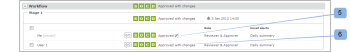

# Werken met elektronische handtekeningen in [!DNL Workfront Proof]

>[!IMPORTANT]
>
>Dit artikel verwijst naar functionaliteit in het zelfstandige product [!DNL Workfront Proof] . Voor informatie bij het proef binnen [!DNL Adobe Workfront], zie [&#x200B; het Bewijzen &#x200B;](../../../review-and-approve-work/proofing/proofing.md).

Met elektronische handtekeningen kunt u de beveiliging van uw proefdrukken verbeteren en voldoen aan industriestandaarden zoals ISO.

Deze instelling kan op het niveau van de rekening verplicht of niet verplicht worden gesteld. Als dit standaard verplicht is, wordt het ingeschakeld voor alle proefdrukken die in uw account zijn gemaakt en kan het niet worden uitgeschakeld op proefdrukniveau. Als deze instelling standaard niet verplicht is, kunt u deze in- of uitschakelen op proefdrukniveau.

Zie voor meer informatie.

Wanneer de instelling voor elektronische handtekeningen is ingeschakeld op een bewijs, wordt elke revisor die een besluit neemt over de proefdruk, via een elektronisch handtekeningvak gevraagd zijn e-mail en wachtwoord in te dienen.

## Elektronische handtekeningen op de [!UICONTROL Proof Details] pagina

Als een revisor zijn beslissing neemt door zijn beslissing te selecteren op de [!UICONTROL Proof details] pagina (1), verschijnt er een pop-upvenster van [!UICONTROL Electronic Signature] waarin hij of zij wordt gevraagd zijn of haar gegevens (2) in te voeren en zijn of haar beslissing te bevestigen (3).

In het pop-upvenster wordt de standaardberichtenset weergegeven (indien aanwezig) en de controleur moet zijn e-mail en wachtwoord invoeren.

Het pop-upvenster [!UICONTROL Electronic Signature] wordt weergegeven in de proefdrukviewer en ook op de pagina [!UICONTROL Proof details] als de controleur besluit om zijn of haar beslissing op dat niveau te nemen.

Als de optie [!UICONTROL Single Sign-On] is ingeschakeld op de proefdruk, worden de e-mail- en wachtwoordgegevens niet weergegeven in het pop-upvenster van [!UICONTROL Electronic Signature] wanneer u een beslissing neemt.

Nadat u op de knop [!UICONTROL Confirm] (4) in deze pop-up hebt geklikt, wordt de controleur omgeleid naar de [!UICONTROL Single Sign-On] -pagina.

Na het invoeren van hun SSO-gegevens wordt de controleur automatisch teruggeleid naar de pagina [!UICONTROL Proof details] (of terug naar de pagina [!UICONTROL Proof Viewer] als de beslissing van daaruit is genomen).

>[!NOTE]
>
> Als de beslissing elektronisch is ondertekend, wordt **[!UICONTROL signature icon]** (5) weergegeven naast de beslissing in de [!UICONTROL Workflow] -sectie op de [!UICONTROL Proof details] -pagina. Indien de beslissing niet door de beoordelaar maar door een andere persoon met bewerkingsrechten op het bewijs wordt gewijzigd, wordt die persoon niet gevraagd de beslissing elektronisch te ondertekenen en wordt er geen handtekeningpictogram naast de beslissing weergegeven (6).

 voor informatie enig teken-op, zie [&#x200B; Enige Sign-On in Workfront Proof &#x200B;](../../../workfront-proof/wp-acct-admin/managing-security/single-sign-on-overview.md).

Voor informatie over de de detailpagina van het Bewijs, zie [&#x200B; Beheers de Details van het Bewijs in  [!DNL Workfront]  Bewijs &#x200B;](../../../workfront-proof/wp-work-proofsfiles/manage-your-work/manage-proof-details.md).
