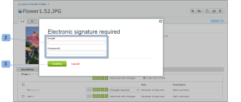

# Werken met elektronische handtekeningen in [!DNL Workfront Proof]

>[!IMPORTANT]
>
>Dit artikel verwijst naar functionaliteit in het standalone product [!DNL Workfront Proof]. Voor informatie over proefdrukken binnen [!DNL Adobe Workfront], zie [Proofing](../../../review-and-approve-work/proofing/proofing.md).

Met elektronische handtekeningen kunt u de beveiliging van uw proefdrukken verbeteren en voldoen aan industriestandaarden zoals ISO.

Deze instelling kan op het niveau van de rekening verplicht of niet verplicht worden gesteld. Als dit standaard verplicht is, wordt het ingeschakeld voor alle proefdrukken die in uw account zijn gemaakt en kan het niet worden uitgeschakeld op proefdrukniveau. Als deze instelling standaard niet verplicht is, kunt u deze in- of uitschakelen op proefdrukniveau.

Zie voor meer informatie.

Wanneer de instelling voor elektronische handtekeningen is ingeschakeld op een bewijs, wordt elke revisor die een besluit neemt over de proefdruk, via een elektronisch handtekeningvak gevraagd zijn e-mail en wachtwoord in te dienen.

## Elektronische handtekeningen op de [!UICONTROL Proof Details] Pagina

Als een controleur zijn beslissing neemt door zijn keuze te maken over de [!UICONTROL Proof details] pagina (1) en [!UICONTROL Electronic Signature] pop - up box zal hen lijken te vragen om hun details (2) in te vullen en hun besluit te bevestigen (3).

In het pop-upvenster wordt de standaardberichtenset weergegeven (indien aanwezig) en de controleur moet zijn e-mail en wachtwoord invoeren.

De [!UICONTROL Electronic Signature] verschijnt in de proefdrukviewer en op de knop [!UICONTROL Proof details] pagina als de controleur besluit zijn besluit op dat niveau te nemen.

Als de [!UICONTROL Single Sign-On] deze optie is ingeschakeld op de proefdruk, worden de e-mail- en wachtwoordgegevens niet weergegeven in het dialoogvenster [!UICONTROL Electronic Signature] verschijnt wanneer u een beslissing neemt.

In plaats daarvan klikt u op de knop [!UICONTROL Confirm] (4) in deze pop-up wordt de controleur omgeleid naar de [!UICONTROL Single Sign-On] pagina.

Na het invoeren van de SSO-gegevens wordt de controleur automatisch teruggeleid naar de [!UICONTROL Proof details] pagina (of terug naar de [!UICONTROL Proof Viewer] indien het besluit van daaruit wordt genomen).

>[!NOTE]
>
> Indien het besluit elektronisch is ondertekend, wordt de **[!UICONTROL signature icon]** (5) naast de beslissing in het [!UICONTROL Workflow] de [!UICONTROL Proof details] pagina. Indien de beslissing niet door de beoordelaar maar door een andere persoon met bewerkingsrechten op het bewijs wordt gewijzigd, wordt die persoon niet gevraagd de beslissing elektronisch te ondertekenen en wordt er geen handtekeningpictogram naast de beslissing weergegeven (6).

Voor informatie over Single Sign-On raadpleegt u [Single Sign-On in Workfront Proof](../../../workfront-proof/wp-acct-admin/managing-security/single-sign-on-overview.md).

Voor informatie over de pagina Proefdrukdetails raadpleegt u [Proofinggegevens beheren in [!DNL Workfront] Proef](../../../workfront-proof/wp-work-proofsfiles/manage-your-work/manage-proof-details.md).
