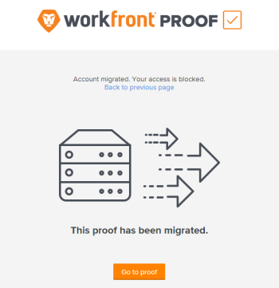

# FAQ: [!UICONTROL Workfront Proof] - Migratie van VS naar EMEA

>[!IMPORTANT]
>
>Dit artikel verwijst naar functionaliteit in het standalone product [!DNL Workfront Proof]. Voor informatie over proefdrukken binnen [!DNL Adobe Workfront], zie [Proofing](../../../review-and-approve-work/proofing/proofing.md).

## Hoe weet ik of deze verandering mijn organisatie beïnvloedt?

[!DNL Workfront] rechtstreeks contact heeft opgenomen met alle organisaties die door de [!DNL Workfront Proof] migratie naar EMEA.

## Is er iets wat ik moet doen om de migratie voor te bereiden?

Ja. Voordat u gaat migreren, moet u het volgende toevoegen aan de lijst van gewenste personen van uw organisatie:

**[!DNL webcapture.proofhq.eu]**

## Hoe lang duurt het om mijn account te migreren?

Gedurende een korte periode, tot twee uur, is uw account niet toegankelijk wanneer we deze naar de nieuwe locatie in het EMEA-datacenter migreren.

Nadat de accountmigratie is voltooid, gaan we al uw bestanden van ons Amerikaanse datacenter naar het EMEA-datacenter verplaatsen. Tijdens het verplaatsen van de bestanden zijn ze nog steeds toegankelijk in het Amerikaanse datacenter. Dit proces vindt plaats op de achtergrond en heeft geen invloed op u en uw gebruikers.

Nadat de migratie is voltooid, hebben u en uw gebruikers alleen toegang tot bestanden en proefdrukken vanuit het EMEA-datacenter.

## Wat gebeurt er met de URL die ik gebruik voor toegang [!DNL Workfront Proof]?

Deze URL blijft ongewijzigd. U kunt de [!DNL Workfront] precies zoals u dat in het verleden hebt gedaan.

## Mag ik nog steeds mijn oude proefdrukken en bladwijzers gebruiken?

Proefbladwijzers werken niet meer na de migratie. Iedereen die een dergelijk bewijs gebruikt, ontvangt een bericht dat toegang geeft tot het bewijs via een [!UICONTROL Go to Proof] knop:

## Blijven mijn gebruikersnaam en wachtwoord hetzelfde als voorheen?

Ja, uw gebruikersnaam en wachtwoord blijven precies hetzelfde als vandaag.

## Kan ik nog steeds communiceren met proefaccounts waarmee ik in de VS samenwerk?

Nee, toegang tot eerdere VS-proefaccounts is niet meer beschikbaar. Uw account in EMEA is volledig losgekoppeld van de Amerikaanse omgeving. Dit is om ervoor te zorgen dat uw gegevens veilig blijven en voldoen aan de EU-wetgeving inzake gegevensbescherming.

Als u een andere Amerikaanse account hebt waarmee u partner bent en u dit partnerschap moet onderhouden, moeten de eigenaars van die account migreren naar uw account. Bespreek dit met hen voordat de migratie plaatsvindt om ervoor te zorgen dat de juiste accounts worden gemigreerd.

## Wat als ik SSO op mijn rekening gebruik?

Als u SSO gebruikt op uw proefdrukaccount, moet u de account opnieuw configureren om de nieuwe [!DNL proofhq.eu] domein.
