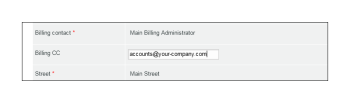
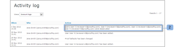

# De facturatiepagina van [!DNL Workfront Proof]

>[!IMPORTANT]
>
>Dit artikel verwijst naar functionaliteit in het zelfstandige product [!DNL Workfront Proof] . Voor informatie bij het proef binnen [!DNL Adobe Workfront], zie [&#x200B; het Bewijzen &#x200B;](../../../review-and-approve-work/proofing/proofing.md).

## De facturatiepagina

Als u de pagina [!UICONTROL Billing] wilt openen, opent u het menu **[!UICONTROL Settings]** rechtsboven in het scherm en kiest u **[!UICONTROL Billing]** in de vervolgkeuzelijst.

De pagina [!UICONTROL Billing] bevat het volgende:

* Accountnaam (1)
* Rekeningenlijst (bijvoorbeeld als u satellietrekeningen hebt)(2)
* Wijzigingsplan (3)
* Betalingsgegevens wijzigen (4)
* Nieuwe satellietrekening (5)
* Dichte rekening (6)
* Informatie over het huidige plan (7)
* Contactpersoon en adres voor facturering (8)
* Gebruiksstatistieken (9)
* Factureringsgeschiedenis (10)
* Factureringsactiviteit (11)

  

## [!UICONTROL Current Plan]

In dit gedeelte (7) worden de details van uw huidige abonnement weergegeven, waaronder:

* De naam van het plan
* Huidige betalingsmethode
* Huidige begin- en einddatum van het abonnement
* Het volgende overzichtstype
* Volgende betalingsmethode voor abonnementen

  Voor meer informatie, zie [&#x200B; Kiezen Uw Betalingsmethode in  [!DNL Workfront Proof]](../../../workfront-proof/wp-billingsettings/manage-your-billing/choose-payment-method-in-wp.md).

## [!UICONTROL Billing Contact and Address]

In deze sectie (8) staan de belangrijkste contactpersoon voor facturatie en de adresgegevens voor uw account.

Het factureringscontact kan slechts van de gebruikers worden geselecteerd die als de Facturerings Beheerders op uw rekening worden geplaatst. Op de satellietrekeningen, slechts kunnen de Facturerings Beheerders van de hoofdrekening op dit gebied worden geplaatst.

>[!NOTE]
>
> U kunt meerdere Factuurbeheerders op uw account hebben, maar slechts een van deze beheerders, die u in het veld [!UICONTROL Billing contact] hebt geselecteerd, ontvangt alle factureringsmeldingen en waarschuwingen over het gebruik van uw account.

Dit omvat de volgende e-mailmeldingen:

* Proefgebruik
* Facturen
* Downgrade
* Betalingsachterstand/Account-schorsing
* Creditcardfout

  

In het veld [!UICONTROL Billing CC] kunt u ook een e-mailadres toevoegen dat u wilt kopiëren naar alle e-mails over facturering. Klik op het veld om inline bewerken te activeren en voer een e-mailadres van uw keuze in (dit kan ook een bestaand e-mailadres van de gebruiker zijn).

## [!UICONTROL Billing Address]

In deze sectie wordt inline bewerken gebruikt, zodat u gewoon op de velden klikt om de tekst in te voeren of te bewerken.

>[!NOTE]
>
> Dit adres wordt opgenomen op uw abonnementsfacturen, zodat deze gegevens altijd up-to-date zijn.

## [!UICONTROL Usage Statistics]

In deze sectie worden de gebruiksstatistieken van uw account binnen de huidige factureringsperiode weergegeven, waaronder de volgende:

* Opslag gebruikt
* Gebruikte proefdrukken
* Gebruikte limiet voor gebruikers

### [!UICONTROL Usage Warnings]

De [[!UICONTROL Proof Permissions Profiles] in  [!DNL Workfront]  Bewijs &#x200B;](../../../workfront-proof/wp-acct-admin/account-settings/proof-perm-profiles-in-wp.md) die als het Facturerende Contact (1) op uw rekening wordt geplaatst zal via e-mail op de hoogte worden gebracht wanneer uw rekening bereikt:

* 75% en 98% van uw opslagcapaciteit
* 75% en vervolgens 100% van uw proefdruklimiet

Zodra de proefdrukken of opslaggrenzen worden bereikt, zult u de alarm bij de bovenkant van de [!UICONTROL Billing] pagina ook zien:

* Voor de bereikte proefdruklimiet

  

* Voor de bereikte opslaglimiet

>[!NOTE]
>
>Het aantal proefdrukken wordt gebruikt wanneer proefdrukken in uw account worden gemaakt. U kunt dit niet herstellen door de proefdrukken te verwijderen.

Opslagruimte kan worden vrijgemaakt door de proefdrukken en bestanden te verwijderen en de [!UICONTROL Trash] achteraf leeg te maken.

Houd er rekening mee dat als u meer proefdrukken, opslaggegevens of gebruikers nodig hebt, u uw account op elk gewenst moment kunt upgraden en dat dit onmiddellijk van kracht wordt.

## [!UICONTROL Billing History]

In deze sectie wordt de activiteit voor recente factureringsperioden weergegeven. U kunt uw facturen ook downloaden vanuit deze sectie.

Voor meer informatie, zie &quot; [&#x200B; het Downloaden van Uw  [!DNL Workfront Proof]  Factuur &#x200B;](../../../workfront-proof/wp-billingsettings/manage-your-billing/download-wp-invoice.md).&quot;

## [!UICONTROL Billing Activity]

In deze sectie ziet u recente wijzigingen in uw factureringsinstellingen, zoals abonnementen, upgrades, downgrades en verlengingen van uw [!DNL Workfront Proof] -abonnement.

Als u uw abonnement wijzigt in een abonnement met een lagere gebruikerslimiet (1), worden gebruikers die de nieuwe limiet overschrijden automatisch gedeactiveerd wanneer het nieuwe abonnement wordt gestart. Deze activiteit wordt ook vastgelegd in uw accountlogboeken (2).

