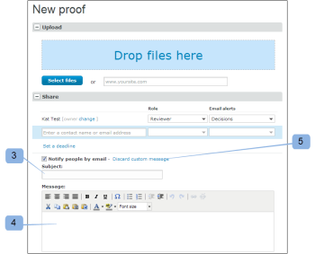

# Nieuwe proefe-mail

>[!IMPORTANT]
>
>Dit artikel verwijst naar functionaliteit in het zelfstandige product [!DNL Workfront Proof] . Voor informatie bij het proef binnen [!DNL Adobe Workfront], zie [ het Bewijzen ](../../../review-and-approve-work/proofing/proofing.md).

<!--

Make this article work better for PiW.

-->

Wanneer u een nieuwe proefdruk of een nieuwe versie van een proefdruk maakt, nieuwe personen aan een proefdruk toevoegt of een workflow aan een proefdruk toevoegt, kunt u besluiten of u de controleurs een e-mail wilt sturen, zoals in de volgende artikelen wordt uitgelegd:

* [Een geavanceerde proefdruk maken met een geautomatiseerde workflow](../../../review-and-approve-work/proofing/creating-proofs-within-workfront/create-automated-proof-workflow.md)
* [Proefdrukken genereren in  [!DNL Workfront Proof]](../../../workfront-proof/wp-work-proofsfiles/create-proofs-and-files/generate-proofs.md)

Het e-mailbericht dat uw ontvangers ontvangen, wordt het [!UICONTROL New Proof] -e-mailbericht genoemd. Alleen de maker van de proef en gebruikers die revisoren mogen toevoegen aan een proefdruk, kunnen dit e-mailbericht besturen. Ontvangers kunnen deze functie niet uitschakelen.

Het e-mailadres voor nieuwe proefdrukken bevat:

* Uw persoonlijke bericht (als u ervoor kiest om er een op te nemen)
* Als u altijd hetzelfde aangepaste bericht naar de controleurs verzendt, is het wellicht raadzaam dit bericht op te slaan in de [!UICONTROL Personal settings] onder het tabblad [!UICONTROL Proofing defaults] . Zie voor meer informatie.
* Persoonlijke link naar het bewijs
* **[!UICONTROL View details]** -koppeling die u naar het gekoppelde [!DNL Workfront] -object (zoals een project, taak of uitgave) brengt
* Miniatuur van de proefdrukafbeelding
* De volgende bewijsgegevens:

   * Proefnaam
   * Versienummer
   * Lijst van de controleurs en hun vorderingen op de proefstukken
   * Een koppeling om de proefdruk met iemand anders te delen

     Zo kunt u de proef-URL en/of de downloadkoppeling delen voor het oorspronkelijke bestand. Hierdoor kunt u niet expliciet revisoren aan de proefdruk toevoegen, u deelt alleen de URL van de openbare proefdruk en de ontvanger krijgt alleen-lezen toegang tot de proefdruk.

     Zie [ Deel een Bewijs in  [!DNL Workfront Proof]](../../../workfront-proof/wp-work-proofsfiles/share-proofs-and-files/share-proof.md) voor meer informatie.

     Als u niet wilt dat deze koppeling wordt weergegeven in de e-mail van de ontvanger, kunt u de instellingen van [!UICONTROL Public Sharing] op de proefdruk uitschakelen

     (Oorspronkelijke bestand downloaden en Openbare URL). Zie [ Beheren de Details van het Bewijs in  [!DNL Workfront Proof]](../../../workfront-proof/wp-work-proofsfiles/manage-your-work/manage-proof-details.md) voor meer informatie.

## Het activiteitenlog

Het verzenden van een [!UICONTROL New Proof] -e-mailbericht naar een revisor wordt aangemeld in de [!UICONTROL Activity] sectie van [!UICONTROL Proof details] -pagina. Zie [ binnen [!UICONTROL &#x200B; Proof Details] beheren  [!DNL Workfront Proof]](../../../workfront-proof/wp-work-proofsfiles/manage-your-work/manage-proof-details.md) voor meer informatie. U kunt controleren of de e-mail van [!UICONTROL New Proof] was ingeschakeld op het moment dat u een proefdruk maakte.

>[!NOTE]
>
>* Als de maker of eigenaar van de proefdruk standaard [!UICONTROL Proof Made] e-mails heeft uitgeschakeld (in zijn persoonlijke instellingen), ontvangen zij geen [!UICONTROL Proof made] - of [!UICONTROL New proof] -e-mails, zelfs niet als het vak [!UICONTROL Notify people by email] is ingeschakeld op de pagina Nieuwe proefdruk. Zie voor meer informatie.
>* Als de e-mailberichten standaard zijn uitgeschakeld in het dialoogvenster [!UICONTROL Account settings] , ontvangen de maker/eigenaar van de proefdruk geen [!UICONTROL Proof made] - of [!UICONTROL New proof] -e-mails, zelfs als deze optie is ingeschakeld in hun persoonlijke instellingen en het vak [!UICONTROL Notify] Personen per e-mail is ingeschakeld op de pagina Nieuwe proefdruk. Voor meer informatie, [ E-mail [!UICONTROL Proof Made] ](../../../workfront-proof/wp-emailsntfctns/proof-notifications-and-reminders/proof-made-email.md) en zie.
>

## Schakel het e-mailbericht van [!UICONTROL New Proof] in en voeg een aangepast bericht toe

U kunt opgeven of u een e-mailwaarschuwing wilt verzenden naar de controleurs op een proefdruk wanneer u deze maakt of wanneer u er iemand aan toevoegt.

* [Wanneer u een proefdruk maakt](#when-you-create-a-proof)
* [Wanneer u een revisor aan een proefdruk toevoegt](#when-you-add-a-reviewer-to-a-proof)

### Wanneer u een proefdruk maakt {#when-you-create-a-proof}

Als u een nieuwe proefdruk maakt op de pagina [!UICONTROL New proof] , kunt u onder de sectie **[!UICONTROL Share]** opgeven of u e-mailwaarschuwingen wilt verzenden:

* Hier kunt u bepalen of u [!UICONTROL Notify people by email] (1) wilt. Als u deze optie uitschakelt, ontvangen geen van de revisoren een e-mail om hen te laten weten dat de proefdruk gereed is voor revisie.
* U kunt ook een aangepast bericht opnemen in het e-mailbericht (2).
* Als u besluit uw eigen aangepaste bericht toe te voegen, kunt u een aangepaste onderwerpregel (3) en een bericht in de tekst van de e-mail (4) plaatsen.
* Als u het aangepaste bericht wilt verwijderen, klikt u gewoon op de koppeling (5).

  >[!NOTE]
  >
  >Als u altijd hetzelfde aangepaste bericht naar de controleurs verzendt, is het wellicht raadzaam dit bericht op te slaan in uw persoonlijke instellingen onder het tabblad [!UICONTROL Proofing defaults] . Zie voor meer informatie.

### Wanneer u een revisor aan een proefdruk toevoegt {#when-you-add-a-reviewer-to-a-proof}

U kunt aangeven of een nieuwe controleur die aan een bestaande proefdruk is toegevoegd, op de hoogte wordt gesteld van de proefdruk (vergelijkbaar met bovenstaande).

* Voeg eerst nieuwe revisoren toe door op de knop **[!UICONTROL Share this Version]** op de pagina **[!UICONTROL Proof details]** (1) te klikken.

* Er wordt een vak weergegeven waarin u nieuwe revisoren kunt toevoegen. Vervolgens kunt u bepalen of u een e-mailbericht wilt ontvangen (2) en een aangepast bericht aan de e-mail wilt toevoegen (3).

* Als u ervoor kiest een aangepast bericht toe te voegen, wordt het vak groter en kunt u een aangepaste onderwerpregel (4) en aangepaste tekst in de hoofdtekst van de e-mail (5) plaatsen. U kunt het aangepaste bericht ook verwijderen door op de koppeling (6) te klikken.

