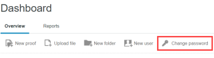

# Aanmelden en uw wachtwoord en e-mail wijzigen voor Workfront Proof

>[!IMPORTANT]
>
>Dit artikel verwijst naar functionaliteit in het standalone product [!DNL Workfront Proof]. Voor informatie over proefdrukken binnen [!DNL Adobe Workfront], zie [Proofing](../../../review-and-approve-work/proofing/proofing.md).

## Aanmelden

1. Ga naar [de aanmeldingspagina](http://www.proofhq.com/login) (of op onze website op  [www.proofhq.com](http://www.proofhq.com/)).

1. Klik op de knop [!UICONTROL login] aan de rechterbovenhoek.
1. Voer uw e-mailadres en wachtwoord in.\
   Als u uw wachtwoord bent vergeten, zie de sectie  [Wanneer u uw wachtwoord vergeet](#when-you-forget-your-password) later in dit artikel.

1. Als u aangemeld wilt blijven (zonder uw sessietime-out na 30 minuten inactiviteit), selecteert u **[!UICONTROL Keep me logged in]**.
1. Klik op **[!UICONTROL Login]**.

De [!DNL Workfront Proof] beheerder kan persoonlijke branding instellen voor de [!UICONTROL Login] pagina. Zie [Merk de [!DNL Workfront Proof] site](../../../workfront-proof/wp-acct-admin/branding/brand-wp-site.md). Of als u een [!UICONTROL Enterprise] of [!UICONTROL Unlimited] editieplan, zie  [Merk de [!DNL Workfront Proof] site - geavanceerd](../../../workfront-proof/wp-acct-admin/branding/brand-wp-site-advanced.md).

Voor [!UICONTROL Enterprise] en [!UICONTROL Unlimited] plannen, bieden wij Single Sign-On (SSO) vermogen aan, dat uw gebruikers toestaat om aan login aan te melden [!DNL Workfront Proof] hun gebruikersnaam en wachtwoord voor uw organisatie te gebruiken. Zie [Single Sign-On configureren voor [!DNL Workfront Proof] gebruikers](../../../workfront-proof/wp-acct-admin/account-settings/configure-sso-for-wp-users.md). voor meer informatie .

## Afmelden

1. Klikken **[!UICONTROL Logout]** in de rechterbovenhoek van Workfront Proof.\
   Er verschijnt een bericht om te bevestigen dat u bent afgemeld. U kunt op **[!UICONTROL Back to login page]** om u opnieuw aan te melden als u wilt.\
   De [!DNL Workfront Proof] de beheerder kan opstelling gepersonaliseerde branding voor dit bericht. Zie [Merk de [!DNL Workfront Proof] site](../../../workfront-proof/wp-acct-admin/branding/brand-wp-site.md). Of als en u een [!UICONTROL Enterprise] of [!UICONTROL Unlimited] editieplan, zie  [Merk de [!DNL Workfront Proof] site - geavanceerd](../../../workfront-proof/wp-acct-admin/branding/brand-wp-site-advanced.md).

## Wanneer u uw wachtwoord vergeet {#when-you-forget-your-password}

Als u uw wachtwoord bent vergeten, kunt u [!DNL Workfront Proof] e-mail u een opnieuw ingesteld e-mailbericht.

1. Ga naar [de aanmeldingspagina](http://www.proofhq.com/login) (of op onze website op  [www.proofhq.com](http://www.proofhq.com/)).

1. Klik op **[!UICONTROL Forgot password?]**
1. Typ in het vak dat wordt weergegeven uw e-mailadres en klik vervolgens op **[!UICONTROL Get Link]**.

## Uw wachtwoord wijzigen

1. Op de [!UICONTROL Dashboard], klikt u op **[!UICONTROL Change password]**.\
   \
   Als uw [!DNL Workfront Proof] de beheerder heeft opstelling om het even welke specifieke wachtwoordvereisten, zij worden vermeld bij de bovenkant van [!UICONTROL reset] pagina.

## Geavanceerde wachtwoordinstellingen

Als u een [!UICONTROL Select] of [!UICONTROL Premium] plan, uw [!DNL Workfront Proof] de beheerder kan specifieke wachtwoordvereisten plaatsen om aan het beleid van IT en van de veiligheid in uw organisatie te voldoen en de veiligheid van uw gegevens te verbeteren. Zie &quot;Geavanceerde wachtwoordinstellingen&quot; in het artikel voor meer informatie.

## Een e-mailadres toevoegen aan uw account

U kunt meerdere e-mailadressen toevoegen aan uw [!DNL Workfront Proof] account. Uw primaire e-mailadres is de e-mail waarnaar [!DNL Workfront Proof] verzendt proefberichten. U gebruikt deze ook om u aan te melden bij [!DNL Workfront Proof]. U kunt uw primaire e-mailadres wijzigen.

1. Klik op **[!UICONTROL Settings]** > **[!UICONTROL Personal settings]**.

1. Onder **[!UICONTROL User email aliases]**, klikt u op **[!UICONTROL New email address]**.

1. In de **[!UICONTROL Email alias]** tekstvak dat wordt weergegeven, typt u het e-mailadres dat u wilt toevoegen en drukt u vervolgens op **[!UICONTROL Enter]**.\
   [!DNL Workfront Proof] verzendt een validatie-e-mail naar het nieuwe e-mailadres.

1. Klik in het validatiebericht dat u ontvangt op de bevestigingskoppeling.\
   De e-mailwijziging wordt opgeslagen in uw profiel. Mogelijk moet u de browser vernieuwen waar u de weergave bekijkt [!DNL Workfront Proof] [!UICONTROL Personal settings] pagina om te zien dat het als een alias-e-mail wordt bevestigd.
1. (Optioneel) Als u het nieuwe e-mailadres wilt opgeven in [!DNL Workfront Proof]klikt u op de knop [!UICONTROL More] (drie punten) rechts van het adres en klikt u op **[!UICONTROL Make primary email]** in het menu dat wordt weergegeven.
