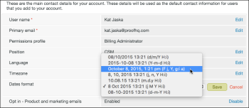

# Tijdzones instellen in [!DNL Workfront Proof]

>[!IMPORTANT]
>
>Dit artikel verwijst naar functionaliteit in het zelfstandige product [!DNL Workfront Proof] . Voor informatie bij het proef binnen [!DNL Adobe Workfront], zie [&#x200B; het Bewijzen &#x200B;](../../../review-and-approve-work/proofing/proofing.md).

In [!DNL Workfront Proof] wordt de tijd weergegeven waarop een proefdruk is gemaakt en waarop enige activiteit heeft plaatsgevonden op de proefdruk, zoals deadlines, beslissingen en opmerkingen. Standaard wordt de tijd weergegeven in GMT.

Als gebruiker met uw eigen [!DNL Workfront Proof] -account kunt u uw tijdzone instellen in persoonlijke instellingen. Alle keren in [!DNL Workfront] worden in deze tijdzone weergegeven, zelfs voor een proefdruk die door een gebruiker in een andere tijdzone is gemaakt. Voor meer informatie, zie [&#x200B; Persoonlijke Montages.](https://support.workfront.com/hc/en-us/sections/115000921168-Personal-settings)

Alle gastrevisoren (gebruikers zonder hun eigen [!DNL Workfront Proof] -account) zien alle keren in de tijdzone van de eigenaar van de proefdruk. Voor meer informatie, zie [&#x200B; Gebruikers, Leden, en Gasten in  [!DNL Workfront Proof]](../../../workfront-proof/wp-mnguserscontacts/contacts/use-members-guests.md) begrijpen.

## Uw persoonlijke tijdzone instellen

1. Klik op **[!UICONTROL Settings]** > **[!UICONTROL Personal settings]** en open vervolgens het tabblad **[!UICONTROL Settings]** .

1. (Optioneel) Als u de notatie van de datums en tijden in uw account wilt wijzigen, bewerkt u de **[!UICONTROL Dates format]** .\
   Als u de tijden wilt zien die in het formaat AM/PM worden getoond, zorg ervoor om de volgende optie van het menu te kiezen:

1. 

## De standaardtijdzone van uw organisatie instellen

Als u een Accountbeheerder bent, kunt u een standaardtijdzone voor uw organisatie instellen. Deze tijdzone wordt standaard ingesteld voor alle nieuwe gebruikers die aan de organisatie worden toegevoegd (maar kan door de individuele gebruiker worden gewijzigd).

1. Klik op **[!UICONTROL Settings]** > **[!UICONTROL Personal settings]** en open vervolgens het tabblad **[!UICONTROL Settings]** .

1. Klik onder **[!UICONTROL Account details]** op [!UICONTROL Edit] rechts van **[!UICONTROL Time zone default]** en breng de wijziging aan.
