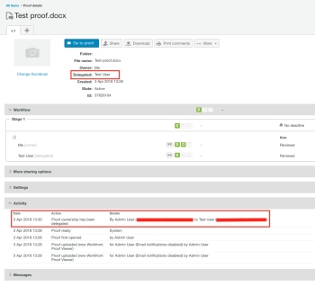

# Aanwijzing van eigenaars van tijdelijke bewijzen in [!DNL Workfront Proof]

>[!IMPORTANT]
>
>Dit artikel verwijst naar functionaliteit in het standalone product [!DNL Workfront Proof]. Voor informatie over proefdrukken binnen [!DNL Adobe Workfront], zie [Proofing](../../../review-and-approve-work/proofing/proofing.md).

Als u het kantoor gedurende langere tijd verlaat, kunt u het eigendom van uw proefdrukken delegeren aan een andere gebruiker in uw account.

>[!NOTE]
>
>Deze functie is alleen beschikbaar in [!DNL Workfront Proof].

Om tijdelijk eigendom van uw proefdrukken aan te wijzen:

1. Within [!DNL Workfront Proof], ga naar **[!UICONTROL Personal settings]**.\
   

1. Klik op de knop **[!UICONTROL Out of office]** tab. De volgende instellingen zijn beschikbaar:

   * **[!UICONTROL Delegate your proofs to]** een andere gebruiker in uw account.
   * Schakel de **[!UICONTROL Out of office]** door het selectievakje in of uit te schakelen.
   * Selecteer **[!UICONTROL Start date]**.

      Als de **[!UICONTROL Start immediately]** wordt gekozen, wordt de eigendom van de proefdrukken onmiddellijk aan de geselecteerde gebruiker gedelegeerd nadat u de functie hebt geactiveerd.

      Als een specifieke begindatum en -tijd worden ingesteld, wordt de functie geactiveerd op de geselecteerde dag en op het gekozen tijdstip.

   * Selecteer **[!UICONTROL End date]**.

      Als er geen einddatum wordt gekozen, wordt de eigendom van de proefdrukken gedelegeerd totdat de functie handmatig is uitgeschakeld.

      Als een specifieke einddatum en -tijd worden ingesteld, wordt de functie op de geselecteerde dag en op het gekozen tijdstip uitgeschakeld.

      

1. Wanneer proefdrukken worden gedelegeerd, wordt de gedelegeerde eigenaar weergegeven in het dialoogvenster **[!UICONTROL Details]** op de pagina met de proefdrukdetails. De nota van de eigendomsdelegatie verschijnt in **[!UICONTROL Activity]** op de pagina met de proefdrukdetails.

   

   An [!UICONTROL Out of Office] de melding wordt ook weergegeven op de account van de eigenaar van het oorspronkelijke bewijs wanneer de functie is ingeschakeld. Dit herinnert de oorspronkelijke eigenaar eraan dat hij de delegatie onmiddellijk kan beëindigen of naar [!UICONTROL Personal settings] om dit aan te passen.

   

   Wanneer de eigenaar van uw proefdrukken door de oorspronkelijke eigenaar wordt teruggenomen, verdwijnt de gedelegeerde eigenaar van de [!UICONTROL Details] van de pagina met de proefdrukgegevens en de [!UICONTROL Out of Office] deze melding wordt niet meer weergegeven op de account van de eigenaar van de oorspronkelijke proefdruk. In het dialoogvenster [!UICONTROL Activity] op de pagina met de proefdrukdetails.

   >[!NOTE]
   >
   >De gedelegeerde eigenaar blijft in de proefdrukworkflow staan, tenzij u deze handmatig verwijdert.

   ![[!UICONTROL activity-section-taken-back].png](assets/activity-section-taken-back-350x99.png)
