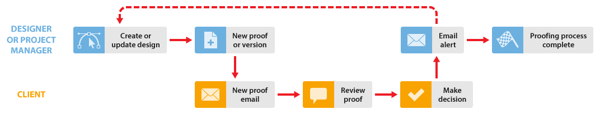

# Proefdrukproces in [!DNL Workfront Proof]

<!-- Audited: 5/2025 -->

>[!IMPORTANT]
>
>Dit artikel verwijst naar functionaliteit in het zelfstandige product [!DNL Workfront Proof] . Voor informatie bij het proef binnen [!DNL Adobe Workfront], zie [ het Bewijzen: artikelindex ](../../../review-and-approve-work/proofing/proofing.md).

In dit voorbeeld wordt de basisworkflow tussen een ontwerper of projectmanager en een of meer revisoren, zoals een client, uitgelegd. U kunt dit proces herhalen totdat de proefdruk is goedgekeurd.

* **creeer nieuwe proef**: De ontwerper of de projectmanager leidt tot een nieuwe proef in [!DNL Workfront Proof] en deelt de proef met de cliënt. Voor informatie, zie [ Proefdrukken in  [!DNL Workfront Proof]](../../../workfront-proof/wp-work-proofsfiles/create-proofs-and-files/generate-proofs.md) produceren.

* **Nieuwe proefdruk e-mail**: De cliënt ontvangt een e-mail die een verbinding aan de proef bevat.

* **herzie een proef**: De cliënt herziet de proef, voegt commentaren toe, en neemt een besluit. Voor informatie, zie [ proefdrukken van het Overzicht binnen  [!DNL Adobe Workfront]: artikelindex ](../../../review-and-approve-work/proofing/reviewing-proofs-within-workfront/review-proofs-in-wf.md) en [ maak een besluit over een proef in de het proeven kijker ](../../../review-and-approve-work/proofing/reviewing-proofs-within-workfront/make-a-decision-on-a-proof/make-decisions-on-proof.md).

* **alarm E-mail**: De ontwerper of de projectmanager ontvangt een e-mail met een samenvatting van de overzicht van de cliënt, afhankelijk van de e-mailalarm zij hebben geplaatst. Voor informatie, zie [ de montages van het e-mailbericht in  [!DNL Workfront Proof]](../../../workfront-proof/wp-emailsntfctns/email-alerts/config-email-notification-settings-wp.md) vormen.

* **Nieuwe versie** (als vereist): De ontwerper of de projectmanager wijzigt het dossier en uploadt het aan [!DNL Workfront Proof] als nieuwe versie.

