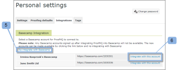

# Integreren [!DNL Workfront Proof] with [!DNL Basecamp]

>[!IMPORTANT]
>
>Dit artikel verwijst naar functionaliteit in het standalone product [!DNL Workfront Proof]. Voor informatie over proefdrukken binnen [!DNL Adobe Workfront], zie [Proofing](../../../review-and-approve-work/proofing/proofing.md).

Als u [!DNL Basecamp] voor projectbeheer kunt u uw projectteam rijkere revisie- en goedkeuringsinstrumenten bieden met behulp van [!DNL Workfront Proof].

## De [!DNL Basecamp] Integratie met [!DNL Workfront]

Integreren met [!DNL Basecamp] staat gebruikers toe om proeven te bekijken, te herzien en goed te keuren allen binnen [!DNL Basecamp]. Gebruikers kunnen proefdrukken verzenden naar uw [!DNL Workfront Proof] en deze aan te sluiten op uw [!DNL Basecamp] project. Uw revisoren kunnen opmerkingen maken en beslissingen nemen via [!DNL Basecamp]met de mini-proefdruk die is ingesloten in uw Basecamp-bericht.

Indien geïntegreerd met [!DNL Workfront Proof], [!DNL Basecamp] heeft de volgende proefdrukfunctionaliteit:

* Gebruikers kunnen proefdrukken controleren en goedkeuren binnen [!DNL Basecamp Classic].
* Gebruikers beschikken direct over revisiegereedschappen.
* Projectbeoordelingsteams ontvangen een bericht in [!DNL Basecamp] met een mini-bewijs voor controle en goedkeuring.
* Gebruikers kunnen overschakelen op een proefdruk van een volledige pagina voor controle en goedkeuring.
* Gebruikers kunnen opmerkingen en markeringen toevoegen aan proefdrukken op zowel miniformaat als op volledige grootte.

   >[!NOTE]
   >
   >Nadat een opmerking is beantwoord, kan deze niet meer worden bewerkt of verwijderd.

* Revisoren kunnen reageren op de opmerkingen en markeringen die door andere revisoren zijn gemaakt.
* Gebruikers worden gewaarschuwd wanneer een nieuwe versie van het bewijs beschikbaar is.
* Gebruikers die niet [!DNL Workfront Proof] gebruikers kunnen aan een proef werken in [!DNL Basecamp].

De integratie van [!DNL Workfront Proof] with [!DNL Basecamp] moeten op twee niveaus worden ingesteld:

* Configureren [!DNL Basecamp] in [Accountinstellingen:](https://support.workfront.com/hc/en-us/sections/115000912147-Account-settings) Dit maakt de integratie met Basecamp mogelijk voor uw hele organisatie. Zie voor meer informatie [De integratie met Basecamp inschakelen met [!DNL Workfront Proof]](#enabling-the-basecamp-integration-with-workfront-proof).

* Configureren [!DNL Basecamp] in [Persoonlijke instellingen](https://support.workfront.com/hc/en-us/sections/115000921168-Personal-settings): Op deze manier kunnen makers en eigenaars van bewijzen verbinding maken met hun persoonlijke Basecamp-account en autoriseren [!DNL Workfront Proof] toegang. Zie voor meer informatie [Persoonlijke instellingen configureren](#configuring-personal-settings).

U kunt [!DNL Workfront] met [!DNL Basecamp] of [!DNL Basecamp Classic]. Elke versie van [!DNL Basecamp] gebruikt een andere API en vereist daarom verschillende configuratieprocedures.

Voor informatie over het configureren [!DNL Basecamp Classic], zie [Integreren [!DNL Workfront Proof] with [!DNL Basecamp Classic].](https://support.workfront.com/knowledge/articles/115004234707/en-us?brand_id=662728&amp;return_to=%2Fhc%2Fen-us%2Farticles%2F115004234707)

## Het inschakelen van de [!DNL Basecamp] Integratie met [!DNL Workfront Proof]

Als [Profielen met proefmachtigingen in [!DNL Workfront Proof]](../../../workfront-proof/wp-acct-admin/account-settings/proof-perm-profiles-in-wp.md) of [Profielen met proefmachtigingen in [!DNL Workfront Proof]](../../../workfront-proof/wp-acct-admin/account-settings/proof-perm-profiles-in-wp.md)kunt u de [!DNL Basecamp] integratie voor de gehele account in uw [Accountinstellingen](https://support.workfront.com/hc/en-us/sections/115000912147-Account-settings).

1. In [!UICONTROL Basecamp], de volgende informatie verzamelen:

   * De URL voor uw [!DNL Basecamp] account
   * De URL gevonden in &quot;[!UICONTROL My info]&quot; sectie

1. Afmelden bij [!DNL Basecamp].
1. Klikken **[!UICONTROL Account settings]** in de rechterbovenhoek.
1. Klik op de knop **[!UICONTROL Integrations]** tab.
1. In de **[!UICONTROL [!DNL Basecamp]]** , rechts van **[!UICONTROL [!DNL Basecamp] integration]**, klikt u op **[!UICONTROL Enable]**.

1. Volgende tot **[!UICONTROL [!DNL Basecamp] version]**, controleert u de **[!UICONTROL Classic version]** Dit is de versie waarmee u wilt integreren.

1. (Voorwaardelijk) Indien niet [!DNL Basecamp] URL wordt weergegeven, klikt u op **[!UICONTROL Edit]** Typ de URL voor uw [!DNL Basecamp] account, zonder &quot;http://&quot; op te nemen en klik vervolgens op **[!UICONTROL Save]**.

1. Klik in de rechterbovenhoek van het venster op **[!UICONTROL Settings]** > **[!UICONTROL Personal settings]**.

1. Klik op de knop **[!UICONTROL Integrations]** tab.
1. Onder **[!DNL Basecamp]**, aan het recht van **[!UICONTROL Basecamp integration]**, klikt u op **[!UICONTROL Enable]**.

1. In de opties worden rechts van **[!UICONTROL [!DNL Basecamp] API Token]**, klikt u op **[!UICONTROL Edit]**.

1. Typ in het vak dat wordt weergegeven de URL in het vak &quot;[!UICONTROL My info]&quot; sectie in [!DNL Basecamp]en klik vervolgens op **[!UICONTROL Save]**.\
   Eenmaal integreren [!DNL Workfront Proof] with [!DNL Basecamp]kunnen uw gebruikers hun persoonlijke instellingen configureren. Voor informatie over het instellen van persoonlijke instellingen raadpleegt u [Persoonlijke instellingen configureren](#configuring-personal-settings)

1. Als u niet kunt [!DNL Basecamp] integratie, uw [!DNL Workfront Proof] account-id is mogelijk niet dezelfde als de account-id waarin u gebruikt [!DNL Basecamp].
1. Eenmaal integreren [!DNL Workfront Proof] with [!DNL Basecamp]kunnen uw gebruikers hun persoonlijke instellingen configureren. Voor informatie over het instellen van persoonlijke instellingen raadpleegt u [Persoonlijke instellingen configureren](#configuring-personal-settings).

## Persoonlijke instellingen configureren

Nadat u het programma hebt ingesteld [Accountinstellingen](https://support.workfront.com/hc/en-us/sections/115000912147-Account-settings) voor uw organisatie moet elk van uw auteurs die proefdrukken maakt/verzendt, hun  [persoonlijke instellingen.](https://support.workfront.com/hc/en-us/sections/115000921168-Personal-settings)

1. Ga naar **[!UICONTROL Personal**&#x200B;**settings]**.

1. Open de **[!UICONTROL Integrations]** tab (1).
1. Om het [!DNL Basecamp] integratie, klik **[!UICONTROL Enable]** (2)
1. Klikken **[!UICONTROL Connect to your [!DNL Basecamp] account]** (3)\
   

1. Meld u aan bij uw [!DNL Basecamp] rekening (1).\
   

1. Klikken **[!UICONTROL Yes, I'll allow access]** autoriseren [!DNL Workfront Proof] toegang tot uw account (2).\
   

1. (Optioneel) Wanneer uw persoonlijke integratie actief is (3), kunt u eenvoudig schakelen tussen [!DNL Basecamp] rekeningen.

   1. Klikken **[!UICONTROL Switch [!DNL Basecamp] account]** (4).\

      \
      De [!UICONTROL Switch Basecamp Account] neemt u naar [!UICONTROL Personal Settings] pagina, waar u kunt kiezen welke van uw [!DNL Basecamp] accounts die u met uw [!DNL Workfront Proof] account.

   1. Klikken **[!UICONTROL Re-Integrate with [!DNL Basecamp]]** (5) voordat u de [!DNL Basecamp] account\

      Hiermee vernieuwt u de [!UICONTROL Personal Settings] en toont uw meest recente lijst van [!DNL Basecamp] rekeningen.

   1. Klikken **[!UICONTROL Integrate with this account]** om het met te verbinden [!DNL Workfront Proof].\

      \
      U kunt nu proefdrukken toevoegen aan [!DNL Basecamp] projecten.
